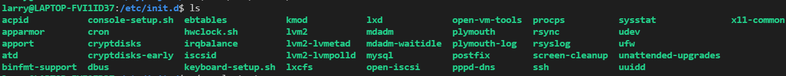
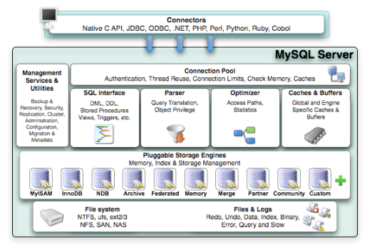
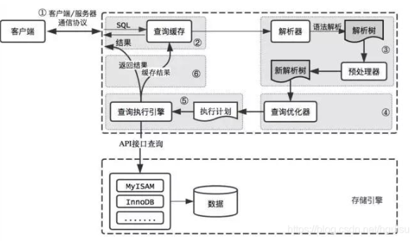
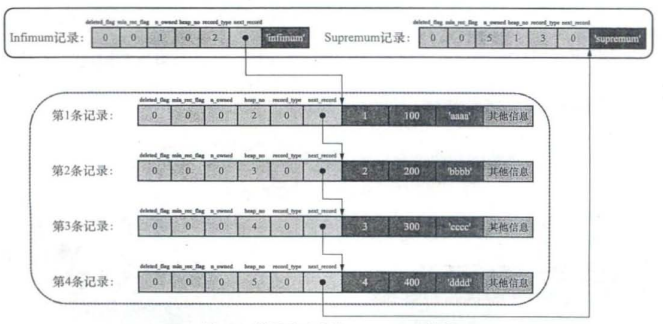
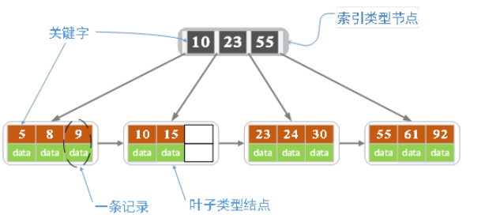
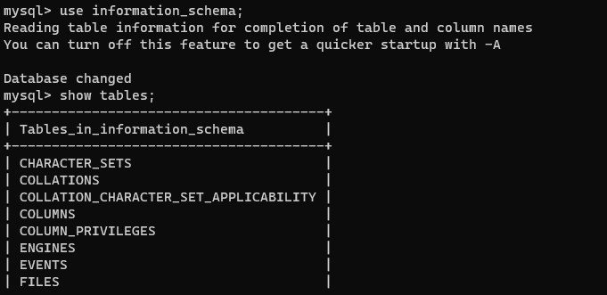
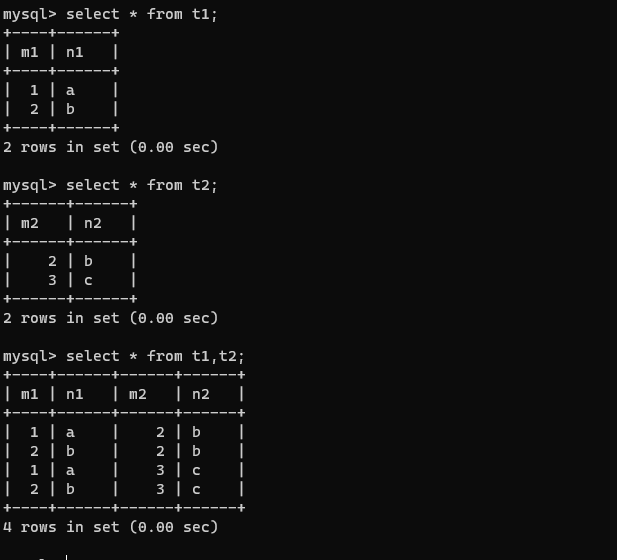

### 基础

mysql的日常使用包括
1. 启动MYSQL服务器程序
2. 启动MYSQL客户端程序,连接到服务器程序
3. 客户端中输入命令语句, 并将其作为请求发送到服务器程序、服务器执行将结果返回到客户端。

安装mysql参考, https://segmentfault.com/a/1190000022843273

#### 使用基础
mysqld 可执行文件表示MYSQL服务器启动程序, 和serve都位于`/usr/sbin`中

在linux上一般使用server来启动mysql服务器

```cpp
service mysql start
/etc/init.d/mysql start

service mysql stop
/etc/init.d/mysql stop
```

mysql服务器默认监听3306端口， 查看mysql是否在监 听端口命令

```
netstat -tl | grep mysql
```

启动mysqL服务器程序后, 可以启动客户端来连接。通过mysql可执行文件可以与服务器交互。
```sh
mysql -h host -u user -p password

mysql -hlocalhost -uroot -p123456
```
命令的长形式


启动


变量


字符集和比较规则, 字符集表示编码规则, 比较规则定义比较(例如大小写是否区分)


#### 文件和配置

mysql安装布局
```cpp
/usr/bin                      客户端程序和mysql_install_db
/var/lib/mysql            数据库和日志文件
/var/run/mysqld        服务器
/etc/mysql               配置文件my.cnf
/usr/share/mysql       字符集，基准程序和错误消息
/etc/init.d/mysql        启动mysql服务器
```

<!-- more -->

my.cnf常见配置项
```
[client]

port = 3306
socket = /tmp/mysql.sock

[mysqld]

#Mysql服务的唯一编号 每个mysql服务Id需唯一
server-id = 1

#服务端口号 默认3306
port = 3306

#mysql安装根目录
basedir = /usr/local/mysql

#mysql数据文件所在位置
datadir = /usr/local/mysql/data

#临时目录
tmpdir  = /tmp

#设置socke文件所在目录
socket = /tmp/mysql.sock

#主要用于MyISAM存储引擎,如果多台服务器连接一个数据库则建议注释下面内容
skip-external-locking

#只能用IP地址检查客户端的登录，不用主机名
skip_name_resolve = 1

#事务隔离级别，默认为可重复读，mysql默认可重复读级别（此级别下可能参数很多间隙锁，影响性能）
transaction_isolation = READ-COMMITTED

#数据库默认字符集,主流字符集支持一些特殊表情符号（特殊表情符占用4个字节）
character-set-server = utf8mb4

#数据库字符集对应一些排序等规则，注意要和character-set-server对应
collation-server = utf8mb4_general_ci

#设置client连接mysql时的字符集,防止乱码
init_connect='SET NAMES utf8mb4'

#是否对sql语句大小写敏感，1表示不敏感
lower_case_table_names = 1

#最大连接数
max_connections = 400

#最大错误连接数
max_connect_errors = 1000

#TIMESTAMP如果没有显示声明NOT NULL，允许NULL值
explicit_defaults_for_timestamp = true

#SQL数据包发送的大小，如果有BLOB对象建议修改成1G
max_allowed_packet = 128M


#MySQL连接闲置超过一定时间后(单位：秒)将会被强行关闭
#MySQL默认的wait_timeout  值为8个小时, interactive_timeout参数需要同时配置才能生效
interactive_timeout = 1800
wait_timeout = 1800

#内部内存临时表的最大值 ，设置成128M。
#比如大数据量的group by ,order by时可能用到临时表，
#超过了这个值将写入磁盘，系统IO压力增大
tmp_table_size = 134217728
max_heap_table_size = 134217728

#禁用mysql的缓存查询结果集功能
#后期根据业务情况测试决定是否开启
#大部分情况下关闭下面两项
query_cache_size = 0
query_cache_type = 0

#数据库错误日志文件
log_error = error.log

#慢查询sql日志设置
slow_query_log = 1
slow_query_log_file = slow.log

#检查未使用到索引的sql
log_queries_not_using_indexes = 1

#针对log_queries_not_using_indexes开启后，记录慢sql的频次、每分钟记录的条数
log_throttle_queries_not_using_indexes = 5

#作为从库时生效,从库复制中如何有慢sql也将被记录
log_slow_slave_statements = 1

#慢查询执行的秒数，必须达到此值可被记录
long_query_time = 8

#检索的行数必须达到此值才可被记为慢查询
min_examined_row_limit = 100

#mysql binlog日志文件保存的过期时间，过期后自动删除
expire_logs_days = 5
```

#### 架构


MySQL Server架构自顶向下大致可以分网络连接层、服务层、存储引擎层和系统文件层。
1. 网络连接层, 提供与MySQL服务器建立的支持。目前几乎支持所有主流 的服务端编程技术，例如常见的 Java、C、Python、.NET等，它们通过各自API技术与MySQL建立连接。

2. 服务层（MySQL Server）,服务层是MySQL Server的核心，主要包含系统管理和控制工具、连接池、SQL接口、解析器、查询优化器和缓存六个部分。

3. 存储引擎层（Pluggable Storage Engines）
存储引擎负责MySQL中数据的存储与提取，与底层系统文件进行交互。MySQL存储引擎是插件式的，服务器中的查询执行引擎通过接口与存储引擎进行通信，接口屏蔽了不同存储引擎之间的差异 。

4. 系统文件层（File System）
该层负责将数据库的数据和日志存储在文件系统之上，并完成与存储引擎的交互，是文件的物理存储层。主要包含日志文件，数据文件，配置文件，pid 文件，socket 文件等。



SQL执行步骤：请求、缓存、SQL解析、优化SQL查询、调用引擎执行，返回结果
1. 连接：客户端向 MySQL 服务器发送一条查询请求，与connectors交互：连接池认证相关处理。
2. 缓存：服务器首先检查查询缓存，如果命中缓存，则立刻返回存储在缓存中的结果，否则进入下一阶段
3. 解析：服务器进行SQL解析(词法语法)、预处理。
4. 优化：再由优化器生成对应的执行计划。
5. 执行：MySQL 根据执行计划，调用存储引擎的 API来执行查询。
6. 结果：将结果返回给客户端，同时缓存查询结果。

### InnoDB记录和页

InnoDB是MYSQL默认的存储引擎,将表中的数据存储到磁盘上。InnoDB将数据划分为若干个页,页是磁盘和内存交换的基本单位,大小为16KB。也就是说一般情况下,一次最少从磁盘读取16KB到内存, 最少从内存刷新16KB到磁盘。

#### COMPACT 每行格式, 行又称记录record


额外信息是方便管理存储的内容
1. 变长字段长度列表, 变长字段存储空间分为两部分: 真正的数据内容, 该数据占用的字节数。其中长度组成了变长字段长度列表, 真实数据存到后面。记录只存储记录的值, 而表的字段作为表的属性存储在表空间中。
2. NULL值列表用二进制表示, 二进制位值为1, 表示对应的列号为NULL
3. 头信息


#### InnoDB数据页格式

页是InnDB管理存储空间的基本单位, 一个页的大小一般是16KB。我们存储的记录会按照指定的行格式存储到User Records部分。


一个数据页大致划分为7部分,一共16K 字节
1. Filer Header: 表示页的一些通用信息,占固定的38字节
2. Page Header: 表示数据页专有的一些信息, 56字节
3. Infimum+Supremum, 表示页中的最小记录和最大记录,26字节
4. User Records: 存储插入的记录,大小不固定
5. Free Space 页中尚未使用的部分,大小不固定
6. Page Directory, 页中某些记录(槽)的相对位置, 大小不固定
7. File Trailer, 检验页是否完整, 8字节。

Page Header存储该页的信息, 例如数据页存储了多少记录等, 存储的是当前页的状态信息


File Header 存储通用的信息例如, 页号, 上一页, 下一页, 页的类型等

File Trailer文件尾部, 由8字节组成。前4字节代表页的校验和, 校验和和File Header的对应, 二者一致说明无误。后四字节也是用于校验完整性LSN。


每个记录的头信息有`next_record`属性,使页内所有记录串联成一个单向链表, 且是有序的。这里使用链表可以使记录的插入删除更加便捷。


为了便于查找, 每个页目录有若干槽, 使页分成了几个分组。槽是连续存储的, 由于页中记录主键有序, 因此可以基于槽实现二分查找加速检索。

综上, 各数据页页组成单向链表, 每个**数据页的记录按照主键值从小到大**顺序组成单向链表。InnoDB会把页里的记录分为若干组, 每个组最后一个记录地址偏移量作为槽, 存放在页目录种。 **通过主键查找可用在页目录中使用二分查找定位到对应的槽**, 然后遍历槽对应的分组。即如果我们想查找某个记录
1. 通过二分法确定记录所在分组对应的槽,找到该槽所在分组中主键值最小的记录
2. 通过记录的next_record属性通过链表遍历该槽所在组中的各个记录

这折衷了数组在查询(查询,修改)的优势, 链表在插入删除的优势。可见根据主键查找是很快的, 查找其他字段条件最好转换成主键查找。

每个数据页的File Header部分都有上一个页和下一个页的编号, 所有的数据页会组成一个双向链表。当页从内存刷新到磁盘时,为了保证页的完整性页首和页尾都会存储页中数据的校验和,检查刷新期间出现问题。


### B+树索引

以上说明记录存储在页中, 且根据页检索记录的二分查找+遍历的两步, 接着问题是怎样找到指定的页。方式是通过索引

#### 聚簇索引

B+树叶子节点维护的是数据页, 它只有叶子节点保存数据, 内部结点只作为索引。MYSQL的B+树索引具有以下特点。



1. 页内的记录按照主键大小顺序排成单向链表, 页内的记录划分为若干组, 每个组主键最大的记录在页内的偏移量当作槽存放在页目录中;这方便了使用二分查找快速定位主键所在记录
2. 存放用户记录页也是根据主键大小顺序形成的双向链表; 存放目录项的页可以分为不同的层级, 同层级的页也是根据页中目录项记录主键大小排成双向链表

3. B+树的叶子节点存储的是完整的用户记录, 包括所有列的值。在InnoDB中，聚簇索引就是数据的存储形式(或者说数据库结构本身是一个B+树), 亦即索引即数据，数据即索引。


聚簇索引B+树的叶子节点存储的是完整的用户记录,包括了记录所有列的值。内部节点存放的是目录项, 目的是方便检索叶子节点的页。


#### 二级索引

聚簇索引只能在搜索条件是主键值时才能发挥作用,原因是B+树种的数据都是按照主键进行排序的。当使用别的列作为条件, 而不是主键值时, 简单的办法时以其他列再建一颗B+树。同样, 联合索引时同时以多个列的大小作为排序规则。

1. 这时候在叶子节点处存储的是索引列+主键。并不是完整的用户记录。
2. 页(包括叶子节点和内部节点)内的记录是按照C2列的大小顺序排成的单向链表, 页内分成若干组, 每个组C2列值最大的记录的偏移量作为槽存放在页目录中, 可以在页目录根据二分查找快速定位槽, 然后链表查找。
3. 当然存放记录的页也构成双向链表, 存目录项记录的页分为不同层级。

B+树的每层都根据索引列的值从小到大组成了双向列表。页内的记录(包括用户记录和目录项记录)都按照索引值从小到大形成单向链表， 联合索引优先前一个索引排序。通过二级索引在指定页的记录中找到主键值之后, 再根据主键从聚簇索引中查找完整的用户记录。

如果是联合索引, 例如`idx_c2_c3(c2,c3)`, 则执行记录和页排序的根据是先对c2列排序, 如果c2列相等再对c3列排序。

#### 索引注意事项

创建索引注意
1. 尽量为出现在where子句的列, 连接子句中的连接列, 或者出现在order by, group by 子句的列创建索引。
2. 索引类型尽可能小
3. 对字符串, 可以为列前缀创建索引(索引只保留字符串的前n个字符)
4. 为了尽量少让聚簇索引发生页面分裂情况, 尽量让主键拥有AUTO_INCREMENT的属性

创建索引的指令
```
CREATE INDEX indexName ON table_name (column_name)
ALTER table tableName ADD INDEX indexName(columnName)

DROP INDEX [indexName] ON mytable; 
```

不是查询操作的列谨慎创建索引, 索引建的不多不少为佳, 不要建立冗余索引。

例如对查询语句`SELECT * FROM single_table WHERE key1 > 'a' AND key1 < 'c';

全表扫描形式执行, 直接扫描全部的聚簇索引记录, 针对每一条记录, 判断搜索条件是否成立。如果成立立刻发送给客户端, 否则跳过。

使用idx_key1索引执行, 先得到扫描区间('a','c'), 然后确定扫描区间的二级索引记录。索引中的数据页一般放在磁盘里，等到需要的适合加载到内存使用。而对二级索引, 由于索引有序磁盘存储相邻, 因此一次性可以把很多二级索引加载到内存, 因此二级索引读取代价较小。但每读取一条二级索引, 都要根据二级记录的主键重新到聚簇索引查找完整记录，也就是回表。而聚簇索引在磁盘中且这些数据的主键毫无规律，分布在各个页中, 磁盘IO会耗费大量时间。因此用全表扫描性能可能好于二级索引。

一般来说执行回表的记录越多就越倾向于使用全表扫描,反之倾向于二级索引+回表模式。另外, 如果`select A, B where B>10`不如直接将(A,B)设置成二级索引而不是B, 如果`select *`不如直接全表扫描, 因此如果字段较多很可能大量回表。幸运的是, 具体采用哪种办法, MYSQL查询优化会决定。也就是即便加了索引，MYSQL查询优化也可能使用全表扫描的方式。

#### 表空间

向InnoDB这样的存储引擎都是把数据存储在文件系统上, 操作系统使用文件系统管理磁盘。InnoDB使用表空间table space来管理页, 表空间可以分为系统表空间和独立表空间。

表空间对应文件系统上一个或多个真实文件, 同时一个表空间可以被划分为很多页, 表数据就存放在某个表空间的某个页中。聚簇索引和二级索引都是以B+树的形式保存在表空间中。而B+树的节点就是页。数据页和索引页是一个意思, 因为索引即是数据, 索引可以看成表。

表空间有多个页组成, 是页更上层的分配单位。具体的, 连续的64个页就是一个区extent, 也就是1MB大小。系统表空间和独立表空间, 可以看成若干连续的区组成, 每256个区划分为一组。


当表中的数据量很大时, 为某个索引分配空间时不再按页为单位而按区为单位分配。

我们在使用B+树查询时只是扫描叶子节点的记录, 因此区应该分为叶子节点区和非叶子节点区以方便查找。存放叶子节点的区的集合就是一个段segment, 也就是说一个索引分为两个段, 叶子节点段和非叶子节点段。尽管内存中段是很小的分配单位, 但MYSQL中段是表最大的分配单位。

针对一个表而言, 一个使用InnoDB存储引擎的表只有一个聚簇索引, 一个索引生成两个段, 段以区为单位分配空间, 一个区默认1MB空间,一个表空间只是为2MB。但对于几条记录的小表, 表空间直接控制一个碎片区, 后面包含若干页。也就是为了防止空间浪费, 小表不再有区段的概念。

* InnoDB提供了一些列系统表描述元数据, 其中`SYS_TABLES`, `SYS_COLUMNS`, `SYS_INDEXS`, `SYS_FIELDS`这四个表尤其重要, 成为基本系统表。



#### 系统数据库

* mysql, 这个数据库存储MYSQL服务器的用户账户和权限信息, 一些存储过程和事件的定义信息, 一些运行过程产生的日志信息等
* information_schema, 保存mysql服务器维护的数据库的信息,例如有哪些表,哪些触发器,索引等, 有时候称元数据
* performance_schema, 保存MYSQL运行过程中的一些状态信息,相当于性能监控信息,例如最近执行的语句,花费时间,内存使用等
* sysm 通过视图的形式把information_schema和performance_schema结合, 让开发人员更方便了解MYSQL服务器性能信息。

### 查询优化

以下表结构
```
CREATE TABLE single_table (
    id INT NOT NULL AUTO_INCREMENT,
    key1 VARCHAR(100),
    key2 INT,
    key3 VARCHAR,
    key_part1 VARCHAR(100),
    key_part2 VARCHAR(100),
    key_part3 VARCHAR(100),
    common_field VARCHAR(100),
    PRIMARY KEY(id),
    KEY idx_key1(key1),
    UNIQUE KEY uk_key2 (key2),
    KEY idx_key3(key3),
    KEY idx_key_part(key_part1, key_part2, key_part3)
) Engine=InnoDB CHARSET=utf8;
```
分析

1. 主键会自动添加唯一索引(聚簇索引)，所以主键列不需要添加索引
2. 唯一键需要该列值唯一，如果声明`UNIQUE KEY`会自动添加唯一索引，不需要额外通过index添加索引
3. 绝大部分情况下，mysql中的索引index和键key是同义词。声明`KEY`说明该列添加索引了。

以上, 主键id有聚簇索引, key2有唯一索引, key1, key3是普通二级索引, (key_part1, key_part2, key_part3)是一个联合二级索引。

#### 访问方法

1. const查询, 当根据**主键或者唯一二级索引和常数等值比较**定位记录, 是最快的, 称const查询。例如`select * from single_table where id = 1438;`id为主键
2. ref查询, **普通二级索引列和常数等值比较**, 称为ref查询。这时候由于索引列值可能不唯一, 因此可能匹配多条记录。这时候每获得一条二级索引记录都立即执行一次对找到的主键进行一次聚簇索引，也就是回表操作。回表操作的问题在于IO时间可能很长,甚至慢于全表查询。例如`select * from single_table where key1 = 'abc';`key1为二级索引。
3. ref_or_null, 执行**普通二级索引列和常数等值比较或者值为NULL**的记录,例如`SELECT * FROM single_table WHERE key1 = 'abc' OR key1 IS NULL`.这时候对应扫描空间是`[NULL,NULL]`和`['abc', 'abc']`,这种查询方法称为`ref_or_null`。这与ref查询类似, 只是执行`key1 = 'abc' OR key1 IS NULL`, 每找到一条记录就会执行回表操作, 和ref查询类似。

4. range查询, 当搜索区间非单点或全部时, 称为range查询。如`SELECT * FROM single_table WHERE key2 IN (1438, 6238) OR (key2 >= 38 AND key2 <= 79)`。这时候搜索区间为`[1438,1438]`, `[6328,6328]`, 以及`[38, 79]`。注意只要区间非单点和全部,就是range查询,这种查询应该是最常见的。
5. index 查询, `SELECT key_part1,key_part2, key_part3 FROM single_table WHERE key_part2 = 'abc'`

这时候`key_part2`不是联合索引idx_key_part最左边的列, 无法形成范围区间。但是查询列表(key_part1,key_part2, key_part3)均来自联合索引且查询条件也是联合索引, **这个过程的优势是不需要回表操作** ,效率远大于ref形式的查询, 称为index查询。此外全表扫描添加`ORDER BY`主键也被认为index访问, 如`SELECT * FROM single_table ORDER BY id`

6. 最后全表扫描称为all查询, 全表扫描指没有索引的扫描。即`select * from single_table`

注意MYSQL一般只会为单个索引生成扫描空间, 但如果使用多个索引进行查询, 有可能发生索引合并。

#### 连接查询

连接查询,将t1表的记录和t2表的记录连起来组成新的更大的记录, 称为连接。全表连接直接在from后面跟多个表名`SELECT * FROM t1, t2`


直接表连接产生的笛卡尔积是巨大的,即对于m行的表t1,n行的表t2,连接得到表记录为m*n行, 因此有必要先过滤掉指定记录。

连接过程, 对于
`SELECT * FROM t1, t2 WHERE t1.m1 > 1 AND t1.m1 = t2.m2 AND t2.n2 < 'd'`

以上查询指明了三个过滤条件, `t1.m1 > 1`, `t1.m1=t2.m2`, `t2.n2<'d'`

1. 首先建立一个需要查询的表称为, 驱动表, 也就是t1。然后单表查询`t1.m1 > 1`, 可以使用全表扫描
2. 从驱动表中得到一个记录, 就从t2表找匹配的记录, 如果找到`t1.m1=2`则t2查询条件`t2.m2=2 AND t2.n2 < 'd'`,根据这个条件全表扫描t2表,如果有结果则返回。因此在连接查询中, 驱动表只需要查询一次,被驱动表则需要查询多次。


内连接, 若驱动表的记录在被驱动表中找不到匹配的记录, 则该记录不会加入到最后的结果集; 外连接, 若驱动表的记录在被驱动表中找不到匹配的记录也会加入到最后的结果集。左外连接就是选取左边的表作为驱动表, 右外连接是选取右边的表作为驱动表。

```
/// 内连接
SELECT * FROM t1 JOIN t2 ON [连接条件,where过滤条件]
// 左外连接
SELECT * FROM t1 LEFT JOIN t2 ON [连接条件,where过滤条件]
// 右外连接
SELECT * FROM t1 RIGHT JOIN t2 ON [连接条件,where过滤条件]
```

以上基础的连接方式是嵌套循环连接,驱动表只访问一般,被驱动表访问多遍, 这是最简单和笨拙的一种连接查询算法,复杂度`n*m`。但是我们可以使用索引加快连接速度, 可以将t1表的连接列和t2表的连接列等根据情况加入索引, 加快被驱动表的查询效率,复杂度变为`n*logm`。

如果被驱动表非常大, 多次访问可能导致很多次的磁盘IO,此时可以使用基于块的嵌套循环连接算法环节IO性能损耗。

`SELECT * FROM  t1,t2 WHERE t1.m1 > 1 AND t1.m1 = t2.m2 AND t2.n2 < 'd'`
在m2列加索引, 查询`t1.m1=t2.m2`就是等值查找, 可能使用到ref访问方法。同理, 在n2上加索引可能使用到range访问方法。而且为了可能用到的index访问方法, 为了方便设置索引最好不要用*作为查询列表, 而把真正用到的列作为查询列表。

#### 优化器执行计划

MYSQL的一条查询语句的执行成本由两个方面组成的,
1. IO成本, 磁盘到内存加载过程时间的损耗
2. CPU成本,读取记录,检测记录是否满足对应搜索条件, 结构集排序等操作损害的时间

单表查询中, 优化器生成执行计划的步骤一般如下
1. 根据搜索条件, 找出所有可能使用的索引
2. 计算全表扫描的代价
3. 计算使用不同索引执行查询的代价
4. 对比各种执行方案的代价, 找出成本最低的方案

对于内连接来说, 为了生成成本最低的执行计划, 需要考虑
1. 最优的表连接顺序
2. 为驱动表和被驱动表选择成本最低的访问方法

可以手动修改mysql数据库下engine_cost表中的某些成本常数, 更精确控制执行计划中的成本计算过程。


MYSQL会根据一些规则, 将糟糕的语句转换成某种可以高效执行的形式。

1. 条件化简, 移除不必要的括号; 移除多余的条件; 合并HAVING子句和WHERE子句;外连接消除, 例如设定搜索条件不为NULL, 外连接和内连接结果没有区别, 就会转化成内连接

2. 子查询优化

```
SELECT m, n FROM (SELECT m2+1 as m, n2 as n FROM te WHERE m2 > 2) AS t;
```