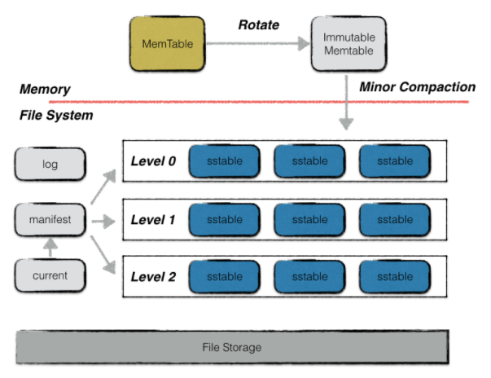
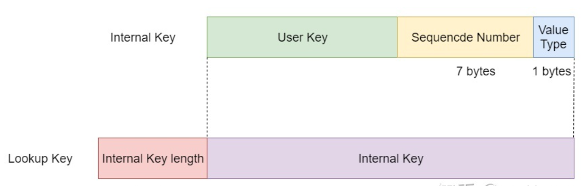
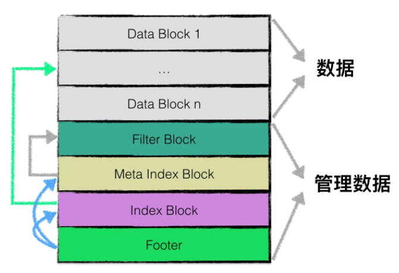
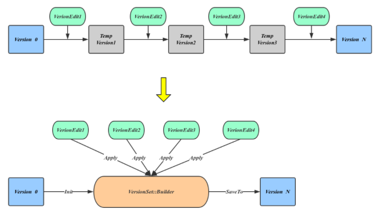
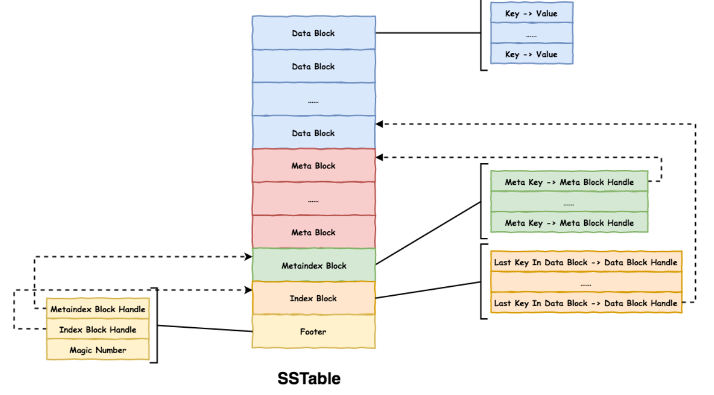
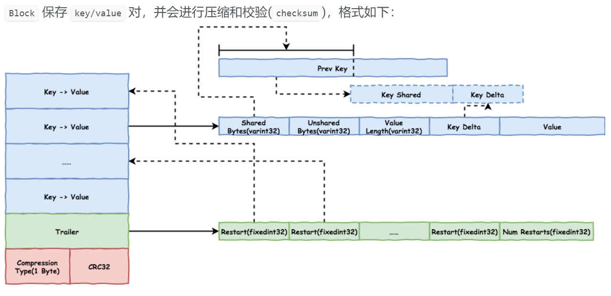
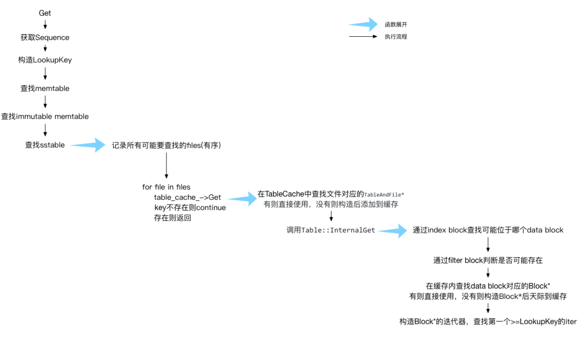
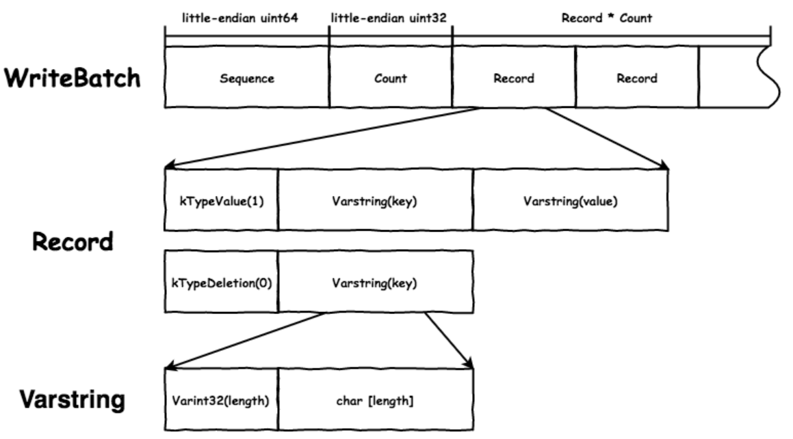
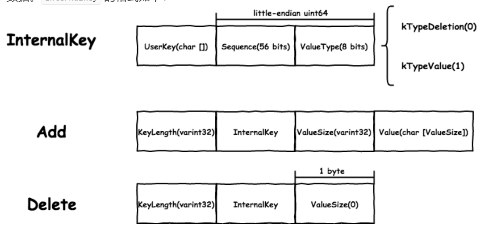

> leveldb最优雅的是把引擎, 数据结构, 日志等交织在一起, 精简模块没有冗余

### 存储架构

可能业务层大多追求模块化, 切片, 减少依赖; 但仅数据库的设计而言, 模块化和模块间联系是兼顾的, 其中表现在理解数据库需要在各模块通晓的基础上。即使单纯的读写也会涉及多模块的联同，而非简单的读写模块。



以上leveldb的文件主要有, log, manifest, current, sstable。而memtable, immutable位于内存中。

####  key

LevelDB里面用到了三种键，分别是User Key，Internal Key和Lookup Key，这三种Key是包含的关系。


User Key，这种是最简单的情况，也就是读写键值对时提供的键，只是一个简单的字符串，一般用Slice来表示。

Internal Key，是SSTable里实际存储的键值，也就是这个持久化有序的Map的键. LevelDB不存在相同的Internal Key因为加上了SequenceNumber, 但可以存在相同的Internal Key
```cpp
typedef uint64_t SequenceNumber;
static const SequenceNumber kMaxSequenceNumber = ((0x1ull << 56) - 1);

enum ValueType { kTypeDeletion = 0x0, kTypeValue = 0x1 };

struct ParsedInternalKey {
    Slice user_key;
    SequenceNumber sequence;
    ValueType type;
}
```

Lookup Key其实就是简单的在Internal Key前面加上键的长度，使用varint32编码。因为跳跃表中只存储key, 通过键的长度可以通过偏移量来定位value。

使用跳跃表有利于处理相同userkey的情况(即userkey相同应该去sequence number大的那个), 用多路顺序查找代替二分查找。

#### log 
log容易理解, leveldb内存中存储为memtable, immutable, cache(LRU)。cache用于缓存, 可认为是manifest, sstable部分内容的缓存。memtable, immutable结构是跳跃表, 内容在磁盘不存在(可理解redis内存数据库), 因此如果内存发生断电等问题数据就丢失了。log的作用是恢复memtable, 也就是如果断电memtable数据丢失可以用Log文件恢复数据。在写memtable之前数据要写入log作为record, 注意这里的数据是写操作, 也就是put,delete; get不会写入log。当immutable数据持久化到SST中, log就没必要保持已经持久化的数据, 因此log会定期清理。

log写操作都是一次顺序写，因此写效率高，整体写入性能较好。leveldb的写操作基本是log顺序写+数据entry插入跳跃表(logn)的开销, 效率很高。

#### sstable
SSTtable是数据的主要存储位置, 我们会对DB的数据进行添加，删除等操作, 这些操作先放入日志, 数据进入memtable。随着数据越来越多, memtable数据转为immutable(immutable只能读不能写), 后者进而转为SST level0的数据, 存储后数据的日志会清理。imutable转为SST level0过程称为minor compaction

level0的SSTtable是直接通过immutable的数据顺序写入的, 其通过sequence number排序, 换言之leveldb 1层是按照sequence number排序的(即按照时间由近到远排序), 景观immutable是按照key排序的, 写入SST顺序写且按照sequence number排序。这里leveldb主要使用的key为InternalKey, 可认为是普通key+seq组成, seq可以是key的唯一标识, 递增, seq越大说明该key距离当前时间越近。level0自动根据seq排序好处是优先查找距离当前时间近的数据。


SST的主要存储单位可以认为是Data Block, 由key-value Entry对组成。这里注意Data Block Entry的key不是直接存数字, 而是根据和上一个key相同区域, 不同区域这样存储, 可能经验好处是节省空间吧。Filter Block作用是进行Bloom filter的判断, 如果某个key不存在这在leveldb中判断开销比较大, 因为需要从memtable到所有level的数据全查一遍才能判断key不存在, bloom filter是一种判断key是否存在的算法。

SST level1及以下层的table, block是根据key排序的, 在查找key时可从footer直接找到该table的最大值最小值判断存在于那个table, 通过index判断在哪个block, 在block中同样可以使用二分查找加快key查找速率。

#### manifest
manifest文件内容和Version有关。

Version可以理解为对SST某些文件的映射, 我们大量直接插入, 删除Entry, Entry进入memtable到immtable再到SST中, 但如果我们想找到过去数据库的样子, 就需要Version了。Version映射到SST某些文件, 而这些文件就是过去某时刻数据库存在的数据。SST中的文件被Version引用,如果引用计数为0, 则文件需要被删除。

所有Version用一个双向链表VersionSet维护, 产生新Version的时刻就是minor compaction和major compaction。因为执行compaction必然会新增SST文件, VersionEdit会记录这个过程文件的增减, 利用上次Compaction后的Version加上期间生成的VersionEdit可以生成本次的Version。

**manifest文件可以作为一个记录Version的日志**, 它和SSTable同样重要, 一般重启数据库会生成manifest文件, 所以数据库往往存在多个manifest文件, 另外需要一个current文件说明当前用到的是哪个manifest文件。

创建manifest文件会将当前数据库版本完整信息(主要是版本包含哪些sst files)写入manifest, 之后compaction时创建Version前每个VersionEdit序列化到manifest中, 可以说manifest存储的信息是Version信息。对恢复某版本的SST 信息有重要作用。

#### compaction

compaction 的实现，涉及到 compaction 的时机、 sstable 的组织方式、memtable 和 sstable 间的合并方式。compaction 对读写性能起着至关重要的影响，它会清理无用数据，能够降低磁盘空间使用并降低读的延迟，但是也会带来极大的 I/O 压力。

compaction 主要考虑如下几个因素:

* 写放大: 要减少 compaction 时涉及到的无关数据量。
* 读放大: 减少读数据时，读取的无关数据量。
* 随机 I/O: 尽量减少随机 I/O。


level-0 由 memtable 直接转化而来, 文件之间有重叠(即存在相同键)。当 level-0 的 sstable 数量到达阈值时, 会将 level-0 中相互重叠的 sstable 和 level-1 中重叠的 sstable 合并为新的 level-1 的 sstable。

其余 level 由低层 compaction 而来，除最高层外，每层有大小限制，level-(N+1) 的大小限制是 level-N 的 10 倍，其中level-1 为 10MB。相同 level 的文件之间无重叠。当 level-N 的 sstable 大小到达阈值时，会挑选一个文件(可能不止一个)和 level-(N+1) 中有重叠的 sstable 合并为新的 level-(N+1) 的 sstable。
#### snapshot

快照的作用是回滚, 即因为各种原因(误操作、系统错误等)导致源数据损毁，那么，我们可以通过回滚（rollback）快照，将源数据恢复至快照创建时的状态。数据库的状态包括内存跳跃表数据和sst中的持久化数据。

LevelDB中的快照是通过sequence_number_来实现的。在LevelDB中每次来一个新的更新类请求（put/del），都会生成一个独一无二的且递增的sequence_number，并把这个sequence_number同原始的key编码（其实还有具体的操作类型put/del）到一个新的key中。当两个key是一样的，就可以通过sequence_number来区分新旧，并且在读的时候默认是返回最新的数据。

LevelDB通过双向循环链表来保存多个快照。每生成一个快照时，要插入双向链表中。当获取一个快照的数据, 只需要定位到


<!-- more -->

当数据进入到compact, 只能用version维护各种历史版本, 每当有文件删除或增加时，就会创建新的 Version 插入到 VersionSet。只有当一个 sstable 不再被任意 Version 使用时才会进行删除。

### SSTable和compaction

对 sstable 的操作只有2种：从 sstable 中查找 key和遍历 sstable。所以对 sstable 的要求如下：

* 生成时要顺序写。
* 支持高效的查找。
* 要支持遍历

stable 划分为 Block 存储，不同 Block 存储不同的数据



* Data Block：有序存储 key value 数据。
* Meta Block：存储 metadata，目前 leveldb 中只存储 filter 信息。
* Metaindex Block：handle 用于索引 Block，包括 Block 的 offset 和 size。Metaindex Block 保存 Meta Block 的索引，目前只保存 filter.name 和 filter Block 索引。
* Index Block：保存每个 Data Block 最后一个 key 和该 Data Block 的索引。
* Footer：固定 48 Bytes，保存 Metaindex Block 和 Index Block 的索引，是解析的起点。

#### block

Block 保存 key/value 对，并会进行压缩和校验(checksum) 。第一个 key 是完整的，按顺序解析时，通过拼接和前一个 key 重叠的加上 Delta 部分即可得到当前完整的 key。按顺序存放的 key 之间很可能会有重叠， 尤其是 leveldb 中很多 key 只有 sequence 不同，使用这种存储方式能够极大的降低数据存储量。



每隔一定数量的 key/value 会有一个 restart point，如 Data Block 默认间隔为 16。restart point 的 shared bytes 为 0，存放完整的 key。Trailer 中记录 restart points 的 offset，查找时先二分查找 restart points 找到 key 所在的起始 restart point，然后顺序查找即可，避免了从头开始查找。

1. 二分查找 restart points：找到最后一个 key < target 的 restart point(这种做法还有个好处是可以保证当userkey相同时先读到sequence大的那个internal key)
2. 然后从 restart point 开始顺序遍历，直到找到第一个 key >= target。

Data Block 的大小超过配置的 block_size(默认为 4KB)时， 会创建一个新的 Data Block

* meta block和filter

leveldb 中只有 filter 一种 metadata。leveldb 中使用 bloom filter，用于快速判断 key 是否存在，它的原理如下:

1. 对于一个 key 集合，使用固定大小的位图，假设 key 的个数为 n，位图大小为 m bits。
2. **集合内每个 key 利用多种hash算法计算出一组 hash 值，将对应的 bit 置位**，假设每个 key 使用 k bits。
3. 查询 key 时使用相同的算法计算出 k bits，若每个 bit 都为 1，则这个 key 很可能存在；若不都为 1，则这个 key 一定不在。

leveldb 是为每个 Data Block 创建一个 bloom filter，要注意创建 bloom filter 的 key 要是 UserKey 而不是 InternalKey。

为每个 Data Block 生成一个 Filter。按照 Data Block 的 offset 生成 filter 索引，目前是每 2KB(1 << kFilterBaseLg) 生成一个。当查找 Data Block 对应的 filter 时，只要 查找第 Data Block Offset >> kFilterBaseLg 个 Filter Offset 即可。按照 2KB 划分的原因是因为 Data Block 的大小不固定，超过 4KB 会切换到新的，但可能会超很多。

Metaindex Block, 目前只存放 filter.name 到 Filter Block 的索引。

* Index Block

Index Block 保存 Data Block 的索引，且每个 key 都是 restart point:


* Footer 

是解析的起点，大小固定为 48 Bytes：包含Metaindex Block Handle和Index Block Handle位置, 以及Magic Number：用于判断检测文件有效性。

#### compaction

leveldb 是分层管理 sstable 的，level-0 的 sstable 之间有重叠，其他 level 的 sstable 之间无重叠。读是从 level-0 开始从低往高查找， 当查找到第一个 key 相同且 sequence 小于等于 target key 的就会停止。这需要保证层高的数据严格旧于层低的数据(即层高的数据sequence number比层低的数据小)

compaction 分为两种：

1. memtable compaction：memtable 直接转储为 sstable。
2. sstable compaction：将 level-n 的一个 sstable 和 level-(n+1) 重叠的 sstable 合并生成新的 level-(n+1) 的 sstable。会把 level-0 中所有重叠的 sstable 和 level-1 中重叠的 sstable 合并生成新的 level-1 的 sstable。 level-0 所有重叠 sstable 合并保证了旧的 key 不会在更低层；

sstable 由 file number 区分，file number 顺序递增，越大文件越新，查找 level-0 时就会按照新旧程度排序，先查找新的 sstable文件块。还会记录每个 sstable 的 key range， 只要查找相匹配的即可。


#### Memtable Compaction

memtable 大小超过 Options.write_buffer_size 时(默认 4MB)，会在下一次写操作时将当前的 memtable 转为 immutable memtable，创建新的 memtable，并触发 immutable memtable 的 compaction。compaction 会由单独的线程来执行。

memtable compaction 的过程很简单，顺序遍历 memtable 将所有的 key/value 转储为 sstable 格式即可(不会清理无用数据)，生成的 sstable 不一定在 level-0

1. 当 level-0 sstable 数量达到 kL0_SlowdownWritesTrigger(8) 时，每个写操作会 sleep(1ms)。
2. 当前 memtable 已满需要 compaction 但之前的 immutable memtable compaction 还未完成时，会等待之前的完成。
3. 当 level-0 sstable 数量达到 kL0_StopWritesTrigger(12) 时，会等待 level-0 compaction 完成。

#### Sstable Compaction

触发 sstable compaction 的条件如下：

1. level-0：sstable 文件个数超过 kL0_CompactionTrigger(4)。因为 level-0 是从 sstable 直接转储而来，所以用个数限制而不是大小。
2. 其他 level：高层的 sstable 会按照 max_file_size(2MB) 进行切割，当一层的 sstable 总大小超过阈值时会触发，最高层无大小限制。
3. 每个文件还有 seek 的次数限制，超过次数会进行 compaction，防止读多写少的场景下，compaction 不会触发。

选择 compaction 的文件分2步：

1. 执行 compaction 的 level：leveldb 会记录每个 level 上次 compaction 的最大的 key，下一次时会挑选在这之后的文件，防止后面的文件一直不会被选到。
2. 高一层的文件：挑选和低一层的文件有重叠的所有文件。高一层的总的 key range 可能会覆盖到更多的低一层的文件，所以会进行 expand，同时为了防止 compaction 太大， 会有一定的限制。

sstable compaction 的过程也比较简单，和 memtable compaction 的区别在于，这里是多个文件，类似 merge sort 的流程，leveldb 中也实现了 MergingIterator 用于 在多个迭代器的情况下有序迭代。

leveldb 支持 snapshot，也就是 sequence，在其内部维护了一个 SnapshotList， 保存着所有正在使用的 snapshot，会根据当前使用到的 smallest snapshot 进行清理
1. 只需要保存 smallest snapshot 能够访问到的及更高版本的，即保存第一个小于等于 smallest snapshot 的版本及更高版本即可。
2. 若第一个小于等于 smallest snapshot 的版本是删除操作，只要高层没有这个 key 也可以丢弃这个版本。

SST中保存的key是internal key, 当然可能存在相同duserkey, 但seq不同。高于smallest snapshot的key leveldb永远不会删除
### 读

leveldb 的读操作按照数据的新旧依次读, leveldb 保证了更新的数据一定会比旧的数据先找到，所以当找到第一个 key 相同且 sequence 小于等于 target key 的就停止。

1. memtable
2. immutable memtable
3. level-0 中按照 sequence number 倒序
4. level1 -> level-6, 通过二分找到restart pointer和顺序找。

注意versionSet保证了SST中文件的版本, 内存中的版本通过snapshot维护(重启则snapshot失效), 因此如果要查找SST的文件需要
1. 根据versionSet找到对应version映射的文件
2. LRU Cache是否有这个块
3. 读取文件到缓存并查找



leveldb的读遵循

```cpp
  Status DBImpl::Get(const ReadOptions &options,
                     const Slice &key,
                     std::string *value)
  {
    Status s;
    MutexLock l(&mutex_); // 获得互斥锁
    SequenceNumber snapshot;
    if (options.snapshot != nullptr)
    {
      snapshot =
          static_cast<const SnapshotImpl *>(options.snapshot)->sequence_number(); // VersionSet的某个Sequence可以作为版本之snapshot
    }

    MemTable *mem = mem_;
    MemTable *imm = imm_;
    Version *current = versions_->current();  // 当前版本
    mem->Ref(); // 对象引用
    if (imm != nullptr)
      imm->Ref();
    current->Ref();

    bool have_stat_update = false;
    Version::GetStats stats;
    // Unlock while reading from files and memtables
    {
      mutex_.Unlock();
      // First look in the memtable, then in the immutable memtable (if any).
      LookupKey lkey(key, snapshot);  // 要查找的key, snapshot表示查找key的seq不能超过snapshot
      if (mem->Get(lkey, value, &s))  // 从mem得到key
      {
        // Done
      }
      else if (imm != nullptr && imm->Get(lkey, value, &s)) // 从imm查找key
      {
        // Done
      }
      else
      {
        s = current->Get(options, lkey, value, &stats);
        have_stat_update = true;
      }
      mutex_.Lock();
    }

    if (have_stat_update && current->UpdateStats(stats))
    {
      MaybeScheduleCompaction();  // 可能定时Compaction执行
    }
    mem->Unref(); // 减少引用
    if (imm != nullptr)
      imm->Unref();
    current->Unref();
    return s;
  }
```
`imm->Get`实际是是从组成memtable的数据结构_跳跃表中执行查找操作

`current->Get`则是从当前版本, 实际是当前version对应的SST中执行查找。

#### 跳跃表的Get

Memtable的查找操作由跳跃表实现, 跳跃表可以看成若干level的不同跨度的链表。
```cpp
bool MemTable::Get(const LookupKey& key, std::string* value, Status* s) { // MemTable检索, 就是从跳跃表中检索
  Slice memkey = key.memtable_key();
  Table::Iterator iter(&table_);  // Table::Iterator 跳跃表迭代器
  iter.Seek(memkey.data()); // 跳跃表中查找key
  
  if (iter.Valid()) {
    // entry format is:
    //    klength  varint32
    //    userkey  char[klength]
    //    tag      uint64
    //    vlength  varint32
    //    value    char[vlength]
    const char* entry = iter.key();
    uint32_t key_length;
    const char* key_ptr = GetVarint32Ptr(entry, entry+5, &key_length);
    if (comparator_.comparator.user_comparator()->Compare(
            Slice(key_ptr, key_length - 8),
            key.user_key()) == 0) {
      // Correct user key
    ...
    }
  }
  return false;
}

// 跳跃表
template<typename Key, class Comparator>
inline void SkipList<Key, Comparator>::Iterator::Seek(const Key& target) {
  // 查找>= target的key
  node_ = list_->FindGreaterOrEqual(target, nullptr);
}

template<typename Key, class Comparator>
typename SkipList<Key, Comparator>::Node*
SkipList<Key, Comparator>::FindGreaterOrEqual(const Key& key,
                                              Node** prev) const {
  Node* x = head_;  // 头节点
  int level = GetMaxHeight() - 1; // 从最高层开始
  while (true) {
    Node* next = x->Next(level);
    if (KeyIsAfterNode(key, next)) {
      // Keep searching in this list
      x = next; // 这层还需要前进
    } else {
      if (prev != nullptr) prev[level] = x;
      if (level == 0) {
        return next;  // 已经是最后一层
      } else {
        // Switch to next list 下沉一层
        level--;
      }
    }
  }
}
```

跳跃表的插入
```cpp
template<typename Key, class Comparator>
void SkipList<Key, Comparator>::Insert(const Key& key) { // 从跳表中插入元素
  // TODO(opt): We can use a barrier-free variant of FindGreaterOrEqual()
  // here since Insert() is externally synchronized.
  Node* prev[kMaxHeight];
  // 找到每层要插入key的prev节点
  Node* x = FindGreaterOrEqual(key, prev);

  // Our data structure does not allow duplicate insertion
  assert(x == nullptr || !Equal(key, x->key));

  int height = RandomHeight();  // 随机生成高度
  // 如果height比当前maxheight大, height~max的prev设置为head_
  if (height > GetMaxHeight()) {
    for (int i = GetMaxHeight(); i < height; i++) {
      prev[i] = head_;
    }
    max_height_.store(height, std::memory_order_relaxed);
  }

  x = NewNode(key, height); // 新建跳跃表节点
  // key节点插入到跳跃表, prev->x->prev->next
  for (int i = 0; i < height; i++) {
    // NoBarrier_SetNext() suffices since we will add a barrier when
    // we publish a pointer to "x" in prev[i].'
    // x插入该层的链表
    x->NoBarrier_SetNext(i, prev[i]->NoBarrier_Next(i));  // x在i层的next节点为prev->next
    prev[i]->SetNext(i, x); // 设置prev[i]节点在该层的next节点为x
  }
}

template<typename Key, class Comparator>
int SkipList<Key, Comparator>::RandomHeight() { // 随机设置高度
  // Increase height with probability 1 in kBranching
  static const unsigned int kBranching = 4;
  int height = 1;
  while (height < kMaxHeight && ((rnd_.Next() % kBranching) == 0)) {
    height++;
  }
  assert(height > 0);
  assert(height <= kMaxHeight);
  return height;
}
```

### SST的Get

SST读key首先基于Version,对Version指向的所有files
1. 如果level0, 遍历找到可能存储key的files,即`ucmp->Compare(user_key, f->smallest.user_key()) >= 0 && ucmp->Compare(user_key, f->largest.user_key()) <= 0)`
2. 如果level>=1, 使用二分查找找可能存储key的files`uint32_t index = FindFile(vset_->icmp_, files_[level], ikey);`

3. 对于可能存在key的files, 调用`vset_->table_cache_->Get(options, f->number, f->file_size,ikey, &saver, SaveValue);`寻找key

```cpp
Status Version::Get(const ReadOptions& options,
                    const LookupKey& k,
                    std::string* value,
                    GetStats* stats) {
  Slice ikey = k.internal_key();
  Slice user_key = k.user_key();
  const Comparator* ucmp = vset_->icmp_.user_comparator();  // internalkey的比较器
  Status s;

  stats->seek_file = nullptr;
  stats->seek_file_level = -1;
  FileMetaData* last_file_read = nullptr;
  int last_file_read_level = -1;

  std::vector<FileMetaData*> tmp;
  FileMetaData* tmp2;
  // 针对当前Version在每个level的文件
  for (int level = 0; level < config::kNumLevels; level++) {
    size_t num_files = files_[level].size();
    if (num_files == 0) continue;

    // Get the list of files to search in this level
    FileMetaData* const* files = &files_[level][0];
    if (level == 0) {
      // Level-0 files may overlap each other.  Find all files that
      // overlap user_key and process them in order from newest to oldest.
      tmp.reserve(num_files);
      for (uint32_t i = 0; i < num_files; i++) {  // 只能遍历level0的所有num_files了
        FileMetaData* f = files[i];
        // level0中, 如果user_key位于file中, 则讲file加入tmp
        if (ucmp->Compare(user_key, f->smallest.user_key()) >= 0 &&
            ucmp->Compare(user_key, f->largest.user_key()) <= 0) {
          tmp.push_back(f);
        }
      }
      if (tmp.empty()) continue;

      std::sort(tmp.begin(), tmp.end(), NewestFirst);
      files = &tmp[0];
      num_files = tmp.size();
    } else {
      // Binary search to find earliest index whose largest key >= ikey.
      // 非level0, 使用二分查找处理level的file, 得到可能存在key的file
      uint32_t index = FindFile(vset_->icmp_, files_[level], ikey);
      if (index >= num_files) {
        files = nullptr;
        num_files = 0;
      } else {
        tmp2 = files[index];
        if (ucmp->Compare(user_key, tmp2->smallest.user_key()) < 0) {
          // All of "tmp2" is past any data for user_key
          files = nullptr;
          num_files = 0;
        } else {
          files = &tmp2;
          num_files = 1;
        }
      }
    }
    // 可能存在key的file放在files中
    for (uint32_t i = 0; i < num_files; ++i) {
      if (last_file_read != nullptr && stats->seek_file == nullptr) {
        // We have had more than one seek for this read.  Charge the 1st file.
        stats->seek_file = last_file_read;
        stats->seek_file_level = last_file_read_level;
      }
      // 可能含有user_key的file
      FileMetaData* f = files[i];
      last_file_read = f;
      last_file_read_level = level;

      Saver saver;  // 保存结果
      saver.state = kNotFound;
      saver.ucmp = ucmp;
      saver.user_key = user_key;
      saver.value = value;  // 根据key找到的value
      // 尝试从table_cache找file, 进而ikey
      s = vset_->table_cache_->Get(options, f->number, f->file_size,
                                   ikey, &saver, SaveValue);
      if (!s.ok()) {
        return s;
      }
      switch (saver.state) {
        case kNotFound:
          break;      // Keep searching in other files
      }
    }
  }
  return Status::NotFound(Slice());  // Use an empty error message for speed
}
```

#### table_cache_的Get()

```cpp
Status TableCache::Get(const ReadOptions& options,
                       uint64_t file_number,
                       uint64_t file_size,
                       const Slice& k,
                       void* arg,
                       void (*saver)(void*, const Slice&, const Slice&)) {
  Cache::Handle* handle = nullptr;
  // 在TableCache根据file找table
  Status s = FindTable(file_number, file_size, &handle);
  if (s.ok()) {
    Table* t = reinterpret_cast<TableAndFile*>(cache_->Value(handle))->table; // 获得table
    
    s = t->InternalGet(options, k, arg, saver); // 基于table的getkey
    cache_->Release(handle);
  }
  return s;
}

// FindTable
Status TableCache::FindTable(uint64_t file_number, uint64_t file_size,
                             Cache::Handle** handle) {
  Status s;
  char buf[sizeof(file_number)];
  EncodeFixed64(buf, file_number);
  Slice key(buf, sizeof(buf));
  *handle = cache_->Lookup(key);  // 尝试直接hash找key
  
  if (*handle == nullptr) { // 没有找到
    std::string fname = TableFileName(dbname_, file_number);
    RandomAccessFile* file = nullptr;
    Table* table = nullptr;
    s = env_->NewRandomAccessFile(fname, &file);
    if (!s.ok()) {
      std::string old_fname = SSTTableFileName(dbname_, file_number);
      if (env_->NewRandomAccessFile(old_fname, &file).ok()) {
        s = Status::OK();
      }
    }
    if (s.ok()) {
      s = Table::Open(options_, file, file_size, &table);
    }

    if (!s.ok()) {
      assert(table == nullptr);
      delete file;
      // We do not cache error results so that if the error is transient,
      // or somebody repairs the file, we recover automatically.
    } else {
      TableAndFile* tf = new TableAndFile;
      tf->file = file;
      tf->table = table;
      *handle = cache_->Insert(key, tf, 1, &DeleteEntry);
    }
  }
  return s;
}

Status Table::InternalGet(const ReadOptions& options, const Slice& k,
                          void* arg,
                          void (*saver)(void*, const Slice&, const Slice&)) {
  Status s;
  Iterator* iiter = rep_->index_block->NewIterator(rep_->options.comparator);
  iiter->Seek(k);
  if (iiter->Valid()) {
    Slice handle_value = iiter->value();
    FilterBlockReader* filter = rep_->filter; // 布隆过滤器, FilterBlock用于
    BlockHandle handle;
    if (filter != nullptr &&
        handle.DecodeFrom(&handle_value).ok() &&
        !filter->KeyMayMatch(handle.offset(), k)) {
      // Not found
    } else {
      Iterator* block_iter = BlockReader(this, options, iiter->value());  // BlockReader, 返回Block::Iter对象
      
      block_iter->Seek(k); // block_iter为Block::Iter对象, 因此->指向Block对象, 相当于调用Block::Seek。二分查找
      
      if (block_iter->Valid()) {  // 如果结果有效, 保存结果
        (*saver)(arg, blo ck_iter->key(), block_iter->value());
      } // 结果保存在save中
      s = block_iter->status();
      delete block_iter;
    }
  }
  if (s.ok()) {
    s = iiter->status();
  }
  delete iiter;
  return s;
}
```

### 写

1. 从`DB::Put`转为`DB::Write`, 将写入的数据构成`WriteBatch`
2. 将操作写入log/WAL
3. 调用`WriteBatchInternal::InsertInto`插入数据到memtable


leveldb 不是直接将 kv 插入到 memtable 中，而是先生成 WAL，然后解析 WAL 插入，目的是为了减少重复代码，复用了重启时用 WAL 恢复 memtable 的代码。 WAL 的格式如下



WriteBatch 记录了当前 batch 的起始 Sequence，会追加在 key 后用于实现 MVCC(MVCC是防止读到未提交的事务, 也就是说只针对内存/缓存中的数据, 因为持久化到数据库中的一定是已提交的)。log::Writer 将log文件划分为固定大小的 Block(32 KB)



leveldb 不支持多个写操作同时执行，写操作会保存在 deque 中，只有队首的才会执行, leveldb 不是直接将 kv 插入到 memtable 中，而是先生成 WAL，然后解析 WAL 插入，目的是为了减少重复代码，复用了重启时用 WAL 恢复 memtable 的代码。 

leveldb的delete是通过增加一个删除标志的key完成的, 这直到major compaction时按key排序发现删除标志key才删除序列号之前的key, memtable和L0 SST都是没有删除的。注意到memtable由于使用了跳跃表是没有key重复的, 而L0 SST是可能重复的, 但读取时会根据seq从大向小读, 如果先读到key delete标志说明更高层的数据都是无效的了，尽管更高层可能还存在key。这说明将key设置delete标志来删除key是可行的。

leveldb 在插入和读取 memtable 的时候是不加锁的，全依赖 skiplist 实现并发控制。leveldb 实现的是支持一写多读的、lock-free 的 skiplist, 所谓的Lock-free其实就是通过原子类实现的

```cpp
/// 调用WriteBatch Put
Status DB::Put(const WriteOptions &opt, const Slice &key, const Slice &value)
{
  WriteBatch batch;
  /// 加入到batch中
  batch.Put(key, value);
  return Write(opt, &batch);
}


 Status DBImpl::Write(const WriteOptions &options, WriteBatch *my_batch)
  {
    /// Writer对象 w, 用Mutex构建
    Writer w(&mutex_);
    w.batch = my_batch;
    w.sync = options.sync;
    w.done = false;

    MutexLock l(&mutex_);
    writers_.push_back(&w); // 加入writers_ 
    while (!w.done && &w != writers_.front())
    {
      w.cv.Wait();
    }
    if (w.done)
    {
      return w.status;
    }

    // May temporarily unlock and wait.
    Status status = MakeRoomForWrite(my_batch == nullptr);  // 增加写的空间
    uint64_t last_sequence = versions_->LastSequence(); // 版本的最后序列号
    Writer *last_writer = &w;
    if (status.ok() && my_batch != nullptr)
    { // nullptr batch is for compactions
      WriteBatch *updates = BuildBatchGroup(&last_writer);  // Writer构建WriteBatch* updates, 用来put
      WriteBatchInternal::SetSequence(updates, last_sequence + 1);
      last_sequence += WriteBatchInternal::Count(updates);

      // Add to log and apply to memtable.  We can release the lock
      // during this phase since &w is currently responsible for logging
      // and protects against concurrent loggers and concurrent writes
      // into mem_.
      {
        mutex_.Unlock();
        status = log_->AddRecord(WriteBatchInternal::Contents(updates));  // 先将记录追加入日志
        bool sync_error = false;
        if (status.ok() && options.sync)
        {
          status = logfile_->Sync();
          if (!status.ok())
          {
            sync_error = true;
          }
        }

        if (status.ok())
        {
          status = WriteBatchInternal::InsertInto(updates, mem_); // update记录写入memtable中
        }
        }
      }

      versions_->SetLastSequence(last_sequence);  // 版本操作序列号
    }

    return status;
```

memtable内部的操作
1. 将对Memtable的操作转为对其迭代器的处理(迭代器可以理解为高级对象指针)
2. 其实通过`MemTableInserter::Put`间接使用`mem_->Add(sequence_, kTypeValue, key, value);` 将数据插入到跳跃表中
```cpp
Status WriteBatchInternal::InsertInto(const WriteBatch* b,
                                      MemTable* memtable) {
  
  MemTableInserter inserter;
  inserter.sequence_ = WriteBatchInternal::Sequence(b);
  inserter.mem_ = memtable;
  return b->Iterate(&inserter);
}

Status WriteBatch::Iterate(Handler* handler) const {  // WriteBatch将数据写入到memtable中, handler是MemTableInserter
  Slice input(rep_);

  int found = 0;
  while (!input.empty()) {
    found++;
    char tag = input[0];
    switch (tag) {
      /// 写入还是删除tag
      case kTypeValue:
        if (GetLengthPrefixedSlice(&input, &key) &&
            GetLengthPrefixedSlice(&input, &value)) {
          handler->Put(key, value); // 写入, 等价于MemTableInserter::Put
        } else {
          return Status::Corruption("bad WriteBatch Put");
        }
        break;
      case kTypeDeletion:
        if (GetLengthPrefixedSlice(&input, &key)) {
          handler->Delete(key);
        } else {
          return Status::Corruption("bad WriteBatch Delete");
        }
        break;
      default:
        return Status::Corruption("unknown WriteBatch tag");
    }
  }
}

class MemTableInserter : public WriteBatch::Handler { // 在MemTable增加数据
 public:
  SequenceNumber sequence_;
  MemTable* mem_;

  virtual void Put(const Slice& key, const Slice& value) {
    mem_->Add(sequence_, kTypeValue, key, value); // 加入数据到mem_中
    sequence_++;
  }
  virtual void Delete(const Slice& key) {
    mem_->Add(sequence_, kTypeDeletion, key, Slice());
    sequence_++;
  }
};

void MemTable::Add(SequenceNumber s, ValueType type,
                   const Slice& key,
                   const Slice& value) {  // 添加数据到跳跃表
  // Format of an entry is concatenation of:
  //  key_size     : varint32 of internal_key.size()
  //  key bytes    : char[internal_key.size()]
  //  value_size   : varint32 of value.size()
  //  value bytes  : char[value.size()]
  // 进行一些格式处理和编码
  size_t key_size = key.size();
  size_t val_size = value.size();
  size_t internal_key_size = key_size + 8;
  const size_t encoded_len =
      VarintLength(internal_key_size) + internal_key_size +
      VarintLength(val_size) + val_size;
  char* buf = arena_.Allocate(encoded_len);
  char* p = EncodeVarint32(buf, internal_key_size);
  memcpy(p, key.data(), key_size);
  p += key_size;
  EncodeFixed64(p, (s << 8) | type);
  p += 8;
  p = EncodeVarint32(p, val_size);
  memcpy(p, value.data(), val_size);
  assert(p + val_size == buf + encoded_len);

  // typedef SkipList<const char*, KeyComparator> Table;
  table_.Insert(buf); // 数据插入到跳跃表中
}
```

### 打开数据库

db的open函数设置为static, 因此往往对leveldb的执行第一步是打开数据库`static Status Open(const Options& options,const std::string& name, DB** dbptr);`

示例代码
```cpp
    leveldb::DB* db;  // 数据库指针
    leveldb::Options options;  // 选项
    options.create_if_missing = true;  
    std::string dbpath = "testdb";  
    leveldb::Status status = leveldb::DB::Open(options, dbpath, &db);  // 直接调用leveldb::DB::Open, 是static函数
    std::string key1 = "lyc";  
    std::string value1 = "liyc7711@gamil.com";  
    //cout<<"Open db OK"<<std::endl;  
    string key2 = "haha";
    string value2 = "segfwaga";
 
    std::string v1 = "";  
    string v2 = "";
    leveldb::Status s ; 
    s = db->Put(leveldb::WriteOptions(), key1, value1);/*key1和key2作为一对key-value对插入*/  
    s = db->Get(leveldb::ReadOptions(), key1, &v1);/*根据key返回对应的value值*/  
    db->Put(leveldb::WriteOptions(), key2, value2);
    db->Get(leveldb::ReadOptions(), key2, &v2);
```

DB::Open的实现
1. 创建DBImpl对象
2. `impl->Recover`恢复当前Version和memtable
3. 设置impl的一些参数, 运行后台进程, 可能执行compaction等
```cpp
  Status DB::Open(const Options &options, const std::string &dbname,
                  DB **dbptr)
  {
    /// *dbptr是指向建立DB的指针
    *dbptr = nullptr;

    DBImpl *impl = new DBImpl(options, dbname); // 创建DBImpl对象
    impl->mutex_.Lock();  // 互斥锁
    VersionEdit edit;
    // Recover handles create_if_missing, error_if_exists
    bool save_manifest = false;

    Status s = impl->Recover(&edit, &save_manifest);     // Recover恢复数据库, 包括根据manifest恢复current Version, 和根据log恢复memtable
    if (s.ok() && impl->mem_ == nullptr)
    {
      // Create new log and a corresponding memtable.
      uint64_t new_log_number = impl->versions_->NewFileNumber();
      WritableFile *lfile;
      s = options.env->NewWritableFile(LogFileName(dbname, new_log_number),
                                       &lfile);       /// 创建可写文件 *lfile
      if (s.ok())
      {
        edit.SetLogNumber(new_log_number);
        impl->logfile_ = lfile;
        impl->logfile_number_ = new_log_number;

        impl->log_ = new log::Writer(lfile);   // 可以写入文件lfile log的Write对象

        impl->mem_ = new MemTable(impl->internal_comparator_);    // impl->mem_ 应该是mutable MemTable
        impl->mem_->Ref();
      }
    }
    if (s.ok() && save_manifest)  // 恢复过程中产生了save_manifest, 生成一个新Version
    {
      edit.SetPrevLogNumber(0); // No older logs needed after recovery.
      edit.SetLogNumber(impl->logfile_number_);
      s = impl->versions_->LogAndApply(&edit, &impl->mutex_); // 新建一个Version插入VersionSet 
    }
    if (s.ok())
    {
      impl->DeleteObsoleteFiles();
      impl->MaybeScheduleCompaction();  // 运行后台进程, 可能执行compaction等
    }
    impl->mutex_.Unlock();
    if (s.ok())
    {
      assert(impl->mem_ != nullptr);
      *dbptr = impl;
    }
    else
    {
      delete impl;
    }
    return s;
  }
```
