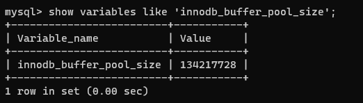
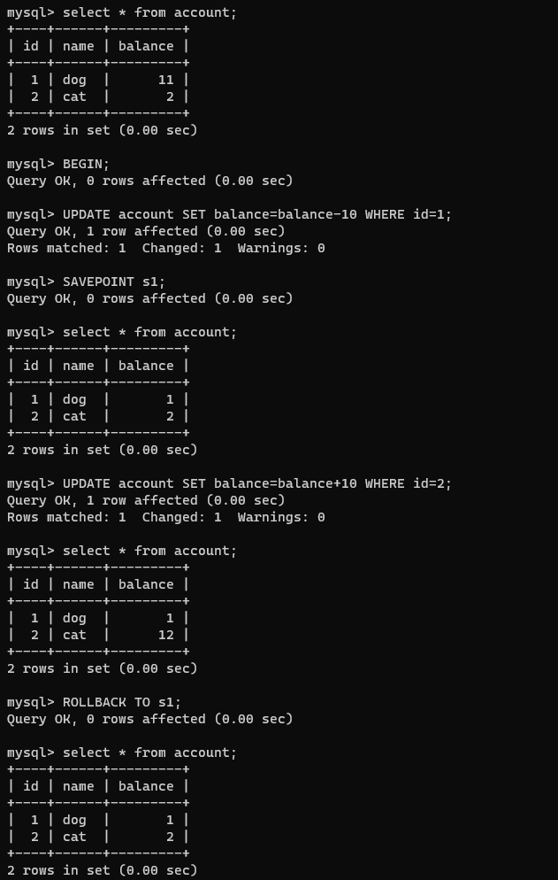
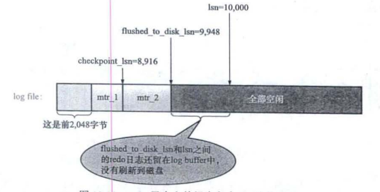
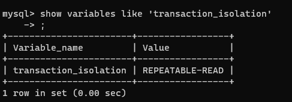
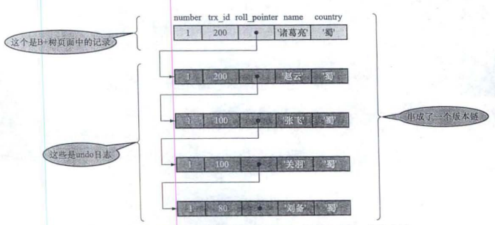

### 缓存

对于使用InnoDB存储引擎的表,无论是存储用户数据的索引(包括聚簇索引和二级索引),还是各种系统数据,都是以页的形式存储在表空间中。而表空间文件层面可以看成由若干文件组成,也就是说索引等数据主要还是存储在磁盘,当使用时读取到IO缓冲区读取,和文件没有太大不同。为了提高访问效率,InnoDB存储引擎如果需要访问某个页的数据,就会把完整的页全部加载到内存中, 内存中的数据起到磁盘缓存的作用。由于内存是有限的,使用缓存就需要考虑到数据页的换入换出。

#### 缓冲页和freelist
Buffer Pool对应的一片连续的内存被划分为若干个页面, 页面大小与InnoDB表空间使用的页面大小一致,默认16KB(因为本身是磁盘页的赋值)。这些页面称之为缓冲页。每个缓冲页有一些控制信息, 包含该页所属的表空间编号, 页号, 地址,链表节点信息等。

刚刚初始化的Buffer Pool, 所有的缓冲页都是空闲的, **每一个缓冲页对应的控制块都会加入到free双向链表中**。每当需要从磁盘加载一个页到Buffer Pool中时，就从free链表取一个空闲的缓冲页, 把该缓冲页对应的控制块信息填入, 将控制块从free链表中移除表示该缓冲页已经使用了。


一般的，如果要访问某个页的数据，需要从磁盘中加载一个页到Buffer Pool中, 如果要访问的页已经在Buffer Pool中, 直接使用就可以不用从磁盘拿数据。直接判断该页是否存在于Buffer pool可以使用哈希, 以页的位置**表空间号+页号**作为key,以缓冲页控制块地址作为value建立哈希表。 访问某个页数据时先根据表空间号+页号看看哈希表中是否有对应的缓冲页,如果有直接用缓冲页,如果没有就从free链表中选一个空闲的缓冲页,把磁盘中对应的页加载到该缓冲区的位置。然后将缓冲页对应free链表节点(也就是对应的控制块)移除,说明缓冲页可以用了。如果缓存释放,将这块区域再加入free链表。

当修改了Buffer Pool缓冲页的数据, 它就与磁盘上的页不一样了, 这样的缓冲页也称为脏页。频繁向磁盘中写数据会影响数据库的性能,因此对于脏页我们不立刻刷入磁盘,而是在某个时间点集体刷。为了判断哪些是脏页，通过创建一个存储脏页的链表,也就是flush链表,该链表和free链表差不多。某个缓冲页不可能既是free链表的节点, 又是flush链表的节点。

#### LRU链表

LRU链表, 留下最近最频繁使用的数据。实现方式很简单,用到某个缓冲页,就把该缓冲页移动到LRU链表的头部。
1. 如果该页不在Buffer Pool, 把该页从磁盘加载到Buffer Pool的缓冲页时,同时把该缓冲页对应的控制块作为节点放到LRU的头部
2. 如果该页已经在Buffer Pool中, 把该页直接移动到头部。

注意LRU链表是和free list, flush list同时存在的链表, 但只要从磁盘中加载一个页面到Buffer Pool的缓冲页中, 该缓冲页对应的控制块就会作为一个节点加入到LRU链表中, 从free list中删除。LRU的节点可能分配空间但没有写数据, 因此可能不是脏页, 但flush链表的节点(脏页)肯定包含在LRU链表中。

这种方式在MYSQL中存在问题, 因为
1. 预读,InnoDB将当前页写入到内存时, 认为后面还会读一些页面,所以会把后面一些页也读入内存,这些页不能直接加入LRU链表中
2. 全表扫描, 全表扫描可能读一些进来然后这一些出去再读一些进来, LRU链表会频繁加入删除, 而且不存在最近频繁使用的原则。

解决以上问题, InnoDB将LRU链表按比例分两截, 一部分存储使用频率非常高的缓冲页, 称为热数据young 区域; 另一部分使用频率不高,称为冷数据或者old区域。LRU的优化目标就是尽可能地提高Buffer Pool地命中率。


1. 对于预读的页面,直接放到old区域的头部,这样不会影响young区域使用频繁的缓冲页
2. 设置innodb_old_blocks_time表示多次访问同一个页面时间低于innodb_old_blocks_time的不会进入young区域,显然全表扫描符合条件,页面不会进入young区域。

后台有线程负责每隔一段时间就把脏页刷新到磁盘, 刷新方式
1. 从LRU链表地冷数据中刷新一部分页面到磁盘, 定时扫描发现脏页刷入磁盘, 称为BUF_FLUSH_LRU
2. 从flush链表中刷新一部分到磁盘, 定时,速率取决于系统是否繁忙, 称为BUF_FLUSH_LIST


### 事务 transaction 和日志log

#### 事务简介

事务的特性 AICD
1. 原子性 Atomicity, 操作不可分割, 要么全部做完且成功, 要么不做(回滚)。
2. 隔离性 Isolation, 其他的操作不会影响本次操作(例如多线程), 事务隔离就是其他事务不要影响本事务。
3. 一致性 Consistency 应用系统从一个正确的状态到另一个正确的状态。可以说AID都是来保证C。
4. 持久性 Durability 状态转移发生后 , 转换的结果永久保留不可更改。也就是事务持久化到硬盘。

事务的状态包括, 活动的(active), 部分提交的(partially committed), 提交的(committed), 失败的(failed), 中止的(aborted)。只有一个事务处于提交和中止的状态, 一个事务处于提交或者中止状态其生命周期才算结束。对于中止状态的事务，该事务对数据所做的所有修改都会被回滚到没执行该事务之前的状态。


<!-- more -->

事务的语法

```
BEGIN;  #开启一个事务
UPDATE account SET balance = blance-10 WHERE id=1;
UPDATE account SET balance = blance+10 WHERE id=2;
COMMIT; # 提交 或者 ROLLBACK # 回滚
```
注意即使没有COMMIT;如果执行其他语句, 例如`create`, 前面的事务指令将自动提交, 称为隐式提交。

保存点

可以在事务中加入保存点`SAVEPOINT`, 回滚到指定的保存点。这样可以保证ROLLBACK不至于回滚到事务开始, 一夜回到解放前。

```
BEGIN;
UPDATE account SET balance = balance - 10 WHERE id = 1;
SAVEPOINT s1;
UPDATE account SET blance = blance + 1 WHERE id = 2;
ROLLBACK TO s1;
```



### redo日志

对于一个已经提交的事务. 在事务提交之后即使系统发生了崩溃, 对数据库做的更改也不能丢失。但为了提高IO速率, 事务提交往往提交在buffer pool, 日志的作用就是防止因内存故障导致的数据丢失。

日志是一般是写入日志缓冲，这些缓冲将高频率刷入磁盘, 一般不需要考虑日志丢失的问题。日志采用的方式是顺序写，这远远高于B树数据的随机写速率。redo日志有以下好处
1. redo日志占用空间小, 只存储表空间id, 页号, 偏移量以及要更新的值。
2. redo日志顺序写入磁盘， 顺序IO

Redo日志的本质是记录事务对数据库做了哪些修改, 注意记录数据库位置(表空间+页号), 修改的内容(命令)。可以认为是一种增量的存储。利用日志恢复时，需要重新执行日志存储的修改命令。


type日志类型, space ID表空间ID, page number页号, data具体内容

redo日志放在了大小为512字节的页中, 称为block。redo日志存储在496字节的log block body中, log block header和log block trailer存储的是一些管理信息。


服务器启动时会将操作系统申请大片redo log buffer redo日志缓冲区, 因此redo日志并不是直接写入到磁盘中。redo log buffer空间可以划分为若干个连续的redo log block, 向log buffer中写入redo 日志时顺序写入到log block body中。


redo buffer的flush时机
1. log buffer空间不足,log buffer时优先的,不够了就得把一些放入磁盘中
2. 事务提交
3. 后台一个线程大概1s一次的时机将redo日志缓冲区进行刷盘。
4. 正常关闭服务器时
5. 做checkpoint时


以上是redo日志在内存中的存储格式, 接下来是日志刷入磁盘后文件中redo日志文件格式。MYSQL的数据目录(可使用`SHOW VARIABLES LIKE 'datadir'`命令)默认有`iblogfile`文件, log buffer的日志默认刷新到这两个磁盘文件中。redo日志文件组中每个文件大小都一样, 格式也一样。前2048个字节可分为4个特殊block, 从2048字节往后存储log buffer中的block镜像。


log sequence number是一个递增的序号, lsn之越小说明日志阐述的越早。这里需要用到脏页的概念, 脏页是Linux内核中的概念，因为硬盘的读写速度远赶不上内存的速度，系统就把读写比较频繁的数据事先放到内存中，以提高读写速度，这就叫高速缓存，linux是以页作为高速缓存的单位，当进程修改了高速缓存里的数据时，该页就被内核标记为脏页，内核将会在合适的时间把脏页的数据写到磁盘中去，以保持高速缓存中的数据和磁盘中的数据是一致的。因此缓存中的日志内容就是脏页。

redo日志文件容量是有限的, 且redo日志只是为了系统崩溃后恢复脏页(恢复内存)用的, 如果对应的脏页已经刷新到磁盘中, 即使现在系统崩溃重启后也不用恢复页面,redo日志也就没用了。InnoDB使用一个全局变量checkpoint_lsn, 记录当前系统可以覆盖的日志容量。

mysql对redo日志设置lsn(log sequence number), 该值一致递增。当redo日志有可以被覆盖的(即日志内容写入到磁盘, 缓存中该部分就可以被覆盖), 首先计算当前可被覆盖的redo日志对应的lsn值最大多少, 小于该值的redo日志都可以被覆盖掉(时间早于lsn)。此外如果缓存页被刷新到磁盘上, redo日志可以覆盖, 同时进行一次增加checkpoint_lsn(日志容量增加)的操作, 这也是执行一次checkpoint。

checkpoint执行时会把checkpoint_lsn内容写入到redo日志中, 具体的, 将checkpoint_lsn与对应的redo日志文件偏移量以及此次checkpoint的编号写到日志文件的管理信息中。mtr_1和mtr_2表示日志内容。



对于lsn小于checkpoint_lsn的redo日志来说, 它们已经写入了磁盘,缓冲区时可以被覆盖的。对于lsn不小于checkpoint_lsn的日志, 就需要根据对应的redo日志开始恢复页面。

恢复时, 首先确定**恢复起始点, 也就是最近发生的那次checkpoint的信息**, 然后确定恢复的终点, 最后一个redo日志文件中的block。如果该日志页lsn小于于检查点的lsn, 说明已经刷入磁盘,不需要恢复。否则逐次扫描redo日志, 执行redo日志的命令恢复cache的数据。


### undo日志

redo日志的目的是恢复, 换言之恢复内存崩溃的数据。但为了满足事务的原子性，要么做完，要么不做。有可能做了一般需要回滚，因此还需要一类可以撤销已经执行任务的日志，也就是undo日志。

当对一条记录进行改动时(INSERT, UPDATE, DELETE),需要记录回滚的内容。插入一条记录时至少把这条记录主键记录，这样回滚只需要删除这个记录; 删除一条记录则要把这条记录所有内容记录,回滚时需将这些内容插入表; 修改一个记录，需要把旧值记录下来以实现回滚。

* INSERT操作的undo日志

因此UNDO需要根据修改的类型设置, 例如INSERT操作对应的UNDO日志是TRX_UNDO_INSERT_REC, 它只需要记录主键信息即可。

* DELETE操作的undo日志

对于删除通过删除链表完成, 插入到页面的记录会根据头信息中的next_record属性组成一个单向链表, 被删除的记录也根据头信息中的next_record组成删除链表。而如果事务中有DELETE, 位于记录链表中该记录会将一个标志deleted_flag设置为一, 在删除语句提交之前它不会放到删除列表中。因此对DELETE操作的undo日志只需要关心delete_flag的设置位置。

* UPDATE操作的undo日志

如果不更新主键, UPDATE操作可以找到记录位置就地更新, 这种undo日志直接通过TRX_UNDO_UPD_EXIST_REC记录更新的列即可; 

如果更新了主键, 由于聚簇索引中记录已经按照主键值的大小连成了单向链表,更新主键一位置记录在聚簇索引的位置会发生改变。这时候
1. 将旧记录delete mark操作
2. 根据更新后的列创建一条新纪录，并插入到聚簇索引中。
这种方式的undo日志相当于以上DELETE+INSERT两条。

undo log是逻辑日志，对事务回滚时，只是将数据库逻辑地恢复到原来的样子，而redo log是物理日志，记录的是数据页的物理变化。

### 事务隔离级别

数据库可以理解成全局变量, 多个事务可能会操作一个记录, 这就造成类似多线程的一致性问题。事务并发执行时的一致性问题可能有

1. 脏写 Dirty Write, 一个事务修改了另一个未提交事务已经修改过的数据。(修改了其他事务未提交修改的数据)

脏写最大问题是破坏原子性和持久性, 例如`w1[x=2]w2[x=3]w2[y=3]c2a1`, 其中`w1[x=2]`表示事务T1修改了x值为2, c2表示事务2提交,a1表示T1中止。这时T1没有提交前T2修改了它的数据`w2[x=3]`然后提交, 但T2提交后T1中止, 如果回滚T1就不知道x该设置成多少, 设置成3破坏T1的原子性, 设置成2破坏T2的持久性。当然脏写还会导致一致性问题，因此一般来说脏写是不可接受的。

2. 脏读 Dirty Read, 一个事务读到了另一个未提交事务修改过的数据 (读了其他事务未提交修改的数据)

脏读可能导致一致性问题, 简单的就是T1读到的数据是T2未提交的,T2还可以改, 从而T1读到的数据是不一致的。而且可能该中间数据相比T2修改前后的数据危害更大。 例如`w2[x=1]w2[y=0]r1[x=1]r1[y=0]c1w2[y=1]c2` T1读的数据y=0是中间数据，既不是最后T2提交的y=2,也不是原本的数据, 而是T2中间修改的y=1。所以脏读危害也是较大的。

3. 不可重复读 Non-Repeatable Read 一个事务修改了另一个未提交事务**读取**的数据。或者叫模糊读。(修改了其他事务未提交读取的数据)。

不可重复读会导致不一致状态, 例如`r1[x=0]w2[x=1]w2[y=1]c2r1[y=1]c1`这里T1是个只读任务, 先读取x=0, 但随后T2修改了x=1,y=1并提交, 造成T1读取的x=0是不一致的。这里不是脏读因为T1读y=1时T2已经提交。相比于脏读, 不可重复读只会造成新旧数据的不一致, 即T1只会读取旧数据x=0而不会读取T2修改数据的中间变量, 因此危害小于脏读。

* 幻读 Phantom 一个事务查询一些记录, 该事务未提交时, 另一个事务写入了那些符合条件的记录(写入可以是INSERT, DELETE, UPDATE), 称为幻读。

幻读和不可重复读都是读取了另一条已经提交的事务(这点就脏读不同)，在提交前被其他事务修改。不同的是不可重复读查询的都是同一个数据项，而幻读针对的是一批数据整体(比如数据的个数)。

脏读和脏写都是修改(读取)**其他未提交事务修改的数据**, 严重性, 脏写 > 脏读 > 不可重复读 > 幻读

隔离级别就是事务与事务之间的隔离关系, 隔离级别越低就越可能发生严重的问题。四个隔离级别由低到高分别是
1. READ UNCOMMITTED 未提交读
2. READ COMMITTED 已提交读
3. REPEATABLE READ 可重复读
4. SERIALIZABLE 可串行化

不同隔离级别下可能发生的一致性问题, 注意脏写不仅影响一致性，还影响原子性和持久性，因此所有隔离级别都不允许脏写。而REPEATABLE READ 可重复读的隔离级别下可以很大程度避免幻读。


MYSQL的默认隔离级别是REPEATABLE READ 可重复读。


### MVCC Muti-Version Concurrency Control 多版本并发控制

#### 版本链
对于使用InnoDB存储引擎的表来说, 它的聚簇索引记录都包含两个必要的列`trx_id`,`roll_pointer`。trx_id, 一个事务每次对某条聚簇索引进行改动时都会把该事务的事务id赋值给trx_id隐藏列, 因此trx_id为最新修改数据的事务。roll_pointer, 每次对某条聚簇索引记录进行改动时, 都会把旧的版本写入到Undo日志中。

注意到undo日志也都有一个roll pointer, 每次更新该记录时都会把旧值放到一条undo日志中, 因此所有更新的版本通过roll pointer可以将undo日志串成一个版本链。对于insert因为没有更新(新加的), 就不设置roll pointer的值。

这样聚簇索引和undo日志通过roll pointer形成更新过程的版本链, 通过自身的trx_id判断这是通过哪个事务执行的。



#### READVIEW

对于使用READ UNCOMMITTED未提交读的隔离级别事务来说，因为不保证脏读, 可以读到未提交事务修改过的记录，那么直接读取最新版本的记录即可(哪怕被别的未提交事务修改过, 但无所谓)。对于使用SERIALIZABLE可串行化隔离级别的事务来说, InnoDB通过加锁的方式访问记录使不出现重复读和幻读。

使用READ COMMITTED提交读和REPEATABLE READ重复读隔离级别事务，必须保证读到已经提交的事务修改的记录(读完了数据可以被其他事务修改, 读之前修改该记录的事务均已提交)。由于版本链是某记录所有的修改历史, 因此核心就是确定版本链中的哪些事务对当前事务可见(因此有可能读到老版本的记录而不是最新版本, 但不用加锁)

ReadView一致性视图用来解决MVCC多版本控制问题, 注意包括以下重要内容
1. m_ids: 生成ReadView时系统活跃的读写事务的id列表
2. min_trx_id, 生成ReadView时,系统活跃读写事务中的最小id
3. max_trx_id, 生成ReadView时, 系统应该分配给下一个事务的id值
4. creator_trx_id:生成该ReadView的事务的事务id

MYSQL中READ COMMITTED提交读和REPEATABLE READ重复读隔离级别区别在于生成ReadView的时机不同, READ COMMITTED提交读每次读取数据前事务都会生成一个ReadView, REPEATABLE READ重复读值在第一次读取数据时事务生成一个ReadView。

当事务访问某条记录时
1. 如果被访问数据版本的trx_id于ReadView的creator_trx_id相同, 说明当前事务访问它修改过的记录, 可以访问当前版本数据
2. 被访问数据版本的trx_id小于ReadView的min_trx_id(修改数据版本的trx_id已经不活跃了), 说明生成该版本的事务在生成ReadView前已经提交, 可以访问当前版本数据
3. 被访问数据版本的trx_id大于等于ReadView的max_trx_id, 说明当前事务生成readview后数据被其他事务修改过, 不能访问。由于ReadView生成时机不同, 这是READ COMMITTED提交读和REPEATABLE READ重复读隔离级别差距最大的地方。
4. 如果访问数据版本的trx_id位于min_trx_id和max_trx_id之间, 则需要判断是否在m_id列表中, 如果在, 说明创建readview时修改数据的事务尚活跃(没提交)，不可访问该版本。

由此可见, 所谓的MVCC就是在使用READ COMMITTED, REPEATABLE READ这两种隔离级别的事务在执行SELECT操作时访问记录版本链的过程, 这需要事务id递增, trx_id记录, readview, roll_pointer链指针的支撑。这样可以使不同事务的读-写, 写-读并发执行, 提高系统性能。但写-写只能加锁。

### 锁

并发访问相同事务(全局变量)大致可以分为三种
1. 读-读情况, 并发事务相继读取相同的记录, 读操作不会对记录有影响,这种情况没有什么问题
2. 写-写情况, 并发事务相继对相同的记录进行改动
3. 读-写或写-读情况, 一个事务进行读操作, 一个写操作。

锁本质上是一个内存中的结构,数据/共享变量/记录可以看成某个内存块, 事务执行之前没有锁, 也就是没有锁结构和记录关联(两个内存块关联)。

当一个事务想对记录改动时, 首先判断有没有和记录关联的锁结构,如果没有就在内存中生成锁结构与之关联,线程上锁也类似,只是线程能和指定锁结构关联(获得锁)才能继续执行。获不到锁的线程进入等待队列,等待释放锁的线程唤醒。
```cpp
    while (true)
    {
        this_thread::sleep_for(chrono::milliseconds(1000));
        {
            unique_lock<mutex> lck(mtx);                        // RAII，程序运行到此block的外面（进入下一个while循环之前），资源（内存）自动释放
            consume.wait(lck, [] {return q.size() != 0; });

            cout << "consumer " << this_thread::get_id() << ": ";
            q.pop();
            cout << q.size() << '\n';
        }


        produce.notify_all();                               // nodity(wake up) producer when q.size() != maxSize is true
    }
```

MYSQL和SQL很大不一样是,MYSQL的REPEATABLE READ重复读隔离级别很大程度避免幻读。而避免脏读，不可重复读，幻读可选的解决方案
1. 读操作用MVCC多版本并发控制, 写操作进行加锁。事务利用MVCC进行的读取称为一致性读Consistent Read,或者一致性无锁读,快照读。
2. 读,写操作都采用加锁的方式, 也就是读写锁。读模式的加锁，其他线程/事务可以执行读操作但不能写操作, 写模式的加锁其他线程/事务的读写操作均不可执行,执行写操作前提是没有读锁也没有写锁。读锁又称为共享锁Shared S锁, 写锁又称为独占锁Exclusive E锁。

锁的粒度会影响并发执行, 粒度越小并发效率越好, 但会消耗更多资源。针对记录的锁称为行锁, 对一个表加锁称为表锁, 表级锁粒度粗,占用资源较少。
1. Record Lock, 只对记录本身加锁
2. 锁住记录前的间隙, 防止别的事务向该间隙插入新纪录
3. Next-Key Lock: Record Lock和Gap Lock的结合体, 既保护记录本身, 也防止别的事务向间隙插入记录
4. 隐式锁, 依据事务的trx_id属性保护不被别的事务改动该记录