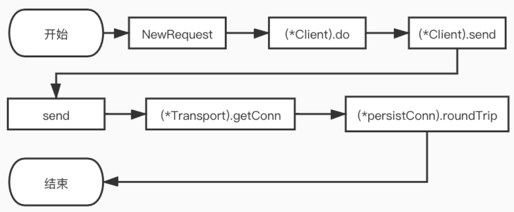

> http协议对于分析应用层编解码具有很大效益, golang内置包实现了http协议的发起

### HTTP1.1

流程



(*Client).do 方法的核心代码是一个没有结束条件的 for 循环。 请求第一次进入会调用c.send, 得到响应后会判断请求是否需要重定向, 如果需要重定向则继续循环， 否则返回响应。
```go
for {
	// For all but the first request, create the next
	// request hop and replace req.
	if len(reqs) > 0 {
		loc := resp.Header.Get("Location")
		// ...
		err = c.checkRedirect(req, reqs) // 重定向
		// ...
	}

	reqs = append(reqs, req)
	var err error
	var didTimeout func() bool
	if resp, didTimeout, err = c.send(req, deadline); err != nil {  // client.send
		// c.send() always closes req.Body
		reqBodyClosed = true
		// ...此处省略代码...
		return nil, uerr(err)
	}

	var shouldRedirect bool
	redirectMethod, shouldRedirect, includeBody = redirectBehavior(req.Method, resp, reqs[0])
	if !shouldRedirect {
		return resp, nil
	}

	req.closeBody()
}
```

(*Client).send 方法逻辑较为简单, 主要看用户有没有为 http.Client 的 Jar 字段实现CookieJar接口。主要流程如下:

如果实现了 CookieJar 接口， 为 Request 添加保存的 cookie 信息。将 Response 中的 cookie 信息保存下来。

```go
// didTimeout is non-nil only if err != nil.
func (c *Client) send(req *Request, deadline time.Time) (resp *Response, didTimeout func() bool, err error) {
	if c.Jar != nil {
		for _, cookie := range c.Jar.Cookies(req.URL) {
			req.AddCookie(cookie) // 给request添加cookie信息
		}
	}
	resp, didTimeout, err = send(req, c.transport(), deadline)  // send函数
	if err != nil {
		return nil, didTimeout, err
	}
	if c.Jar != nil {
		if rc := resp.Cookies(); len(rc) > 0 {
			c.Jar.SetCookies(req.URL, rc)
		}
	}
	return resp, nil, nil
}
```

send 函数会检查 request 的 URL，以及参数的 rt， 和 header 值。如果 URL 和 rt 为 nil 则直接返回错误。同时， 如果请求中设置了用户信息， 还会检查并设置 basic 的验证头信息，最后调用rt.RoundTrip得到请求的响应。
```go
// client.go
func send(ireq *Request, rt RoundTripper, deadline time.Time) (resp *Response, didTimeout func() bool, err error) {
	req := ireq // req is either the original request, or a modified fork
	// ...
	if u := req.URL.User; u != nil && req.Header.Get("Authorization") == "" {
		username := u.Username()
		password, _ := u.Password()
		forkReq()
		req.Header = cloneOrMakeHeader(ireq.Header)
		req.Header.Set("Authorization", "Basic "+basicAuth(username, password))
	}

	if !deadline.IsZero() {
		forkReq()
	}
	stopTimer, didTimeout := setRequestCancel(req, rt, deadline)

	resp, err = rt.RoundTrip(req) // 包括发送请求, 得到请求的响应
	if err != nil {
        // ...
		return nil, didTimeout, err
	}
	// ...
	return resp, nil, nil
}
```

(\Transport).RoundTrip 的会调用(\Transport).roundTrip 方法

```go
func (t *Transport) RoundTrip(req *Request) (*Response, error) {
	return t.roundTrip(req)
}
func (t *Transport) roundTrip(req *Request) (*Response, error) {
	// ...此处省略校验header头和headervalue的代码以及其他代码...

	for {
		select {
		case <-ctx.Done():
			req.closeBody()
			return nil, ctx.Err()
		default:
		}

		// treq gets modified by roundTrip, so we need to recreate for each retry.
		treq := &transportRequest{Request: req, trace: trace}
		cm, err := t.connectMethodForRequest(treq)
		// ...此处省略代码...
		pconn, err := t.getConn(treq, cm) // 获取连接并发送请求, 接收请求
		if err != nil {
			t.setReqCanceler(req, nil)
			req.closeBody()
			return nil, err
		}

		var resp *Response
		if pconn.alt != nil {
			// HTTP/2 path.
			t.setReqCanceler(req, nil) // not cancelable with CancelRequest
			resp, err = pconn.alt.RoundTrip(req)
		} else {
			resp, err = pconn.roundTrip(treq) // 得到响应
		}
		if err == nil {
			return resp, nil
		}

		// ...此处省略判断是否重试请求的代码逻辑...
	}
}
```

(*Transport).getConn, 调用t.queueForIdleConn获取一个空闲且可复用的连接，如果获取成功则直接返回该连接。如果未获取到空闲连接则调用t.queueForDial开始新建一个连接。

```go
func (t *Transport) getConn(treq *transportRequest, cm connectMethod) (pc *persistConn, err error) {
	req := treq.Request
	trace := treq.trace
	ctx := req.Context()
	// ...此处省略代码...
	w := &wantConn{
		cm:         cm,
		key:        cm.key(),
		ctx:        ctx,
		ready:      make(chan struct{}, 1),
		beforeDial: testHookPrePendingDial,
		afterDial:  testHookPostPendingDial,
	}
	// ...此处省略代码...
	// Queue for idle connection. 获取连接
	if delivered := t.queueForIdleConn(w); delivered {
		pc := w.pc  
		// ...此处省略代码...
		return pc, nil
	}

	cancelc := make(chan error, 1)
	t.setReqCanceler(req, func(err error) { cancelc <- err }) // 新建连接

	// Queue for permission to dial.
	t.queueForDial(w)

	// Wait for completion or cancellation.
	select {
	case <-w.ready:
		// Trace success but only for HTTP/1.
		// HTTP/2 calls trace.GotConn itself.
		if w.pc != nil && w.pc.alt == nil && trace != nil && trace.GotConn != nil {
			trace.GotConn(httptrace.GotConnInfo{Conn: w.pc.conn, Reused: w.pc.isReused()})
		}
		// ...此处省略代码...
		return w.pc, w.err
	case <-req.Cancel:
		return nil, errRequestCanceledConn
	case <-req.Context().Done():
		return nil, req.Context().Err()
	case err := <-cancelc:
		if err == errRequestCanceled {
			err = errRequestCanceledConn
		}
		return nil, err
	}
}
```

位于queueForIdleConn的dialConnFor负责创建和建立连接

```go
func (t *Transport) queueForDial(w *wantConn) {
	w.beforeDial()
	if t.MaxConnsPerHost <= 0 {
		go t.dialConnFor(w)
		return
	}

	t.connsPerHostMu.Lock()
	defer t.connsPerHostMu.Unlock()

	if n := t.connsPerHost[w.key]; n < t.MaxConnsPerHost {
		if t.connsPerHost == nil {
			t.connsPerHost = make(map[connectMethodKey]int)
		}
		t.connsPerHost[w.key] = n + 1
		go t.dialConnFor(w)
		return
	}

	if t.connsPerHostWait == nil {
		t.connsPerHostWait = make(map[connectMethodKey]wantConnQueue)
	}
	q := t.connsPerHostWait[w.key]
	q.cleanFront()
	q.pushBack(w)
	t.connsPerHostWait[w.key] = q
}
```

(*Transport).dialConn 方法主要逻辑如下

1. 调用t.dial(ctx, "tcp", cm.addr())创建 TCP 连接。
3. 如果是 https 的请求， 则对请求建立安全的 tls 传输通道。
4. 为 persistConn 创建读写 buffer， 如果用户没有自定义读写 buffer 的大小， 根据 writeBufferSize 和 readBufferSize 方法可知， 读写 bufffer 的大小默认为 4096。
5. 执行go pconn.readLoop()和go pconn.writeLoop()开启读写循环然后返回连接。

```go
func (t *Transport) dialConn(ctx context.Context, cm connectMethod) (pconn *persistConn, err error) {
	pconn = &persistConn{
		t:             t,
		cacheKey:      cm.key(),
		reqch:         make(chan requestAndChan, 1),
		writech:       make(chan writeRequest, 1),
		closech:       make(chan struct{}),
		writeErrCh:    make(chan error, 1),
		writeLoopDone: make(chan struct{}),
	}
	// ...此处省略代码...
	if cm.scheme() == "https" && t.hasCustomTLSDialer() {
		// ...此处省略代码...
	} else {
		conn, err := t.dial(ctx, "tcp", cm.addr())
		if err != nil {
			return nil, wrapErr(err)
		}
		pconn.conn = conn
		if cm.scheme() == "https" {
			var firstTLSHost string
			if firstTLSHost, _, err = net.SplitHostPort(cm.addr()); err != nil {
				return nil, wrapErr(err)
			}
			if err = pconn.addTLS(firstTLSHost, trace); err != nil {
				return nil, wrapErr(err)
			}
		}
	}
	// Proxy setup.
	switch { // ...此处省略代码... }

	if cm.proxyURL != nil && cm.targetScheme == "https" {
		// ...此处省略代码...
	}
	if s := pconn.tlsState; s != nil && s.NegotiatedProtocolIsMutual && s.NegotiatedProtocol != "" {
		// ...此处省略代码...
	}

	pconn.br = bufio.NewReaderSize(pconn, t.readBufferSize())
	pconn.bw = bufio.NewWriterSize(persistConnWriter{pconn}, t.writeBufferSize())

	go pconn.readLoop()
	go pconn.writeLoop()
	return pconn, nil
}
func (t *Transport) writeBufferSize() int {
	if t.WriteBufferSize > 0 {
		return t.WriteBufferSize
	}
	return 4 << 10
}
func (t *Transport) readBufferSize() int {
	if t.ReadBufferSize > 0 {
		return t.ReadBufferSize
	}
	return 4 << 10
}
```

(*persistConn).readLoop 读循环被协程执行, 只要连接处于活跃状态， 则这个读循环会一直开启， 直到连接不活跃或者产生其他错误才会结束读循环。

```go
func (pc *persistConn) readLoop() {
	closeErr := errReadLoopExiting // default value, if not changed below
	defer func() {
		pc.close(closeErr)
		pc.t.removeIdleConn(pc)
	}()

	tryPutIdleConn := func(trace *httptrace.ClientTrace) bool {
		if err := pc.t.tryPutIdleConn(pc); err != nil {
			// ...此处省略代码...
		}
		// ...此处省略代码...
		return true
	}
	// ...此处省略代码...
	alive := true
	for alive {
	    // ...此处省略代码...
	    rc := <-pc.reqch
	    trace := httptrace.ContextClientTrace(rc.req.Context())

		var resp *Response
		if err == nil {
			resp, err = pc.readResponse(rc, trace)
		} else {
			err = transportReadFromServerError{err}
			closeErr = err
		}

		// ...此处省略代码...
		bodyWritable := resp.bodyIsWritable()
		hasBody := rc.req.Method != "HEAD" && resp.ContentLength != 0

		if resp.Close || rc.req.Close || resp.StatusCode <= 199 || bodyWritable {
			// Don't do keep-alive on error if either party requested a close
			// or we get an unexpected informational (1xx) response.
			// StatusCode 100 is already handled above.
			alive = false
		}

		if !hasBody || bodyWritable {
			// ...此处省略代码...
			continue
		}

		waitForBodyRead := make(chan bool, 2)
		body := &bodyEOFSignal{
			body: resp.Body,
			earlyCloseFn: func() error {
				waitForBodyRead <- false
				<-eofc // will be closed by deferred call at the end of the function
				return nil

			},
			fn: func(err error) error {
				isEOF := err == io.EOF
				waitForBodyRead <- isEOF
				if isEOF {
					<-eofc // see comment above eofc declaration
				} else if err != nil {
					if cerr := pc.canceled(); cerr != nil {
						return cerr
					}
				}
				return err
			},
		}

		resp.Body = body
		// ...此处省略代码...

		select {
		case rc.ch <- responseAndError{res: resp}:
		case <-rc.callerGone:
			return
		}

		// Before looping back to the top of this function and peeking on
		// the bufio.Reader, wait for the caller goroutine to finish
		// reading the response body. (or for cancellation or death)
		select {
		case bodyEOF := <-waitForBodyRead:
			pc.t.setReqCanceler(rc.req, nil) // before pc might return to idle pool
			alive = alive &&
				bodyEOF &&
				!pc.sawEOF &&
				pc.wroteRequest() &&
				tryPutIdleConn(trace)
			if bodyEOF {
				eofc <- struct{}{}
			}
		case <-rc.req.Cancel:
			alive = false
			pc.t.CancelRequest(rc.req)
		case <-rc.req.Context().Done():
			alive = false
			pc.t.cancelRequest(rc.req, rc.req.Context().Err())
		case <-pc.closech:
			alive = false
		}

		testHookReadLoopBeforeNextRead()
	}
}
```

(*persistConn).roundTrip 方法是 http1.1 请求的核心之一，该方法在这里获取真实的 Response 并返回给上层。

(*persistConn).roundTrip 方法可以分为三步：
1. 向连接的 writech 写入writeRequest: pc.writech <- writeRequest{req, writeErrCh, continueCh}, 参考(*Transport).dialConn 可知 pc.writech 是一个缓冲大小为 1 的管道，所以会立马写入成功。
2. 向连接的 reqch 写入requestAndChan: pc.reqch <- requestAndChan, pc.reqch 和 pc.writech 一样都是缓冲大小为 1 的管道。其中requestAndChan.ch是一个无缓冲的responseAndError管道，(*persistConn).roundTrip 就通过这个管道读取到真实的响应。
3. 开启 for 循环 select， 等待响应或者超时等信息。

```go
func (pc *persistConn) roundTrip(req *transportRequest) (resp *Response, err error) {
	// ...此处省略代码...

	gone := make(chan struct{})
	defer close(gone)
	// ...此处省略代码...
	const debugRoundTrip = false

	// Write the request concurrently with waiting for a response,
	// in case the server decides to reply before reading our full
	// request body.
	startBytesWritten := pc.nwrite
	writeErrCh := make(chan error, 1)
	pc.writech <- writeRequest{req, writeErrCh, continueCh} // 写入请求

	resc := make(chan responseAndError)
	pc.reqch <- requestAndChan{
		req:        req.Request,
		ch:         resc,
		addedGzip:  requestedGzip,
		continueCh: continueCh,
		callerGone: gone,
	}

	var respHeaderTimer <-chan time.Time
	cancelChan := req.Request.Cancel
	ctxDoneChan := req.Context().Done()
	for {
		testHookWaitResLoop()
		select {
		case err := <-writeErrCh:
			// ...此处省略代码...
			if err != nil {
				pc.close(fmt.Errorf("write error: %v", err))
				return nil, pc.mapRoundTripError(req, startBytesWritten, err)
			}
			// ...此处省略代码...
		case <-pc.closech:
			// ...此处省略代码...
			return nil, pc.mapRoundTripError(req, startBytesWritten, pc.closed)
		case <-respHeaderTimer:
			// ...此处省略代码...
			return nil, errTimeout
		case re := <-resc:
			if (re.res == nil) == (re.err == nil) {
				panic(fmt.Sprintf("internal error: exactly one of res or err should be set; nil=%v", re.res == nil))
			}
			if debugRoundTrip {
				req.logf("resc recv: %p, %T/%#v", re.res, re.err, re.err)
			}
			if re.err != nil {
				return nil, pc.mapRoundTripError(req, startBytesWritten, re.err)
			}
			return re.res, nil  // 返回响应
		case <-cancelChan:
			pc.t.CancelRequest(req.Request)
			cancelChan = nil
		case <-ctxDoneChan:
			pc.t.cancelRequest(req.Request, req.Context().Err())
			cancelChan = nil
			ctxDoneChan = nil
		}
	}
}
```

### http2.0

当建立http2的连接时, 在dialConn建立连接时发生了变化, 新建出来的连接会保存在 http2 的连接池即http2clientConnPool中。(*http2Transport).NewClientConn 内部会调用t.newClientConn(c, t.disableKeepAlives())。

#### 连接建立

1. 初始化一个http2ClientConn：

```go
cc := &http2ClientConn{
	t:                     t,
	tconn:                 c,
	readerDone:            make(chan struct{}),
	nextStreamID:          1,
	maxFrameSize:          16 << 10,           // spec default
	initialWindowSize:     65535,              // spec default
	maxConcurrentStreams:  1000,               // "infinite", per spec. 1000 seems good enough.
	peerMaxHeaderListSize: 0xffffffffffffffff, // "infinite", per spec. Use 2^64-1 instead.
	streams:               make(map[uint32]*http2clientStream),
	singleUse:             singleUse,
	wantSettingsAck:       true,
	pings:                 make(map[[8]byte]chan struct{}),
}
```

2. 创建一个条件锁并且新建 Writer&Reader。

```go
cc.cond = sync.NewCond(&cc.mu)
cc.flow.add(int32(http2initialWindowSize))
cc.bw = bufio.NewWriter(http2stickyErrWriter{c, &cc.werr})
cc.br = bufio.NewReader(c)
```

3. 新建一个读写数据帧的 Framer。

```go
cc.fr = http2NewFramer(cc.bw, cc.br)
cc.fr.ReadMetaHeaders = hpack.NewDecoder(http2initialHeaderTableSize, nil)
cc.fr.MaxHeaderListSize = t.maxHeaderListSize()
```

4. 向 server 发送开场白，并发送一些初始化数据帧。

```go
initialSettings := []http2Setting{
	{ID: http2SettingEnablePush, Val: 0},
	{ID: http2SettingInitialWindowSize, Val: http2transportDefaultStreamFlow},
}
if max := t.maxHeaderListSize(); max != 0 {
	initialSettings = append(initialSettings, http2Setting{ID: http2SettingMaxHeaderListSize, Val: max})
}

cc.bw.Write(http2clientPreface)
cc.fr.WriteSettings(initialSettings...)
cc.fr.WriteWindowUpdate(0, http2transportDefaultConnFlow)
cc.inflow.add(http2transportDefaultConnFlow + http2initialWindowSize)
cc.bw.Flush()

const (
    // client首先想server发送以PRI开头的一串字符串。
    http2ClientPreface = "PRI * HTTP/2.0\r\n\r\nSM\r\n\r\n"
)
var (
	http2clientPreface = []byte(http2ClientPreface)
)
```

5. 发送完开场白后，client 向 server 发送SETTINGS数据帧。

6. 开启读循环并返回

```go
go cc.readLoop()
```

#### 流建立和请求发送

以下几点均为 true 时，才代表当前连接能够处理新的请求：
* 连接状态正常，即未关闭并且不处于正在关闭的状态。
* 当前连接正在处理的数据流小于maxConcurrentStreams。
* 下一个要处理的数据流 + 当前连接处于等待状态的请求 2 < math.MaxInt32。
* 当前连接没有长时间处于空闲状态（主要通过cc.tooIdleLocked()判断）

当从链接池成功获取到一个可以处理请求的连接，就可以和 server 进行数据交互，即(*http2ClientConn).roundTrip流程。

1. 调用cc.newStream()在连接上创建一个数据流（创建数据流是线程安全的，因为源码中在调用awaitOpenSlotForRequest之前先加锁，直到写入请求的 header 之后才释放锁）

```go
func (cc *http2ClientConn) newStream() *http2clientStream {
	cs := &http2clientStream{
		cc:        cc,
		ID:        cc.nextStreamID,
		resc:      make(chan http2resAndError, 1),
		peerReset: make(chan struct{}),
		done:      make(chan struct{}),
	}
	cs.flow.add(int32(cc.initialWindowSize))
	cs.flow.setConnFlow(&cc.flow)
	cs.inflow.add(http2transportDefaultStreamFlow)
	cs.inflow.setConnFlow(&cc.inflow)
	cc.nextStreamID += 2
	cc.streams[cs.ID] = cs
	return cs
}
/*
新建一个http2clientStream，数据流 ID 为cc.nextStreamID，新建数据流后，cc.nextStreamID +=2。

数据流通过http2resAndError管道接收请求的响应。

初始化当前数据流的可写流控制窗口大小为cc.initialWindowSize，并保存连接的可写流控制指针。

初始化当前数据流的可读流控制窗口大小为http2transportDefaultStreamFlow，并保存连接的可读流控制指针。

最后将新建的数据流注册到当前连接中。
*/
```

2. 因为是多个请求共享一个连接，那么向连接写入数据帧时需要加锁，比如加锁写入请求头

```go
cc.wmu.Lock()
endStream := !hasBody && !hasTrailers
werr := cc.writeHeaders(cs.ID, endStream, int(cc.maxFrameSize), hdrs)
cc.wmu.Unlock()
```

3. 轮询管道获取响应结果。

能否读到响应，如果能够读取响应则直接返回。

判断请求 body 是否发送成功，如果发送失败，直接返回。

如果请求 body 发送成功，则设置响应 header 的超时时间。
```go
for {
	select {
	case re := <-readLoopResCh:
		return handleReadLoopResponse(re)
	// 此处省略代码（包含请求取消，请求超时等管道的轮询）
	case err := <-bodyWriter.resc:
		// Prefer the read loop's response, if available. Issue 16102.
		select {
		case re := <-readLoopResCh:
			return handleReadLoopResponse(re)
		default:
		}
		if err != nil {
			cc.forgetStreamID(cs.ID)
			return nil, cs.getStartedWrite(), err
		}
		bodyWritten = true
		if d := cc.responseHeaderTimeout(); d != 0 {
			timer := time.NewTimer(d)
			defer timer.Stop()
			respHeaderTimer = timer.C
		}
	}
}
```

#### 数据帧和管理

HTTP2 通信的最小单位是数据帧，每一个帧都包含两部分：帧头和Payload(即实际数据)。不同数据流的帧可以交错发送(同一个数据流的帧必须顺序发送)，然后再根据每个帧头的数据流标识符重新组装

帧头总长度为 9 个字节，并包含四个部分，分别是:
1. Payload 的长度，占用三个字节。
2. 数据帧类型，占用一个字节。
3. 数据帧标识符，占用一个字节。
4. 数据流 ID，占用四个字节。

读取一个帧头
```go
func http2readFrameHeader(buf []byte, r io.Reader) (http2FrameHeader, error) {
	_, err := io.ReadFull(r, buf[:http2frameHeaderLen])
	if err != nil {
		return http2FrameHeader{}, err
	}
	return http2FrameHeader{
		Length:   (uint32(buf[0])<<16 | uint32(buf[1])<<8 | uint32(buf[2])),
		Type:     http2FrameType(buf[3]),
		Flags:    http2Flags(buf[4]),
		StreamID: binary.BigEndian.Uint32(buf[5:]) & (1<<31 - 1),
		valid:    true,
	}, nil
}
```

数据帧类型
```go
const (
	http2FrameData         http2FrameType = 0x0
	http2FrameHeaders      http2FrameType = 0x1
	http2FramePriority     http2FrameType = 0x2
	http2FrameRSTStream    http2FrameType = 0x3
	http2FrameSettings     http2FrameType = 0x4
	http2FramePushPromise  http2FrameType = 0x5
	http2FramePing         http2FrameType = 0x6
	http2FrameGoAway       http2FrameType = 0x7
	http2FrameWindowUpdate http2FrameType = 0x8
	http2FrameContinuation http2FrameType = 0x9
)

/*
http2FrameData：主要用于发送请求 body 和接收响应的数据帧。

http2FrameHeaders：主要用于发送请求 header 和接收响应 header 的数据帧。

http2FrameSettings：主要用于 client 和 server 交流设置相关的数据帧。

http2FrameWindowUpdate：主要用于流控制的数据帧。
*/
```

数据帧标识符, 不同的帧有不同的标识符可以表示一些信息, 例如数据流结束等
```go
const (
	// Data Frame
	http2FlagDataEndStream http2Flags = 0x1
  // Headers Frame
	http2FlagHeadersEndStream  http2Flags = 0x1
  // Settings Frame
	http2FlagSettingsAck http2Flags = 0x1
	// 此处省略定义其他数据帧标识符的代码
)
```

流控制是一种阻止发送方向接收方发送大量数据的机制，以免超出后者的需求或处理能力。Go 中 HTTP2 通过http2flow结构体进行流控制：
```go
type http2flow struct {
	// n is the number of DATA bytes we're allowed to send.
	// A flow is kept both on a conn and a per-stream.
	n int32

	// conn points to the shared connection-level flow that is
	// shared by all streams on that conn. It is nil for the flow
	// that's on the conn directly.
	conn *http2flow
}
// 返回当前流控制可发送的最大字节数：
func (f *http2flow) available() int32 {
	n := f.n
	if f.conn != nil && f.conn.n < n {
		n = f.conn.n
	}
	return n
}

// 增加流控制器可发送的最大字节数：
func (f *http2flow) add(n int32) bool {
	sum := f.n + n
	if (sum > n) == (f.n > 0) {
		f.n = sum
		return true
	}
	return false
}
```

数据帧的发送比较简单, 将http1.1的报文对象根据http2.0的格式序列化并构建成帧的流形式, 发送到缓冲区。

从socket缓冲区中读取数据帧
```go
func (cc *http2ClientConn) readLoop() {
	rl := &http2clientConnReadLoop{cc: cc}
	defer rl.cleanup()
	cc.readerErr = rl.run()
	if ce, ok := cc.readerErr.(http2ConnectionError); ok {
		cc.wmu.Lock()
		cc.fr.WriteGoAway(0, http2ErrCode(ce), nil)
		cc.wmu.Unlock()
	}
}

func (rl *http2clientConnReadLoop) run() error {
	cc := rl.cc
	rl.closeWhenIdle = cc.t.disableKeepAlives() || cc.singleUse
	gotReply := false // ever saw a HEADERS reply
	gotSettings := false
	for {
		f, err := cc.fr.ReadFrame() // 读取帧
    // 此处省略代码
		maybeIdle := false // whether frame might transition us to idle

		switch f := f.(type) {
      // 针对不同的帧调用不同的回调函数处理
		case *http2MetaHeadersFrame:
			err = rl.processHeaders(f)
			maybeIdle = true
			gotReply = true
		case *http2DataFrame:
			err = rl.processData(f)
			maybeIdle = true
		case *http2GoAwayFrame:
			err = rl.processGoAway(f)
			maybeIdle = true
		case *http2RSTStreamFrame:
			err = rl.processResetStream(f)
			maybeIdle = true
		case *http2SettingsFrame:
			err = rl.processSettings(f)
		case *http2PushPromiseFrame:
			err = rl.processPushPromise(f)
		case *http2WindowUpdateFrame:
			err = rl.processWindowUpdate(f)
		case *http2PingFrame:
			err = rl.processPing(f)
		default:
			cc.logf("Transport: unhandled response frame type %T", f)
		}
		if err != nil {
			if http2VerboseLogs {
				cc.vlogf("http2: Transport conn %p received error from processing frame %v: %v", cc, http2summarizeFrame(f), err)
			}
			return err
		}
		if rl.closeWhenIdle && gotReply && maybeIdle {
			cc.closeIfIdle()
		}
	}
}
```

处理帧来自对象http2Framer, 对于http2的每个连接, 具有`*http2Framer`处理帧, `streams map[uint32]*http2stream`表示连接上存在的流

```go

type http2serverConn struct {
	// Immutable:
	srv              *http2Server
	hs               *Server
	conn             net.Conn
	bw               *http2bufferedWriter // writing to conn
	handler          Handler
	baseCtx          context.Context
	framer           *http2Framer
	doneServing      chan struct{}               // closed when serverConn.serve ends
	readFrameCh      chan http2readFrameResult   // written by serverConn.readFrames
	wantWriteFrameCh chan http2FrameWriteRequest // from handlers -> serve
	wroteFrameCh     chan http2frameWriteResult  // from writeFrameAsync -> serve, tickles more frame writes
	bodyReadCh       chan http2bodyReadMsg       // from handlers -> serve
	serveMsgCh       chan interface{}            // misc messages & code to send to / run on the serve loop
	flow             http2flow                   // conn-wide (not stream-specific) outbound flow control
	inflow           http2flow                   // conn-wide inbound flow control
	tlsState         *tls.ConnectionState        // shared by all handlers, like net/http
	remoteAddrStr    string
	writeSched       http2WriteScheduler

	// Everything following is owned by the serve loop; use serveG.check():
	serveG                      http2goroutineLock // used to verify funcs are on serve()
	pushEnabled                 bool
	sawFirstSettings            bool // got the initial SETTINGS frame after the preface
	needToSendSettingsAck       bool
	unackedSettings             int    // how many SETTINGS have we sent without ACKs?
	queuedControlFrames         int    // control frames in the writeSched queue
	clientMaxStreams            uint32 // SETTINGS_MAX_CONCURRENT_STREAMS from client (our PUSH_PROMISE limit)
	advMaxStreams               uint32 // our SETTINGS_MAX_CONCURRENT_STREAMS advertised the client
	curClientStreams            uint32 // number of open streams initiated by the client
	curPushedStreams            uint32 // number of open streams initiated by server push
	maxClientStreamID           uint32 // max ever seen from client (odd), or 0 if there have been no client requests
	maxPushPromiseID            uint32 // ID of the last push promise (even), or 0 if there have been no pushes
	streams                     map[uint32]*http2stream
	initialStreamSendWindowSize int32
	maxFrameSize                int32
	headerTableSize             uint32
	peerMaxHeaderListSize       uint32            // zero means unknown (default)
	canonHeader                 map[string]string // http2-lower-case -> Go-Canonical-Case
	writingFrame                bool              // started writing a frame (on serve goroutine or separate)
	writingFrameAsync           bool              // started a frame on its own goroutine but haven't heard back on wroteFrameCh
	needsFrameFlush             bool              // last frame write wasn't a flush
	inGoAway                    bool              // we've started to or sent GOAWAY
	inFrameScheduleLoop         bool              // whether we're in the scheduleFrameWrite loop
	needToSendGoAway            bool              // we need to schedule a GOAWAY frame write
	goAwayCode                  http2ErrCode
	shutdownTimer               *time.Timer // nil until used
	idleTimer                   *time.Timer // nil if unused

	// Owned by the writeFrameAsync goroutine:
	headerWriteBuf bytes.Buffer
	hpackEncoder   *hpack.Encoder

	// Used by startGracefulShutdown.
	shutdownOnce sync.Once
}

// A Framer reads and writes Frames.
type http2Framer struct {
	r         io.Reader
	lastFrame http2Frame
	errDetail error

	// lastHeaderStream is non-zero if the last frame was an
	// unfinished HEADERS/CONTINUATION.
	lastHeaderStream uint32

	maxReadSize uint32
	headerBuf   [http2frameHeaderLen]byte

	// TODO: let getReadBuf be configurable, and use a less memory-pinning
	// allocator in server.go to minimize memory pinned for many idle conns.
	// Will probably also need to make frame invalidation have a hook too.
	getReadBuf func(size uint32) []byte
	readBuf    []byte // cache for default getReadBuf

	maxWriteSize uint32 // zero means unlimited; TODO: implement

	w    io.Writer
	wbuf []byte

	// AllowIllegalWrites permits the Framer's Write methods to
	// write frames that do not conform to the HTTP/2 spec. This
	// permits using the Framer to test other HTTP/2
	// implementations' conformance to the spec.
	// If false, the Write methods will prefer to return an error
	// rather than comply.
	AllowIllegalWrites bool

	// AllowIllegalReads permits the Framer's ReadFrame method
	// to return non-compliant frames or frame orders.
	// This is for testing and permits using the Framer to test
	// other HTTP/2 implementations' conformance to the spec.
	// It is not compatible with ReadMetaHeaders.
	AllowIllegalReads bool

	// ReadMetaHeaders if non-nil causes ReadFrame to merge
	// HEADERS and CONTINUATION frames together and return
	// MetaHeadersFrame instead.
	ReadMetaHeaders *hpack.Decoder

	// MaxHeaderListSize is the http2 MAX_HEADER_LIST_SIZE.
	// It's used only if ReadMetaHeaders is set; 0 means a sane default
	// (currently 16MB)
	// If the limit is hit, MetaHeadersFrame.Truncated is set true.
	MaxHeaderListSize uint32

	// TODO: track which type of frame & with which flags was sent
	// last. Then return an error (unless AllowIllegalWrites) if
	// we're in the middle of a header block and a
	// non-Continuation or Continuation on a different stream is
	// attempted to be written.

	logReads, logWrites bool

	debugFramer       *http2Framer // only use for logging written writes
	debugFramerBuf    *bytes.Buffer
	debugReadLoggerf  func(string, ...interface{})
	debugWriteLoggerf func(string, ...interface{})

	frameCache *http2frameCache // nil if frames aren't reused (default)
}
```

帧的读取处理
```go
func (fr *http2Framer) ReadFrame() (http2Frame, error) {
	fr.errDetail = nil
	if fr.lastFrame != nil {
		fr.lastFrame.invalidate()
	}
  // 构造对象
	fh, err := http2readFrameHeader(fr.headerBuf[:], fr.r)
	if err != nil {
		return nil, err
	}
	if fh.Length > fr.maxReadSize {
		return nil, http2ErrFrameTooLarge
	}
	payload := fr.getReadBuf(fh.Length)
	if _, err := io.ReadFull(fr.r, payload); err != nil {
		return nil, err
	}
	f, err := http2typeFrameParser(fh.Type)(fr.frameCache, fh, payload)
	if err != nil {
		if ce, ok := err.(http2connError); ok {
			return nil, fr.connError(ce.Code, ce.Reason)
		}
		return nil, err
	}
	if err := fr.checkFrameOrder(f); err != nil {
		return nil, err
	}
	if fr.logReads {
		fr.debugReadLoggerf("http2: Framer %p: read %v", fr, http2summarizeFrame(f))
	}
	if fh.Type == http2FrameHeaders && fr.ReadMetaHeaders != nil {
		return fr.readMetaFrame(f.(*http2HeadersFrame))
	}
	return f, nil
}
```