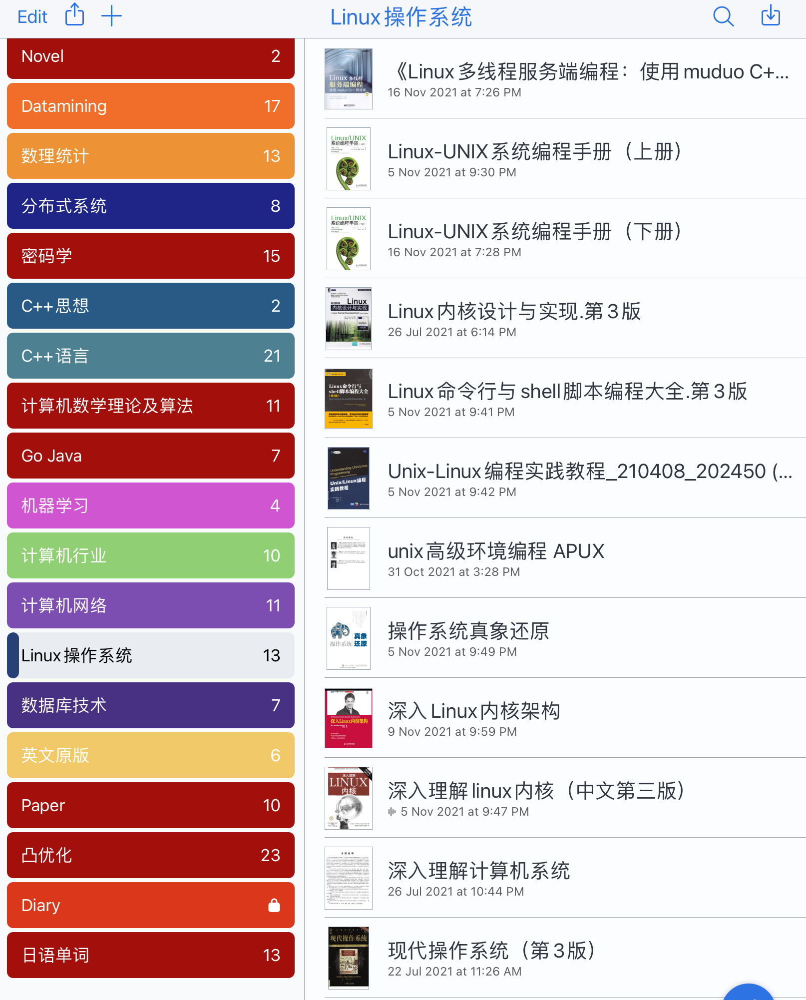
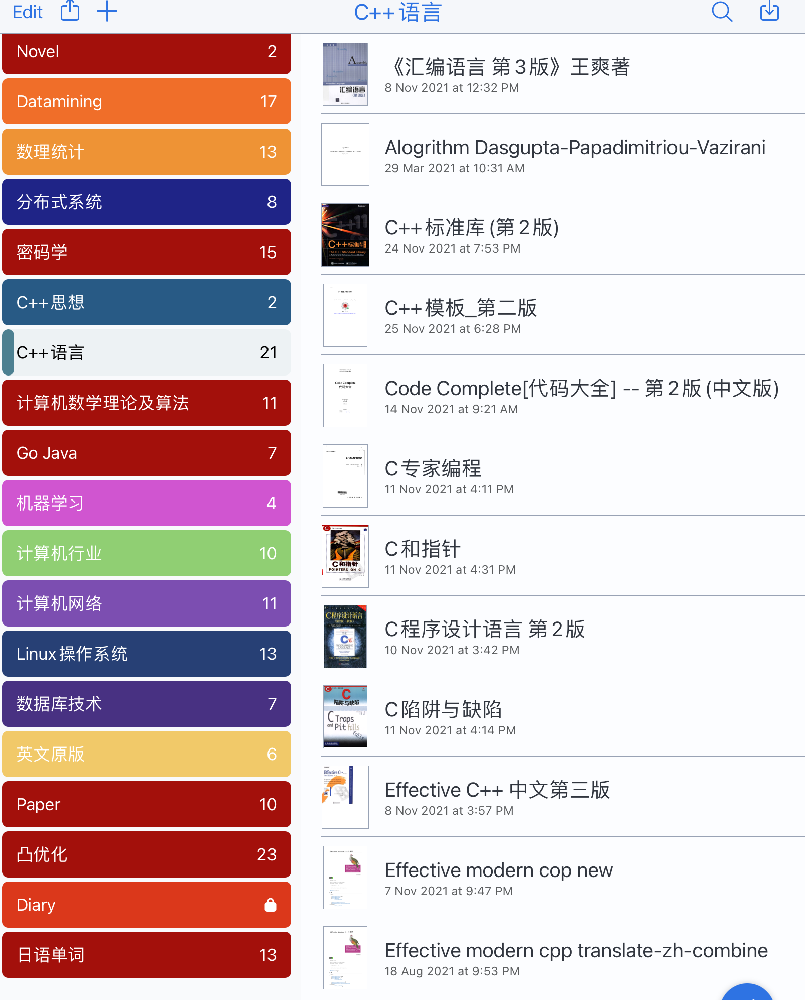
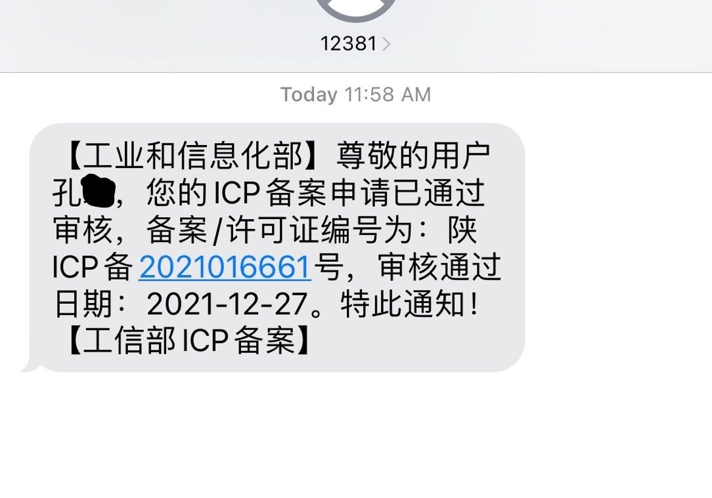
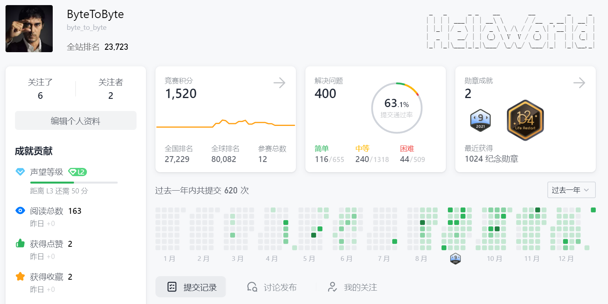

> 2021年度总结 ^_^

<!-- -->

### 回顾

#### 学习

虽然貌似学编程不少年了，但也就是算今年进展比较快吧。可能因为心比较踏实了，知道要做啥了，还有一个原因是C++本身比较有意思，不像Java一样学一会就陷入写业务的枯燥中，Maven下载一堆依赖要弄半天; 人工智能训练的枯燥就更不用多说了

2021年看了很多本书

01

02

大概三月份开了博客，记录了一些学到的东西。这个博客就像是读书笔记一样，可能比较杂，但却记录了我真实的学习轨迹，学习路线。可能2022签完工作，会写公众号吧，整理一下。公众号的内容和博客也不会相同的，因为博客是真实的学习轨迹，工作号是加工整理过的。

上半年学习效率并不高，主要是不会的太多，又总想尽快学完，以及在学艺不精的时期老有很牛逼的幻觉。到了下半年知识框架渐渐搭完，前期的曲线渐渐经历完，效率也提上来了。其实下半年很长时间在学上半年的东西，因为上半年学的并不扎实，而博客也写在了下半年。且往后学随着知识的深入会发现前面写的博客有很多错的，也修正了很多。

2021年开始是挺迷茫的，上半年长时间后悔本科没专心学技术，频率嘛可能是每天后悔N次的水平。很多人说后悔的没什么用，要向前看。我觉得后悔有用，后悔了就想尽快的跟上别人的步伐。下半年开始逐渐内心变稳，理解了大佬内心才是最稳的, 像我之前内心躁动的，嗯，是挺Low的。博客[我叫尤加利](https://youjiali1995.github.io/)是给了我开始很多鼓舞的, 因为作者经历和我很像, 有种知音的感觉。

还是很幸运的，对于C/C++, 操作系统, 网络以及源码的学习让我得以窥见计算机内部的运行奥妙, 这是从来没有过的。顺便看了下Java, Python, 初学了点go, 理解和原来大有不同。如果没有2021的经历, 或许毕业后也只是从事简单的调用接口, 对内部的实现机制望而生畏吧。

(今天leetcode400题, 好巧)

总之结果还是不错的，去年一年自己的技术提升比本科四年总和估计还要高很多，虽然依然不足，但架不住基数低增长率高啊! 想到本科到了大四觉得去字节做测试开发挺了不得的，真是。。毕竟本科也是电子科大的，去字节不很正常嘛? 这也足见本科四年的失败，光想着保研和绩点了。上了研究生老吐槽西安没有实习的地方以及创新港位置偏僻，但这一年确实是23年来提升最多的一年了。

很幸运遇到了计算机, 满足了我小小的物质需求, 支持我进一步深入技术的海洋, 有余力了解生活, 维持内心细微的清高, 保持内心的安稳不焦躁。在生活尚在探索时, 计算机是对我最好的陪伴, 最忠实的朋友, 也是我最重要的东西。

#### 生活

生活上, 嗯,,,呃

最大的成就是消费自由了吧，研究生补助几百块钱可以忽略不计, 学业上排名倒数并荣幸拿到了最低等的奖学金。但日常靠接一些单居然cover住学费生活费, 甚至2021谈过半年恋爱居然也可维持生活。目前尚有五位数存款。

其余的，，没啥了。健身，额没咋弄; 跑步倒坚持了大概一个月，结果遇到西安封城现在又over了; 体重也似乎重了7,8斤。生活上本身起步低，这没啥进步自然结果也低了。还好现在对恋爱也佛了(没错这是本科以来没有过的，之前单但是没佛过)，找女朋友要考虑以后工作唉, 重感情的吧，谨慎之以至再不想分(都是泪。。。承载内心感情的还是纸片人, 还是老漫里的, 除了女主很好以外, 还因为不会被伤害哎

另外零零碎碎看了不少书，会追b站一些up主, 主要是历史类的; 游戏啥的基本没了, 也算是小小的进步吧。但健身，没有坚持下来确实比较遗憾。工作上，基本要去江浙沪吧，因为广州深圳的房子买不起，南京苏州的倒还能咬咬牙

思想性格上，我觉得我是比较小众的人，新潮流的文化在我心中似乎比不上怀旧的东西。例如喜欢历史，喜欢听民谣soft music, 喜欢一些经典的影视剧, 对流行的rap, 仙侠剧, "历史剧"无感。2021的思考和经历告诉我也没有必要追随大众，大众的东西和小众的东西需要权衡, 工作上做个大众的人, 生活上还是遵循自己的内心做一个小众的人。

对于过去的, 我承认是个怀旧的人, 过去的很多都没有真正放下, 这是对生活不成熟的体现。从2021年往前看, 许多都不是自己想要的, 不少只是懵懂的错误, 需要吸取教训的东西。怀旧和幻想是憧憬以后的生活, 不正确的旧事与我美好生活的向往相悖, 因此也拿下了不少生活的包袱。

感慨自媒体的泛滥, 或者说搜广推娱乐化。搞笑的是以后也想从事搜广推和数据库, , 技术上确有挑战, 但应用上却是在中国有点泛滥了。在b站知乎搜索不到想看的东西, 呃可能我比较小众吧, 已经习惯于直接看关注了。算法的加成让搜索推荐不再是靠谱的结果, 而是迎合大众的, 而这种算法却被认为是人工智能革命, 挺搞笑的。我喜欢看一些别人实际经历的事情, 这也是我喜欢历史的原因吧, 因为历史记载的90%是真实存在过的。然而自媒体习惯于讲故事，虚构，或空言时代发展, 这些我很理解, 但不是我想看的。

越来越觉得生活没有那么容易，想弄懂因此看了些哲学的书，对唯心主义也没那么抵制了。因为即使唯物是对的，但是我们的能力不能理解，但可以从唯心角度去近似，类似生活的经验。这时候，唯心手段得到的结果可能会更接近真相。我们不可能理解生活，只能尽力的去近似理解。

我不是一个擅长快速学习的人，学新的东西很慢, 但优势在于一旦上道之后效率会很高。生活的风雨，本科并没有能够收获太多经验, 很多到现在尚不能get used of, 必然要做好开始被吹打的准备。但是过去的，一般吹打完了我能很快吸取教训经验从而get used of，希望生活我也能如此。

### 展望

严于律己，宽以待人。说起来容易，实践起来很难。至少严于律己总是一周最多严一半(2到3天), 计划一周最多有一半(2到3天)。希望2022能更自律, 更有效率, 有计划性。

去喜欢地方实习, 签工作, 自不多说。

健身，每天半小时，周末一小时，坚持下来。有一个强壮的体魄，健康的作息。这个是我最想看到变化的。

生活更有规律，更加享受生活，例如一个人的旅游，或者跟旅行团吧

应该继续坚持的, 写博客, 刷leetcode, 看源码, 看历史,, 

### 最后

以上, 希望你能说到做到;

理解生活真的很难, 还要有运气成分, 结果也不可知, 但不要丧失希望和信心

想对2022的自己说, 今年会面临实习秋招毕设一系列难关, 以及生活可能在某个时刻打乱你的行程, 经历的喜悦和挫折可能都是出生以来最多的。希望带着乐观，无畏，谨慎的态度面对