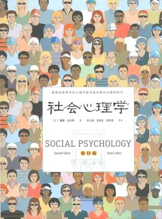

> 整合了在小打卡上的读后感

### 1.18 喜欢和爱情

缺点比优点更有影响力
1. 破坏性行为对亲密关系的伤害程度比建设性行为促进更大(冷酷的言辞比甜言蜜语能持续更长时间)
2. 坏心情比好心情更能影响我们的思维和基于
3. 不好的名声比好名声更容易获得
4. 坏事唤起的悲伤比耗时带来的快乐更多

为什么会喜欢，两个人能否称为朋友最好的预测因素是他们之间的接近性，接近性有利于双方不断曝光，从而相互交往

第二个因素是外表吸引力，人们实际上愿意选择大写大体与自己吸引力匹配的人结婚

双方在态度，信仰和价值观的相似性，相似导致喜欢，对立则很少建立吸引（所以别说什么互补了2333）

我们也很可能和那些喜欢我们的人建立友谊关系; 我们还喜欢那些能给我们带来奖赏的人。如果跟某人在一起的回报大于付出的成本, 那我们就喜欢并愿意继续维持这种关系。

<!-- more -->

第一印象可以包括以上的接近性，吸引力(外貌), 相似性(内在), 他人是否喜欢自己, 但这只是喜欢。长期的爱情不仅于此。(当然追女生还是接近+外貌吸引+内在相似+让她相信你喜欢她, 似乎就这么简单。。。)

爱分为激情之外和陪伴之爱，对于激情之爱，如果对方对自己的热情做出了回应，那么他就会感到满足和快乐; 如果对方对自己的热情没有回应就会空虚而绝望。如果这种感觉强烈，说明现在的爱还处于激情中。激情之外=欲望+依恋

如果亲密的感情能经受住时间的考验，就会称为一种稳固的感情相伴之爱。令人激情迸发的激素(睾丸激素, 多巴胺, 肾上腺素)会消退，催产素会维持依赖感和信任感。

促进亲密关系的重要原因是依恋。从婴儿到老年，依恋都是人类生活的中心。安全性依恋会使婚姻持久，生活美满。大约70%的人表现出安全性依恋, 这类人很容易和别人接近并且不会因为依赖感到苦恼。但还有20%的人表现出回避型依恋, 这种类型的成人很少投入亲密关系, 而且更倾向于摆脱这种关系。这类人可能是恐惧型("与别人太接近令我感到不舒服"), 要么是疏离型("感到独立和自足对我来说重要")。还有10%的人表现出不安全依恋, 缺乏信任感，情绪冲突或者易怒。这里似乎在说，所谓的内在吸引，核心的是应该能激起双方的依恋。或者说，双方应该互相依恋，这是基础。

如果感情关系的双方毫不考虑对方，都只追求个人需求的满足，那么友谊就会结束。如果两个人都觉得自己的所得和付出成正比，那么他们都会觉得公平。这个似乎很重要，在九种被认为成功婚姻象征的事物中, "分担家务活"排在第三位(在"忠诚"和"幸福的性关系"之后)。

促进亲密关系的第三个原因是表露，经常敞开心扉，坦诚，这时双方随着对方表露程度提高而回应从而逐步达到的一种状态。

符合以下条件的夫妇通常不会离婚
1. 20岁以后结婚
2. 都在稳定的双亲家庭里长大
3. 结婚之前恋爱 的较长一段时间
4. 接受过较好且相似的教育
5. 有稳定收入
6. 居住在小城镇或农场里
7. 结婚之前没有同居过或怀孕过
8. 彼此之间有虔诚的承诺
9. 年龄相当，信仰和受教育水平相似
(很明显婚前能安定下来，恋爱一段时间，婚姻会比较稳定；尽量不要同居，尽量年龄相当，创造承诺(答应的事情不要忘记, 不要食言等))

不幸福的夫妻彼此争吵, 命令，责难和羞辱，幸福的夫妻通常更加一致，赞同，妥协并且愉快。痛苦和争吵不能预测离婚，真正能预测婚姻危机的因素是冷漠，希望破灭和无助。而如果通过角色扮演和表达爱意，平淡的生活似乎也能激发片刻的触电感觉。

渴望激情永存或亲密关系不受挑战的情侣一定会感到失望，我们必须致力于不断地理解，创建和重建我们的爱情关系。关系是一种建构，如果没有的到维持和改善，就会随着时间而衰退。

### 1.20 认识自己和自尊

世界三种东西极其坚硬，钢铁，钻石以及认识自己。

焦点效应意味着，人类往往会把自己看做一切的中心，并且直觉的高估别人对我们的关注程度。同样的，我们可能高估自己失误，我们的懊恼别人可能根本注意不到。

我们如何判断自己是否富有，聪明或者矮小，一种方式是通过社会比较。我们可能因为别人的失败而暗自高兴，同样社会比较会给人带来烦恼。

我们通常感到赞扬别人比批评别人更自在，更倾向于恭维而不是嘲讽他人。因此我们可能高估了别人对我们的评价，膨胀了我们的自我意象。

人们似乎很难预测自己未来的情绪的强度和持续时间，无论坏事还是好事，人们都会高估它们对自己幸福感的影响。我们常常不知道自己为什么会以这种方式行动，我们会低估心理免疫系统的力量，以至于高估我们对重大事件情绪反应的持久性。

自尊，是我们对自我的全面评价。例如我们认为自己是有魅力的，强壮的，聪明的，或者注定是富有的，被人爱的，我们就会有高自尊。

高自尊确实由很多优势，有利于培养主动， 乐观，愉快的感觉。很小年龄有性体验
的男孩子倾向于高自尊，恐怖分子和暴力犯罪者也倾向有高自尊

大多数高自尊的人都重视个人成功和他人的关系，如果缺失关心他人，就变成了自恋。长远来看，自恋常常导致许多关系问题。研究发现自恋者并非掩盖内心的不安全感，而是它们心底里就认为极好。一个高自尊的人(包括自恋)如果遭到社会的排斥而感到威胁或沮丧时，他就有潜在的攻击性。

### 1.22 自我控制和自我感觉

#### 自我控制

努力进行自我控制的人，随后遇到无解的难题会更快放弃。努力做自我控制会耗尽我们有限的意志力。自我控制的运作类似于肌肉力量, 二者在使用后都会变得虚弱，但在休息时可以进行补充，并且随着练习加强。

自我概念确实会影响我们的行为，多想一些积极的可能性，会让你更有可能制定和实施一个成功的策略。所以我觉得就算失败了，没有坚持成功，但也要给自己以积极暗示虽然失败了但还是有可以认可的地方，不要自暴自弃。

如果你相信你又能力做一些事，这就是自我效能，如果你由衷的喜欢你自己，这就是自尊。研究显示自我效能的反馈("你真的已经很努力了")比自尊的显示("你真的很棒")引起更好的表现，习惯于努力比优秀更应该成为我们的自我暗示, 自我赋能。

我们在多大程度上感觉到控制取决于我们如何解释挫折，如果训练学生采取乐观的态度，即相信努力、良好的学习习惯和自律可以产生不同的效果，学习成绩会直线上升。

自我控制如同肌肉般需要训练，通过坚持锻炼和计算减少冲动性购物来锻炼自我控制的大学生，同时也能减少垃圾食品摄入，减少酗酒。研究证明，促进个人控制的系统管理确实可以增强个体的健康和幸福。

自我效能的主要来源是对成功的体验，如果你在减肥，戒烟或者提高学习成绩方面通过努力获得了成功，你的自我效能就会增强。这又会强化好的行为和进步，这是一种良性循环。

还有一个比较有意思的，人们对无法反悔的选择的满意度比对可以反悔的选择(比如允许退换和退款)满意度高，同样的调查显示过去人们对无法反悔的婚姻(不可离婚)表示更高的满意度，现在尽管有更多婚姻自由人们却对婚姻表现更低的满意度。

#### 自我感觉

我们大多数人都自我感觉良好，在对自尊的研究中，即使得分最低的人，给自己的打分也在中等范围。当得知自己成功后，人们乐于接受成功的荣誉，他们把成功归结为自己的才能和努力，却把失败归咎于诸如"运气不佳", "问题本身无法解决"这种外部因素。婚姻中也普遍存在自我服务偏差，49%的已婚男士声称自己承担了一半以上子女教养责任，而认为如此的妻子只有31%; 70%妻子认为家里饭大部分自己做的而56%丈夫认为自己做更多。

盲目的乐观让我们更加脆弱，那些高估自己学习能力的大学新生经常会体验到自尊心和幸福感受挫的痛苦，悲观主义的思维和乐观主义的思维都具有力量。乐观主义支撑希望，悲观主义激起关注。

自我服务偏差，虚伪的谦逊，自我妨碍揭示出个体十分在意形象，自我表露指我们要向外在的观众(别人)和内在的观众(自己)展现处一种受赞许的形象。社会交往是一种看上去很好却又不为过的微秒的平衡。展现自己以给人留下好印象真的是很微妙的事，人们希望自己被看成有才华的，同时又是谦逊和诚实的，这确实需要一定的社会技巧。

注意到本书所有结论均来自调查或者引用文献，本书并非给人以行为规范，而是描述社会的现象。这似乎是理性的，但我觉得这是感性的，只是大多数人都这样做所以有理性的色彩，但是我们很难解释原因，如同我们有时候不知道自己为什么这么做，类似叔本华的作为意志和表象的世界。真正理性的来自自然科学，例如计算机的运转，雷电的形成，这都是有章可循有理可据的。对于社会现象，我们似乎是从历史从社会中获取经验来帮助我们执行，至于原理如何，很难探知，只知道这样做能够更加靠近向往的生活吧。

我把理性定义成可以从底层可以自底而上的对事物透彻理解，这是我喜欢的也是值得辩论的，例如计算机程序为什么段错误等。感性的事物恰恰是我们不知道底层原理，每个人都有自己的看法，我们能借鉴的是别人对表象的研究，例如哲学心理学等，然后感性的方法去感受，经营(这是书中没有的), 而我们试图辩论道理，讲理论反倒是无意义的，这也是非暴力沟通的原因。正所谓工作当理性认知，处事待人应该留有感情。

### 1.24 情绪和评判他人

#### 情绪

我们的陷入之见会强烈影响我们对事件的解释和记忆，但撇开明显的偏见和逻辑缺陷，我们对彼此的知觉和理解大多数时候是正确的, 人们相互的第一印象，正确的比错误的多得多。我们通过自己的信念，态度和价值观来看待社会，我们的信念塑造了我们对其他任何事物的解释。

情绪反应通常是即刻的，在我们审慎的思考之前就表现了出来。如果积累了足够多的专业知识，就可能凭直觉获得问题的答案。当面临做决定但缺乏专业知识时, 我们的无意识行为就会引导我们做出令人满意的选择。人群中普遍存在过度自信现象, 例如二选一凭感觉往往正确率超过50%(比如60%), 但他们往往确信会更高(例如70%), 这种清况高中考试经常出现，大部分学生也同样很自信的低估的写论文和其他学位作业所需的时间，讽刺的是能力不足反而促进过度自信倾向。降低过度自信可以通过任务分解成几个部分，或者设想自己可能出错的原因。

快乐的人往往表现出更多的信任，关爱和敏捷，情绪会渗入我们的思维中，对享受自己球队获得胜利的球迷来说似乎人人都是热心肠，生活好极了。然而如果心情抑郁低落的话，坏心情将会启动我们对消极事件的记忆，我们的自我意象骤然下降。我们的情绪能够给我们的所见着色，当某种情绪被唤醒，我们似乎更可能在仓促间决定，或者依据刻板印象来评价别人。

#### 社会世界的解释

我们对他人的评判取决于我们如何解释他人的行为。但我们在解释他人行为时存在一种偏见: 我们通常忽略情境所起的重要作用。日常生活中，拥有社会权力的人通常发起并控制着谈话，而这常常会导致人们高估他们的知识水平和智力水平。人人通常认为出题考别人的人非常聪明，比如老师和问答节目的主持人。

一个持有西方式世界观的人，更可能认为是人本身而不是环境导致了事件的发生，这种文化下用内部原因解释人的行为会更受到社会赞许。但是东亚文化下的人通常对环境的作用格外敏感，当意识到社会环境作用时，他们很少设想人的行为与其内在特质相关。那些将贫穷和失业归因为个人特质("他们太懒，没追求")的人通常赞成不同情这些人的政策，而那些情景性归因的人则倾向于支持。告诉我你对贫穷的归因，我就可以猜出你的政治立场。

读到这里有感社会心理学研究的都是人类思维中的荒谬之处，虽然有的是一些显而易见的后见之明，但是如果没有人指出，也许我们永远都不会发现。但这是一门每个人都应该去了解的学问，对每个人、对彼此间乃至全世界都是有好处的。

读书一个知识储备的过程。读生活相关的书，当生活处于某个情景，比如失望，能用到知识储备选择合理的办法调控自己，不会无目的的情绪崩溃或者选择恐惧了。短期内还是应该读自我认识的书，有一定的储备后再读白夜行这种小说会有更加科学的认识。读书目的不只是感受他们生活，而且要科学的融入到自己的生活。感觉有三种计算系统需要认识，一种是面前的电脑, 有芯片,操作系统，网络，I/O设备(计算机科学); 一种是自己，认识自己，包括感情，情绪，也包括肝，肾等器官(哲学，心理学，医学)；最后是社会，公司等集体运行的规律(管理学，经济金融学,政治学，历史学)。这或许是生活之上的终极目标吧。

(未完待续)