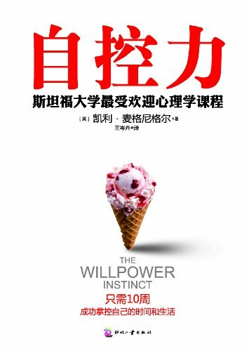

> 整合了在小打卡上的读后感

### 1.26 意志力

所谓意志力，就是控制自己的注意力、情绪和能力。

意志力就是驾驭“我要做"，“我不要”和“我想要”这三种力量。意志力不但区分了任何动物，也区分了每个人。每个人的意志力都是与生俱来的，但有些人的意志力更强。无论从哪个方面看，能够更好地控制自己地注意力，情绪和行为的人，都会活得幸福。《社会心理学》中的人类彷佛只是普通的生物，《自控力》中的人类却是高等动物崇高的光辉。

前额皮质的左边区域负责“我要做”的力量，它能帮你处理枯燥、困难或充满压力的工作。右边的区域则控制“我不要”的力量，它能克制你的一时冲动。前额皮质中间靠下的区域记录目标和愿望，决定需要什么。

意志力需要训练，经常让大脑冥想，它不仅会变得擅长冥想，而回提升自控力，提升集中注意力、管理压力、克制冲动和认识自我的能力。刚开始的适合，每天5分就行，习惯自然后，每天可以10分钟。

冥想注意1. 原地不动，安静坐好，不要烦躁，背挺直 2. 注意呼吸，不要走神，大脑只注意吸气，呼气 3. 锻炼集中注意力。冥想应该写到每日计划中，中午做最佳

人需要控制自己，所谓严于律己，宽以待人。宽以待人方面可以借助《社会心理学》获得人类的共性以满足他人，心理学能让人感受到自然的压力，从而变得宽容。至于严于律己，年关比较懈怠，我觉得要读《自控力》了

<!-- more -->

最近苦恼于女生（可能因为要过年来比较羁动），读《社会心理学》，感觉了人作为动物具有的一些共性行为。《社会心理学》并没有提到人的特性，而对的人，需要特性。对的人，注定是一个小圈子。用社交软件，额，不太靠谱hhh, 还是要控制自己的欲望了

### 1.28 提高意志力

当人们感到压力时, 交感神经会控制身体。心率升高，心率变异度就会降低。当人们成功自控的时候，副交感神经系统会发挥主要作用，缓解压力，控制冲动行为，心率降低，心率变异度会升高。心率变异度能很好地反映意志力地程度，例如一个戒酒地人看到酒时心率变异度升高那么他很可能会继续保持清醒。但如果情况相反，他地心率变异度降低，那么他很可能故态复萌。（所以要保护自己的心脏啊，心脏不好确实会影响情绪和控制力）

很多因素会影响心率变异度，例如吃植物为原材料未加工食品有利于提高心率变异度，垃圾食品则会降低心率变异度。焦虑，愤怒，抑郁和孤独都与较低的心率变异度和较差的自控力有关。

快速提高意志力的办法，将呼吸频率降低到每分钟4-6次，也就是每次呼吸用10-15秒时间。但注意不要憋气，而是缓慢地，充分地呼气。每天进行20分钟放慢呼吸地练习，就能提高心率变异度，降低欲望和抑郁程度。只要做1-2分钟地呼吸训练，就能提高你的意志力储备。

#### 锻炼

意志力地奇迹来自于身体地训练，15分钟地跑步机锻炼就能降低巧克力对节食者，香烟对戒烟者地诱惑。健身地长期效果更加显著，它能缓解普通的日常压力，抵抗抑郁。

如果想立即提高意志力，最好出门走走。科学家认为，5分钟的绿色训练就能减缓压力，改善心情，提高注意力，增强自控力。

#### 睡眠

长期睡眠不足让你更容易感到压力，萌生欲望，受到诱惑。你还会很难控制情绪，集中注意力，或是无力应付“我想要”的意志力挑战。

如果不知道自己想做什么的时候，你或许知道自己不想做什么。When you don't know what you want to do, you may need to know what you want. 也就是说，当明知道能获得更多睡眠却没法早点入睡，那不要想睡眠这件事，而是想一想到底对什么说了“我想要”（你现在的欲望是什么）

#### 压力

如果我么想更好的应对挑战，就需要更有效的管理压力、照顾自己。疲惫不堪，处于高压之中的人会有明显的劣势。压力是意志力的死敌，但很多时候，我们都以为压力是解决问题的唯一路径，但宏观上看，压力状态下（例如期末考试期间）学生除了学习几乎什么也控制不了。规律的生活是我们的追求，如果丧失了规律一昧追求压力下的工作，我们会丧失更多。所以，放松，躺下，深呼吸。

### 2.4 压力和解压

情绪低落使人屈服于诱惑。 美国心理学家协会的调查显示, 缓解压力常见的方法是那些激活大脑奖励系统的方法
--吃东西，喝酒，购物，看电视，上网和玩游戏（真实）。在我们想更快乐的时候，释放大量多巴胺是在正常不过的了

在研究压力，焦虑，罪恶感对自控力的影响时，我们发现，情绪低落会使人屈服，而且经常是以令人吃惊的方式屈服。可是人何尝能无压力呢，不然就遁入空门了。如果你相信购物某种程度上更快乐，你就会通过购物来缓解因债务引发的压力。当拖延症患者想到自己已经远远落后于进度时候，他们会万分焦虑，这反而让他们继续拖延下去。（真实，尤其是对不喜欢的，例如科研）

解决办法是通过有效的方法解压，美国心理学协会的调查发现，最有效的解压方法包括：锻炼和体育活动，祈祷或宗教活动，阅读，听音乐，与家人朋友相处，按摩，外出散步，冥想，培养有创意的爱好。而最没有效果的解压则包括赌博，购物，抽烟，喝酒，暴饮暴食，玩游戏，上网，看电影或者看电视。

有效和无效的主要策略区别在于，真正缓解压力不是降低多巴胺，而是增加改善情绪的化学物质，如血清素，催产素等。通过备忘等提醒自己，到底什么才能在压力中更快乐，在感到压力之前，能不能先想出一些鼓励自己的办法。

此外，请远离那些让你产生恐惧，焦虑的电视新闻，节目，网页。远离制造焦虑的社交媒体，比如某乎

### 2.7 挫折原谅和改变

#### 罪恶感不起作用——原谅自己

"那又如何"效应，描述了放纵，后悔到更严重的放纵的恶性循环。研究者发现，很多节食者会为了自己的失误，比如多吃了一口蛋糕，而感到情绪低落。但是他们不会为了把损失降到最低而不吃第二口，相反他们会那有如何，既然已经破坏了节食计划不如把他们都吃光。

屈服会让你对自己失望，会让你做一些改善心情的事情。那么最廉价，最快捷的改善心情的事情，往往是做导致你心情低落的事情。

似乎解决办法是自我谅解，"那又如何"效应是要摆脱失败后的低落情绪，但如果没有罪恶感和自我批评就没有这种要摆脱的东西了。遇到挫折亟需安抚这种感觉，而不是吸取教训。这时候自我批评反而会削弱自控力。

严于律己没错，但如果遇到了挫折，应该首先安抚，谅解自己，而不是吸取教训。

#### 决定改善心情——用改变而不是决定

情绪低落，遇到挫折时，发誓改变会让我们充满希望。但是不切实际的乐观可能给我们一时的快乐，但接下来我们就会感到失落。波利维和赫尔曼把这个循环称为"虚假希望综合症"。（我应该有比较大的虚假希望综合征，尤其是不擅长的领域哎，比如情场2333，不应该用幻想麻痹自己

我们需要注意这种意志力陷阱，我们需要相信，改变是能够做到的。但是我们需要避免用"改变的承诺"而不是"改变"来改善我们的心情。

乐观的悲观主义者更能获得成功。乐观给予我们动力，但少许的悲观能帮我们走向成功。研究发现，如果能预测自己什么时候，会如何受到诱惑和违背承诺，你就更有可能拥有坚定的决心

情绪低落会使人屈服于诱惑，摆脱罪恶感会让你变得强大。

思考, 人为什么而活.

答案可能是为自己的生活, 爱好吧。包括赚钱买房子, 应是为了自己喜欢的城市定居耳。

看书, 学习, 培养高雅的爱好, 而这爱好, 似乎为它们而活也

### 2.12

#### 出售未来
一个实验, 黑猩猩和人类分别有两种选择, 立刻吃掉两份食物和等两分钟有机会吃6种事物。72%的黑猩猩选择等待, 但只有19%的人如此。

人类总有各种各样的花招，让自己相信抵抗诱惑是明天的事情。因此拥有巨大前额皮质的我们会一再屈服于即刻的满足感。人类是唯一会考虑未来各种可能性的物种，但我们的问题不是预知未来，而是看不清未来的模样。

即时奖励和未来奖励触发大脑的形式并不一样，即时奖励会激活更古老，更原始的奖励系统，而未来奖励更依赖于自控地前额皮质。但是想延迟快感来说，简单地方法是创造一点距离。例如使巧克力豆不会看到，将糖果放在抽屉里而不是桌上。

同样，可以利用10分钟延迟法则，即当发现自己马上屈服于诱惑了，不如等上10分钟，10分钟之后可以选择继续自控或者屈服诱惑。这种10分钟延迟可以提高自控力。

梦想比任何都值钱，当屈服于社交网站等时，不如想上一想，因为这个我可能成为不了计算机领域的专业者，这值得吗？

### 2.16

#### 压力

如何看待压力，主要有两种思维模式

1. 压力有害，承受压力损害我的健康和活力，承受压力影响我的表现和效率，承受压力阻碍我的学习和成长，压力的影响是负面的，应该避免

2. 压力有促进作用，承受压力有助于我的健康和活力； 承受压力提升我的表现和效率；承受压力推动我的学习和成长；压力的影响是积极的，应该加以利用。

这两种模式中，压力有害思维更加普遍，即使大多数人都能从两种模式中找到事实，但是他们还是认为压力弊大于利，男女老少没有差别。

秉持压力有害的人，心理学上更可能通过规避来应对压力，努力逃避压力源，或者转向酒精等上瘾的东西，而不是搞定压力。认为压力有益的人更有可能接受压力和发生的事实，采取步骤征服，消除或者改变压力源。

压力反应帮你应对挑战，与人联结，学习和成长。当你注意到心脏怦怦跳动，身体出汗或者呼吸加快。你的头脑聚焦在压力源上，感觉兴奋、冲动、不安、焦躁或者准备好行动

即使身体已经平静下来，你依然感觉大脑充满了电，你在脑海里回放或分析过往的经验，或者想找别人倾述。呈现的情绪往往较复杂，而且想从发生的事情身上找到意义。

要到目标截止日期了，我们要有压力，所以要采取行动。价值观受到威胁，我们有压力，所以我们要捍卫它们。需要有勇气的时候，我们也有压力。理解了这些，压力反应就不再是可怕的东西，它应该被感激，被善用，被信任。正所谓压力根植于心中，不可能丢失，丧失压力反而更加可怕，所以有未雨绸缪。对于心中而来的东西，我们要适应，理解它，控制它。理解存在的意义，也不能放任。

永远在路上