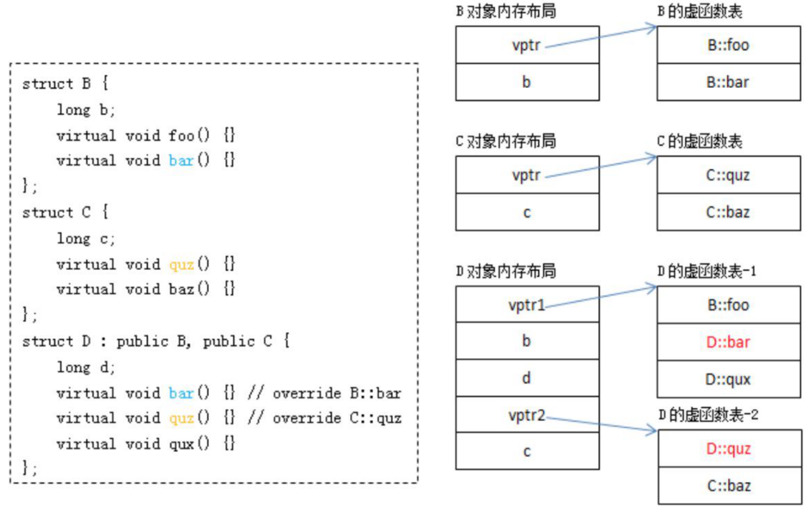

> 秋招八股文, 真滴恶心


### C++语言

1. 四种智能指针auto_ptr, shared_ptr, unique_ptr, weak_ptr

auto_ptr存在所有权问题, 如
```cpp
auto_ptr<std::string> p1 (new string ("hello"));
auto_ptr<std::string> p2;
p2 = p1; //auto_ptr 不会报错. 但是p1无效, 如果不小心访问到p1会出错
```

unique_ptr用来替换auto_ptr, 不能拷贝或者赋值, 比auto_ptr更安全
```cpp
unique_ptr<string> p3 (new string (auto));//#4
unique_ptr<string> p4；//#5
p4 = p3;//此时编译报错
```

shared_ptr基于引用计数, 多个指针可以指向共享对象;weak_ptr也可以多个指针指向共享对象, 但不控制对象周期。可以用来解决shared_ptr互相引用无法释放对象的问题。

在内部实现中, shared_ptr和weak_ptr作为栈上的对象会有个成员指针指向共享变量, 共享变量即对象的引用计数, 但只有shared_ptr的引用计数共享变量可以控制对象的析构

https://larrystd.site/cppAdvance/2021-09-07-%E6%99%BA%E8%83%BD%E6%8C%87%E9%92%88/

https://larrystd.site/cppAdvance/2021-09-25-%E5%B8%B8%E7%94%A8%E7%B1%BB%E7%9A%84%E5%AE%9E%E7%8E%B0/

https://larrystd.site/sourcecode/2021-11-23-C++%E6%A0%87%E5%87%86%E5%BA%93%E6%99%BA%E8%83%BD%E6%8C%87%E9%92%88%E6%BA%90%E7%A0%81/

<!-- more -->

2. C++内存分配(进程)情况

栈, 由编译器管理分配和回收, 存放局部变量和函数参数, 但空间默认8MB, 如果太多可能爆栈

映射段, 映射动态库文件, mmap

堆, 由程序员管理, 需要手动new, malloc, free, delete, 初始空间较大, 且可以通过mmap获取更多内存

bss段, 未初始化的静态变量

数据段, 分为只读存储区(常量)和读写存取区, 虚函数表, 字面量在只读存储区, 初始化的静态变量

代码段, 存放程序二进制代码

https://larrystd.site/cppBase/2021-04-13-Cpp%E5%9F%BA%E7%A1%801/

https://larrystd.site/cppAdvance/2021-11-05-cpp%E7%BC%96%E8%AF%91%E6%B7%B1%E7%A9%B6/

3. 指针和引用

1.引用只能在定义时初始化一次，之后不能改变指向其它变量（从一而终）；指针变量的值可变; 2.引用必须指向有效的变量，指针可以为空; 3.引用比指针更安全, 引用内部也是使用指针实现, 相当于指针的封装, 没有指针乱指的危险; 4.程序为指针变量分配内存区域，而引用不需要分配内存区域。

程序编译的时候，将指针和引⽤添加到符号表, 在编译的时候，则是将指针变量
名-指针变量的地址(不是对象变量)添加到符号表中，所以说，指针包含的内容是可以改变的。而引用则是添加到符号表的时候，是将"引⽤变量名-引⽤对象的地址"添加到符号表中，符号表⼀经完成不能改变

const修饰指针

```cpp
const int * p1; //指向整形常量 的指针，它指向的值不能修改
int * const p2; //指向整形的常量指针 ，它不能在指向别的变量，但指向（变量）的
值可以修改。
const int *const p3; //指向整形常量 的 常量指针 。它既不能再指向别的常量，指向
的值也不能修改。
```

const向右匹配, *向左匹配, const可修饰类型或者变量, 因此const int表示修饰常类型int, 而const p2表示修饰常量p2

4. C和C++区别

两者都可以操纵内存, C++兼容C语法。C++面向对象, 可以定义类, 有explicit, static_cast/dynamic_cast, 重载, 虚函数等。C++的类相比于C语言的struct有初始化构造函数, 拷贝函数等, 以及设置权限访问。C++支持模板

```cpp
// C语言实现链表
typedef struct Linklist{
    int  elem;//代表数据域
    struct Linklist *next;//代表指针域，指向直接后继元素
}Linklist; //link为节点名，每个节点都是一个 link 结构体

linklist * initlinklist(){
    linklist * p=NULL;//创建头指针
    linklist * temp = (linklist*)malloc(sizeof(linklist));//创建首元节点
    //首元节点先初始化
    temp->elem = 1;
    temp->next = NULL;
    p = temp;//头指针指向首元节点
    //从第二个节点开始创建
    for (int i=2; i<5; i++) {
     //创建一个新节点并初始化
        linklist *a=(linklist*)malloc(sizeof(linklist));
        a->elem=i;  // C语言只能挨个赋值, C++可以使用构造函数
        a->next=NULL;
        //将temp节点与新建立的a节点建立逻辑关系
        temp->next=a;
        //指针temp每次都指向新链表的最后一个节点，其实就是 a节点，这里写temp=a也对
        temp=temp->next;
    }
    //返回建立的节点，只返回头指针 p即可，通过头指针即可找到整个链表
    return p;
}
```

C++在布局以及存取时间上主要的额外负担由virtual引起, 1通过virtual function支持动态绑定, 2通过virtual继承实现多重继承下后代只存在单一实体

C++中可认为两种class data member: static和non-static, 三种class function member, static, non-static, virtual

成员初值列list的次序按照class member在类中的次序决定，与initialization list的排列顺序无关。

5. C++的构造函数, 特殊函数生成

无参构造函数, 即默认构造函数, 如果没写编译器自动生成

一般构造函数, 有重载参数的构造函数

拷贝构造函数，类型转换构造函数(声明为explicit允许默认转换), 拷贝赋值

C++特殊函数的生成
```cpp
class Base {
public:
    Base() = default;
    virtual ~Base() = default;
    Base(Base&&) = default;
    Base& operator=(Base&& ) = default;

    Base(const Base&) = default;
    Base& operator=(const Base&) = default;
}
```

6. 模板

两阶段编译检查, 

模板定义阶段，不包含类型参数的检查。只会检查例如函数有无定义的问题

模板实例化阶段，模板会再次被检查，尤其是依赖于类型参数的部分。和模板参数有关的，总是在第二阶段被检查。

模板参数传递, 当按值传递参数时，原则上所有的参数都会被拷贝;按值传递会导致类型退化decay，裸数组退化成指针，const和volatile等限制符被解除

模板按引用传递引用传递类型不会退化，也就是裸数组不会转换成指针，也不会移除const和volatile等限制符。


7. 函数指针

函数指针是指向函数的指针变量, 它需要先定义后使用。该函数指针可以直接由函数名赋值, 直接当函数调用

```cpp
char * (*pf)(char * p); // 函数指针pf
pf = fun; // 函数指针pf指向函数fun
pf(p); 
```

https://larrystd.site/cppBase/2021-11-11-C%E5%92%8C%E6%8C%87%E9%92%88/

8. 参数传递

值传递：形参是实参的拷⻉，函数内部对形参的操作并不会影响到外部的实参

指针传递：也是值传递的⼀种⽅式，形参是指向实参地址的指针

引⽤传递：实际上把引⽤对象的地址放在了开辟的栈空间中，函数内部对形参的任何操作
可以直接映射到外部的实参上⾯。相当于自动实现了取地址, 解地址操作

9. new / delete ，malloc / free 区别

执⾏ new 实际上执⾏两个过程：1.分配未初始化的内存空间（malloc）；2.使⽤对象的构造
函数对空间进⾏初始化；返回空间的⾸地址。如果在第⼀步分配空间中出现问题，则抛出
std::bad_alloc 异常，或被某个设定的异常处理函数捕获处理；如果在第⼆步构造对象时出现
异常，则⾃动调⽤ delete 释放内存。

new/delete作为运算符可以对象自定义方法, 例如placement new

https://larrystd.site/book/2021-11-8-8%E5%AE%9A%E5%88%B6new%E5%92%8Cdelete/

10. volatile  extern explicit

volatile 三个特性, 易变性：在汇编层⾯反映出来，就是两条语句，下⼀条语句不会直接使⽤上⼀条语句对应的
volatile 变量的寄存器内容，⽽是重新从内存中读取； 不可优化性：volatile 告诉编译器，不要对我这个变量进⾏各种激进的优化，甚⾄将变量直接消除，保证程序员写在代码中的指令，⼀定会被执⾏; 顺序性：能够保证 volatile 变量之间的顺序性，编译器不会进⾏乱序优化。

extern

修饰符 extern ⽤在变量或者函数的声明前，⽤来说明 此变量/函数是在别处定
义的，要在此处引⽤。另外extern "C"表示下面这段代码要根据C语言规则编译

explicit关键字是防止隐式转换, 那么什么是隐式转换呢。简而言之, 凡是没有强制类型转换的类型自动发生了类型转换, 都是隐式转换

C语言系列常见的隐式转换是算术隐式转换, 而C++ class的隐式转换是自动调用operator T()转型函数
```cpp
struct A
{
    operator int() const {
        std::cout << "covert A to int" << "\n";
    };
};
int main() {
    A a;
    bool b = a; // 发生了隐式转换, A转为int
}
```

11. define 和 const, static变量 

宏定义实际上是在预编译阶段进⾏处理，没有类型，也就没有类型检查，
仅仅做的是遇到宏定义进⾏字符串的展开

const 是在编译期间进⾏处理的，const 有类型，有类型检查，程序运⾏时系统会为 const 常量分配内存; 有时编译器不会为普通的 const 常量分配内存，⽽是直接将 const 常量添加到符号表中，省去了读取和写⼊内存的操作，效率更⾼。

C++编译器会对const修饰的变量进行优化, C语言不会优化, 因此C语言中，const表示只读的变量，存储在内存中，可以通过指针改变该存储空间中的值。

C++编译器使用常数直接替换掉被const修饰内置类型，并不会通过访问内存去读取数据，这一点类似C语言中的宏#define。但对于非内置类型例如结构体还是从内存中读取

而C++对全局定义的const和函数内部定义的const处理也是不同的, 在函数内部如果操纵内存, 输出的const_value还是100, 因为const_value不是存储在内存中的, 而是从符号表中读取
```cpp
const int const_value = 100;
int * ptr = (int *)&const_value;
*ptr = 200;
```

而全局定义的const不可用修改内存, 因为放到了只读存储区
```cpp
static const char const_data[16] = "I'm Const Data";
// 放在了.rodata分区
```

static修饰的变量存储在静态区, static修饰的全局变量的作用域只能是本身的编译单元, 这其实由编译器决定的。在其他编译单元使用它时，只是简单的把其值复制给了其他编译单元，其他编译单元会另外开个内存保存它。每个编译单元就是一个ELF文件, 里面都有读写静态区, static修饰的变量无法通过链接引用其他编译单元

C++11支持在类成员变量初始化普通变量, 但不能初始化const, static变量

12. 类大小

```cpp
class A{}; sizeof(A) = 1; //空类在实例化时得到⼀个独⼀⽆⼆的地址，所以为 1.
class A{virtual Fun(){} }; sizeof(A) = 4 //当 C++ 类中有虚
函数的时候，会有⼀个指向虚函数表的指针（vptr）
class A{static int a; }; sizeof(A) = 1; // static成员也不记录在类中
class A{int a; }; sizeof(A) = 4;
class A{static int a; int b; }; sizeof(A) = 4;
```

13. 派生类虚函数

拷⻉基类的虚函数表，如果是多继承，就拷⻉每个有虚函数基类的虚函数表; 查看派⽣类中是否有重写基类中的虚函数， 如果有，就替换成已经重写的虚函数地址, 查看派⽣类是否有⾃身的虚函数，如果有，就追加⾃身的虚函数到⾃身的虚函数表中。多继承情况下一个类可能有多个虚函数表



14. 构造函数和析构函数, 虚函数

为了降低内存泄漏的可能性, 即多态情况下基类指针指向派生类对象, 若构造函数不是虚函数将执行基类的析构函数造成派生类对象析构不干净, 设置成了虚函数则执行派生类的析构函数。

⽬前编译器实现虚函数进⾏多态的⽅式，虚函数的调⽤是通过实例化之后对象的虚函数表指针来找到虚函数的地址进⾏调⽤的，如果说构造函数是虚的，那么调用构造函数前虚函数表指针则是不存在的，⽆法找到对应的虚函数表来调⽤构造函数

虚函数对调用者来说只需要"部分的"信息，即只需要知道函数接⼝，⽽不需要知道对象的具体类型。但是，我们要创建⼀个对象的话，是需要知道对象的完整信息的。也就是说构造函数不应该被定义成虚函数, 因为构造函数需要调用者知道对象完整信息

构造函数中调用虚函数是危险的, 因为继承体系下基类对象先创建, 倘若用虚函数调用派生类虚函数表函数, 这时候派生类对象还没有被创建。析构函数也不应该调用虚函数, 基对象调用虚函数时派生类对象已经被销毁

15. 虚函数

虚函数表位于只读数据段（.rodata），即：C++内存模型中的常量区; 虚函数代码则位于代码段（.text），也就是C++内存模型中的代码区。

栈区, 共享存储映射区, 堆区, 读写数据段(静态区, .data+.bss), 只读数据段(常量区), 代码段(.text)

虚函数结构, 主义vpt指向的位置是第一个虚函数, 但上面至少还有typeinfo object内容, typeid, dynamic_cast实现原理都是基于type_info
```cpp
/*
              Object                      vtable
                               -16 [ offset to top     ]  __si_class_type_info
                               -8  [ typeinfo Object   ] --> +0 [ ... ]
--> +0  [ vptr           ] --> +0  [ &Object::HashCode ]
    +8  [ identity_hash_ ]     +8  [ &Object::Equals   ]
    +12 [ (padding)      ]     +16 [ &Object::ToString ]

             MyObject                     vtable
                               -16 [ offset to top       ]  __si_class_type_info
                               -8  [ typeinfo MyObject   ] --> +0 [ ... ]
--> +0  [ vptr           ] --> +0  [ &MyObject::HashCode ]
    +8  [ identity_hash_ ]     +8  [ &Object::Equals     ]
    +12 [ dummy_         ]     +16 [ &MyObject::ToString ]

*/

```

16. 纯虚函数

声明⼀个纯虚函数的⽬的就是为了让派⽣类只继承函数的接⼝，⽽且派⽣类中必需提供⼀个这个纯虚函数的实现。含有纯虚函数的类将是抽象类，不能进⾏实例化

17. 静态绑定和动态绑定

绑定就是对应, 例如类型和对象对应(对应),对象和成员函数绑定(对应), 例如A* a = new A(), A对象绑定A类型, 静态绑定就是编译期绑定类型, 动态绑定是运行期绑定类型, 也就是多态。virtual 函数是动态绑定的，⾮虚函数是静态绑定的

18. 调⽤拷贝构造函数

三种情况下调用拷贝构造函数

* ⼀个对象以值传递的⽅式传⼊函数体，需要拷贝构造函数创建⼀个临时对象压⼊到栈空间中。
* ⼀个对象以值传递的⽅式从函数返回，需要执⾏拷⻉构造函数创建⼀个临时对象作为返回值。
* ⼀个对象需要通过另外⼀个对象进⾏初始化。

19. 结构体内存对⻬

* 对于结构体中的各个成员，第⼀个成员位于偏移为 0 的位置，以后的每个数据成员的偏移量必须是偏移量(一般四个字节)的倍数。
* 在所有的数据成员完成各自对⻬之后，结构体或联合体本身也要进⾏对⻬，整体⻓度是偏移量的倍数。

经过内存对⻬之后，CPU 的内存访问速度⼤⼤提升。因为 CPU 把内存当成是⼀块⼀块的，块的⼤⼩可以是 2，4，8，16 个字节，因此 CPU 在读取内存的时候是⼀块⼀块进行读取。有些平台强制块读取, 因此内存对⻬还有利于平台移植

20. 红黑树

https://larrystd.site/cppAdvance/2021-09-20-%E7%BA%A2%E9%BB%91%E6%A0%91%E5%92%8Cmap/

21. typedef, inline 

typedef 在编译阶段有效，typedef 有类型检查的功能; 宏定义在预处理阶段进⾏⽂本替换，inline 函数在编译阶段进⾏替换；一般头文件实现的成员函数都设置成inline

using可用来代替typedef 
```cpp
typedef std::unique_ptr<std::unordered_map<std::string, std::string>> UPtrMaps;

using UPtrMaps = std::unique_ptr<std::unordered_map<std::string, std::string>>;
```

22. 预处理，编译，汇编，链接


23.  fork，wait，exec

⽗进程产⽣⼦进程使⽤ fork 拷⻉出来⼀个⽗进程的副本，此时只拷⻉了⽗进程的⻚表，两个进程都读同⼀块内存。因为使用了写时复制

当有进程写的时候使⽤写时复制机制分配内存，exec 函数可以加载⼀个ELF可执行 ⽂件去替换⽗进程，从此⽗进程和⼦进程就可以运⾏不同的程序了。

fork 从⽗进程返回⼦进程的 pid，从⼦进程返回 0，调⽤了 wait 的⽗进程将会发⽣阻塞，直到有⼦进程状态改变，执⾏成功返回 0，错误返回 -1。

24. 动态链接和静态链接

采⽤静态链接库lib中的指令都全部被直接包含在最终⽣成的 EXE ⽂件中了。但是若使⽤ DLL，该 DLL 不必被包含在最终 EXE ⽂件中，EXE ⽂件执⾏时可以动态地引⽤和卸载这个与 EXE 独⽴的 DLL ⽂件(在进程内存的映射区)。

25. brk/sbrk, mmap

linux中几种管理内存的方式有：STL，new/delete，malloc/free，brk/sbrk，mmap/unmap

brk通过传递的addr来重新设置program break; sbrk用来增加heap，增加的大小通过参数increment决定。即先调用brk增长空间, 再调用sbrk设置空间分配

mmap用于内存映射，也就是将一段区域映射到自己的进程地址空间中，分为两种：1. 文件映射： 将文件区域映射到进程空间，文件存放在存储设备上；2. 匿名映射：没有文件对应的区域映射，内容存放在物理内存上；文件相当于通过文件系统间接访问虚存。mmap可用于进程地址空间增长, 也可用来访问文件, 读取文件一般先把文件读取到文件缓冲区中, 再从缓冲区拿数据(两次拷贝)。mmap实际是对缓冲区做了映射，免去了先读到缓冲区这一步(只需要一次拷贝)。

https://larrystd.site/cppBase/2021-04-13-Cpp%E5%9F%BA%E7%A1%801/

26. 模板参数推导和auto

主义模板参数T如果是引用, 不会去除const修饰符

ParamType是一个指针或引用但不是通用引用，则参数一般会被推导成左值引用T&或者T*

ParamType是一个通用引用, 则传入左值推到成左值引用T&, 传入右值推到成右值引用

ParamType既不是指针也不是引用, 即T直接按值传递, 且去除const等修饰符, 数组也会退化成指针

auto类型推导也是基于模板类型推导,分别将auto, auto&, auto&&视作无引用, 左值引用, 通用引用。由于auto必须进行类型推导, 因此必须显示初始化

27. decltype

decltype最主要用途是用于函数模板返回类型 而这个返回类型依赖于形参。
```cpp
template <typename Container, typename Index>
auto authAndAccess(Container& c, Index i)
    -> decltype(c[i])       // 推导成int, 而不是int&
{
    authenticateUser();
    return c[i];
}
```

28. 成员初始列{}

{}倾向于与std::initializer_list<>()进行匹配, initializer_list是一种标准库类型, {}的应用更加灵活, 不用区分赋值和拷贝, 都是调用的`Widget(std::initializer_list<bool> il); `, 但是由于是编译期行为, 不允许变窄变化即上面模板类型是bool, 传入int会出错

29. C++11

智能指针shared_ptr, unique_ptr, weak_ptr; thread等多线程类thread, condition_variable, mutex, promise, future; 右值引用; std::bind/std::function

unordered_map/unordered_set

using代替typedef, {}, auto, decltype, enum class限域枚举, override, final, noexcept, constexpr, default/delete

30. 内存分配

linux系统的buddy和slab内存分配, 内部碎片和外部碎片, brk/mmap, vmalloc, kmalloc
https://larrystd.site/computerbase/2021-11-2-linux%E5%86%85%E5%AD%98%E7%AE%A1%E7%90%86/

malloc的ptmalloc, tcmalloc, jemalloc内存分配
https://larrystd.site/cppAdvance/2022-01-02-malloc%E5%A0%86%E5%86%85%E5%AD%98%E7%AE%A1%E7%90%86/

STL的 内存分配,
https://larrystd.site/cppAdvance/2021-04-25-STL%E7%A9%BA%E9%97%B4%E9%85%8D%E7%BD%AE%E5%99%A8/

memcached的内存分配


### STL

1. 空间配置器

STL ⼀共提供六⼤组件，包括容器，算法，迭代器，仿函数，配接器和空间配置器

SGI 设计了双层级配置器，第⼀级配置器直接使⽤ malloc()和 free()完成内存的分配和回收。第⼆级配置器则根据需求量的⼤⼩选择不同的策略执⾏

第⼆级配置器，如果需求块⼤⼩⼤于 128bytes，则直接转⽽调⽤第⼀级配置器，使⽤malloc()分配内存。如果需求块⼤⼩⼩于 128bytes，第⼆级配置器中维护了 16 个⾃由链表，负责 16 种⼩型区块的次配置能⼒。

当有⼩于 128bytes 的需求块要求时，⾸先查看所需需求块⼤⼩所对应的链表中是否有空闲空间，如果有则直接返回，如果没有， 如果一个都不能够满足的话，则从系统的heap里面要内存给到内存池，换算的标准是bytes_to_get=2*total_bytes+ROUND_UP(heap_size>>4)，申请的大小为需求量的两倍加上一个 附加值

从比较大的freelist那里要内存到内存池，如果还是要不到。如果还是没有，交由一级配置器 malloc()处理，主要考虑能否从 malloc() 的out-of-memory 处理机制可能获得一些内存, 还是没有则报bad_alloc错误

https://larrystd.site/cppAdvance/2021-04-25-STL%E7%A9%BA%E9%97%B4%E9%85%8D%E7%BD%AE%E5%99%A8/

2. 序列型容器

vector, 动态数组, 支持RandomAccessIterator, 随机存取。三个迭代器构成的，⼀个指向⽬前使⽤空间头的 iterator，⼀个指向⽬前使⽤空间尾的iterator，⼀个指向⽬前可⽤空间尾的 iterator。

扩容两倍, 扩充的过程并不是直接在原有空间后⾯追加容量，⽽是重新申请⼀块连续空间，将原有的数据拷⻉到新空间中，再释放原有空间。可能出现迭代器失效

list, 双向链表, BidirectionalIterator, 可用作队列的实现

deque, 其提供了RandomAccessIterator, 即兼顾vector的随机存取和队列的两端性。deque 采⽤⼀块map 作为主控，map中的每⼀个元素指向了另⼀段连续线性空间称为缓冲区，缓冲区是 deque 的真正存储空间主体。

stack和queue基于deque实现

priority_queue, 底层时⼀个 vector，使⽤ heap 形成的算法，插⼊，获取 heap 中元素的算法，维护这个vector

emplace_back() 函数在原理上⽐ push_back() 有了⼀定的改进，包括在内存优化⽅⾯和运⾏效率⽅⾯。内存优化主要体现在使⽤了就地构造(直接在容器内构造对象，不⽤拷⻉⼀个复制品再使⽤)+强制类型转换的⽅法来实现, 省略了拷贝的过程

3. map和set

map 和 set 都是 C++ 的关联容器，其底层实现都是红⿊树, map 和 set 都是 C++ 的关联容器，其底层实现都是红⿊树

set 的迭代器是 const 的，不允许修改元素的值；map⽀持下标操作，set不⽀持下标操作

对于关联容器 map set 来说，使⽤了 erase(iterator) 后，当前元素的迭代器失效，但是其结构是红⿊树，删除当前元素的，不会影响到下⼀个元素的迭代器，所以在调⽤ erase 之前，记录下⼀个元素的迭代器即可。

对于序列容器 vector，deque来说，使⽤ erase(itertor) 后，后边的每个元素的迭代器都会失效，但是 erase 会返回下⼀个有效的迭代器；

list 删除元素不会导致迭代器失效, list的 erase ⽅法也会返回下⼀个有效的
iterator

4. resize()和reserve()

resize()：改变当前容器内含有元素的数量(size()); reserve()：改变当前容器的最⼤容量capacity

5. unordered_map, rehash, 结合redis的rehash

6. trait

编译期技法, 运行时当然不能获取到类型(除了使用虚函数)

### 操作系统

1. 进程和线程

https://larrystd.site/computerbase/2021-10-31-linux%E8%BF%9B%E7%A8%8B%E7%BA%BF%E7%A8%8B/

一般的, 线程私有：线程栈，寄存器，程序寄存器; 共享：堆，地址空间，全局变量，静态变量

进程私有：地址空间，堆，全局变量，栈，寄存器; 共享：代码段，公共数据，进程⽬录，进程ID

线程⽐进程更具有更⾼的性能，这是由于同⼀个进程中的线程都有共性：多个线程将共享同⼀个进程虚拟空间；当操作系统创建⼀个进程时，必须为进程分配独⽴的内存空间，并分配⼤量相关资源

/usr/bin/ulimit实用程序定义允许单个进程使用的文件描述符的数量。 它的最大值在rlim_fd_max中定义，在缺省情况下，它设置为65,536。最大可修改甚至达到100万个

2. 进程线程的创建

fork函数创造的⼦进程是⽗进程的完整副本，复制了⽗亲进程的资源，包括内存的内容task_struct内容；对于⽗进程，fork函数返回新建⼦进程的pid, 对于⼦进程，fork函数返回 0

vfork创建的⼦进程与⽗进程共享数据段，⽽且由vfork创建的⼦进程将先于⽗进程运⾏

linux上创建线程⼀般使⽤的是pthread库，实际上linux也给我们提供了创建线程的系统调⽤clone；

3. 死锁

互斥条件。即某个资源在⼀段时间内只能由⼀个进程占有; 不可抢占条件。进程所获得的资源在未使⽤完毕之前，资源申请者不能强⾏地从资源占有者⼿中夺取资源; 占有且申请条件。进程⾄少已经占有⼀个资源，但⼜申请新的资源; 循环等待条件。存在⼀个进程等待序列, 序列组成一个循环

4. 死锁算法

鸵鸟算法, OS中这种置之不理的策略称之为鸵⻦策略, 忽略之

银⾏家算法, 银⾏家算法的基本思想是分配资源之前，判断系统是否是安全的；若是，才分配。

5. 进程通信方式

管道, FiFO（有名管道）, 消息队列, 信号量, 共享内存

https://larrystd.site/computerbase/2022-02-25-apue01/

6. ⻚和段

7. 孤⼉进程和僵⼫进程

常情况下⽗进程先结束会调⽤ wait 或者 waitpid 函数等待⼦进程完成再
退出，⽽⼀旦⽗进程不等待直接退出，则剩下的⼦进程会被init(pid=1)进程接收，成会孤⼉进程。

⼦进程先退出了，⽗进程还未结束并且没有调⽤ wait 或者 waitpid 函数获取⼦进程的状态信息，则⼦进程残留的状态信息（ task_struct 结构和少量资源信息）会变成僵⼫进程。将⼦进程成为孤⼉进程，从⽽其的⽗进程变为init进程，通过init进程可以处理僵⼫进程。

守护进程(daemon) 是指在后台运⾏，没有控制终端与之相连的进程。它独⽴于控制终端，通常周期性地执⾏某种任务 。

8. ⽤户态到内核态

系统调⽤, ⽤户态进程主动要求切换到内核态的⼀种⽅式

异常, CPU 在执⾏运⾏在⽤户态下的程序时，发⽣了某些事先不可知的异常，这时会触发由当前运⾏进程切换到处理此异常的内核相关程序中，也就转到了内核态，⽐如缺⻚异常

外围设备的中断, 当外围设备完成⽤户请求的操作后，会向 CPU 发出相应的中断信号，这时 CPU 会暂停执⾏下⼀条即将要执⾏的指令转⽽去执⾏与中断信号对应的处理程序

当程序运⾏在3级特权级上时，就可以称之为运⾏在⽤户态，因为这是最低特权级, 当程序运⾏在0级特权级上时，就可以称之为运⾏在内核态

处于⽤户态执⾏时，进程所能访问的内存空间和对象受到限制，其所处于占有的处理机是可被抢占的 ； ⽽处于核⼼态执⾏中的进程，则能访问所有的内存空间和对象，且所占有的处理机是不允许被抢占的

9. CPU中断

CPU中断，系统内发⽣了⾮寻常或⾮预期的急需处理事件, CPU暂时中断当前正在执⾏的程序⽽转去执⾏相应的事件处理程序

10. 字节序

大端字节序: 高位字节在前(左, 地址底的地方)，低位字节在后(右, 高地址处)，因为计算机由低地址向高地址读, 会先读到高位字节, 这是人类读写数值的方法。

小端字节序: 低位字节在前，高位字节在后，计算机从低地址向高地址读取会先读到低位。

### 网络

1. epoll 和select, poll

2. epoll的ET, LT, 使用场景, 源码分析

https://larrystd.site/computerbase/2021-07-20-IO%E5%A4%9A%E8%B7%AF%E5%A4%8D%E7%94%A8/

3. 惊群场景

4. http和https

https://larrystd.site/computerbase/2021-09-18-http%E5%92%8Chttps%E5%8D%8F%E8%AE%AE/

5. http2.0和http3.0, quic

6. 计算机网络五层模型

7. DNS的工作流程

8. ARP协议 address 

9. ping和ICMP

10. TCP与UDP有什么区别

TCP	面向连接	可靠	字节流	消耗资源多

UDP 无连接	不可靠	数据报文段 消耗资源少 首部只有8个字节

11. TCP协议如何保证可靠传输

主要有校验和、序列号、超时重传、流量控制及拥塞避免等几种方法

校验和：在发送算和接收端分别计算数据的校验和，如果两者不一致，则说明数据在传输过程中出现了差错，TCP将丢弃和不确认此报文段。

序列号：TCP会对每一个发送的字节进行编号，接收方接到数据后，会对发送方发送确认应答(ACK报文)，并且这个ACK报文中带有相应的确认编号，告诉发送方，下一次发送的数据从编号多少开始发。

超时重传：在上面说了序列号的作用，但如果发送方在发送数据后一段时间内（可以设置重传计时器规定这段时间）没有收到确认序号ACK，那么发送方就会重新发送数据。

流量控制：如果发送端发送的数据太快，接收端来不及接收就会出现丢包问题。为了解决这个问题，TCP协议利用了滑动窗口进行了流量控制。在TCP首部有一个16位字段大小的窗口，窗口的大小就是接收端接收数据缓冲区的剩余大小。

拥塞控制：如果网络出现拥塞，则会产生丢包等问题, 拥塞控制主要有四部分组成：慢开始、拥塞避免、快重传、快恢复

12. 三次握手

13. 四次挥手

14. TIME_WAIT, CLOSE_WAIT

CLOSE_WAIT是被动关闭形成的，当客户端发送FIN报文，服务端返回ACK报文后进入CLOSE_WAIT。

TIME_WAIT是主动关闭形成的，当第四次挥手完成后，客户端进入TIME_WAIT状态。

主动关闭方处于TIME_WAIT状态需再经过2MSL，可使本次TCP连接中的所有报文全部消失，不会出现在下一个TCP连接中。

15. HTTP状态码

1XX	信息性状态码

2XX	成功状态码， 200 OK：请求成功

3XX	重定向状态码

4XX	客户端错误状态码，400 Bad Request：客户端请求的语法错误，服务器无法理解。 403 Forbidden：服务器理解用户的请求，但是拒绝执行该请求， 404 Not Found：服务器无法根据客户端的请求找到资源。

5XX	服务端错误状态码， 500 Internal Server Error：服务器内部错误，无法完成请求

16. get和Post

GET用于获取资源，POST用于传输实体主体; GET的参数放在URL中，GET方法提交的请求的URL中的数据做多是2048字节，POST请求没有大小限制。GET方法是具有幂等性的，而POST方法不具有幂等性。这里幂等性指客户端连续发出多次请求，收到的结果都是一样的.

17. CLOSE_WAIT和TIME_WAIT

18. TCP可靠传输机制

ACK确认机制

超时重传

序列化机制

校验和

19. ARQ滑动窗口

停止等待协议

连续ARQ协议(回退N帧协议, 选择重传协议)

20. 拥塞控制

慢开始, 拥塞避免, 快重传, 快恢复


### 分布式系统

1. raft协议

2. CAP和BASE理论

3. 事务的两阶段提交

### 设计模式

1. 单例模式

两种懒汉和饿汉, 即饿汉：在单例类定义的时候就进⾏实例化; 懒汉(懒加载), 也就是在第⼀次⽤到的类实例的时候才会去实例化。

饿汉
```cpp
#include <iostream>
#include <algorithm>
  using namespace std;
class SingleInstance {
 public:
  static SingleInstance* GetInstance() {
  static SingleInstance ins;
    return &ins;
  }
~SingleInstance(){};
private:
//涉及到创建对象的函数都设置为private
SingleInstance() { std::cout<<"SingleInstance() 饿汉"<<std::endl;
}
SingleInstance(const SingleInstance& other) {};
SingleInstance& operator=(const SingleInstance& other) {return
*this;}
};
int main(){
//因为不能创建对象所以通过静态成员函数的⽅法返回静态成员变量
SingleInstance* ins = SingleInstance::GetInstance();
return 0;
}
```

### redis

1. 什么是 redis？它能做什么

redis 即 Remote Dictionary Server，内存key-value存储系统

应用场景:缓存，数据库，消息队列，分布式锁

2. 八种数据结构，五种基本数据类型和三种特殊数据类型

.string， hashmap:，.list:基本的数据类型，set, set:集合,zset有序集合

3. redis为什么这么快

1:完全基于内存操作 2.使用单线程模型来处理客户端的请求，避免了上下文的切换 2.epoll 4. 自身使用 C 语言编写，有很多优化机制，比如动态字符串 sds

4. redis 6.0之后又使用了多线程，不会有线程安全的问题吗

redis 还是使用单线程模型来处理客户端的请求，只是使用多线程来处理数据的读写和协议解析，执行命令还是使用单线程，所以是不会有线程安全的问题。

5. 持久化机制

redis 有两种持久化的方式，AOF 和 RDB.

把某个时间点 redis 内存中的数据以二进制的形式存储的一个.rdb为后缀的文件当中,也就是「周期性的备份redis中的整个数据」,这是redis默认的持久化方式,也就是我们说的快照(snapshot)，是采用 fork 子进程的方式来写时同步的。

redis 每次执行一个命令时,都会把这个「命令原本的语句记录到一个.aod的文件当中,然后通过fsync策略,将命令执行后的数据持久化到磁盘中」(不包括读命令)

6. Redis的过期键的删除策略

定时过期：每个设置过期时间的key都需要创建一个定时器，到过期时间就会立即清

惰性过期：只有当访问一个key时，才会判断该key是否已过期

定期过期：每隔一定的时间，会扫描一定数量的数据库的expires字典中一定数量的key，并清除其中已过期的key。

7. 8种内存淘汰策略

1.noeviction：直接返回错误，不淘汰任何已经存在的redis键
2.allkeys-lru：所有的键使用lru算法进行淘汰
3.volatile-lru：有过期时间的使用lru算法进行淘汰
4.allkeys-random：随机删除redis键
5.volatile-random：随机删除有过期时间的redis键
6.volatile-ttl：删除快过期的redis键
7.volatile-lfu：根据lfu算法从有过期时间的键删除
8.allkeys-lfu：根据lfu算法从所有键删除

8. Redis 的热 key 问题怎么解决

可以将结果缓存到本地内存中
将热 key 分散到不同的服务器中
设置永不过期

9. 缓存击穿、缓存穿透、缓存雪崩

缓存穿透是指用户请求的数据在缓存中不存在并且在数据库中也不存在，导致用户每次请求该数据都要去数据库中查询一遍，然后返回空。

缓存击穿，是指一个 key 非常热点，在不停的扛着大并发，大并发集中对这一个点进行访问，当这个 key 在失效的瞬间，持续的大并发就穿破缓存，

缓存雪崩是指缓存中不同的数据大批量到过期时间，而查询数据量巨大，请求直接落到数据库上导致宕机。

10. Redis 有哪些部署方式

单机模式:这也是最基本的部署方式,只需要一台机器,负责读写,一般只用于开发人员自己测试

哨兵模式:哨兵模式是一种特殊的模式，首先Redis提供了哨兵的命令，哨兵是一个独立的进程，作为进程，它会独立运行。其原理是哨兵通过发送命令，等待Redis服务器响应，从而监控运行的多个Redis实例。它具备自动故障转移、集群监控、消息通知等功能。

cluster集群模式:在redis3.0版本中支持了cluster集群部署的方式，这种集群部署的方式能自动将数据进行分片，每个master上放一部分数据，提供了内置的高可用服务，即使某个master挂了，服务还可以正常地提供。

主从复制:在主从复制这种集群部署模式中，我们会将数据库分为两类，第一种称为主数据库(master)，另一种称为从数据库(slave)。主数据库会负责我们整个系统中的读写操作，从数据库会负责我们整个数据库中的读操作。其中在职场开发中的真实情况是，我们会让主数据库只负责写操作，让从数据库只负责读操作，就是为了读写分离，减轻服务器的压力。

11. 哨兵有哪些作用？

监控整个主数据库和从数据库，观察它们是否正常运行

当主数据库发生异常时，自动的将从数据库升级为主数据库，继续保证整个服务的稳定

12. cluster集群模式是怎么存放数据

一个cluster集群中总共有16384个节点，集群会将这16384个节点平均分配给每个节点，当然，我这里的节点指的是每个主节点

13. cluster的故障恢复

在集群中，每个节点都会定期的向其他节点发送ping命令，通过有没有收到回复来判断其他节点是否已经下线。如果长时间没有回复，那么发起ping命令的节点就会认为目标节点疑似下线，也可以和哨兵一样称作主观下线，当然也需要集群中一定数量的节点都认为该节点下线才可以称之为客观下线

14. 主从同步原理

同步+命令传播, 同步分为完整重同步(full resynchronization)和部分重同步(partial resynchronization)两种模式, 一般只有数据库打开时才会采用完整重同步, PSYNC

部分重同步结构, 复制积压缓冲区, 复制偏移量, 传写操作

15. 哨兵模式

保证容错和可用性, Sentinel本质上是运行在特殊模式下的Redis server

INFO, Sentinel默认以每10秒一次的频率, 通过命令连接向被监视的主服务器发送INFO命令, 获取主服务器的当前信息。

下线判定

选举领头哨兵节点, 用该节点进行故障转移

16. 集群模式

Redis集群通过分片的方式保存数据库中的键值对, 集群的整个数据库被分为16384个槽slot, 数据库的每个键都位于这16384个slot中的一个。集群的节点可以处理0~16384个槽。当集群的16384个槽都有节点处理, 集群处于上线状态; 如果有一个槽没有得到处理, 则集群处于下线状态。

采取主从节点, 主节点复制保证一致性, 通过raft领头选举从节点选举出主节点

17. 持久化rdb, aof

BGSAVE会派生出一个子进程创建RDB文件, 不会阻塞当前进程。将数据库内容持久化到rdb文件中。

AOF持久化是通过保存Redis服务器执行的写命令来记录数据库状态, 写命令保存到AOF文件。AOF持久化功能实现可分为命令追加(append), 文件写入, 文件同步(sync)三个部分。rewrite目前采用的方式是创建一个新的 AOF 文件，将数据库里的全部键值对转换成协议的方式按照RPUSH命令保存到文件中(直接读取当前数据库的key, 因此aof会增加数据库的读取负载)

一般数据库开启或者BGSAVE命令执行rdb(且优先使用AOF还原, AOF未开启则使用RDB), 而aof是注册在定时器中定期执行的。定期执行的任务有, 删除过期键, 客户端超时释放, aof操作, AOF缓冲区内容写入到AOF文件等。

18. redis过期键的删除

Redis采用惰性删除和定期删除策略, 所有读写数据库之前都会调用expireIfNeeded函数检查, 如果输入键过期那么将会删除。此外redis通过activeExpireCycle在规定时间内随机检查一部分键的过期时间, 并删除过期键

19. rehash

扩展和收缩哈希表的工作可以通过rehash进行, 哈希表负载因子=哈希表已保存节点数量/ 哈希表大小。

当以下条件任意一个被满足时, 程序会自动开始对哈希表执行扩展操作。服务器目前没有执行BGSAVE或者BGREWRITEAOF命令且哈希表负载因子>1; 或者服务器目前再执行BGSAVE或NGREWRITEAOF命令且负载因子大于等于5

当哈希表的负载因子小于0.1时，程序自动开始对哈希表执行收缩操作。hash表大小取值一般是素数, 一般扩容可采用大于当前两倍hash表大小的第一个素数。hash检索一般使用MurmurHash 算法

渐进rehash, 服务器不是一次性将ht[0]里面所有键值对rehash到ht[1], 而是分多次, 渐进地将ht[0]里地键值对rehash到ht[1]。即每次对字典执行添加, 删除, 查找或者更新操作时, 程序除了执行指定操作, 而会顺带将ht[0]哈希表rehashidx索引的所有键值对rehash到ht[1].

20. redis和memcached的区别

Redis不仅仅支持简单的k/v类型的数据，同时还提供list，set，zset，hash等数据结构的存储。 memcache只支持简单数据类型(字符串)，需要客户端自己处理复杂对象.

Redis支持数据的持久化(rdb, aof)，可以将内存中的数据保持在磁盘中，重启的时候可以再次加载进行使用;Memcache没有持久化机制，因此宕机所有缓存数据失效。 Redis配置为持久化，宕机重启后，将自动加载宕机时刻的数据到缓存系统中。具有更好的灾备机制。

Memcache可以使用Magent在客户端进行一致性hash做分布式。 Redis支持在服务器端做分布式（PS:Twemproxy/Codis/Redis-cluster多种分布式实现方式）

Redis使用的是单线程模型，保证了数据按顺序提交。Memcache需要使用cas保证数据一致性。 CAS（Check and Set）是一个确保并发一致性的机制，属于"乐观锁"范畴； 原理很简单：拿版本号，操作，对比版本号，如果一致就操作，不一致就放弃任何操作

cpu利用。由于Redis只使用单核，而Memcached可以使用多核， 所以平均每一个核上Redis在存储小数据时比Memcached性能更高。 而在100k以上的数据中，Memcached性能要高于Redis 。

memcache内存管理：使用Slab Allocation。 原理相当简单，预先分配一系列大小固定的组，然后根据数据大小选择最合适的块存储。避免了内存碎片。 缺点：不能变长，浪费了一定空间 memcached默认情况下下一个slab的最大值为前一个的1.25倍。

redis内存管理： Redis通过定义一个数组来记录所有的内存分配情况， Redis采用的是包装的malloc/free， 相较于Memcached的内存 管理方法来说，要简单很多。 由于malloc首先以链表的方式搜索已管理的内存中可用的空间分配，导致内存碎片比较多

memcached能接受的key的最大长度为250个字符, 最大能存储!M大的item

### Nginx

1. 什么是Nginx

Nginx是一个 轻量级/高性能的反向代理Web服务器，他实现非常高效的反向代理、负载平衡，他可以处理2-3万并发连接数，官方监测能支持5万并发

跨平台、配置简单、方向代理、高并发连接：nginx处理静态文件好，耗费内存少，

稳定性高：宕机的概率非常小

2. 为什么性能高

充分利用多核CPU, Nginx的进程架构图，可以看到它含有4类进程：1个Master管理进程、多个Worker工作进程、1个Cache Loader缓存载入进程和1个Cache Manager缓存淘汰进程。相比之下, NodeJS受制于单进程、单线程架构

Master是管理进程，它长期处于Sleep状态，并不参与请求的处理.只有在开启HTTP缓存后，Cache Loader和Cache Manager进程才存在，其中，当Nginx启动时加载完磁盘上的缓存文件后，Cache Loader进程也会自动退出。

为了防止服务器上的其他进程占用过多的CPU，你还可以给Worker进程赋予更高的静态优先级。Linux作为分时操作系统，会将CPU的执行时间分为许多碎片，交由所有进程轮番执行。这些时间片有长有短，从5毫秒到800毫秒不等，内核分配其长短时，会依据静态优先级和动态优先级。其中，动态优先级由内核根据进程类型自动决定，比如CPU型进程就能比IO型进程获得更长的时间片，而静态优先级可以通过setpriority函数设置。Linux中，静态优先级共包含40级，从-20到+19不等，其中-20表示最高优先级。进程的默认优先级是0，所以你可以通过调级优先级，让Worker进程获得更多的CPU资源。

缩小阻塞API的影响范围，Nginx允许将读文件操作放在独立的线程池中执行。这个线程池是运行在Worker进程中的，并通过一个任务队列（max_queue设置了队列的最大长度），以生产者/消费者模型与主线程交换数据

作为高性能负载均衡，稳定性非常重要。由于多线程共享同一地址空间，一旦出现内存错误，所有线程都会被内核强行终止，这会降低系统的可用性。Nginx的模块化设计允许第三方代码嵌入到核心流程中执行，这虽然大大丰富了Nginx生态，却也引入了风险。因此，Nginx宁肯选用多进程模式使用多核CPU，而只以多线程作为补充。


事件处理机制：异步非阻塞事件处理机制：运用了epoll模型，提供了一个队列，排队解决

3. 怎么处理请求

nginx接收一个请求后，首先由listen和server_name指令匹配server模块，再匹配server模块里的location，location就是实际地址
```
server {            		    	# 第一个Server区块开始，表示一个独立的虚拟主机站点
    listen       80；      		        # 提供服务的端口，默认80
    server_name  localhost；    		# 提供服务的域名主机名
    location / {            	        # 第一个location区块开始
        root   html；       		# 站点的根目录，相当于Nginx的安装目录
        index  index.html index.htm；    	# 默认的首页文件，多个用空格分开
    }          				# 第一个location区块结果
}     
```

4. 正向代理和反向代理

正向代理（forward proxy）：是一个位于客户端和目标服务器之间的服务器(代理服务器)，为了从目标服务器取得内容，客户端向代理服务器发送一个请求并指定目标，然后代理服务器向目标服务器转交请求并将获得的内容返回给客户端。访问外国网站技术，其用到的就是正向代理。**正向代理，其实是"代理服务器"代理了"客户端"，去和"目标服务器"进行交互**。

反向代理（reverse proxy）：是指以代理服务器来接受internet上的连接请求，然后将请求转发给内部网络上的服务器。，反向代理，其实是"代理服务器"代理了"目标服务器"，去和"客户端"进行交互。反向代理作用包括, 隐藏服务器真实IP, 负载均衡,提高访问速度(反向代理服务器可以对于静态内容及短时间内有大量访问请求的动态内容提供缓存服务，提高访问速度。), 保护服务器安全

5. Nginx应用场景

http服务器。Nginx是一个http服务可以独立提供http服务。可以做网页静态服务器

虚拟主机。可以实现在一台服务器虚拟出多个网站，例如个人网站使用的虚拟机

反向代理，负载均衡

6. Nginx负载均衡的算法

Nginx目前提供的负载均衡模块：

ngx_http_upstream_round_robin，加权轮询，可均分请求，是默认的HTTP负载均衡算法，集成在框架中。

ngx_http_upstream_ip_hash_module，IP哈希，可保持会话。客户端固定到一台服务器处理

ngx_http_upstream_least_conn_module，最少连接数，可均分连接。

ngx_http_upstream_hash_module，一致性哈希，可减少缓存数据的失效。当后端是缓存服务器(memcached)时，经常使用一致性哈希算法来进行负载均衡。

7. 负载均衡过程

1.文件的解析函数, 比如least_conn、ip_hash、hash指令的解析函数, 解析配置文件

2.初始化upstream块, 用所有HTTP模块的init main conf函数; 执行ngx_http_upstream_module的init main conf函数时，会调用所有upstream块的初始化函数，

3.选取一台后端服务器, r->upstream->peer.get指向的函数采用特定的算法，比如加权轮询或一致性哈希，从集群中选出一台后端，处理本次请求

4.释放一台后端服务器,

具体的反向代理功能是由upstream模块实现的,比如和后端服务器建立连接、向后端服务器发送请求、处理后端服务器的响应等


### mysql

1. Mysql中有哪几种锁

表级锁：开销小，加锁快；不会出现死锁；锁定粒度大，发生锁冲突的概率最高，并发度最低。

行级锁：开销大，加锁慢；会出现死锁；锁定粒度最小，发生锁冲突的概率最低，并发度也最高。(InnoDB是通过索引加行锁的, 如果索引一样也会发生锁冲突, 数据库操作使用主键索引时，InnoDB会锁住主键索引；使用非主键索引时，InnoDB会先锁住非主键索引，再锁定主键索引。)

页面锁：开销和加锁时间界于表锁和行锁之间；会出现死锁；锁定粒度界于表锁和行锁之间，并发度一般。

2. MySQL数据库中MyISAM和InnoDB的区别

MyISAM不支持事务，但是每次查询都是原子的; 支持表级锁，即每次操作是对整个表加锁; 一个MYISAM表有三个文件：索引文件、表结构文件、数据文件; 采用非聚集索引，索引文件的数据域存储指向数据文件的指针。

InnoDb支持ACID的事务，支持事务的四种隔离级别; 支持行级锁及外键约束;主键索引采用聚集索引（索引的数据域存储数据文件本身），辅索引的数据域存储主键的值;最好使用自增主键，防止插入数据时，为维持B+树结构，文件的大调整。

3. InnoDB支持的四种事务隔离级别

四个隔离级别

read uncommited ：读到未提交数据
read committed：脏读，不可重复读
repeatable read：可重读
serializable ：串行事务

隔离级别⾼的数据库的可靠性⾼，但并发量低，⽽隔离级别低的数据库可靠性低，但并发量⾼，系统开销⼩

READ UNCIMMITTED（读未提交）, 即脏读

READ COMMITTED（读已提交）, 大多数数据库默认的隔离级别, 解决脏读的问题，存在不可重复读

REPEATABLE READ（可重复读）, 存在幻读的问题, MVCC可以实现可重复读

SERIALIZABLE（可串⾏化），SERIALIZABLE是最⾼的隔离级别

不可重复读表示前后数据多次读取，结果集内容不一致, 当事务 A 按照查询条件得到了一个结果集，这时事务 B 对事务 A 查询的结果集数据做了修改操作，之后事务 A 为了数据校验继续按照之前的查询条件得到的结果集与前一次查询不同，导致不可重复读取原始数据。(使用MVCC相当于快照读, 一直读当前事务时间点之前的快照, 对于某个事务A来说不会存在前后两次读的内容差异, 但是MVCC基于快照只能保证内容(换言之快照对于某个时刻数据库状态的描写是不全面的, 不能描写的地方就是幻读), 因此对于幻读select数量的问题无能为力)

幻读侧重的方面是某一次的 select 操作得到的结果所表征的数据状态无法支撑后续的业务操作。或者说前后数据多次读取，结果集数量不一致。更为具体一些：select 某记录是否存在，不存在，准备插入此记录，但执行 insert 时发现此记录已存在，无法插入，此时就发生了幻读。

4. CHAR和VARCHAR的区别

char是一种固定长度的类型，varchar则是一种可变长度的类型; 由于是可变长度,因此存储的是实际字符串再加上一个记录字符串长度的字节

5. 锁的优化策略

读写分离

分段加锁

减少锁持有的时间

多个线程尽量以相同的顺序去获取资源

6. 优化数据库的方法

选取最适用的字段属性，尽可能减少定义字段宽度，尽量把字段设置NOTNUL

使用连接(JOIN)来代替子查询;适用联合(UNION)来代替手动创建的临时表

锁定表、优化事务处理

适用外键，优化锁定表

建立索引

优化查询语句

7. mysql中，索引，主键，唯一索引，联合索引的区别

主键，是一种特殊的唯一索引，在一张表中只能定义一个主键索引

索引可以覆盖多个数据列，如像INDEX(columnA, columnB)索引，这就是联合索引

索引可以极大的提高数据的查询速度，但是会降低插入、删除、更新表的速度，因为在执行这些写操作时，还要操作索引文件。

8. 数据库中的事务

原子性：即不可分割性，事务要么全部被执行，要么就全部不被执行。

一致性或可串性。事务的执行使得数据库从一种正确状态转换成另一种正确状态

隔离性。在事务正确提交之前，不允许把该事务对数据的任何改变提供给任何其他事务，

持久性。事务正确提交后，其结果将永久保存在数据库中，即使在事务提交后有了其他故障，事务的处理结果也会得到保存。

9. 存储过程

存储过程是一个预编译的SQL语句, 优点是允许模块化的设计，就是说只需创建一次，以后在该程序中就可以调用多次。如果某次操作需要执行多次SQL，使用存储过程比单纯SQL语句执行要快。可以用一个命令对象来调用存储过程。

10. 三个范式

第一范式：1NF是对属性的原子性约束，要求属性具有原子性，不可再分解；

第二范式：2NF是对记录的惟一性约束，要求记录有惟一标识，即实体的惟一性；

第三范式：3NF是对字段冗余性的约束，即任何字段不能由其他字段派生出来，它要求字段没有冗余。

11. 查询优化

查询类型, const查询, 当根据主键或者唯一二级索引和常数等值比较定位记录(不会有null), 是最快的, 称const查询

ref查询, 普通二级索引列和常数等值比较, 称为ref查询。这时候由于索引列值可能不唯一, 因此可能匹配多条记录。

ref_or_null, 执行普通二级索引列和常数等值比较或者值为NULL的记录

range查询, 当搜索区间非单点或全部时, 称为range查询, 这种查询是最常见的

index 查询, select的字段存在联合索引中, 优势是不用回表

最后全表扫描称为all查询, 全表扫描指没有索引的扫描。即select * from single_table

12. 页和索引

页是InnDB管理存储空间的基本单位, 一个页的大小是16KB。页分为File Header, Page Header, User record(储存记录)。页中兼顾了数组的检索和链表的插入删除优势, 分为若干槽, 可以通过二分查找先找到槽, 槽内的记录是链表组织的, 

B+树和B树索引最大区别是B+树只有叶子节点存储数据, 而B树所有节点均存储数据。另外B+树的叶子节点具有指向邻近叶子节点的指针

聚簇索引节点就是数据页16K, 理论上一个页可以存储超过1000条索引, 则两层索引可以指向1000*1000=1M个数据页, 可对应16GB的存储空间, 因此三层聚簇索引大多数情况下已经够用, 聚簇索引不会超过四层。

计算机中磁盘存储数据最小单元是扇区，一个扇区的大小是512字节，而文件系统（例如XFS/EXT4）他的最小单元是块，一个块的大小是4k, InnoDB最小存储单元是页（Page），一个页的大小是16K。

二级索引, 叶子节点处存储的是索引列+主键。并不是完整的用户记录。

13. 表空间

索引, 页存储的内容单位都是记录。InnoDB使用表空间table space来管理页, 页中包含表包含的记录, 因此表空间实际是管理记录, 也就是数据库中的表。 表空间可以分为系统表空间和独立表空间。

连续的64个页就是一个区extent, 也就是1MB大小。系统表空间和独立表空间可以看成若干连续的区组成, 每256个区划分为一组。组和表空间是并列的。表中的数据量很大时, 为某个索引分配空间时不再按页为单位而按区为单位分配。

一个表而言, 一个使用InnoDB存储引擎的表只有一个聚簇索引, 一个索引生成两个段(叶子节点段和非叶子节点段), 段以区为单位分配空间, 一个区默认1MB空间,一个表空间只是为2MB。但对于几条记录的小表, 表空间直接控制一个碎片区, 后面包含若干页。也就是为了防止空间浪费, 小表不再有区段的概念。

表空间作用只是为表分配空间, 保存信息等, 表的查询, 修改操作是基于聚簇索引的。

14. 连接查询和子查询

`SELECT * FROM t1, t2 WHERE t1.m1 > 1 AND t1.m1 = t2.m2 AND t2.n2 < 'd'`连接查询, 指明了三个过滤条件, t1.m1 > 1, t1.m1=t2.m2, t2.n2<'d'。

首先建立一个需要查询的表称为, 驱动表, 也就是t1。然后单表查询t1.m1 > 1, 可以使用全表扫描。从驱动表中得到一个记录, 就从t2表找匹配的记录, 如果找到t1.m1=2则t2查询条件t2.m2=2 AND t2.n2 < 'd',根据这个条件全表扫描t2表,如果有结果则返回。因此在连接查询中, 驱动表只需要查询一次,被驱动表则需要查询多次。

子查询, 如`select * from user where userId in (1, 2, 3);`, 需要将子查询查出来(全表扫描), 结果生成很多不连续的子区间, 效率比连接查询低。

### leveldb(其代表的LSM)

1. leveldb的放大

读放大（Read Amplification）。LSM-Tree 的读操作需要从新到旧（从上到下）一层一层查找，直到找到想要的数据。这个过程可能需要不止一次 I/O。特别是 range query 的情况，影响很明显。

空间放大（Space Amplification）。因为所有的写入都是顺序写（append-only）的，不是 in-place update ，所以过期数据不会马上被清理掉。

写放大。实际写入 HDD/SSD 的数据大小和程序要求写入数据大小之比。正常情况下，HDD/SSD 观察到的写入数据多于上层程序写入的数据。compaction一次就是重新写一次

2. 并发控制

leveldb 使用 MVCC 实现并发控制，不支持事务，支持单个写操作和多个读操作同时执行:

每个成功的写操作会更新 db 内部维护的顺序递增的 sequence，sequence 会追加到 key 后一同保存。

读操作会使用当前最新的 sequence(或者使用传入的 snapshot)，只会读到小于等于自己的最大的 sequence 数据。

3. leveldb的compaction

minor compaction

major compaction

4. leveldb的顺序写

wsl顺序写

minor和major compaction都是顺序写

5. leveldb的key

userkey, internal key, lookup key

4. SST block的结构, 读取顺序

footer, restart pointer, 先二分再顺序

bloom filter

5. 为什么使用跳跃表

简单, 方便实现当key一致时先检索到sequence number最大的key。而当使用snapshot时, 只需要检索第一个小于snapshot的seq即可; 将memtable持久化到sst中很容易进行多路归并