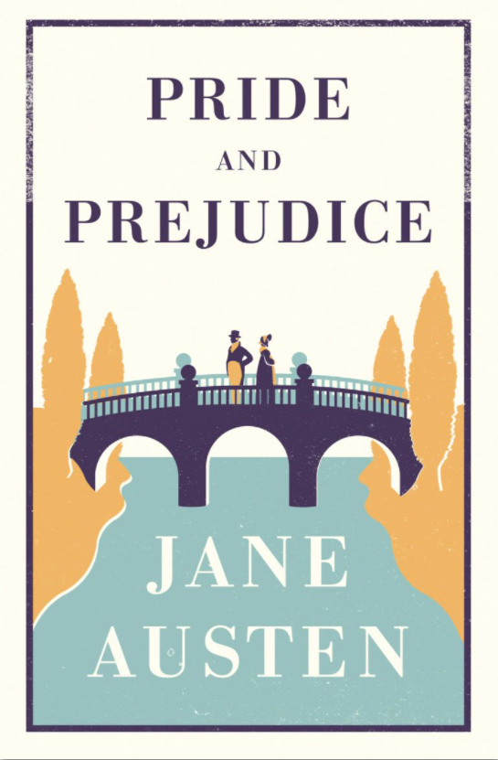

<!-- more -->

#### 3.13

看《傲慢与偏见》，大致人物
本内特Bennet 先生，挺有意思的。第一章宾利先生比较有钱，本内特太太想让女儿认识下，想让本内特先生拜访下，本内特先生知道她心思但是故意吊她胃口，作者笔下的男性角色也颇有心思。作者说他善于诙谐，又能不露声色，还好突发奇想，简直集敏捷机智于一身了。他太太积二十三年之经验还是没能摸透他的脾气。

本内特太太，算比较富裕的那种中产阶级了，但是感觉如同没有心思的农妇一般，赏心乐事就是会亲访友，正经营生就是把女儿嫁出。感觉年轻时颜值应该挺高，所以本内特先生才会喜欢。

宾利Bingley 先生，高富帅，性格也很好，特别受女生欢迎（包括中年女性例如本内特太太）。和简互相喜欢；简Jane是本内特的大女儿，没啥心机，温柔，谨口慎言，得体，和宾利先生很般配。

达西Darcy，高富帅，似乎比宾利先生更富有，性格比较直男且孤傲（傲慢），和伊丽莎白开始相互讨厌，但内心喜欢伊丽莎白；伊丽莎白Elizabeth 是本内特的二女儿，性格比较活泼，直白也挺敏感，能觉察出周围人的傲慢和偏见。开始比较diss达西，因为他孤傲的性格。

本内特家公有五个女儿，除了上述两个还有Mary玛丽, Kitty, Lydia , 这三位比较小，玛丽颜值似乎一般所以努力学习型的但内心也是想被关注，后面俩属于那种还没成熟，爱慕炫耀正常。宾利先生还有俩姐妹，因为家庭优渥都比较傲慢，表现得热情但背后讥讽，一个已结婚，另一个不断舔达西但后者无动于衷。但是我觉得这俩人是没有啥感情的，生活和演戏一样。

到第十章大体是两个家庭人在舞会认识相见，简去宾利家路上淋雨生病于是住在了宾利家，伊丽莎白照顾姐姐也住在了那，宾利、达西还有搞笑二姐妹也在发生的故事。总体上女性形象有点脸谱化似乎不太真实，但是男性形象挺不错的，作者对人物的对话，心理描写也比较细腻。

#### 3.18

从简病好回家开始，到柯林斯先生向伊丽莎白求婚为止。

最好笑的莫过于柯林斯了，在第13章出场，是本内特先生的的侄子。因为本内特家有五个女儿无法继承家业（当时情况如此，只有男的有继承权），所以按照顺序是这个侄子顺位继承。
这本书的角色多数具有，表现的合乎礼节，和地位高的人说话很殷勤，乖巧玲珑，但和平级的人会表现的装逼，对下级人则表现的傲慢。柯林斯先生在和本内特先生和本内特太太表现的乖巧奉承，但很令本内特的五个小姐讨厌。摘录一些段落
”第一天晚上，她（简）就成了他选中的目标。然而，第二天早晨他就做出了改变（因为宾利先生是本内特太太心中简的好配偶）。柯林斯先生只好从简换到伊丽莎白。“
”他们一路走去，柯林斯先生这一边是口吐莲花，言之无物，他的几位表妹那边则是彬彬有礼，唯唯诺诺“
当然伊丽莎白对柯林斯先生没啥感觉，一切只是后者一厢情愿。”你提出求婚，我深感荣幸，可是除了拒绝以外，我别无他法“，”如果我刚才说的一切在你眼前都是鼓励，那我真不知道用什么样的一种方式表示拒绝“。
搞笑的柯林斯先生认为表妹对他的拒绝是她性格腼腆忸怩，娇羞柔媚的自然流露。

对于达西的描写还是很神秘，其他主角性格大致确定，对于达西还停留在他人的表述中。例如魏肯（达西家管家的儿子）口中的达西是一个讨好上层，对下层傲慢，虚伪的人，魏肯言明自己受到达西的不公平对待，但真实性存疑。宾利先生和宾利小姐口中的达西已经对魏肯仁至义尽，魏肯先生绝不是个品德高尚的年轻人。

伊丽莎白告诉简后，简无法相信达西先生竟会这样不配宾利先生的器重，然而要怀疑像魏肯先生这样仪表堂堂，和蔼可亲的年轻人说话不老实，又不合乎她的天性。（形象跃然纸上，这就是名著的描写）

对于最年轻的本内特小姐，生活就是姨母、军官（帅哥）、新闻(八卦)。要说区别，女人之间区别很大，大致就是本内特太太和伊丽莎白吧。

#### 3.20

第一卷的最后，柯林斯先生向伊丽莎白求婚被拒后，转而向伊丽莎白的邻居好友夏洛蒂献殷勤。虽然柯林斯先生比较直男，但进展尤其顺利，原因在于夏洛蒂一直推动，鼓舞，即便前者呆头呆脑，没有任何魅力。原因在于夏洛蒂家甚至拿不出一点钱作为嫁妆，且柯林斯先生还算比较有钱（虽然没法和达西，宾利比）。作者书上说，“婚姻一直是她的目标，至于找什么样的男人，则不打看重”。“她如今芳龄已二十有七，从来也不曾美丽动人，所以她也感到十分走运”。柯林斯和夏洛蒂似乎是最现实的一对了。

作为主人公伊丽莎白，作者用了大量心理描写表现她的性格，例如柯林斯和夏洛蒂突然的订婚，“她（伊丽莎白）从来也无法想象，等到付诸实践的时候，这个人居然会为了世俗的利益而牺牲所有美好的事情”。这时候的伊丽莎白偏见还很深，不管是对达西，还是对夏洛蒂。

第二卷开始宾利一家和达西去了伦敦，说好会回来结果没有了音讯。简很伤心，去伦敦寻宾利先生但是无果，只见到了宾利小姐的冷漠而归。伊丽莎白越发讨厌宾利一家和达西，且似乎对魏肯有了好感，但魏肯移情别恋到了金小姐，且似乎只是看重金小姐祖父的遗产。

下一个主要场景是伊丽莎白和威廉爵士（夏洛蒂的父亲）看望柯林斯夫妇，他们又拜访了凯瑟琳夫人，后者是一个富婆形象，作者大量描写了柯林斯和威廉爵士对凯瑟琳夫人的恭维，洋洋得意，以及凯瑟琳夫人高高在上的自命不凡，说话却十分傲慢粗俗

凯瑟琳夫人是达西的姨妈，因此久别以来伊丽莎白又见到了达西，这时候的伊丽莎白对达西的偏见到了极点，因为听说简和宾利的离别，拆散也是达西造成的。她心烦意乱，此时达西突然走到屋子来，对她说“我努力克制，但是不成，你一定得让我告诉你，我是多么的渴慕你，热爱你。”而达西先生克制的原因，主要出自对门第，家庭障碍的担忧。伊丽莎白当然拒绝，同时拿拆散简和宾利，不公平对待魏肯，来嘲讽他。

这段情节是比较无聊的，伊丽莎白和简的心情都在低谷，达西的形象作者迟迟没描述，而别人眼中的达西并不完全是真正的达西。在压抑中只有柯林斯和威廉爵士稍微娱乐一下。但对于伊丽莎白的误解达西用了一封信做了解释，此后剧情直接让人欲罢不能。写小说如此，生活也是，不要开始全盘拖出（比如自己的优势优点），留点悬念，慢慢来

#### 3.22

达西先生用一封信向伊丽莎白解释，至于不顾宾利先生和简的感情硬把他们拆散。在于达西知道宾利动了真情，
但简的表现过于自然完全掩盖了简内心的小确幸，达西不认为简对宾利有真感情所以出此策，另外达西认为伊丽莎白的母亲和妹妹毫无礼节，这让他感到忧虑。至于毁了魏肯先生的前途和幸福，这纯属后者泼脏水，事实是魏肯品格低劣，设置为了达西的财产攻略达西妹妹，费茨威廉上校和达西的邻居可以作证。

细腻的描写了伊丽莎白看到信之后的反应，惊讶，伤心，疲倦，沮丧。她对写信人的感情有时是大起大落，想起他那封信的语调，仍然满腔义愤，可是想到他曾经多么不公平地怪罪他，责骂他，她反而又对自己感到气愤了。达西先生的解释让她恢复了以前对宾利的一切好感，因而更加深感简受到的损失。

达西伟岸的形象自此立下来了，尽管他傲慢过，但是在伊丽莎白的指责下下变得体贴（这是得多爱伊丽莎白啊，还是暗恋我醉了）。之后发生了魏肯和伊丽莎白妹妹莉迪亚私奔的事件，这仅仅因为莉迪亚年轻恋爱脑，以及达西对魏肯承诺给予好处才勉强解决，不然用伊丽莎白父亲的话说就是：“魏肯如果不得到一万磅就娶了莉迪亚那他就成了大傻瓜了。这一切都是达西背后做的，当然之后还是让伊丽莎白知道了（达西进化了666。当然魏肯莉迪亚这一对性格如此，花钱大手大脚也不赚钱，很难得到幸福

伊丽莎白和达西吐露心扉的谈话，伊丽莎白首先说”达西先生，我是非常自私的人，只管自己舒服，就不顾我对你的感情会有多大的伤害。你对我那个不争气的妹妹恩重如山，我对你多么感激。。“，达西说“如果你要感谢我，那你就感谢你自己吧，我不想否认，指使我那样做的，就是希望让你快乐”然后达西吐露自己的真情，表明她在他心里占据了多么重要的位置。

或许珍贵的相爱就是肯为了对方改变吧，傲慢和偏见是普遍的，可是为了对方，伊丽莎白改变了自己的偏见，达西也不再傲慢。此外，宾利和简的感情是颜值，气质，性格相似情况下下一见钟情的契合，柯林斯和夏洛蒂则是基于现实互利的匹配，魏肯和莉迪亚则是爱玩恋爱脑的不理智行为。