### 数据表示

```
Count (Frequency) 频率
• Min, Max, Range
• Quartiles, and Percentiles. 四分位数
• Mean, Median, Mode 平均数 中位数 众数
• Variance, Standard deviation 方差 标准差
```

四分位图

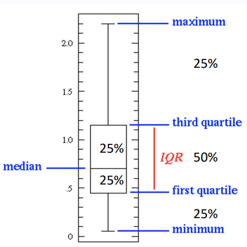

直方图
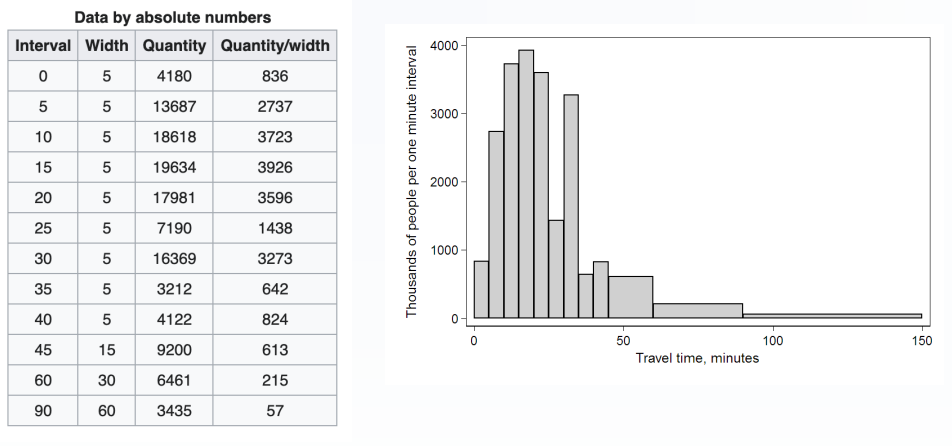

散点图
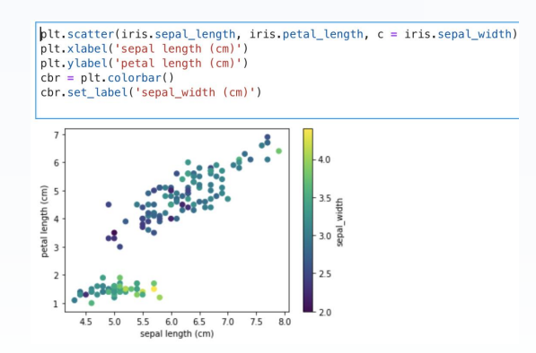

热图
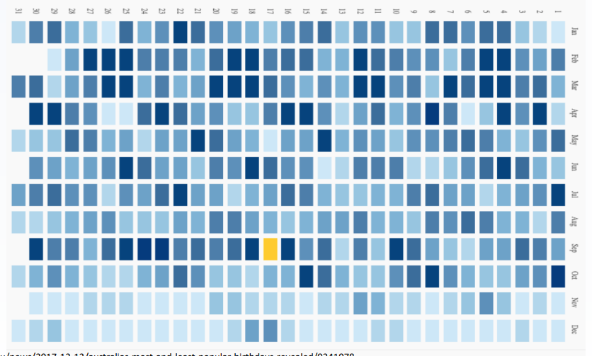

<!-- more -->

#### 数据存储格式

1. CSV  comma separated values 

纯文本形式存储表格数据（数字和文本），文件的每一行都是一个数据记录。每个记录由一个或多个字段组成，用逗号分隔。

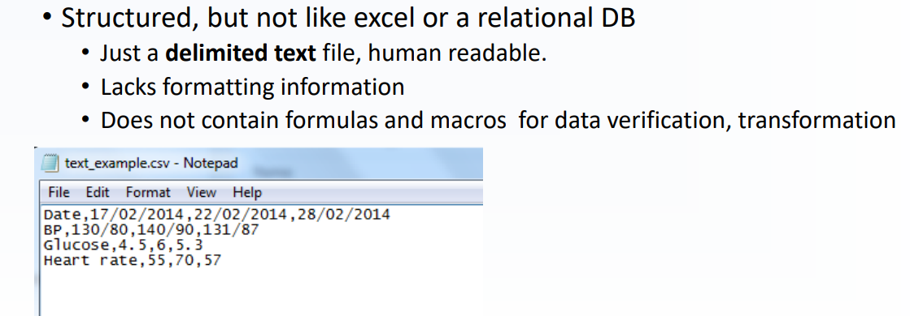


2. HTML – Hypertext Markup language

每个标记mark由tag, attribute, value, content组成。

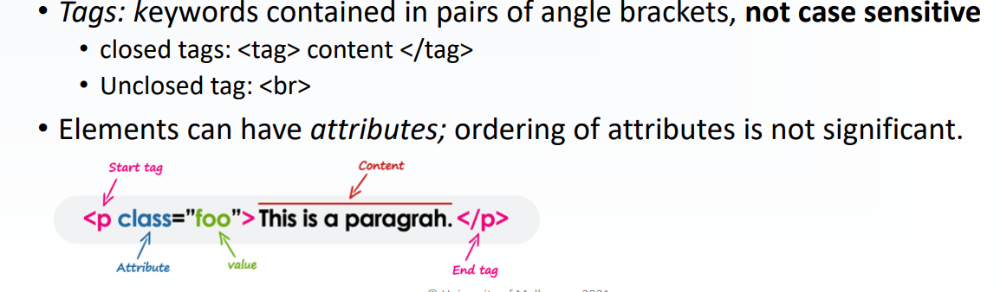

3. XML eXtensible Markup Language 

纯文本，默认使用UTF-8编码; 可嵌套，适合表示结构化数据。

JSON  JavaScript Object Notation 

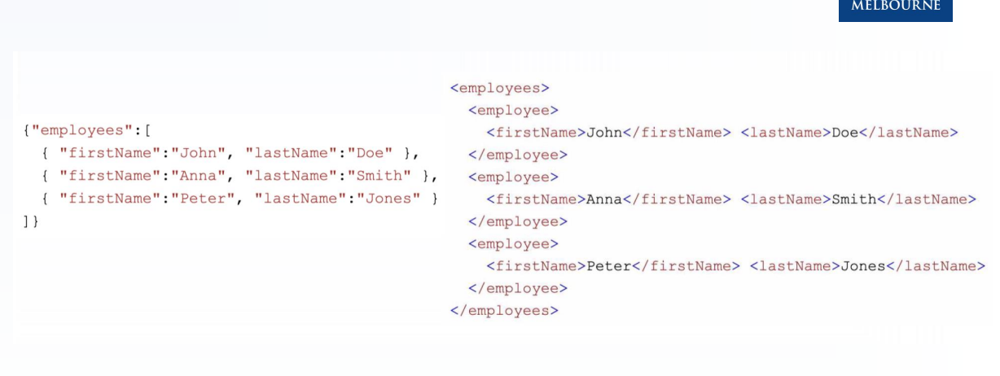


### 文本处理

#### 编辑距离和编辑距离相似性

Levenshtein距离，是编辑距离的一种。 指两个字串之间，由一个转成另一个所需的最少编辑操作次数。 允许的编辑操作包括将一个字符替换成另一个字符，插入一个字符，删除一个字符。

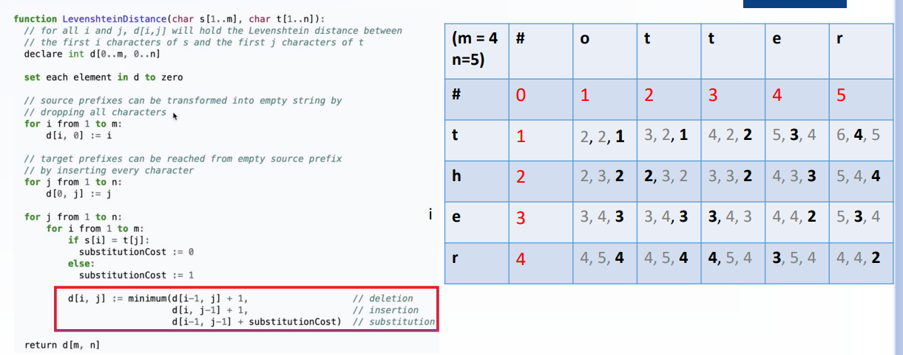

基于编辑距离的相似性。

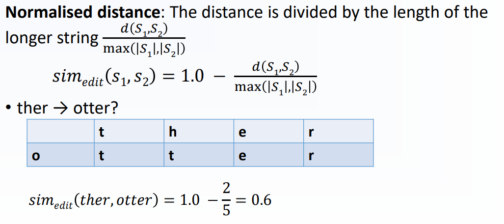

#### N-grams

n-gram意思是长度为n的子串, N-gram distance定义如下

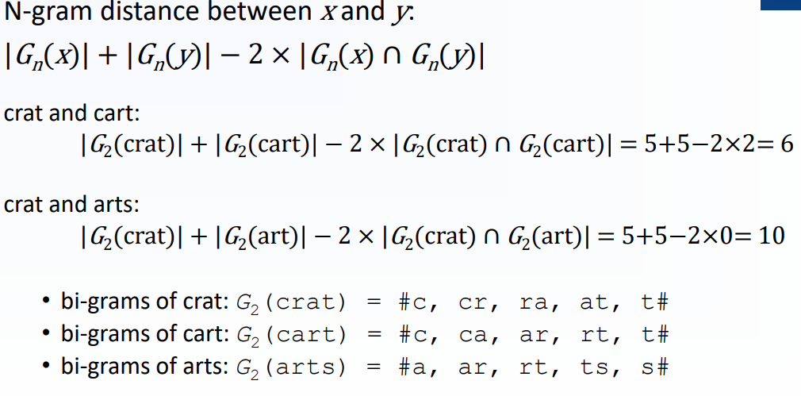

基于集合的Jaccard similarity定义如下

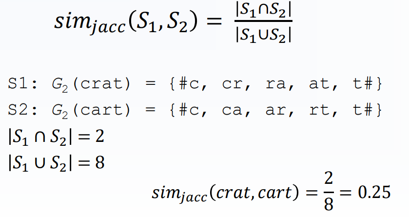

基于向量的Cosine similarity (vector-based)定义如下

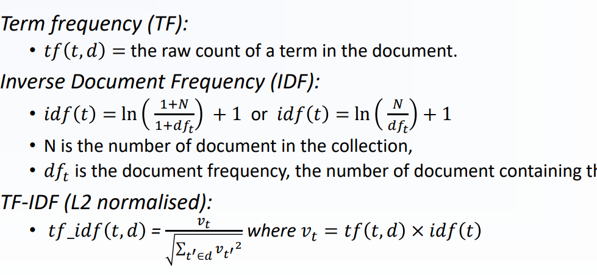

#### 基于正则表达式的匹配

正则表达式(regular expression)描述了一种字符串匹配的模式(pattern)，可以用来检查一个串是否含有某种子串、将匹配的子串替换或者从某个串中取出符合某个条件的子串等。正则表达式是由普通字符(例如字符 a 到 z)以及特殊字符(称为"元字符")组成的文字模式。

普通字符
```
[ABC] 匹配其中的一个字符
[^ABC] 除了 [...] 中字符的一个字符
[A-Z] 表示一个区间
[\s\S] \s 是匹配所有空白符，包括换行，\S 非空白符，不包括换行。
\w 匹配字母、数字、下划线。等价于 [A-Za-z0-9_]
```

特殊字符
```
$匹配输入字符串的结尾位置
^ 匹配输入字符串的开始位置
* 匹配前面的子表达式零次或多次。
+ 匹配前面的子表达式一次或多次。
. 匹配除换行符 \n 之外的任何单字符
? 匹配前面的子表达式零次或一次
{n,m}最少匹配 n 次且最多匹配 m 次
{n} 匹配确定的 n 次
| 指明两项之间的一个选择

( ) 标记一个子表达式的开始和结束位置。子表达式可以获取供以后使用。
```

匹配一个正整数`/[1-9][0-9]*/`, 注意`[1-9]`设置第一个数字不是0，后面的表示无限次

`* `和` +` 限定符都是贪婪的，因为它们会尽可能多的匹配文字，只有在它们的后面加上一个` ?` 就可以实现非贪婪或最小匹配。

#### Text Representation

* Bag-of-words, BOW。 

基于上述文档中出现的单词，构建一个词典。每个单词有唯一的索引, 那么每个文本我们可以使用一个10维的向量来表示。词袋模型不考虑单词的顺序，只考虑每个词在文本中出现的次数。

```
原文
John likes to watch movies. Mary likes too.
John also likes to watch football games.

词典
{"John": 1, "likes": 2,"to": 3, "watch": 4, "movies": 5,"also": 6, "football": 7, "games": 8,"Mary": 9, "too": 10}

词袋表示, 数值为John, likes,...等单词依次在文本中出现的个数。
[1, 2, 1, 1, 1, 0, 0, 0, 1, 1]
[1, 1, 1, 1, 0, 1, 1, 1, 0, 0]
```

* TF-IDF

TF-IDF(term frequency–inverse document frequency), TF-IDF是一种统计方法，用以评估一字词对于一个文件集或一份文件对于所在的一个语料库中的重要程度。

1. 计算词频TF, 每个文档出现的词
2. 计算逆文档频率, N为文档数量, df是包含这个词的文档数目。
3. 对每个词，用TF*IDF
4. 标准化, 每个词的v / (这个文档所有词的v平方和的根)


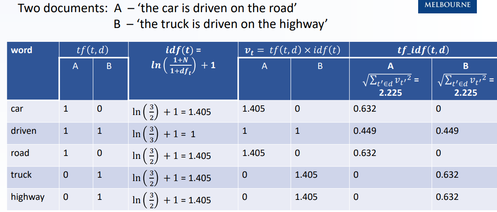

TF越高说明该文档词出现高, IDF高说明包含这个词的文档数目少。TF-IDF越高说明词越不重要。

基于TF-IDF可以用余弦相似度求两个document的相似性, 也就是`cos([0.632,0.449,0.632,0,0], [0,0.449,0,0.632,0.632])`

#### 缺失值填充

例如Mean, Median, Mode填充


### 相关分析

计算相关性, Euclidean distance; Pearson correlation
;Mutual information (another method to compute correlation)

欧式距离，直接平方和根号求两者与温度的相关性。
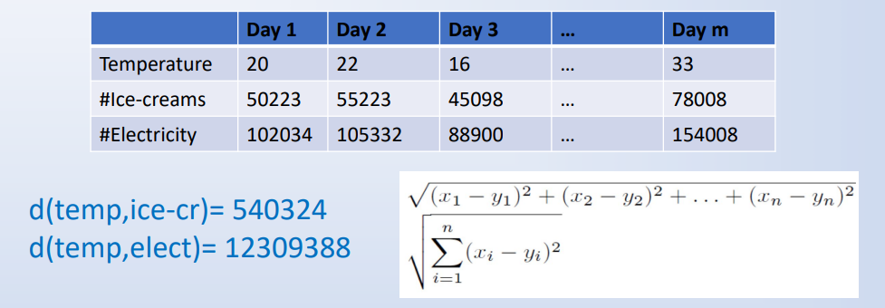

#### Pearson correlation, 衡量线性相关。

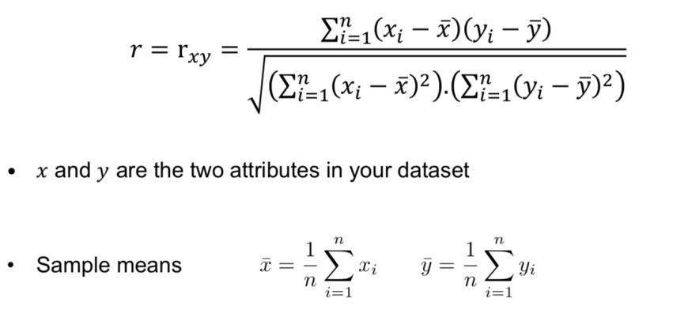

Pearson 相关系数是用协方差除以两个变量的标准差得到的。
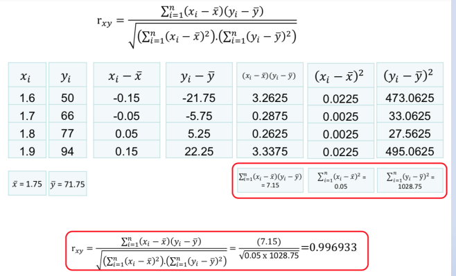


#### 互信息 

某一个属性的熵entropy
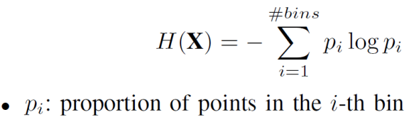

条件熵 condition entropy, 在某一个属性的条件下另一个属性的熵
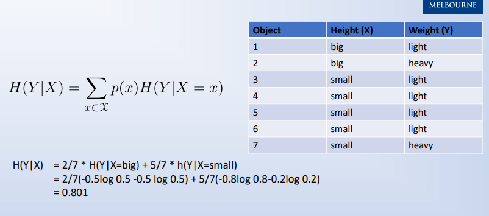


两个属性的互信息, Mutual information

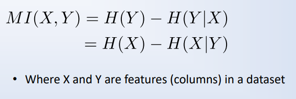
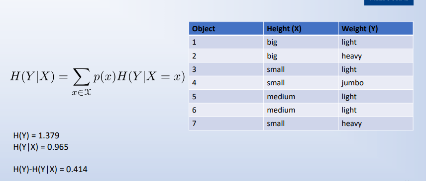

### 分类

#### 决策树分类

对于每个属性分类的信息增益。选择增益最高的属性作为划分属性。

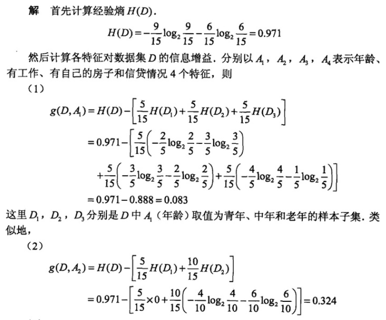

#### KNN分类

基于欧式距离，皮尔逊相关系数等找到离所求点最近的k个点。在特征空间中，如果一个样本附近的k个最近(即特征空间中最邻近)样本的大多数属于某一个类别，则该样本也属于这个类别。

KNN可使用kd tree的数据结构加速。

### 回归

#### 一元线性回归

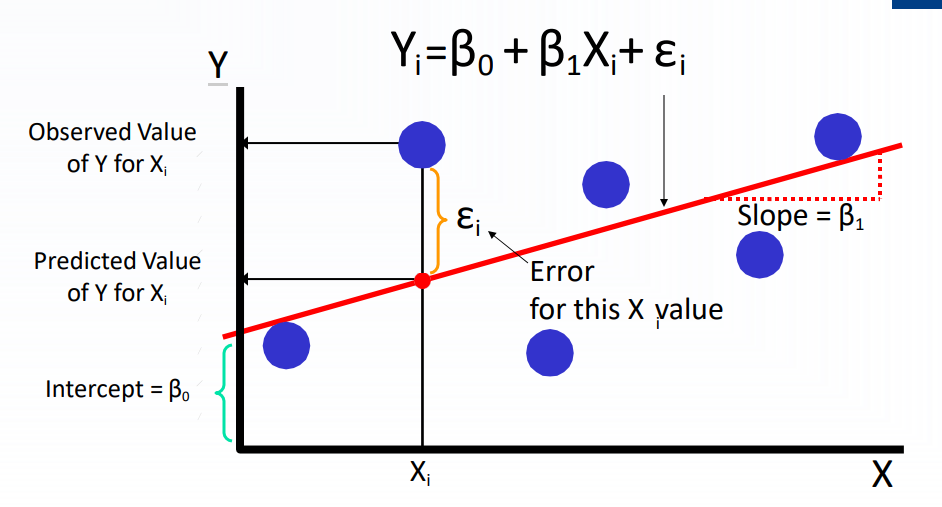

关键是求斜率k值和截距b值。方法是使用最小二乘法。

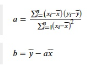


#### 方差分析 Residual Analysis

关于, 观察值, 预测值, 观察值的均值之间的关系。
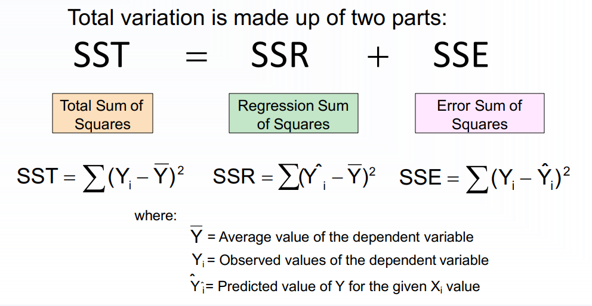

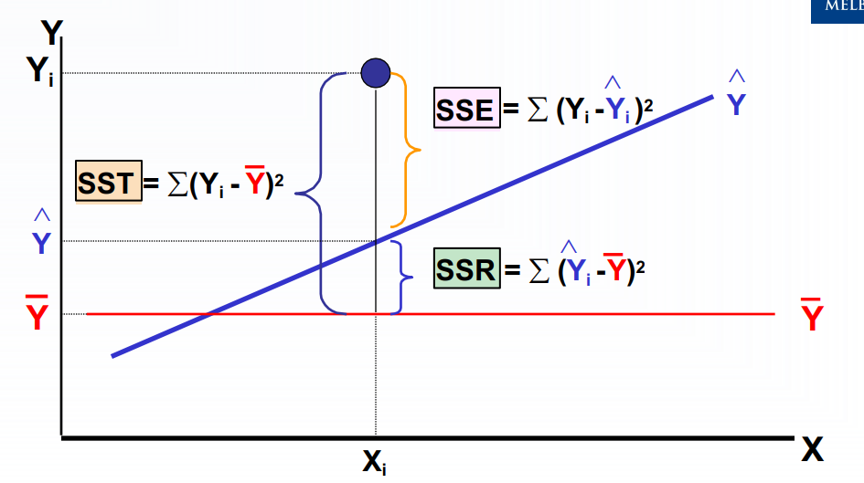

$r^2 = SSR / SST$

R^2越接近于1，则拟合回归效果越好。

### 聚类

聚类方法有, 
1. K-means
2. Visualisation of clustering tendency (VAT)
3. Hierarchical clustering

#### kmeans
对于给定的样本集，按照样本之间的距离大小，将样本集划分为K个簇。让簇内的点尽量紧密的连在一起，而让簇间的距离尽量的大。

1. 选择聚类的个数K, 任意产生k个聚类, 然后确定聚类中心
2. 对每个点归类到k个类别, 用每个簇的均值作为k个类别的新中心点
3. 重复以上步骤直到满足收敛要求(通常确定的中心点不再改变)

#### 


#### Hierarchical Clustering

每次取距离最小的点，然后合并之。
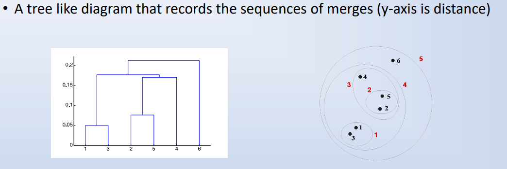

如图, 先合并1,3; 然后2,5; 然后2,5,4;然后1,3,2,5,4; 最后1,3,2,5,4,6


### 模型评估

#### 特征选择

过滤式（filter）、包裹式（wrapper）和嵌入式（embedding）

1. 过滤式方法先对数据集进行特征选择，然后再训练模型，特征选择过程与后续模型训练无关。

2. 包裹式特征选择直接把最终将要使用的模型的性能作为特征子集的评价标准，也就是说，包裹式特征选择的目的就是为给定的模型选择最有利于其性能的特征子集

从最终模型的性能来看，包裹式特征选择比过滤式特征选择更好，但需要多次训练模型，因此计算开销较大

3. 嵌入式特征选择是将特征选择过程与学习器训练过程融为一体，两者在同一个优化过程中完成，即在学习器训练过程中自动地进行了特征选择。

例如采用L1范数正则化，则是LASSO回归(Least Absolute Shrinkage and Selection Operator), 比L2范数更易于得到稀疏解。因此基于L1正则化的学习方法就是一种嵌入式特征选择方法，其特征选择过程与学习器训练过程融为一体，同时完成。


#### 维数约简

特征选择和维数约简二者的目标都是使得特征维数减少。但是方法不一样。维数约简（Dimensionality reduction）。它的思路是：将原始高维特征空间里的点向一个低维空间投影，新的空间维度低于原特征空间，所以维数减少了。在这个过程中，特征发生了根本性的变化，原始的特征消失了(虽然新的特征也保持了原特征的一些性质)。

而特征选择，是从 n 个特征中选择 d 个出来，而其它的 n-d 个特征舍弃。所以，新的特征只是原来特征的一个子集。没有被舍弃的 d 个特征没有发生任何变化。这是二者的主要区别。

主成分分析

#### 模型评估

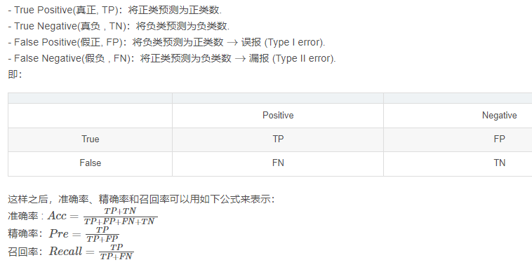\

精确率, 预测正类中, 预测正确的比例

召回率, 实际的正类中, 预测正确的比例