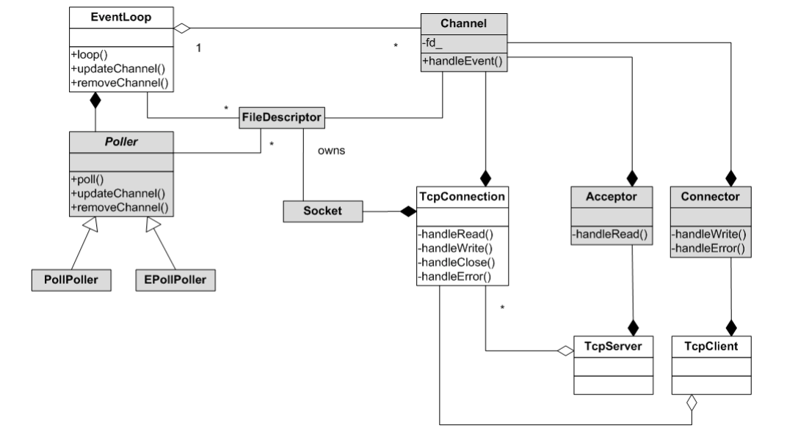

之前在`muduo`系列中剖析了`muduo`网络库的实现过程。网络的层次介于socket和应用层之间。而常用的框架直接封装到了业务逻辑, 例如java servelet, 在处理请求时可以直接写业务逻辑。


 

 muduo网络库封装socket层到tcpserver层, 其实增加了多线程eventloop和IO多路复用, 以及定时器, 日志, 缓冲区读写功能。

 * wsl2内部ubuntu和windows的端口映射设置

 ```
 1. 获取虚拟机ip
 wsl -- ifconfig eth0
 2. 端口映射
# netsh interface portproxy add v4tov4 listenport=[win10端口] listenaddress=0.0.0.0 connectport=[虚拟机的端口] connectaddress=[虚拟机的ip]
netsh interface portproxy add v4tov4 listenport=80 listenaddress=0.0.0.0 connectport=80 connectaddress=172.29.41.233

3. 检查是否成功
netsh interface portproxy show all
```

<!-- more -->

```cpp
public class HelloWorld extends HttpServlet {
 
  private String message;

  public void init() throws ServletException
  {
      // 执行必需的初始化
      message = "Hello World";
  }
  public void doGet(HttpServletRequest request,
                    HttpServletResponse response)
            throws ServletException, IOException
  {
      // 设置响应内容类型
      response.setContentType("text/html");

      // 实际的逻辑是在这里
      PrintWriter out = response.getWriter();
      out.println("<h1>" + message + "</h1>");
  }
  public void destroy()
  {
      // 什么也不做
  }
}
/// url映射
<web-app>      
    <servlet>
        <servlet-name>HelloWorld</servlet-name>
        <servlet-class>HelloWorld</servlet-class>
    </servlet>

    <servlet-mapping>
        <servlet-name>HelloWorld</servlet-name>
        <url-pattern>/HelloWorld</url-pattern>
    </servlet-mapping>
</web-app>  
```

这样的框架直接将http层到socket层全部封装，用户只需要写业务逻辑，不用管其他发送消息等操作。这种效果在`muduo`的tcpserver上层封装一个http层即可实现。

如果tcpconnection回调tcpserver的函数实现, 可以建立一个httpserver用tcpserver回调httpserver的实现, 这一切都是底层回调上层的基本实现。

#### httpserver

* httpServer中调用了httpRequest和httpResponse两个类, 基本思路时从tcpserver中获取封装来到的信息成httpRequest类, 用户逻辑处理httpRequest为httpResponse, 最后将httpResponse的内容封装发送到客户端。

* 整个框架类似, 取出inputBuffer中的字符串->封装成httpRequest对象->处理httpRequest对象，得到httpResponse(用户执行逻辑), 并添加响应状态码->response序列化到outputBuffer->发送到客户端。

```cpp
#include "muduo/net/TcpServer.h"

namespace muduo
{
namespace net
{
/// 具有HttpRequest类和HttpResponse类, 如同servelet的HttpServletRequest和HttpServletResponse
class HttpRequest;
class HttpResponse;

class HttpServer : noncopyable
{
 public:
 /// 回调函数, 用户设置
  typedef std::function<void (const HttpRequest&,
                              HttpResponse*)> HttpCallback;
  /// 具有eventloop, 监听地址
  HttpServer(EventLoop* loop,
             const InetAddress& listenAddr,
             const string& name,
             TcpServer::Option option = TcpServer::kNoReusePort);

  /// 获取tcpserver的loop
  EventLoop* getLoop() const { return server_.getLoop(); }

  void setHttpCallback(const HttpCallback& cb)
  {
    httpCallback_ = cb;
  }

  void setThreadNum(int numThreads)
  {
    server_.setThreadNum(numThreads);
  }
  /// 实际上调用tcpserver的start方法
  void start();

 private:
 /// 维护回调函数
  void onConnection(const TcpConnectionPtr& conn);
  void onMessage(const TcpConnectionPtr& conn,
                 Buffer* buf,
                 Timestamp receiveTime);
  void onRequest(const TcpConnectionPtr&, const HttpRequest&);

  TcpServer server_;
  HttpCallback httpCallback_;
};

}  // namespace net
}  // namespace muduo

/// server.cpp
/// 默认回调函数
void defaultHttpCallback(const HttpRequest&, HttpResponse* resp)
{
  resp->setStatusCode(HttpResponse::k404NotFound);
  resp->setStatusMessage("Not Found");
  resp->setCloseConnection(true);
}

/// 构造函数
/// 设置用户定义的回调函数
/// 绑定到tcpserver中
HttpServer::HttpServer(EventLoop* loop,
                       const InetAddress& listenAddr,
                       const string& name,
                       TcpServer::Option option)
  : server_(loop, listenAddr, name, option),
    httpCallback_(detail::defaultHttpCallback)
{
  server_.setConnectionCallback(
      std::bind(&HttpServer::onConnection, this, _1));

  /// messageCallback绑定到tcpserver中, 会调用httpCallback
  /// 需要三个参数
  server_.setMessageCallback(
      std::bind(&HttpServer::onMessage, this, _1, _2, _3));
}

/// httpserver::start, 转调用tcpserver的start
void HttpServer::start()
{
  LOG_WARN << "HttpServer[" << server_.name()
    << "] starts listening on " << server_.ipPort();
  server_.start();
}

/// 有连接. 调用连接
void HttpServer::onConnection(const TcpConnectionPtr& conn)
{
  if (conn->connected())
  {
    conn->setContext(HttpContext());
  }
}

//// 封装到messageCallback绑定到tcpserver
void HttpServer::onMessage(const TcpConnectionPtr& conn,
                           Buffer* buf,
                           Timestamp receiveTime)
{
  /// httpcontext
  HttpContext* context = boost::any_cast<HttpContext>(conn->getMutableContext());

  /// 解析请求, 得到context->request()
  if (!context->parseRequest(buf, receiveTime))
  {
    conn->send("HTTP/1.1 400 Bad Request\r\n\r\n");
    conn->shutdown();
  }

  if (context->gotAll())
  {
    /// 执行处理请求req, 并封装到resp中
    onRequest(conn, context->request());
    context->reset();
  }
}

/// 处理请求,整理到响应中, 封装TcpConnectionPtr& conn用于发送响应
void HttpServer::onRequest(const TcpConnectionPtr& conn, const HttpRequest& req)
{
  const string& connection = req.getHeader("Connection");
  bool close = connection == "close" ||
    (req.getVersion() == HttpRequest::kHttp10 && connection != "Keep-Alive");
  /// 响应
  HttpResponse response(close);

  /// 执行
  httpCallback_(req, &response);
  /// 当前的response
    /*response 格式
  {<muduo::copyable> = {<No data fields>}, headers_ = std::map with 2 elements = {["Content-Type"] = "text/html",
    ["Server"] = "Muduo"}, statusCode_ = muduo::net::HttpResponse::k200Ok, statusMessage_ = "OK",
  closeConnection_ = false,
  body_ = "<html><head><title>This is title</title></head><body><h1>Hello</h1>Now is 20210913 08:12:43.152553</body></html>"}
  */

  /// 处理响应, 结果放入到Buffer中
  Buffer buf;
  response.appendToBuffer(&buf);
  /// 将buf数据发送到客户端
  conn->send(&buf);
  if (response.closeConnection())
  {
    conn->shutdown();
  }
}
```

#### httpRequest和httpContext

* httpServer中调用了httpRequest和httpResponse两个类, 
* httpRequest是一个头文件, 封装了请求的一些参数。HttpContext用于从inputbuffer中解析参数, 并设置httpRequest的属性


```cpp


class HttpRequest : public muduo::copyable
{
 public:
  enum Method
  {
    kInvalid, kGet, kPost, kHead, kPut, kDelete
  };
  enum Version
  {
    kUnknown, kHttp10, kHttp11
  };

  HttpRequest()
    : method_(kInvalid),
      version_(kUnknown)
  {
  }

  void setVersion(Version v)
  {
    version_ = v;
  }
  Version getVersion() const
  { return version_; }

  //// 请求方法
  bool setMethod(const char* start, const char* end)
  {
    assert(method_ == kInvalid);
    string m(start, end);
    if (m == "GET")
    {
      method_ = kGet;
    }
    else if (m == "POST")
    {
      method_ = kPost;
    }
    else if (m == "HEAD")
    {
      method_ = kHead;
    }
    else if (m == "PUT")
    {
      method_ = kPut;
    }
    else if (m == "DELETE")
    {
      method_ = kDelete;
    }
    else
    {
      method_ = kInvalid;
    }
    return method_ != kInvalid;
  }
  Method method() const
  { return method_; }
  const char* methodString() const
  {
    const char* result = "UNKNOWN";
    switch(method_)
    {
      case kGet:
        result = "GET";
        break;
      case kPost:
        result = "POST";
        break;
      case kHead:
        result = "HEAD";
        break;
      case kPut:
        result = "PUT";
        break;
      case kDelete:
        result = "DELETE";
        break;
      default:
        break;
    }
    return result;
  }

  void setPath(const char* start, const char* end)
  {
    path_.assign(start, end);
  }

  const string& path() const
  { return path_; }

  void setQuery(const char* start, const char* end)
  {
    query_.assign(start, end);
  }
  const string& query() const
  { return query_; }

  void setReceiveTime(Timestamp t)
  { receiveTime_ = t; }

  Timestamp receiveTime() const
  { return receiveTime_; }
/// 从string add到request中
  void addHeader(const char* start, const char* colon, const char* end)
  {
    string field(start, colon);
    ++colon;
    while (colon < end && isspace(*colon))
    {
      ++colon;
    }
    string value(colon, end);
    while (!value.empty() && isspace(value[value.size()-1]))
    {
      value.resize(value.size()-1);
    }
    headers_[field] = value;
  }
    /// 得到head，返回string
  string getHeader(const string& field) const
  {
    string result;
    std::map<string, string>::const_iterator it = headers_.find(field);
    if (it != headers_.end())
    {
      result = it->second;
    }
    return result;
  }

  const std::map<string, string>& headers() const
  { return headers_; }

  void swap(HttpRequest& that)
  {
    std::swap(method_, that.method_);
    std::swap(version_, that.version_);
    path_.swap(that.path_);
    query_.swap(that.query_);
    receiveTime_.swap(that.receiveTime_);
    headers_.swap(that.headers_);
  }
 private:
  Method method_;
  Version version_;
  string path_;
  string query_;
  Timestamp receiveTime_;
  std::map<string, string> headers_;
};

//// httpContext.cc
#include "muduo/net/Buffer.h"
#include "muduo/net/http/HttpContext.h"

using namespace muduo;
using namespace muduo::net;

/// 从buf解析请求
bool HttpContext::processRequestLine(const char* begin, const char* end)
{
  bool succeed = false;
  const char* start = begin;
  const char* space = std::find(start, end, ' ');
  /// 可以解析出Method
  if (space != end && request_.setMethod(start, space))
  {
    start = space+1;
    space = std::find(start, end, ' ');
    if (space != end)
    {
      const char* question = std::find(start, space, '?');
      if (question != space)
      {
        request_.setPath(start, question);
        request_.setQuery(question, space);
      }
      else
      {
        request_.setPath(start, space);
      }
      start = space+1;
      succeed = end-start == 8 && std::equal(start, end-1, "HTTP/1.");
      if (succeed)
      {
        if (*(end-1) == '1')
        {
          request_.setVersion(HttpRequest::kHttp11);
        }
        else if (*(end-1) == '0')
        {
          request_.setVersion(HttpRequest::kHttp10);
        }
        else
        {
          succeed = false;
        }
      }
    }
  }
  return succeed;
}

// return false if any error
bool HttpContext::parseRequest(Buffer* buf, Timestamp receiveTime)
{
  bool ok = true;
  bool hasMore = true;
  /// 一行一行解析
  /// state_ = muduo::net::HttpContext::kExpectRequestLine
  while (hasMore)
  {

    if (state_ == kExpectRequestLine)
    {
      /// 找CR LR \r或\n, 得到结束指针
      const char* crlf = buf->findCRLF();
      if (crlf)
      {
        /// 从buf中找到crlf
        // buf中存储的字符如"GET / HTTP/1.1\r\nHost: 127.0.0.1:8000\r\nUser-Agent: curl/7.61.0\r\nAccept: 
        /// 可以解析出method, httpversion
        ok = processRequestLine(buf->peek(), crlf);
        if (ok)
        {
          request_.setReceiveTime(receiveTime);
          /// 读后更新buffer索引
          buf->retrieveUntil(crlf + 2);
          /// kExpectHeaders
          state_ = kExpectHeaders;
        }
        else
        {
          hasMore = false;
        }
      }
      else
      {
        hasMore = false;
      }
    }
    else if (state_ == kExpectHeaders)
    {
      const char* crlf = buf->findCRLF();
      if (crlf)
      {
        const char* colon = std::find(buf->peek(), crlf, ':');
        if (colon != crlf)
        {
          request_.addHeader(buf->peek(), colon, crlf);
        }
        else
        {
          /// 空行
          // empty line, end of header
          // FIXME:
          /// 已经gotall
          state_ = kGotAll;
          hasMore = false;
        }
        buf->retrieveUntil(crlf + 2);
      }
      else
      {
        hasMore = false;
      }
    }

    else if (state_ == kExpectBody)
    {
      // FIXME:
    }
  }
  return ok;
}
````

#### httpResponse

```cpp
namespace muduo
{
namespace net
{

class Buffer;
class HttpResponse : public muduo::copyable
{
 public:
 /// http状态码
  enum HttpStatusCode
  {
    kUnknown,
    k200Ok = 200,
    k301MovedPermanently = 301,
    k400BadRequest = 400,
    k404NotFound = 404,
  };

  explicit HttpResponse(bool close)
    : statusCode_(kUnknown),
      closeConnection_(close)
  {
  }
    /// 状态码
  void setStatusCode(HttpStatusCode code)
  { statusCode_ = code; }

  void setStatusMessage(const string& message)
  { statusMessage_ = message; }

  void setCloseConnection(bool on)
  { closeConnection_ = on; }

  bool closeConnection() const
  { return closeConnection_; }

  //// contentType
  void setContentType(const string& contentType)
  { addHeader("Content-Type", contentType); }
  /// header
  // FIXME: replace string with StringPiece
  void addHeader(const string& key, const string& value)
  { headers_[key] = value; }
  /// body
  void setBody(const string& body)
  { body_ = body; }
    /// 将response的内容序列化到output中, 进而发送到客户端
  void appendToBuffer(Buffer* output) const;

 private:
  std::map<string, string> headers_;
  HttpStatusCode statusCode_;
  // FIXME: add http version
  string statusMessage_;
  bool closeConnection_;
  string body_;
};
```