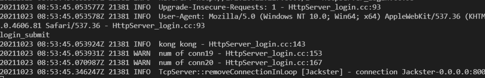

> muduo日志系统主要由三个文件组成, `LogStream`表示日志流对象; `Logging`提供日志的接口, 也就是使用的`LOG_INFO`等;`LogFile`提供日志的持久化。`LogFile`内部是`FileUtil`对象, 该对象实现了文件读和顺序写功能。

从这章中可以学习到
1. stream类的一般实现和处理
2. 文件类读写的实现
3. 字符串格式化的一般过程
4. 缓冲区buffer的一般实现
5. 日志功能的实现

### LogStream

`LogStream`在使用上需要类似于输入输出流iostream, 重载`operator<<`操作符将数据对象输入日志流。

* `LogStream`核心有两个, 其一维护一个缓冲区, 用户存储字节。其二实现各种类型的`operator<<`, 从而可以把不同类型的数据输入到缓冲区中。

`LogStream`内部的定长缓冲区, 位于namespace muduo::detail中
```cpp
// 日志定长缓冲区, 维护一个连续内存data_, 当前的地址cur_, 增加数据直接再cur_之后添加
// 操作cur_指针的函数, add(len), reset(), 清空data_函数bzero
// cookie是一个函数指针,
template <int SIZE>
class FixedBuffer : noncopyable
{
 public:
  FixedBuffer() : cur_(data_){
  }
  ~FixedBuffer() {
  }

  void append(const char* buf, size_t len) {
    if (implicit_cast<size_t>(avail()) > len){  // implicit_cast作用相当于static_cast
      memcpy(cur_, buf, len); /// 以字节为单位存储
      cur_ += len;
    } /// 空间足够
  }

  const char* data() const {
    return data_;
  }
  /// 使用的长度
  int length() const {
    return static_cast<int>(cur_ - data_);
  }

  char* current() {
    return cur_;
  }
  /// 还可以用的长度
  int avail() const {
    return static_cast<int>(end() - cur_);
  }

  void add(size_t len) {
    cur_ += len;
  }

  /// 重置
  void reset() {
    cur_ = data_;
  }
  void bzero() {
    memZero(data_, sizeof data_);
  }

  const char* debugString();

  string toString() const {
    return string(data_, length());
  }

  StringPiece toStringPiece() const {
    return StringPiece(data_, length());
  }

 private:
  const char* end() const {
    return data_ + sizeof(data_);
  }
  char data_[SIZE];
  char* cur_; 
};
```

外部的LogStream对象，位于namespace muduo之中。其维护一个FixedBuffer对象, 对LogStream的append等操作转为对FixedBuffer的操作。此外实现了不同数据类型的`operator<<`
```cpp
/// 日志流
class LogStream : noncopyable
{
  typedef LogStream self;
 public:
  // 创建kSmallBuffer的内存
  typedef detail::FixedBuffer<detail::kSmallBuffer> Buffer;

  /// LogStram对象重载operator<< 操作符
  LogStream& operator<<(bool v) {
    buffer_.append(v ? "1" : "0", 1);
    return *this;
  }
  /// 重载不同的类型
  LogStream& operator<<(short);
  LogStream& operator<<(unsigned short);
  LogStream& operator<<(int);
  LogStream& operator<<(unsigned int);
  LogStream& operator<<(long);
  LogStream& operator<<(unsigned long);
  LogStream& operator<<(long long);
  LogStream& operator<<(unsigned long long);

  LogStream& operator<<(const void*);

  LogStream& operator<<(float v) {
    *this << static_cast<double>(v);  /// 调用operator<<(double)处理
    return *this;
  }

  LogStream& operator<<(double);
  LogStream& operator<<(char v) {
    buffer_.append(&v, 1);  /// 直接将char加入buffer_
    return *this;
  }
  

  LogStream& operator<<(const char* str) {
    if (str) {
      buffer_.append(str, strlen(str)); ///const char*容易处理, 当成连续的char
    }else{
      buffer_.append("(null)", 6);  /// 加入(null)
    }

    return *this;
  }

  LogStream& operator<<(const unsigned char* str) {
    return operator<<(reinterpret_cast<const char*>(str));  /// reinterpret_cast用于指针的重新的解释, 反正指针都是4个字节
  }

  LogStream& operator<<(const string& v) {  /// string改成const char*处理
    buffer_.append(v.c_str(), v.size());
    return *this;
  }

  self& operator<<(const StringPiece& v)
  {
    buffer_.append(v.data(), v.size());
    return *this;
  }

  self& operator<<(const Buffer& v)
  {
    *this << v.toStringPiece();
    return *this;
  }

  void append(const char* data, int len) {  ///流的append调用底层缓冲区的append
    buffer_.append(data, len);
  }
  /// 返回的引用一定是const&, 防止用户修改错误
  const Buffer& buffer() const {
    return buffer_;
  }
  void resetBuffer() {
    buffer_.reset();
  }

 private:
 /// 静态检测
  void staticCheck();

  template<typename T>
  void formatInteger(T);  /// 格式化

  /// 日志流对应的缓冲区, 来自FixBuffer
  Buffer buffer_; 
  ///static const, 可用类名调用的常量
  static const int kMaxNumericSize = 32;
};
```

#### 格式化方式

不同类型的数据需要通过格式化转型为字符序列, 对于bool这些简单的类型直接`true`->`1`, `false`->`0`就可以用一个字节表示, 但对于int, double等复杂类型需要有不同的转型的方式。

格式化方式卸载了`LogStream.cc`文件中, 通过一个模板实现。位于命名空间`muduo::detail`中。

```cpp
namespace detail
{

/// 9-0-9, size=20(还有一个\0)
const char digits[] = "9876543210123456789";
const char* zero = digits + 9;
static_assert(sizeof(digits) == 20, "wrong number of digits");

const char digitsHex[] = "0123456789ABCDEF";
static_assert(sizeof digitsHex == 17, "wrong number of digitsHex");

// Efficient Integer to String Conversions, by Matthew Wilson.
/// 将T类型value, 转为char buf[]的字符串
template<typename T>
size_t convert(char buf[], T value)
{
  T i = value;
  char* p = buf;

  do
  {
    int lsd = static_cast<int>(i % 10); /// 最后一位数字
    i /= 10;
    *p++ = zero[lsd];   // *p = zero[lsd]; p++;
  } while (i != 0);

  if (value < 0)
  {
    *p++ = '-'; // 负号标识
  }
  *p = '\0';

  /// 反转
  std::reverse(buf, p);

  return p - buf; // size
}

/// 10进制整数value转为16进制字符串char buf[]
size_t convertHex(char buf[], uintptr_t value)
{
  uintptr_t i = value;
  char* p = buf;

  do
  {
    int lsd = static_cast<int>(i % 16);
    i /= 16;
    *p++ = digitsHex[lsd];
  } while (i != 0);

  *p = '\0';
  std::reverse(buf, p);

  return p - buf;
}

template class FixedBuffer<kSmallBuffer>;
template class FixedBuffer<kLargeBuffer>;

}  // namespace detail
```

整型的格式化基本是通过上述的`convert`函数实现的

```cpp
/// 将泛型T v存储到buffer_中。
template<typename T>
void LogStream::formatInteger(T v)
{
  if (buffer_.avail() >= kMaxNumericSize)
  {
    // convert, 将v存储到buffer_.current()内存起始处
    size_t len = convert(buffer_.current(), v);

    /// len区域已经输出, 指针右移
    buffer_.add(len);
  }
}

/// 重载short v, 可以使用LogStream << 输入到流中
LogStream& LogStream::operator<<(short v)
{
  *this << static_cast<int>(v);
  return *this;
}

LogStream& LogStream::operator<<(unsigned short v)
{
  *this << static_cast<unsigned int>(v);
  return *this;
}

/// int类型的operator<<到流中, 基于convert泛型实现。
LogStream& LogStream::operator<<(int v)
{
  formatInteger(v); 
  return *this;
}
```

指针类型通过`convertHex`实现的, 表示成16进制。

```cpp
/// 指针类型就是地址, 用16进制的字符串存储
LogStream& LogStream::operator<<(const void* p) {
  uintptr_t v = reinterpret_cast<uintptr_t>(p); /// 四个字节读取, 范围为0~2^32 unsigned long int
  if (buffer_.avail() >= kMaxNumericSize) { /// 存在可用空间
    char* buf = buffer_.current();
    buf[0] = '0';
    buf[1] = 'x';
    size_t len = convertHex(buf+2, v);
    buffer_.add(len+2);
  }
  return *this;
}
```

double类型直接通过`sprintf`函数格式化成字符串

```cpp
LogStream& LogStream::operator<<(double v)
{
  if (buffer_.avail() >= kMaxNumericSize)
  {
    /// 使用sprintf将double v格式化的存储到buffer中
    int len = snprintf(buffer_.current(), kMaxNumericSize, "%.12g", v);
    /// buffer_
    buffer_.add(len);
  }
  return *this;
}
```

字符串类型等直接字符覆盖, 底层用的是`memcpy`

```cpp
  LogStream& operator<<(const string& v) {  /// string改成const char*处理
    buffer_.append(v.c_str(), v.size());
    return *this;
  }
```

### Logging

Logging维护了几个对象,支撑起了日志的一般形式。分别是时间戳, 日志流, 日志等级, 执行代码的位置, 日志持久化文件名。注意basename_来自`__FILE__`,line_来自`__LINE__`

```cpp
  // Logger内部的Impl是其核心成员
  class Impl {
   public:
    typedef Logger::LogLevel LogLevel;  // 枚举类
    Impl (LogLevel level, int old_errno, const SourceFile& file, int line);
    void formatTime();
    void finish();

    // 时间戳
    Timestamp time_;
    // 日志流
    LogStream stream_;
    // 日志level
    LogLevel level_;
    // 执行代码的位置
    int line_;
    SourceFile basename_;
  };

  Impl impl_;
```

SourceFile这里表示文件名, 或者说字符串, 传入的是__FILE__, 因此要对传入进行处理。实际上维护`const char* data_;`

```cpp
  // compile time calculation of basename of source file
  // 两种构造方法，(1)通过传入数组的引用  (2)通过const char*
  // 存储文件名和长度
  // int &array[] array与[]匹配, 等价于(int&) array[], array是一个数组, 数组元素是引用(int&)
  // int (&array)[], array是一个引用, 引用的对象是数组
  class SourceFile {
   public:
    template<int N>
    /// 传入的是数组调用之 char arr[10]这种
    SourceFile(const char (&arr)[N]) /// arr先和&匹配成引用, 引用的对象是数组。
      : data_(arr), size_(N-1)
    {
      const char* slash = strrchr(data_, '/');  // strrchr参数 str 所指向的字符串中搜索第一次出现字符 c（一个无符号字符）的位置。
      if (slash) {
        data_ = slash + 1;  // '/'之后的第一个字符, 也就是文件名的指针
        size_ -= static_cast<int>(data_ - arr); /// data_指针文件名处
      }
    }
    /// 传入的是指针, 加上explicit保证只能通过SourceFile(p)调用构造函数, 而不会发生隐式转换
    explicit SourceFile(const char* filename) 
      : data_(filename)
    {
      const char* slash = strrchr(filename, '/');
      if (slash) {
        data_ = slash + 1;
        size_ -= static_cast<int> (data_ - filename);
      }
    }

    // data_存储的是文件名
    const char* data_;
    int size_;  
  };
```

日志等级是枚举类型

```cpp
  enum LogLevel {
    TRACE,
    DEBUG,
    INFO,
    WARN,
    ERROR,
    FATAL,
    NUM_LOG_LEVELS,
  };
```

Logging类的其他一些函数

```cpp
  // 声明Logger类的构造函数, 宏定义会调用之
  /// 基于Source file, LogLevel
  Logger(SourceFile file, int line);
  Logger(SourceFile file, int line, LogLevel level);
  Logger(SourceFile file, int line, LogLevel level, const char* func);
  Logger(SourceFile file, int line, bool toAbort);
  ~Logger();

  /// 返回Logger的流对象引用
  LogStream& stream() { return impl_.stream_; }

  static LogLevel logLevel();
  static void setLogLevel(LogLevel level);

  /// 函数指针类型
  typedef void (*OutputFunc)(const char* msg, int len);
  // Flushh函数
  typedef void (*FlushFunc)();

  // 设置函数, 表示设置输出函数,刷新函数等的函数指针
  static void setOutput(OutputFunc);
  static void setFlush(FlushFunc);
  static void setTimeZone(const TimeZone& tz);
  
```

构造函数会转接`impl`

```cpp
/// Logger构造函数, 进而调用impl_
Logger::Logger(SourceFile file, int line)
  : impl_(INFO, 0, file, line)
{
}

Logger::Logger(SourceFile file, int line, LogLevel level, const char* func)
  : impl_(level, 0, file, line)
{
  impl_.stream_ << func << ' '; // func加入到流中
}

Logger::Logger(SourceFile file, int line, LogLevel level)
  : impl_(level, 0, file, line)
{
}
```

利用宏定义将LOG_TRACE, LOG_INFO替换成对应的流对象, 如`LOG_TRACE << "1"`实际是是`muduo::Logger(__FILE__, __LINE__, muduo::Logger::TRACE, __func__).stream() << "1"`

`muduo::Logger::logLevel()`返回的是g_logLevel, 也就是最低日志等级, 如果设置最低等级g_logLevel为muduo::Logger::DEBUG, 则更低的muduo::Logger::TRACE不会输出。

```cpp

extern Logger::LogLevel g_logLevel;

inline Logger::LogLevel Logger::logLevel()
{
  return g_logLevel;
}
// 用__FILE__, __LINE__, muduo::Logger::TRACE, __func__ 构造Logger对象,注意设置好了日志等级 
// 分别表示当前语句的文件，行数，函数名
// .stream()返回日志流, 可以接收<<传入
//g_logLevel是最小日志等级, 如果设为INFO, 则不会输出TRACE。由环境变量getenv决定
#define LOG_TRACE if (muduo::Logger::logLevel() <= muduo::Logger::TRACE) \
  muduo::Logger(__FILE__, __LINE__, muduo::Logger::TRACE, __func__).stream()
#define LOG_DEBUG if (muduo::Logger::logLevel() <= muduo::Logger::DEBUG) \
  muduo::Logger(__FILE__, __LINE__, muduo::Logger::DEBUG, __func__).stream()
#define LOG_INFO if (muduo::Logger::logLevel() <= muduo::Logger::INFO) \
  muduo::Logger(__FILE__, __LINE__).stream()
#define LOG_WARN muduo::Logger(__FILE__, __LINE__, muduo::Logger::WARN).stream()
#define LOG_ERROR muduo::Logger(__FILE__, __LINE__, muduo::Logger::ERROR).stream()
#define LOG_FATAL muduo::Logger(__FILE__, __LINE__, muduo::Logger::FATAL).stream()
#define LOG_SYSERR muduo::Logger(__FILE__, __LINE__, false).stream()
#define LOG_SYSFATAL muduo::Logger(__FILE__, __LINE__, true).stream()
```

#### Logging.cc

以上是`Logging.h`头文件, 简要的概述了Logger的功能和结构, Logging.cc是其具体的实现。

设置日志字符output函数和flush函数, output是将LogStream的msg写入到输出流的缓冲区, flush是将输出流缓冲区刷入到屏幕等硬件中。

```cpp
// 默认输出, 用fwrite将msg刷入stdout
void defaultOutput(const char* msg, int len)
{
  /// 将msg刷新到stdout
  //size_t n = fwrite(msg, 1, len, stdout);
  fwrite(msg, 1, len, stdout);
}

/// fwrite是写入到流的缓冲区, fflush刷新流的缓冲区
void defaultFlush()
{
  /// 刷新到stdout, 缓存输出到终端
  fflush(stdout);
}

/// 设置输出和刷函数
Logger::OutputFunc g_output = defaultOutput;
Logger::FlushFunc g_flush = defaultFlush;

//时间
TimeZone g_logTimeZone;
```

Logger::Impl::Impl的实现, 主要针对时刻time_, 流stream, level_, line_, basename。 同时将时刻, 线程号, level等<<到流中

```cpp
// 设置Logger的level, file
Logger::Impl::Impl(LogLevel level, int savedErrno, const SourceFile& file, int line)
  : time_(Timestamp::now()),
    stream_(),
    level_(level),
    line_(line),
    basename_(file)
{
  formatTime(); /// 时刻<<到stream中
  CurrentThread::tid();
  // 向流注入CurrentThread信息
  stream_ << T(CurrentThread::tidString(), CurrentThread::tidStringLength()); // 线程号<<到stream中
  // 向刘注入level信息
  stream_ << T(LogLevelName[level], 6);  // Level <<到stream
  if (savedErrno != 0)  /// errno=0表示程序没有错误
  {
    stream_ << strerror_tl(savedErrno) << " (errno=" << savedErrno << ") ";
  }
}

// class T起到转换成const char*字符串格式化的作用
class T
{
 public:
  T(const char* str, unsigned len)
    :str_(str),
     len_(len)
  {
    assert(strlen(str) == len_);
  }

  const char* str_;
  const unsigned len_;
};


/// 格式化时间, 将当前的epoch时间microSecondsSinceEpoch, 格式化成年月日时分秒的字符串, 并<<到stream中
void Logger::Impl::formatTime()
{
  // 相关时间的设置
  int64_t microSecondsSinceEpoch = time_.microSecondsSinceEpoch();
  time_t seconds = static_cast<time_t>(microSecondsSinceEpoch / Timestamp::kMicroSecondsPerSecond);
  int microseconds = static_cast<int>(microSecondsSinceEpoch % Timestamp::kMicroSecondsPerSecond);
  if (seconds != t_lastSecond)
  {
    t_lastSecond = seconds;
    struct tm tm_time;
    if (g_logTimeZone.valid())
    {
      tm_time = g_logTimeZone.toLocalTime(seconds);
    }
    else
    {
      ::gmtime_r(&seconds, &tm_time); // FIXME TimeZone::fromUtcTime
    }
  /// 将时间信息按照年月日时分秒 根据"%4d%02d%02d %02d:%02d:%02d"格式化, 输出到t_time中
    snprintf(t_time, sizeof(t_time), "%4d%02d%02d %02d:%02d:%02d",
        tm_time.tm_year + 1900, tm_time.tm_mon + 1, tm_time.tm_mday,
        tm_time.tm_hour, tm_time.tm_min, tm_time.tm_sec);
    //assert(len == 17);
  }

  if (g_logTimeZone.valid())
  {
    Fmt us(".%06d ", microseconds);
    assert(us.length() == 8);
    // t_time时间信息加入到流中
    stream_ << T(t_time, 17) << T(us.data(), 8);
  }
  else
  {
    Fmt us(".%06dZ ", microseconds);
    assert(us.length() == 9);
    stream_ << T(t_time, 17) << T(us.data(), 9);
  }
}
```

Logger析构的时候, ouput到输出流缓冲区, **如果是FATAL**flush输出流缓冲区并终止线程执行。
```cpp
void Logger::Impl::finish()
{
  /// 将- 日志文件名:行数加入到stream的缓冲区中
  stream_ << " - " << basename_ << ':' << line_ << '\n';
}
/// 在Logger析构的时候, flush日志数据
Logger::~Logger()
{
  /// 加入结束信息
  impl_.finish();
  /// 将stream().buffer()拷贝到新的buf中, 先创建对象再根据拷贝构造初始化对象返回对象的引用
  const LogStream::Buffer& buf(stream().buffer());

  /// g_output指向defaultOutput对buf, 即将msg刷新到stdout
  g_output(buf.data(), buf.length());

  /// 如果日志FATAL
  if (impl_.level_ == FATAL)
  {
    /// 全部刷新到g_flush中
    g_flush();
    // 结束当前线程程序执行
    abort();
  }
}

/// 设置日志level
void Logger::setLogLevel(Logger::LogLevel level)
{
  g_logLevel = level;
}

// 设置outFunc函数
void Logger::setOutput(OutputFunc out)
{
  g_output = out;
}
// 设置刷新函数
void Logger::setFlush(FlushFunc flush)
{
  g_flush = flush;
}
// 设置时间工具TimeZone
void Logger::setTimeZone(const TimeZone& tz)
{
  g_logTimeZone = tz;
}
```

`impl_.finish();`向日志流输入`- 文件名: 行数`, 加上构造函数输入的, 总体格式是, `时间 线程号 level 用户自己的输入 - 文件名: 行数`， 如下



### FileUtil

Logger可能要将日志持久化到文件中, 我们需要介绍对于文件的处理。这里支持的文件是顺序写, 只能在文件末尾添加数据。

文件的读取方式一般有两种, 一种是基于fd文件描述符使用`read`,`write`;另一种是C语言提供的文件指针`FILE`结构体。文件指针结构体实际上由文件描述符和缓冲区组成, 从文件描述符中读出的数据会先放在缓冲区中。

注意文件描述符的读写在`#include <fcntl.h>`,`<unistd.h>`中

```cpp
打开或创建一个文件, 返回文件描述符
int open(const char *pathname, int oflag, ... /* mode_t mode */ );

mode选择
O_RDONLY只读打开。
O_WRONLY只写打开。
O_RDWR 读、写打开。
O_APPEND 每次都从文件尾端写。
O_CREAT  若文件不存在，则创建它。

关闭一个打开的文件
int close(int fd)
成功则返回打开的文件描述符，出错则返回-1

lseek函数　为一个打开的文件设置偏移量
off_t lseek(int filedes, off_t offset, int whence)

read函数 从打开的文件读数据
ssize_t read(int filedes, void *buf, size_t nbytes);

write函数 向打开的文件写入数据
ssize_t write(int filedes, const void *buf, size_t nbytes);
```
注意`read`,`write`一次可能读写不完,需要while循环多次读写直到读写完。

`ReadSmallFile` class是根据fd读取数据, 维护一个缓冲区buf_将文件数据读取到缓冲区中。

readToString除了读取文件到string, 还会调用`fstat`获得文件的一些信息这些信息来自Stat结构体。
例如
```
dev_t         st_dev;       //文件的设备编号 
ino_t         st_ino;       //节点 
mode_t        st_mode;      //文件的类型和存取的权限
time_t        st_atime;     //最后一次访问时间 
time_t        st_mtime;     //最后一次修改时间
```

```cpp
class ReadSmallFile : noncopyable
{
 public:
  ReadSmallFile(StringArg filename);
  ~ReadSmallFile();

  // return errno
  /// File内容到String
  template<typename String>
  int readToString(int maxSize,
                   String* content,
                   int64_t* fileSize,
                   int64_t* modifyTime,
                   int64_t* createTime);

  /// Read at maxium kBufferSize into buf_
  /// 读入到缓冲
  // return errno
  int readToBuffer(int* size);

  const char* buffer() const { return buf_; }

  static const int kBufferSize = 64*1024;

 private:
  int fd_;
  int err_;

  // 小文件读取到的缓冲区
  char buf_[kBufferSize];
};


template<typename String>
int FileUtil::ReadSmallFile::readToString(int maxSize,
                                          String* content,
                                          int64_t* fileSize,
                                          int64_t* modifyTime,
                                          int64_t* createTime)
{
  static_assert(sizeof(off_t) == 8, "_FILE_OFFSET_BITS = 64");
  assert(content != NULL);
  int err = err_;
  if (fd_ >= 0)
  {
    content->clear();

    if (fileSize)
    {
      struct stat statbuf;
      /// 获取fd_的stat保存到statbuf中, 0表示成功
      // 同时将相关信息存储到createTime等变量中
      if (::fstat(fd_, &statbuf) == 0)
      {
        if (S_ISREG(statbuf.st_mode))
        {
          *fileSize = statbuf.st_size;

          /// content开辟fileSize或maxSize的空间
          content->reserve(static_cast<int>(std::min(implicit_cast<int64_t>(maxSize), *fileSize)));
        }
        else if (S_ISDIR(statbuf.st_mode))
        {
          err = EISDIR;
        }
        if (modifyTime)
        {
          *modifyTime = statbuf.st_mtime;
        }
        if (createTime)
        {
          *createTime = statbuf.st_ctime;
        }
      }
      else
      {
        err = errno;
      }
    }

    while (content->size() < implicit_cast<size_t>(maxSize))
    {
      // 可读的大小
      size_t toRead = std::min(implicit_cast<size_t>(maxSize) - content->size(), sizeof(buf_));
      /// 先fd_读取文件数据到buf_中
      ssize_t n = ::read(fd_, buf_, toRead);
      /// 再将buf_数据再到content
      if (n > 0)
      {
        content->append(buf_, n);
      }
      else
      {
        if (n < 0)
        {
          err = errno;
        }
        break;
      }
    }
  }
  return err;
}

/// 读取文件到buf
int FileUtil::ReadSmallFile::readToBuffer(int* size)
{
  int err = err_;
  if (fd_ >= 0)
  {
    // 在指定偏移offset位置开始读取count个字节，pread 可以保证线程安全, 因为是基于offset读取(相当于fseek), 多线程下文件指针没有改变
    ssize_t n = ::pread(fd_, buf_, sizeof(buf_)-1, 0);
    /// 读取成功
    if (n >= 0)
    {
      if (size)
      {
        *size = static_cast<int>(n);
      }
      buf_[n] = '\0';
    }
    else
    {
      err = errno;
    }
  }
  return err;
}
```

工具类readFile, 传入文件名, 创建文件读取对象读取文件内容到content中, 返回读取的字节数。同时获取文件状态信息
```cpp
template<typename String>
int readFile(StringArg filename,
             int maxSize,
             String* content,
             int64_t* fileSize = NULL,
             int64_t* modifyTime = NULL,
             int64_t* createTime = NULL)
{
  ReadSmallFile file(filename);
  return file.readToString(maxSize, content, fileSize, modifyTime, createTime);
}
```

#### AppendFile
前面的文件处理主要是读取文件, 对象是smallFile, 基于fd的`read`和缓冲区进行文件读取。AppendFile作用是顺序写, 内部维护一个文件指针`FILE* fp_;`和与之绑定的缓冲区, 要写的数据先调用`write`加入到缓冲区中。之后再调用flush刷入文件中。AppendFile析构时会关闭文件指针。

```cpp
class AppendFile : noncopyable
{
 public:
  explicit AppendFile(StringArg filename);

  ~AppendFile();
  /// 在文件后面写入数据
  void append(const char* logline, size_t len);
  /// flush持久化, 将缓冲区数据写入的文件中
  void flush();

  off_t writtenBytes() const { return writtenBytes_; }

 private:
  /// 向文件中写入字节
  size_t write(const char* logline, size_t len);
  /// 维护的文件指针
  FILE* fp_;

  /// 缓冲区
  char buffer_[64*1024];
  /// 已经写入的字节数
  off_t writtenBytes_;
};

/// 构造需要文件名
FileUtil::AppendFile::AppendFile(StringArg filename)
  : fp_(::fopen(filename.c_str(), "ae")),  // 'e' for O_CLOEXEC
    writtenBytes_(0)
{
  /// 设置文件流的缓冲区, fp与缓冲区关联
  assert(fp_);
  ::setbuffer(fp_, buffer_, sizeof buffer_);
  // posix_fadvise POSIX_FADV_DONTNEED ?
}

/// 关闭文件指针fp
FileUtil::AppendFile::~AppendFile()
{
  ::fclose(fp_);
}

/// 在文件后写入len字节的数据, 实际上是logline的数据写入到fp的缓冲区中
void FileUtil::AppendFile::append(const char* logline, const size_t len)
{
  size_t written = 0;

  while (written != len)
  {
    size_t remain = len - written;
    /// 调用FileUtil write函数将logline的数据写入到fp的缓冲区中
    size_t n = write(logline + written, remain);
    if (n != remain)
    {
      int err = ferror(fp_);
      if (err)
      {
        fprintf(stderr, "AppendFile::append() failed %s\n", strerror_tl(err));
        break;
      }
    }
    written += n;
  }
  /// 已经写入的字节
  writtenBytes_ += written;
}

/// fp_缓冲区数据刷新到持久化磁盘文件中
void FileUtil::AppendFile::flush()
{
  /// 将fp关联的缓冲区内的数据写回fp_指定的文件中
  ::fflush(fp_);
}

// 将logline指的缓冲区写入到fp_文件流的缓冲区
size_t FileUtil::AppendFile::write(const char* logline, size_t len)
{
  // #undef fwrite_unlocked
  /// 无锁写入, 将logline指向内存的len字节写入到fp_指向的文件中
  return ::fwrite_unlocked(logline, 1, len, fp_);
}
```

### LogFile

日志文件是日志可能持久化的对象, 底层是顺序写文件AppendFile。同时注意两个时间, `lastFlush_`最后刷新时间, 距离超出刷新间隔就要刷新到日志中。`lastRoll_`最后滚动时间, 超过就要写新的日志文件(日志文件定期写新文件，不要一个日志文件写到底)

日志文件的实现基于内部的AppendFile, 具体的, 数据先写到内部AppendFile的文件指针缓冲区中, 满足一定要求刷新到持久化

```cpp
namespace FileUtil
{
class AppendFile;       // 前向声明, 文件类AppendFile
}

class LogFile : noncopyable {
 public:
  LogFile(const string& basename, off_t rollFile,
        bool threadSafe = true, int flushInterval = 3,
        int checkEveryN = 1024);

  ~LogFile();

    // 在缓冲区后添加数据, 内部调用append_unlocked
  void append(const char* logline, int len);
  /// flush到文件
  void flush();
  bool rollFile();  // 滚动日志, 就是建新的日志文件写日志

 private:

  void append_unlocked(const char* logline, int len); // 添加logline到日志文件fp缓冲区, 满足要求可flush
  
  static string getLogFileName(const string& basename, time_t* now);  // 日志文件名

  const string basename_; // 文件名
  const off_t rollSize_;  // 日志fp缓冲区数据如果超过rollSize_, 就要用新的文件写日志(roll)
  const int flushInterval_; // flush间隔
  const int checkEveryN_; // 连续写日志的次数, 连续写入次数超过checkEveryN_, 就要检查要滚动日志, flush了

  int count_;

  std::unique_ptr<MutexLock> mutex_;     // MutexLock是自定义的互斥量

  // time_t 长整型, 
  // 时间1970年1月1日00时00分00秒(也称为Linux系统的Epoch时间)到当前时刻的秒数。
  time_t startOfPeriod_;
  time_t lastRoll_;   // 最后Roll_时刻
  time_t lastFlush_;  // 最后Flush_时刻

  std::unique_ptr<FileUtil::AppendFile> file_;  // unique_ptr维护的文件对象

  const static int kRollPerSeconds_ = 60*60*24; // static常量, 写新日志文件的周期
};    
```

LogFile.cc
```cpp
LogFile::LogFile(const string& basename,
                 off_t rollSize,
                 bool threadSafe,
                 int flushInterval,
                 int checkEveryN)
  : basename_(basename),
    rollSize_(rollSize),
    flushInterval_(flushInterval),
    checkEveryN_(checkEveryN),
    count_(0),
    mutex_(threadSafe ? new MutexLock : NULL),
    startOfPeriod_(0),
    lastRoll_(0),
    lastFlush_(0)
{
  assert(basename.find('/') == string::npos);
  rollFile();
}

LogFile::~LogFile() = default;


// 无锁将logline加入到日志缓冲区中
void LogFile::append(const char* logline, int len)
{
  if (mutex_)
  {
    MutexLockGuard lock(*mutex_);
    append_unlocked(logline, len);
  }
  else
  {
    append_unlocked(logline, len);
  }
}

void LogFile::flush()
{
  if (mutex_)
  {
    /// 将缓冲区内的数据写回file_中fp_指定的文件中
    MutexLockGuard lock(*mutex_);
    file_->flush();
  }
  else
  {
    file_->flush();
  }
}

// 无锁将logline加入到日志缓冲区中
void LogFile::append_unlocked(const char* logline, int len)
{
  /// 在会将数据写入file_ 文件指针的缓冲区中
  file_->append(logline, len);
  //// 数据加入缓冲区以后, 缓冲区写的字节大于滚动的大小
  if (file_->writtenBytes() > rollSize_)
  {
    rollFile();
  }
  else
  {
    ++count_;
    if (count_ >= checkEveryN_) // 连续写入次数超过checkEveryN_, 就要检查要滚动日志, flush了
    {
      count_ = 0;
      time_t now = ::time(NULL);
      time_t thisPeriod_ = now / kRollPerSeconds_ * kRollPerSeconds_;
      if (thisPeriod_ != startOfPeriod_)  // 表示距离上次滚动时间超过了kRollPerSeconds_
      {
        rollFile();
      }
      /// 距离上次flush时间超出flushInterval_
      else if (now - lastFlush_ > flushInterval_)
      {
        lastFlush_ = now;
        // 刷入文件中
        file_->flush();
      }
    }
  }
}


/// 日志滚动
bool LogFile::rollFile()
{
  time_t now = 0;
  /// filename
  string filename = getLogFileName(basename_, &now);
  time_t start = now / kRollPerSeconds_ * kRollPerSeconds_;
  // 当前时间>lastRoll_, 需要滚动
  if (now > lastRoll_)
  {
    // 重新设置时间
    lastRoll_ = now;
    lastFlush_ = now;
    startOfPeriod_ = start;
    // 创建新的文件对象, 作为日志文件
    file_.reset(new FileUtil::AppendFile(filename));
    return true;
  }
  return false;
}

/// 生成logfile的名字, log文件命名规则, 文件名+时间+主机名+进程名+.log
string LogFile::getLogFileName(const string& basename, time_t* now)
{
  string filename;
  filename.reserve(basename.size() + 64);
  // 文件名
  filename = basename;

  char timebuf[32];
  struct tm tm;
  *now = time(NULL);
  gmtime_r(now, &tm); // FIXME: localtime_r ?
  strftime(timebuf, sizeof timebuf, ".%Y%m%d-%H%M%S.", &tm);
  filename += timebuf;

  filename += ProcessInfo::hostname();

  char pidbuf[32];
  snprintf(pidbuf, sizeof pidbuf, ".%d", ProcessInfo::pid());
  filename += pidbuf;

  filename += ".log";

  return filename;
}
```