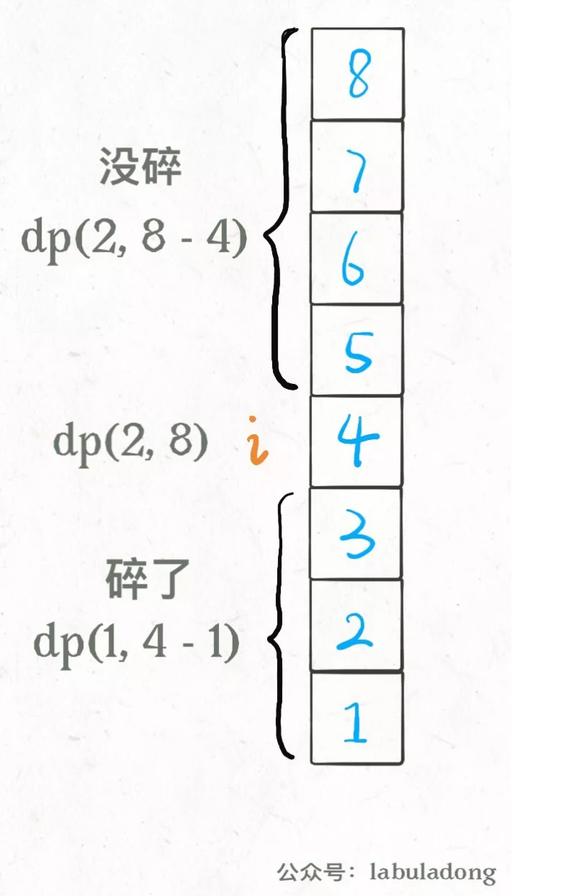
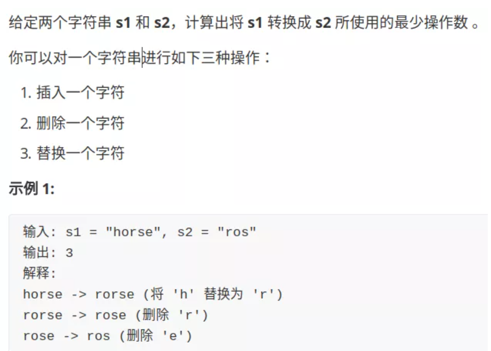
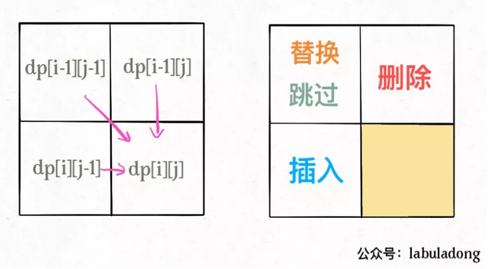
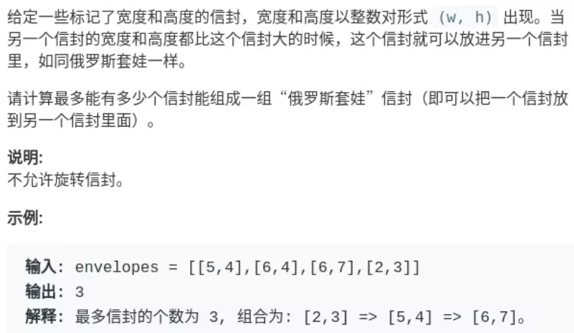
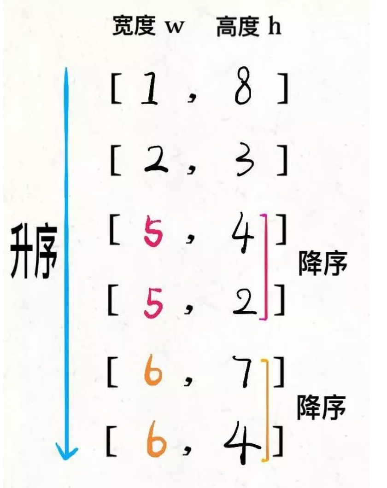
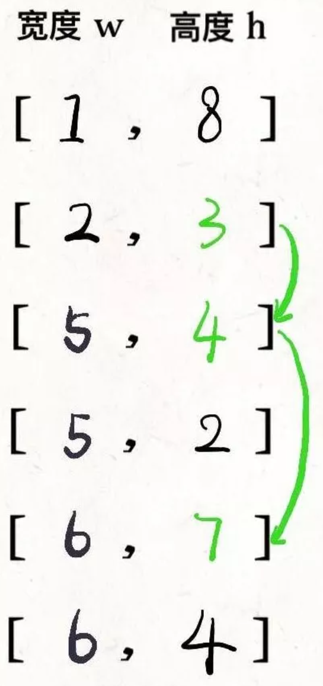

### 扔鸡蛋问题

题目要求, 面前有一栋从1到N共N层的楼, 给K个鸡蛋(K至少为1)。该楼存在楼层`0<=F<=N`，在这层楼扔下去, 鸡蛋恰好每摔碎(高于F的楼层都会碎, 低于F的楼层不会碎)。问**最坏情况下**，扔多少次鸡蛋，确定该楼层。


我们在第`i`层楼扔鸡蛋, 可能出现两种情况, 鸡蛋碎了和鸡蛋没碎。

如果鸡蛋碎了, 鸡蛋的个数`K`减1, 搜索楼层区间应该从`[1..N]`变为`[1..i-1]`共`i-1`层楼。

如果鸡蛋没碎, 鸡蛋个数`K`不变, 搜索楼层从`[1..N]`变为`[i+1..N]`共`N-i`层楼。



<!-- more -->

所以有递归写法
```py
def dp(K, N):
    for 1 <= i <= N:
        # 最坏情况下的最少扔鸡蛋次数
        res = min(res, 
                  max( 
                        dp(K - 1, i - 1), # 碎
                        dp(K, N - i)      # 没碎
                     ) + 1 # 在第 i 楼扔了一次
                 )
    return res
```
加上备忘录
```py
def superEggDrop(K: int, N: int):

    memo = dict()
    def dp(K, N) -> int:
        # base case
        if K == 1: return N
        if N == 0: return 0
        # 避免重复计算
        if (K, N) in memo:
            return memo[(K, N)]

        res = float('INF')
        # 穷举所有可能的选择
        for i in range(1, N + 1):
            res = min(res, 
                      max(
                            dp(K, N - i), 
                            dp(K - 1, i - 1)
                         ) + 1
                  )
        # 记入备忘录
        memo[(K, N)] = res
        return res

    return dp(K, N)
```

### 编辑距离



**解决两个字符串的动态规划问题，一般都是用两个指针i,j分别指向两个字符串的最后**，然后一步步往前走，缩小问题的规模。

* 注意每一个字符串都可以进行插入, 删除, 替换操作。换言之可以按照, a删除, b替换等顺序。

一般的, 可以有如下思路
```
if s1[i] == s2[j]:
    啥都别做（skip）
    i, j 同时向前移动
else:
    三选一：
        插入（insert）
        删除（delete）
        替换（replace）
```


```py
def minDistance(s1, s2) -> int:
    def dp(i, j):

        if i == -1:
            return j+1  # j+1个字符全部删除
        if j == -1:
            return i+1
        

        if s[i] == s[j]:
            return dp(i-1, j-1) # i, j前移, 啥也不做
        else
            return min(dp(i-1, j),  # 删除
            dp(i, j-1), # 增加一个字符
            dp(i-1, j-1) # 替换字符
            )
    return dp(len(s1)-1, len(s2)-1)

dp(i, j - 1) + 1,    # 插入
# 解释：
# 我直接在 s1[i] 插入一个和 s2[j] 一样的字符
# 那么 s2[j] 就被匹配了，前移 j，继续跟 i 对比
# 别忘了操作数加一

dp(i - 1, j) + 1,    # 删除
# 解释：
# 我直接把 s[i] 这个字符删掉
# 前移 i，继续跟 j 对比
# 操作数加一

dp(i - 1, j - 1) + 1 # 替换
# 解释：
# 我直接把 s1[i] 替换成 s2[j]，这样它俩就匹配了
# 同时前移 i，j 继续对比
# 操作数加一

```

#### 加备忘录

```py
def minDistance(s1, s2) -> int:

    memo = dict() # 备忘录
    def dp(i, j):
        if (i, j) in memo: 
            return memo[(i, j)]
        ...

        if s1[i] == s2[j]:
            memo[(i, j)] = ...  
        else:
            memo[(i, j)] = ...
        return memo[(i, j)]

    return dp(len(s1) - 1, len(s2) - 1)
```

#### dp table的自底向上


* dp[i][j] 表示两个字符串分为在i, j位置(从1开始)的最小编辑距离。i,j对应字符串位置为i-1, j-1。
* 对字符s1[i-1]和s2[j-1], 如果不等, 增加删除字符可以理解为某个字符串字符前移, 也就是对应dp[i-1][j], dp[i][j-1], 替换字符位置不变(两个都前移), 为dp[i-1][j-1]。 换言之, dp[i-1][j]+1表示从0位置到第i-1, j字符串编辑距离加一。

```cpp
int minDistance(string s1, string s2) {
    int m = s1.size();
    int n = s2.size();

    vector<vector<int>> dp(m+1, vector<int>(n+1, 0));
    /// 初始条件要注意
    for (int i = 0; i <=m; i++)
        dp[i][0] = i;
    for (int j = 0; j <= n; j++) 
        dp[0][j] = j;

    for (int i = 1; i <= m; i++) {
        for (int j = 1; j <= n; j++) {
            if (s1[i-1] == s2[j-1])
                dp[i][j] = dp[i-1][j-1];
            else
                dp[i][j] = Min(dp[i-1][j-1]+1,  dp[i-1][j]+1, dp[i][j-1]+1);
        }
    }
    return dp[m][n];
}

int Min (int a, int b, int c) {
    return min(a, min(b,c));
}
```




可以用状态压缩使空间复杂度从O(N^2)变为O(N)


#### 信封嵌套问题


解法
先对宽度w进行升序排序，如果遇到w相同的情况，则按照高度h降序排序。之后把所有的h作为一个数组，在这个数组上计算 LIS 的长度就是答案。


然后在`h`上寻找最长递增子序列：



### 两个字符串的删除操作

```
给定两个单词 word1 和 word2，找到使得 word1 和 word2 相同所需的最小步数，每步可以删除任意一个字符串中的一个字符。

输入: "sea", "eat"
输出: 2
解释: 第一步将"sea"变为"ea"，第二步将"eat"变为"ea"
```

* 这个问题和编辑距离的区别是, 编辑距离两个字符串都可以进行替换,增加, 删除操作, 本问题两个字符串智能进行删除的操作

* 在i, j处, 字符串s1删除一个字符, 与字符串s2增加一个字符效果一致。最后都是s1[i-1]与s[j]进行比较。因此本题可以用编辑距离求解

```cpp
int minDistance(string s1, string s2) {
    int m = s1.size();
    int n = s2.size();

    vector<vector<int>> dp(m+1, vector<int>(n+1, 0));
    /// 初始条件要注意
    for (int i = 0; i <=m; i++)
        dp[i][0] = i;
    for (int j = 0; j <= n; j++) 
        dp[0][j] = j;

    for (int i = 1; i <= m; i++) {
        for (int j = 1; j <= n; j++) {
            if (s1[i-1] == s2[j-1])
                dp[i][j] = dp[i-1][j-1];
            else
                dp[i][j] = min( dp[i-1][j]+1, dp[i][j-1]+1);
        }
    }
    return dp[m][n];
}
```

* 另一种办法是求最长公共子序列解决

```cpp
    int minDistance2(string word1, string word2) {
        int m = word1.size();
        int n = word2.size();
        vector<vector<int>> dp(m + 1, vector<int>(n + 1));

        for (int i = 1; i <= m; i++) {
            char c1 = word1[i - 1];
            for (int j = 1; j <= n; j++) {
                char c2 = word2[j - 1];
                if (c1 == c2) {
                    dp[i][j] = dp[i - 1][j - 1] + 1;
                } else {
                    dp[i][j] = max(dp[i - 1][j], dp[i][j - 1]);
                }
            }
        }

        int lcs = dp[m][n];
        return m - lcs + n - lcs;
    }
```

### 背包问题

#### 01背包

明确两点，**状态**和**选择**

01背包状态有两个，就是**背包的容量**和**可选择的物品**。

选择就是**装进背包**或者**不装进背包**。 即01两种选择。

```
for 状态1 in 状态1的所有取值：
    for 状态2 in 状态2的所有取值：
        for ...
            dp[状态1][状态2][...] = 择优(选择1，选择2...)
```


给定一组多个（$n$）物品，每种物品都有自己的重量（$w_i$）和价值（$v_i$），在限定的总重量/总容量（$C$）内，选择其中若干个（也即每种物品可以选0个或1个），设计选择方案使得物品的总价值最高。


$max \sum_{i=1}^n x_iv_i$

s.t $\sum_{i=1}^n x_iw_i \leq C$

$ x_i \in \{0, 1\} $

定义子问题, $P(i, W)$, 在前i个物品中挑选总重量不超过$W$(背包剩余容量为W)的物品, 每种物品至多选一个, 使总价值最大。这时的最优解记作$m(i, W)$

则
$m(i, W) = max\{m(i-1, W), m(i-1, W-w_i) + v_i\} $

综合边界条件

$i=0, m(i, W)=0$

$w=0, m(i, W)=0$

$w_i>W, m(i, W) = m(i-1, W)$


$otherwise, m(i, W) = max\{m(i-1, W), m(i-1, W-w_i) + v_i\}$

```py
举例

N = 3 //地主家有三样东西

wt = [2,1,3] //每样东西的重量

val = [4,2,3] //每样东西的价值

W = 4 //背包可装载重量

def kpack(N:int, wt:List[int], val:List[int], W:int) -> int:
    size = len(wt)
    m = [[0 for i in range(W + 1)] for j in range(N + 1)]

    #i 为选择的物品, j为剩余容量
    for i in range(1, N+1):
        for j in range(1, W+1):
            if wt[i-1] > j:
                m[i][j] = m[i-1][j]
            else:
                m[i][j] = max(m[i-1][j], m[i-1] [j-wt[i-1]]+val[i-1])
    print (m)
    return m[N][W]
```

#### 完全背包

与0-1背包问题不同的地方时，完全背包问题允许一件物品无限次的出现。

```cpp
dp[i][w] = max(dp[i - 1][w], dp[i - 1][w - w[i]] + v[i]);  //01背包问题的递推方程式
dp[i][w] = max(dp[i - 1][w], dp[i - 1][w - k * w[i]] + K * v[i]);  //完全背包问题的递推方程式
    //dp[i][w] 代表前i件物品放入质量为w的背包时的最大价值。
    //k 代表着第i件物品拿了几件，咱们枚举一下自然就知道几件的时候可以使得价值最大，这个就是扩展01背包问题的关键地方


for(int i = 1; i <= N; i++){
    for(int j = 1; j <= W; j++){
        for(int k = 1; j - k*w[i] >= 0; k++){ //防止越界, 容量足够
            dp[i][j] = max(dp[i - 1][j], dp[i - 1][j - k * w[i]] + k * v[i]);  //完全背包问题的递推方程式
//dp[i][w] 代表前i件物品放入质量为w的背包时的最大价值。
//k 代表着第i件物品拿了几件，咱们枚举一下自然就知道几件的时候可以使得价值最大，这个就是扩展01背包问题的关键地方
        }
    }

```

完全背包问题还有一个简单又有效的优化，那就是如果 `w[a] > w[b] && v[a] < v[b]` 这种情况下就可以a物品去掉，因为有b就没必要去选a了，因为a比b重而且a的价值比b还小

完全背包递推
```

for(int i = 1; i <= N; i++){
    for(int j = 1; j <= W; j++){
            if(j < W[i]) dp[i][j] = dp[i-1][j];
            else dp[i][j] = max(dp[i - 1][j], dp[i][j - w[i]] + v[i]);

    }
}
```

#### 等和子集

相当于从数组选取数字, 将背包装满。
```
dp[i][j] 表示从数组的 [0,i]下标范围内选取第i个数字（可以是 0 个），是否存在一种选取方案使得被选取的正整数的和等于 j。

如果 j>=nums[i]，则对于当前的数字 nums[i]，可以选取也可以不选取，两种情况只要有一个为 true，就有 dp[i][j]=true。

选取如果不选取 nums[i]，则 dp[i][j]=dp[i−1][j]；

如果选取 dp[i][j]=dp[i−1][j−nums[i]]。


dp[i][j] = dp[i−1][j−nums[i]] | dp[i−1][j]
表示选取或者不选取

如果 j<nums[i]，则在选取的数字的和等于 j 的情况下无法选取当前的数字 nums[i]，因此有 dp[i][j]=dp[i−1][j]。

```

```cpp
bool canPartition(vector<int>& nums) {
    int sum = 0;
    for (int num : nums) sum += num;
    // 和为奇数时，不可能划分成两个和相等的集合
    if (sum % 2 != 0) return false;
    int n = nums.size();
    sum = sum / 2;
    vector<vector<bool>> 
        dp(n + 1, vector<bool>(sum + 1, false));
    // base case
    // 背包没有空间的时候，就相当于装满了，
    for (int i = 0; i <= n; i++)
        dp[i][0] = true;

    for (int i = 1; i <= n; i++) {
        for (int j = 1; j <= sum; j++) {
            if (j - nums[i - 1] < 0) {
               // 背包容量不足，不能装入第 i 个物品
                dp[i][j] = dp[i - 1][j]; 
            } else {
                // 装入或不装入背包
                dp[i][j] = dp[i - 1][j] | dp[i - 1][j-nums[i-1]];
            }
        }
    }
    return dp[n][sum];
}
```