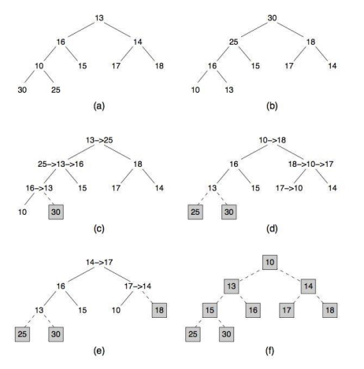
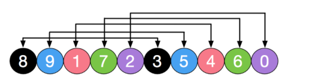
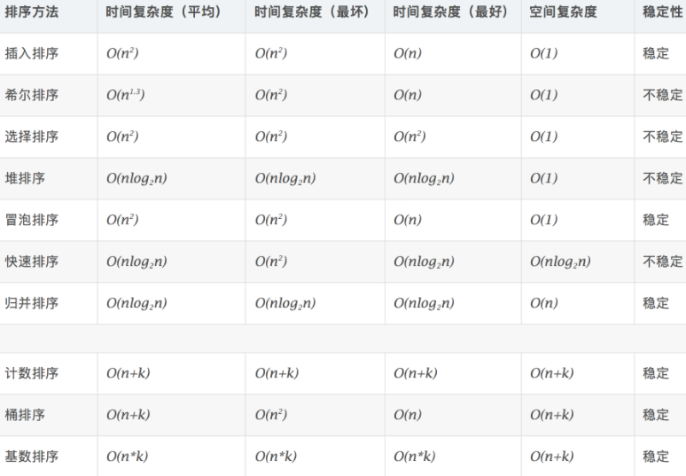

### 冒泡排序

* 稳定排序
* 相邻比较交换, 大数移动到后面

```cpp
void bubbleSort(vector<int> arr) {
    int temp = 0;
    for (int i = arr.size() - 1; i > 0; i--) { // 每次需要排序的长度
        for (int j = 0; j < i; j++) { // 从第一个元素到第i个元素
            if (arr[j] > arr[j + 1]) {  // 相邻交换, 大数冒泡到后面
                temp = arr[j];
                arr[j] = arr[j + 1];
                arr[j + 1] = temp;
            }
        }//loop j
    }//loop i
}

```
<!-- more -->

```cpp
/// 优化版本
void bubbleSort(vector<int> arr) {
    int temp = 0;
    bool swap;
    for (int i = arr.size() - 1; i > 0; i--) { // 每次需要排序的长度
        swap=false;
        for (int j = 0; j < i; j++) { // 从第一个元素到第i个元素
            if (arr[j] > arr[j + 1]) {
                temp = arr[j];
                arr[j] = arr[j + 1];
                arr[j + 1] = temp;
                swap=true;
            }
        }//loop j
        if (swap==false){
            break;
        }
    }//loop i
}
```

### 选择排序

* 基本思路是, 在未排序序列中找到最小元素，存放已经排序序列的末尾
* 用数组实现的选择排序是不稳定的，用链表实现的选择排序是稳定的。

```cpp
void selectionSort(vector<int> arr) {
    int temp, min = 0;
    for (int i = 0; i < arr.size() - 1; i++) {
        min = i;
        // 循环查找最小值(有可能前面被后面交换过去, 因此不稳定)
        for (int j = i + 1; j < arr.length; j++) {
            if (arr[min] > arr[j]) {
                min = j;
            }
        }
        /// 将min和i位置元素进行交换
        if (min != i) {
            temp = arr[i];
            arr[i] = arr[min];
            arr[min] = temp;
        }
    }
}
```

### 插入排序

* 对于未排序数据，在已排序序列中从后向前扫描，找到相应位置并插入。
* 稳定排序

```cpp
void insertionSort(vector<int>& arr){
    for (int i=1; i<arr.size(); ++i){
        int value = arr[i];
        int position=i;
        /// position value插入到合适位置
        /// 直到arr[position-1]<value才是位置
        while (position>0 && arr[position-1]>value){
            arr[position] = arr[position-1];
            position--;
        }
        arr[position] = value;
    }//loop i
}
```

### 归并排序

* 稳定排序
* 需要辅助空间

```cpp
void mergeSort(vector<int> arr){
    vector<int> temp(arr.size(), 0);
    internalMergeSort(arr, temp, 0, arr.size()-1);
}
void internalMergeSort(vector<int>& arr, vector<int>& temp, int left, int right){
    /// 递归是一个入栈出栈的过程
    //当left==right的时，已经不需要再划分了
    if (left >= right)
        return;

    int middle = (left+right)/2;
    internalMergeSort(arr, temp, left, middle);          //左子数组
    internalMergeSort(arr, temp, middle+1, right);       //右子数组
    mergeSortedArray(arr, temp, left, middle, right);    //合并两个子数组

}
// 合并两个有序子序列
private static void mergeSortedArray(vector<int>& arr, vector<int>& temp, int left, int middle, int right){
    int i=left;      
    int j=middle+1;
    int k=0;
    /// i从left, j从mid+1开始遍历, 放入到temp数组中
    while (i<=middle && j<=right){
        temp[k++] = arr[i] <= arr[j] ? arr[i++] : arr[j++];
    }
    /// 对多余的i或者j
    while (i <=middle){
        temp[k++] = arr[i++];
    }
    while ( j<=right){
        temp[k++] = arr[j++];
    }
    //把数据复制回原数组
    for (i=0; i<k; ++i){
        arr[left+i] = temp[i];
    }
}
```

### 快速排序

* 不是稳定排序

```cpp
void quickSort(vector<int> arr){
    qsort(arr, 0, arr.size()-1);
}
void qsort(vector<int>& arr, int low, int high){
    if (low >= high)
        return;
    /// 划分, 以pivot为界, 左侧小于arr[pivot], 右侧大于arr[prvot]
    int pivot = partition(arr, low, high);        //将数组分为两部分
    qsort(arr, low, pivot-1);                   //递归排序左子数组
    qsort(arr, pivot+1, high);                  //递归排序右子数组
}
int partition(vector<int>& arr, int low, int high){
    int pivot = arr[low];     //基准
    while (low < high){
        while (low < high && arr[high] >= pivot) --high;
        arr[low]=arr[high];             //右侧比基准大的记录到左端
        while (low < high && arr[low] <= pivot) ++low;
        arr[high] = arr[low];           //左侧比基准小的记录到右端
    }
    arr[low] = pivot;
    //返回的是基准的位置
    return low;
}
```


### 堆排序

* **最大堆中，父节点的值比每一个子节点的值都要大。在最小堆中，父节点的值比每一个子节点的值都要小**
* 不稳定排序

堆排序的基本思想是, 如果是从小到大排序, **先根据已有元素建大顶堆, 这样堆顶元素是最大的。将堆顶元素和最后一个元素交换, 该最大元素就变成了最后一个元素了。之后不断调整堆顶元素**, 最终可以得到从小到大的排序。



如图, a是数组的树状表示, b先建立成大顶堆。将堆顶元素和堆尾元素交换, c,d,e,f表示不断调整堆顶元素, 最终形成从小到大的排序。

```cpp
class ArrayHeap {
public:
    vector<int> arr;
    ArrayHeap(vector<int>& arr) {
        this->arr = arr;
    }

    int getParentIndex(int child) {
        return (child - 1) / 2;
    }
    int getLeftChildIndex(int parent) {
        return 2 * parent + 1;
    }
    void swap(int i, int j) {
        int temp = arr[i];
        arr[i] = arr[j];
        arr[j] = temp;
    }
    /// 从i索引开始调整堆
    void adjustHeap(int i, int len) {
        int left, right, j;
        /// 找到i的左孩子
        left = getLeftChildIndex(i);    // 即index = 2*i+1
        while (left <= len) {   // 这里是个循环, 表示将持续向下调整
            right = left + 1;
            j = left;
            /// 左孩子和右孩子哪个大
            if (j+1 < len && arr[left] < arr[right]) {
                j++;
            }
            // 目前j是i左右孩子的最大值

            /// 注意由于是从下到上遍历, 如果出现某节点父亲大于子节点, 则后续均有父节点大于子节点, 直接break即可
            if (arr[i] < arr[j]) {
                swap(array, i, j);  // 交换i和左右孩子
                i = j;
                left = getLeftChildIndex(i);    // swap之后i已经是子节点, 因此继续向下递归, 更新left
            } else {
                break; // 停止筛选
            }
        }
    }
    /**
     * 堆排序。
     * */
    void sort() {
        int last = arr.size() - 1;
        // 建立一个最大堆, 这样要求从堆尾元素父亲到堆顶一直调整, 大概调整n/2的个元素
        for (int i = getParentIndex(last); i >= 0; --i) {
            adjustHeap(i, last);
        }
        // 堆调整
        while (last >= 0) {
            swap(0, last--);    // 堆顶元素和当前最后一个元素交换
            /// 调整
            adjustHeap(0, last);    // 只调整堆顶元素, 长度为last
        }
    }

}
```


### 希尔排序

* 插入排序改良版, 插入排序算法在数组基本有序的情况下，可以近似达到O(n)复杂度
* 插入排序每次只能将数据移动一位，在数组较大且基本无序的情况下性能会迅速恶化。
* 不稳定排序


* 选择一个增量序列t1，t2，…，tk，其中ti>tj，tk=1；

* 每趟排序，根据对应的增量ti，将待排序列分割成若干长度为m 的子序列，分别对各子序列进行**直接插入排序**。同时不断降低增量序列。



```cpp
void shellSort(vector<int>& arr){
    int temp;
    /// delta增量序列呈对数减少
    for (int delta = arr.size()/2; delta>=1; delta/=2){                              //delta为增量对每个增量进行一次排序
        /// i从delta开始,直到arr.size(), 显然delta越小i移动越多
        for (int i=delta; i<arr.size(); i++){    
            /// j从i开始, 与j-delta比较，如果小于则交换之, 如果大于则退出循环          
            for (int j=i; j>=delta && arr[j]<arr[j-delta]; j-=delta){ //注意每个地方增量和差值都是delta
                temp = arr[j-delta];
                arr[j-delta] = arr[j];
                arr[j] = temp;
            }
        }//loop i
    }//loop delta
}
```

### 计数排序

* 计数排序不是基于比较的排序算法，其核心在于将输入的数据值转化为键存储在额外开辟的数组空间中。

```cpp
void countSort(vector<int> a, int max, int min) {
     vector<int> b(a);//存储数组
     vector<int> count(max - min + 1, 0);//计数数组

     for (int i = 0; i < a.length; i++) {
        int num = a[i];
        count[num - min]++;//每出现一个值，计数数组对应元素的值+1
     }

     for (int num = min + 1; num <= max; num++) {
        //加总数组元素的值为计数数组对应元素及左边所有元素的值的总和
        count[num - min] += sum[num - min - 1]
     }

     for (int i = 0; i < a.length; i++) {
          int num = a[i];//源数组第i位的值
          int index = count[num - min] - 1;//加总数组中对应元素的下标
          b[index] = num;//将该值存入存储数组对应下标中
          count[num - min]--;//加总数组中，该值的总和减少1。
     }

     //将存储数组的值一一替换给源数组
     for(int i=0;i<a.length;i++){
         a[i] = b[i];
     }
}
```

### 桶排序

### 基数排序

