### lsof 一切皆文件

lsof(list open files)是一个查看进程打开的文件的工具。在 linux 系统中，一切皆文件。通过文件不仅仅可以访问常规数据，还可以访问网络连接和硬件。所以 lsof 命令不仅可以查看进程打开的文件、目录，还可以查看进程监听的端口等 socket 相关的信息。

```
-c <进程名> 输出指定进程所打开的文件
-d <文件描述符> 列出占用该文件号的进程
+d <目录>  输出目录及目录下被打开的文件和目录(不递归)
+D <目录>  递归输出及目录下被打开的文件和目录
-i <条件>  输出符合条件与网络相关的文件
-p <进程号> 输出指定 PID 的进程所打开的文件

lsof -i:8080：查看8080端口占用
lsof abc.txt：显示开启文件abc.txt的进程
lsof -c abc：显示abc进程现在打开的文件
lsof -c -p 1234：列出进程号为1234的进程所打开的文件
lsof -g gid：显示归属gid的进程情况
lsof +d /usr/local/：显示目录下被进程开启的文件
lsof +D /usr/local/：同上，但是会搜索目录下的目录，时间较长
lsof -d 4：显示使用fd为4的进程
lsof -i -U：显示所有打开的端口和UNIX domain文件
```

* lsof -i:端口号, 查看与打开端口相关的文件

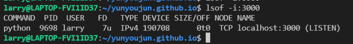

* 查看哪个进程打开了这个文件, `lsof /bin/bash`

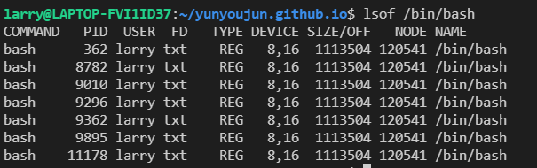

* 查看某个进程打开得全部文件

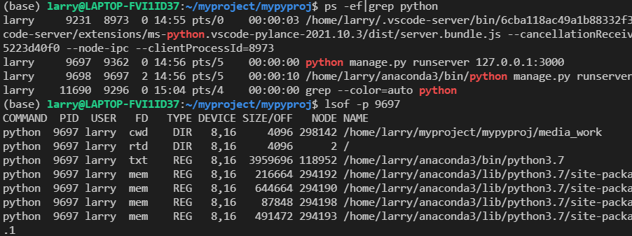

### netstat

Netstat(network statistics)是在内核中访问网络连接状态及其相关信息的命令行程序，可以显示路由表、网络连接和网络接口设备的状态信息，以及与 IP、TCP、UDP 和 ICMP 协议相关的统计数据，**一般用于检验本机各端口的网络服务运行状况**。

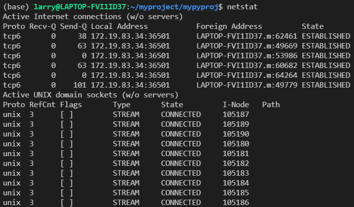

<!-- more -->

netstat的输出结果可以分为两个部分：
1. Active Internet connections，称为有源TCP连接，其中"Recv-Q"和"Send-Q"指%0A的是接收队列和发送队列。这些数字一般都应该是0。如果不是则表示软件包正在队列中堆积。
2. 另一个是Active UNIX domain sockets，称为有源Unix域套接口(和网络套接字一样，但是只能用于本机通信，性能可以提高一倍)。

常用参数
```
-a (all)显示所有选项，注意默认不显示LISTEN相关, 显示监听端口要么-l, 要么-a
-t (tcp)仅显示tcp相关选项
-u (udp)仅显示udp相关选项
-n 拒绝显示别名，能显示数字的全部转化成数字。
-l 仅列出有在 Listen (监听) 的服務状态

-p 显示建立相关链接的程序名
-r 显示路由信息，路由表
-e 显示扩展信息，例如uid等
-s 按各个协议进行统计
-c 每隔一个固定时间，执行该netstat命令。
```

* 列出所有端口 `netstat -a`,  列出所有 tcp 端口 `netstat -at`, 列出所有监听 tcp 端口 `netstat -lt`'。一般直接`netstat -nat|grep`
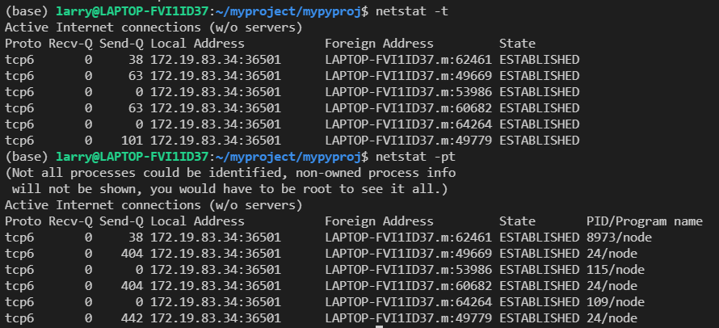
* 显示所有协议的统计信息 `netstat -s`, 输出中显示 PID 和进程名称 `netstat -p`

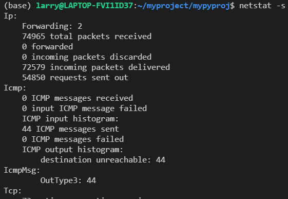
* netstat -tunlp 用于显示 tcp，udp 的端口和进程等相关情况。

```
# netstat -tunlp | grep 8000
tcp        0      0 0.0.0.0:8000            0.0.0.0:*               LISTEN      26993/nodejs   

-t (tcp) 仅显示tcp相关选项
-u (udp)仅显示udp相关选项
-n 拒绝显示别名，能显示数字的全部转化为数字
-l 仅列出在Listen(监听)的服务状态
-p 显示建立相关链接的程序名
```

* 核心路由信息 `netstat -r`
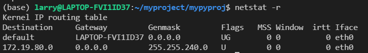

### 系统信息

#### 查看进程信息

* ps, `ps -ef` 是用标准的格式显示进程的、其格式如下

* 杀死进程 `kill -9 PID`

#### 查看cpu, 内存信息

* top, 注意cpu的状态信息

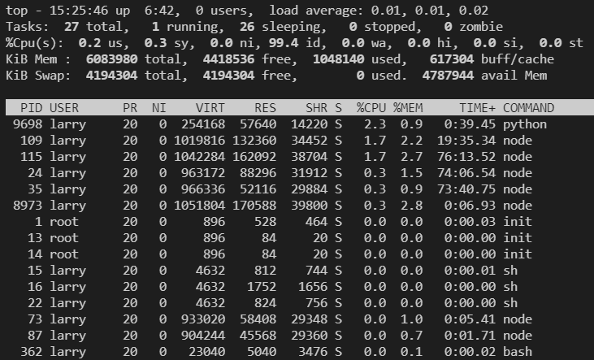
```
cpu状态信息，具体属性说明如下：

us — 用户空间占用CPU的百分比。
sy — 内核空间占用CPU的百分比。
ni — 改变过优先级的进程占用CPU的百分比

id — 空闲CPU百分比
wa — IO等待占用CPU的百分比
hi — 硬中断（Hardware IRQ）占用CPU的百分比
si — 软中断（Software Interrupts）占用CPU的百分比
```

#### 查看磁盘信息

* iostat

#### 查看域名解析

nslookup
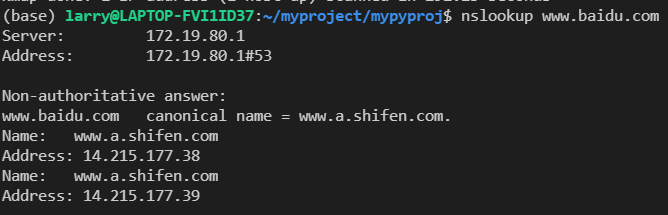

本机地址为172.19.80.1, 解析baidu.com的地址为14.215.177.38

#### 检查路由traceroute

traceroute, 用来测试路由问题的最好的工具之一

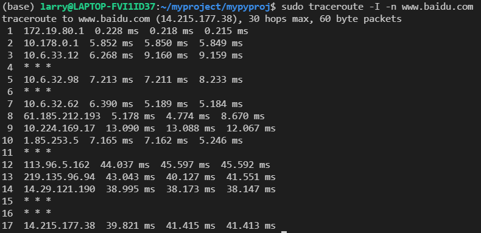

### 防火墙iptables

所谓防火墙就是设定某种规则, 满足规则的数据包可以进入或发出, 不满足的不能进入和出去
#### 防火墙

1. 包过滤防火墙：包过滤是**IP层**实现，包过滤根据**数据包的源 IP、目的 IP、协议类型（TCP/UDP/ICMP）、源端口、目的端口**等包头信息及数据包传输方向灯信息来判断是否允许数据包通过。
2. 应用层防火墙：也称为应用层代理防火墙，基于应用层协议的信息流检测，可以拦截某应用程序的所有封包，提取包内容进行分析。有效防止 SQL 注入或者 XSS（跨站脚本攻击）之类的恶意代码。
3. 状态检测防火墙：结合包过滤和应用层防火墙优点，基于连接状态检测机制，将属于同一连接的所有包作为一个整体的数据流看待，构成连接状态表（通信信息，应用程序信息等），通过规则表与状态表共同配合，对表中的各个连接状态判断。

iptables 是 Linux 下的配置防火墙的工具，用于配置 Linux 内核集成的 IP 信息包过滤系统


四表,防火墙规则是一个表, 增加一条规则相当于在表中多写一行。
```
filter
用于包过滤
nat
网络地址转发
mangle
对特定数据包修改
raw
不做数据包链路跟踪
```

五链, 表示入口或者出口等
```
INPUT
本机数据包入口
OUTPUT
本机数据包出口
FORWARD
经过本机转发的数据包
PREROUTING
防火墙之前，修改目的地址（DNAT）
POSTROUTING
防火墙之后，修改源地址（SNAT）
```

表中的链
```
filter
INPUT/OUTPUT/FORWARD

nat
PREROUTING/POSTROUTING/OUTPUT

mangle
PREROUTING/POSTROUTING/INPUT/OUTPUT/FORWARD

raw
PREROUTING/OUTPUT
```

#### 命令

`iptables [-t table] 命令 [chain] 匹配条件 动作`

命令
```
-A, append	追加一条规则
-I, insert	插入一条规则，默认链头，后跟编号，指定第几条
-D, delete	删除一条规则
-F, flush	清空规则
-s	源地址
-d	目标地址
-p	协议类型
--sport	源端口
--dport	目的端口
```

动作
```
ACCEPT
允许数据包通过
DROP
丢弃数据包不做处理
REJECT
拒绝数据包，并返回报错信息
SNAT
一般用于nat表的POSTROUTING链，进行源地址转换
DNAT
一般用于nat表的PREROUTING链，进行目的地址转换
```

例子
```
iptables -F
# 清空表规则，默认filter表

iptables -t nat -F
# 清空nat表
    
iptables -A INPUT -p tcp --dport 22 -j ACCEPT
# 允许TCP的22端口访问

iptables -A INPUT -p tcp --dport 22:25 -j ACCEPT
    # 允许端口范围访问

iptables -D INPUT -p tcp --dport 22:25 -j ACCEPT
    # 删除这条规则

iptables -A INPUT -p tcp -m multiport --dports 22,80,8080 -j ACCEPT
# 允许多个 TCP 端口访问

iptables -A INPUT -s 192.168.1.0/24 -j ACCEPT
# 允许 192.168.1.0 段 IP 访问

iptables -I INPUT -s 121.0.0.0/8 -j DROP
丢弃某个ip段的包, 也就是禁止某个ip访问

iptables -A INPUT -s 192.168.1.10 -j DROP
# 对 1.10 数据包丢弃

iptables -A INPUT -i eth0 -p icmp -j DROP
# eth0 网卡 ICMP 数据包丢弃，也就是禁 ping

iptables -A INPUT -i lo -j ACCEPT
# 允许来自 lo 接口，如果没有这条规则，将不能通过 127.0.0.1 访问本地服务

iptables -I INPUT -p tcp --syn --dport 80 -m connlimit --connlimit-above 30 -j REJECT
# 限制并发连接数，超过 30 个拒绝

iptables -I INPUT -p tcp --syn -m limit --limit 1/s --limit-burst 3 -j ACCEPT
# 限制每个 IP 每秒并发连接数最大 3 个


iptables –t nat -A PREROUTING -d [对外 IP] -p tcp --dport [对外端口] -j DNAT --to [内网 IP:内网端口]
# 访问 iptables 公网 IP 端口，转发到内网服务器端口

iptables -t nat -A PREROUTING -p tcp --dport 80 -j REDIRECT --to-ports 8080
# 本地 80 端口转发到本地 8080 端口

iptables -A INPUT -m state --state ESTABLISHED,RELATED -j ACCEPT
# 允许已建立及该链接相关联的数据包通过

```

### 渗透 NMAP

NMap，也就是Network Mapper，是Linux下的网络扫描和嗅探工具包。与`netstat`不同的, `netstat`用来查看本机的端口，协议等情况, NMap用来测试对方主机的端口等信息。其基本功能有三个：
1. 扫描主机端口，嗅探所提供的网络服务
2. 探测一组主机是否在线
3. 推断主机所用的操作系统，到达主机经过的路由，系统已开放端口的软件版本

Nmap常用在渗透测试中信息搜集阶段，用于搜集目标机主机的基本状态信息

#### 端口扫描

端口分为TCP.和UDP两种类型。TCP: 面向连接. 较可靠, UDP:无连接.不可靠的。常见端口: 80, 443,139,445等.

端口扫描就是发送一组扫描信息,了解目标计算机的基本情况.并了解其提供的网络服务类型.从而找到攻击点。


使用nmap一个ip地址可以直接找到开放的端口
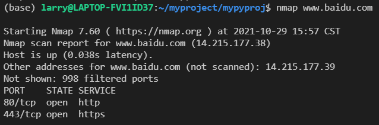

```
端口状态
open ： 应用程序在该端口接收 TCP 连接或者 UDP 报文。 
closed ：关闭的端口对于nmap也是可访问的， 它接收nmap探测报文并作出响应。但没有应用程序在其上监听。
filtered ：由于包过滤阻止探测报文到达端口，nmap无法确定该端口是否开放。过滤可能来自专业的防火墙设备，路由规则 或者主机上的软件防火墙。
unfiltered ：未被过滤状态意味着端口可访问，但是nmap无法确定它是开放还是关闭。 只有用于映射防火墙规则集的 ACK 扫描才会把端口分类到这个状态。
open | filtered ：无法确定端口是开放还是被过滤， 开放的端口不响应就是一个例子。没有响应也可能意味着报文过滤器丢弃了探测报文或者它引发的任何反应。UDP，IP协议,FIN, Null 等扫描会引起。
closed|filtered：（关闭或者被过滤的）：无法确定端口是关闭的还是被过滤的
```

* -sV可以得到端口进程的相关版本信息
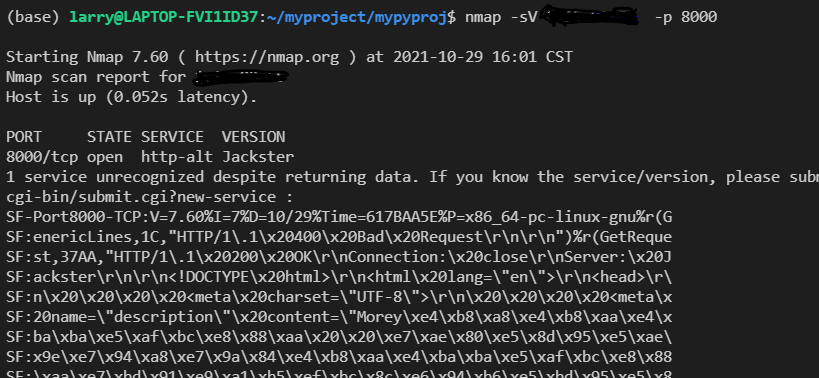

* -O可以得到操作系统信息
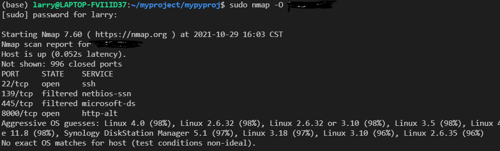

### 抓包 tcpdump

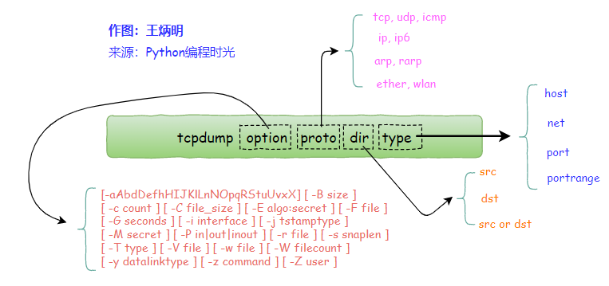

* 基于ip 端口过滤

```
tcpdump host 192.168.10.100
根据源ip进行过滤
tcpdump -i eth2 src 192.168.10.100
根据目标ip进行过滤
tcpdump -i eth2 dst 192.168.10.200

根据网段过滤
tcpdump net 192.168.10.0/24

根据端口过滤
tcpdump port 8088

根据协议过滤
tcpdump icmp

过滤组合
tcpdump src 10.5.2.3 and dst port 3389

过滤结果输出到文件
tcpdump icmp -w icmp.pcap
```

远程运行一个server, 监听5000端口。用tcpdump抓包分析

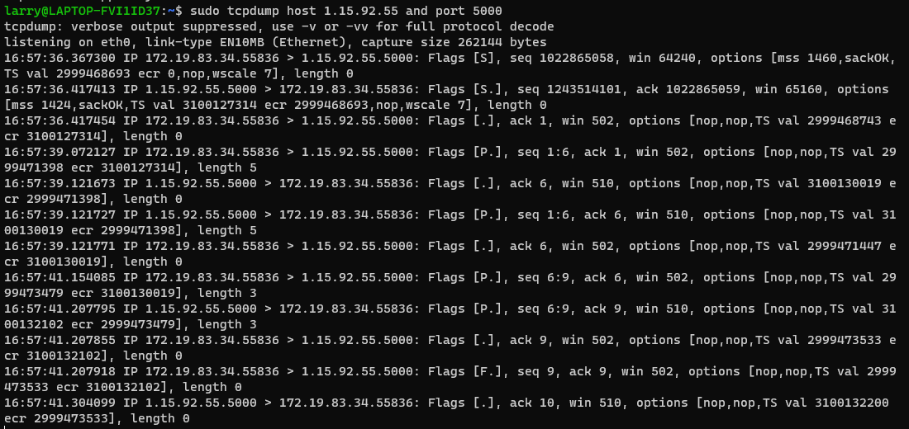

### 使用wireshark抓包分析

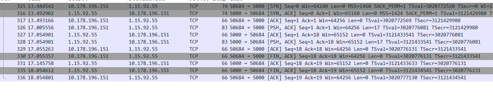
前三行表示三次握手。第一次握手：客户端发送syn包(syn=j)到服务器，并进入`SYN_SEND`状态，等待服务器确认;第二次握手：服务器收到syn包，必须确认客户的syn(ack=j+1)，同时自己也发送一个SYN包(syn=k)，即SYN+ACK包，此时服务器进入`SYN_RECV`状态；第三次握手：客户端收到服务器的SYN+ACK包，向服务器发送确认包ACK(ack=k+1, 下一个ACK为对方发送的SYN+1)，此包发送完毕，客户端和服务器进入`ESTABLISHED`状态，完成三次握手。

注意连接时服务器进入`SYN_RECV`状态时，服务器发送SYN+ACK进入`SYN_RECV`状态，会临时开放一个端口并在一段时间内等待客户端的第三次握手。这时候如果恶意客户端短时间内发送大量恶意SYN, 将消耗服务器端口等资源使服务器无法服务其他的连接，这就是SYN flood攻击。这是利用tcp三次握手的缺陷进行的。

* TCP sequence number seq序列号占4个字节, 当某端开启一个TCP会话时，他的初始序列号(seq)是随机的，可能是0和4,294,967,295(2^32-1)之间的任意值,序号的生成也是随机的，通常是一个很大的数值。像Wireshark这种工具，通常显示的都是**相对序列号/确认号**, wireshark中一般初始SYN和ACK都为0, 比起真实序列号/确认号，跟踪更小的相对序列号/确认号会相对容易一些。序列号表示某端packet的数据部分的第一位应该在整个data stream中所在的位置, 可以认为是一共发了多少字节的数据。例如No23的seq=18, 原因是客户端上一次发送No19时seq=1, 而No19一共发送了17字节的数据, 所有No23的seq=1+17=18

* TCP acknowledge number ack确认号也占四个字节：表示的是期望的对方(接收方)的下一次sequence number是多少。显然因为No23的seq为18, 所以No21,No22的ACK都是18, 因为它们期望的下一个seq,也就是No23的seq, 是18。

连接建立后，客户端和服务器就可以开始进行数据传输。第四行就是数据传输了, 具体的, 第四行客户端向服务端发送数据(17字节), 第5行服务器表示收到并想接收seq=18(ACK=18), 第6行服务器向客户端发送处理好的数据, 第7行客户端表示收到(ACK), 想接收服务器seq=18(ack=18)。准确收到了数据会发送ACK=1确认, 发送数据时会发送PSH=1。没有用到的URG和RST， URG表示要紧急处理, 接收方收到URH标志有效的数据报时，回去检测TCP 报头中的16 位字段紧急指针。 该字段指示从第一个字节计数的段中的数据时多少紧急处理的。rst段标识复位，用来异常的关闭连接。发送rst段关闭连接时，不必等缓冲区的数据都发送出去，直接丢弃缓冲区中的数据。而接收端收到rst段后，也不必发送ack来确认。例如连接一个未监听的端口, 服务器会发送rst=1.

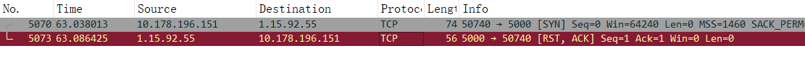
第8行(No 32) 客户端请求关闭连接发送[FIN,ACK], 第11行服务器发送ACK确认表示想接受下一个seq为19(表示同意)。服务器经短暂CLOSE_WAIT接着发送[FIN,ACK]请求断开连接, 进入LAST_ACK状态。客户端最后发送[ACK]确认服务器连接关闭。客户端进入`TIME_WAIT`阶段如果等待2MSL的时间后依然没有收到回复，证明Server端已正常关闭，Client端关闭连接了。

此外, 我们还可以分析数据包各部分的大小。
EthernetII以太网帧报头为14字节, 由6字节的目的MAC地址, 6字节的MAC源地址, 2字节的IP类型
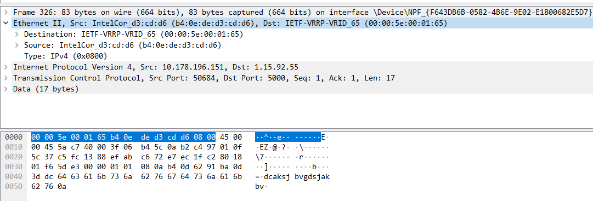

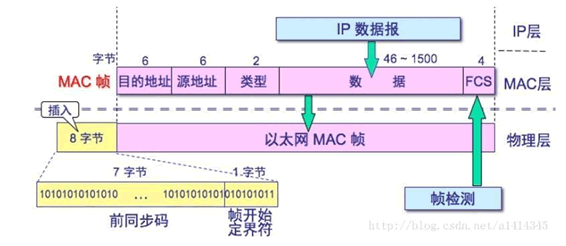

IPV4的数据报头为20字节, 注意2个字节存储数据报长度, 1byte的生存时间, 1byte的传输层协议, 2字节首部校验和, 4字节源地址(32位), 4字节目的地址。

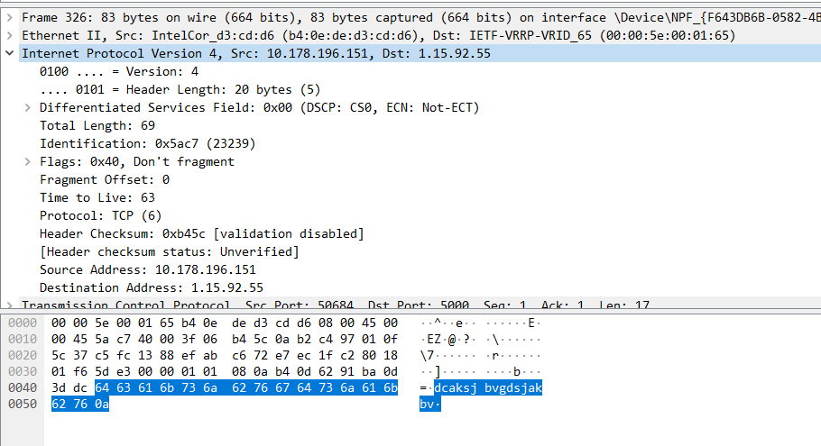

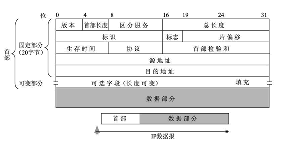

TCP报头固定部分为20字节, 包括2字节的源端口, 2字节的目的端口, 4字节的seq, 4字节ack, 半字节首部长度。SYN, FIN, ACK等只有一位。注意ack number用于正常通信, 期待下一个seq值, ACK用于三次握手。即客户端SYN=1->服务端SYN=1,ACK=1 ->客户端ACK=1。FIN用于四次挥手, 即客户端FIN=1,ACK=1 -> 服务端ACK=1 -> 

2字节的滑动窗口(拥塞控制, 窗口大小表示在确认了字节之后还可以发送多少个字节),2字节检验和。但是**TCP报头选项部分字节不一, 因此无法确定TCP报头的字节数**。例如下图选项部分为12字节。

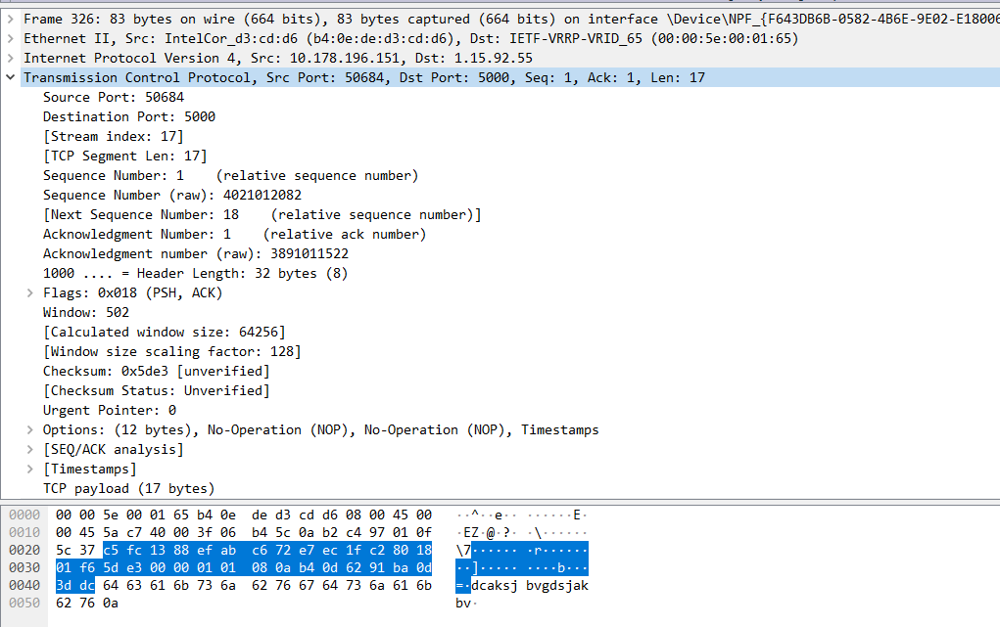

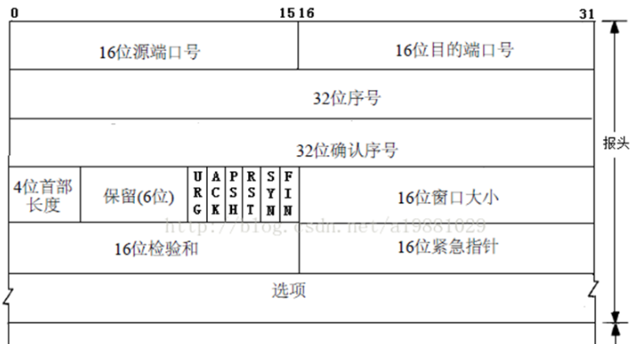

最后是17字节的数据, 前面的总计14+20+20+12 = 66字节, 因此包大小总计66+17=83字节。
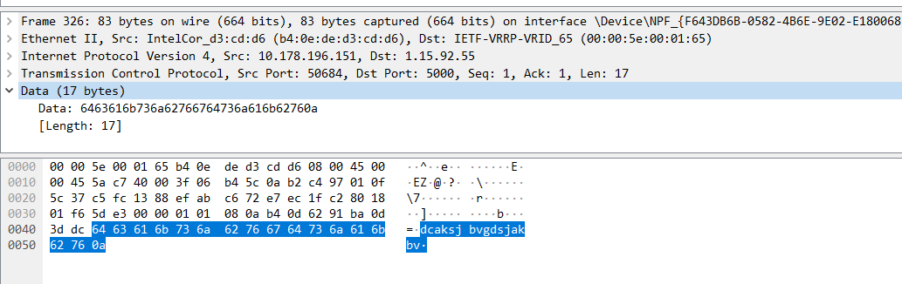


#### TIME_WAIT和CLOSE_WAIT

区分这两个状态的原因, 是在四次挥手过程中两个状态分别存在于两端中, 主动释放进入TIME_WAIT状态, 被动释放者进入CLOSE_WAIT状态。TIME_WAIT和CLOSE_WAIT两种状态如果一直被保持，意味着对应数目的通道就一直被占着，一旦达到句柄数上限，新的请求就无法被处理了。

* TIME_WAIT防止FIN发送时丢包，如果新连接建立后上一个包又出现了, 会影响新连接。(经过2MSL，上一次连接中所有的重复包都会消失)。主动断开者发送FIN之后会进入`TIME_WAIT`状态, 一般服务器不要是主动断开的发起者(除非是爬虫服务器)。如果有一直处于TIME_WAIT的风险, 修改`/etc/sysctl.conf`文件，服务器能够快速回收和重用那些TIME_WAIT的资源。

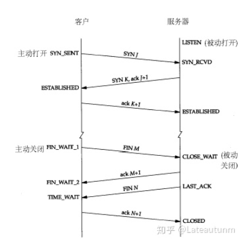

```cpp
#表示开启SYN Cookies。当出现SYN等待队列溢出时，启用cookies来处理，可防范少量SYN攻击，默认为0，表示关闭    
net.ipv4.tcp_syncookies = 1    
#表示开启重用。允许将TIME-WAIT sockets重新用于新的TCP连接，默认为0，表示关闭    
net.ipv4.tcp_tw_reuse = 1    
#表示开启TCP连接中TIME-WAIT sockets的快速回收，默认为0，表示关闭    
net.ipv4.tcp_tw_recycle = 1  
#表示如果套接字由本端要求关闭，这个参数决定了它保持在FIN-WAIT-2状态的时间    
net.ipv4.tcp_fin_timeout=30  

cat /proc/sys/net/ipv4/tcp_fin_timeout
```

* 长时间处于`CLOSE_WAIT`的原因是服务器在客户端发送断开请求时没有及时向客户端发送断开的信息, 因为正常情况下`CLOSE_WAIT`存在时间很短。这样往往是程序的问题, 比如服务端没有执行`close(fd)`。
* **在网络编程中尽量让客户端先释放连接(防止服务端进入TIME_WAIT), 客户端释放连接后服务端应该优先处理(防止服务端进入CLOSE_WAIT)**

客户端
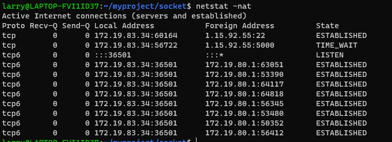

测试代码
server.c
```cpp
/// server.c
#include <stdio.h>
#include <unistd.h>
#include <sys/socket.h>		// socket header
#include <stdlib.h>
#include <arpa/inet.h>
#include <ctype.h>
#include <strings.h>

//#define IP "127.0.0.1"	// IP  address
#define IP "1.15.92.55"
#define PORT 5000		// port number

int main(int argc, char *argv[])
{
	int lfd, cfd;		// lfd is socket descriptor
	struct sockaddr_in serv_addr, clie_addr;
	socklen_t clie_addr_len;
	char buf[BUFSIZ], clie_ip[BUFSIZ];	//  #define 8192 bytes
	int n, i, ret;

	lfd = socket(AF_INET, SOCK_STREAM, 0);	// SOCK_STREAM means tcp protocol		/* Sequenced, reliable, connection-based byte streams.  */
	if (lfd == -1)
	{
		perror("socket error");
		exit(1);
	}

	/// Construct client address IP+port 127.0.0.1+5000
	bzero(&serv_addr, sizeof(serv_addr));	/// set serv_addr = 0
	serv_addr.sin_family = AF_INET;			// AF_INET means Ipv4 /* IP protocol family.  */
	serv_addr.sin_port = htons(PORT);	// PORT
	serv_addr.sin_addr.s_addr = htonl(INADDR_ANY);	// can accept all local ip

	/// bind serv_addr(ip+port) to socket fd
	ret = bind(lfd, (struct sockaddr *)&serv_addr, sizeof(serv_addr));	
	if (ret == -1)
	{
		perror("bind error");
		exit(1);
	}
	while (1) {


		ret = listen(lfd, 128);		/// listen client connection
		if (ret == -1)
		{
			perror("listen error");
			exit(1);
		}

		clie_addr_len = sizeof(clie_addr);
		/// establish connection
		cfd = accept(lfd, (struct sockaddr *)&clie_addr, &clie_addr_len);		/// when client connection, three-way handshake to establish a connection
		/// cfd is connection fd
		printf("client IP: %s, client port: %d\n", 
				inet_ntop(AF_INET, &clie_addr.sin_addr.s_addr, clie_ip, sizeof(clie_ip)),
				ntohs(clie_addr.sin_port));

		/// The following is the data transmission process after the connection is established

		n = read(cfd, buf,  sizeof(buf));		/// read data from client
		for (i = 0; i < n; ++i)
			buf[i] = toupper(buf[i]);	/// Capitalize the input characters
		write(cfd, buf, n);		/// write to client
		// 保证客户端先关闭连接
		sleep(1);
		close(cfd);	// 关闭连接, 不然服务器CLOSE_WAIT
	}
	/// close cfd, four waves to terminate the connection

	close(lfd);
	return 0;
}
```

client.c
```cpp
#include <stdio.h>
#include <unistd.h>
#include <sys/socket.h>
#include <stdlib.h>
#include <string.h>
#include <arpa/inet.h>

/// client application port number is 5000
#define SERV_PORT 5000

int main(int argc, char *argv[])
{
	int cfd;
	struct sockaddr_in serv_addr;
	// socklen_t serv_addr_len;
	char buf[BUFSIZ];
	int n;
    /// cfd
	cfd = socket(AF_INET, SOCK_STREAM, 0);

    /// Construct server address IP+por
	memset(&serv_addr, 0, sizeof(serv_addr));
	serv_addr.sin_family = AF_INET;
	serv_addr.sin_port = htons(SERV_PORT);
    /// 127.0.0.1+5000, to connect
	printf("%s\n", argv[1]);
	inet_pton(AF_INET, argv[1], &serv_addr.sin_addr.s_addr);
    /// Send a connection request to the server, a three-way handshake, and return the correct status code after the connection is successful

	connect(cfd, (struct sockaddr *)&serv_addr, sizeof(serv_addr));

    /// The following is the data transmission process after the connection is established
	do
	{
		fgets(buf, sizeof(buf), stdin);
		write(cfd, buf, strlen(buf));
		n = read(cfd, buf, sizeof(buf));
		write(STDOUT_FILENO, buf, n);
	}while(0);	// 执行一次
    /// Send a connection termination request to the server
	close(cfd);

	return 0;
}
```
