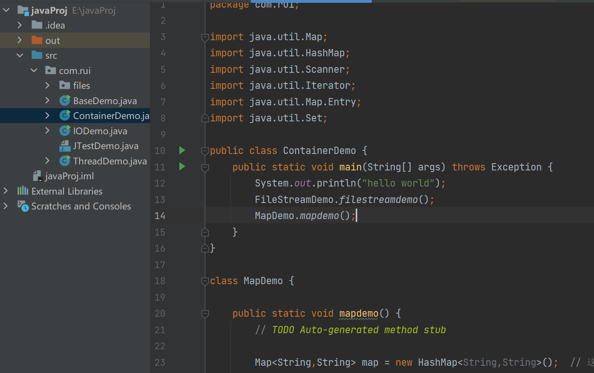
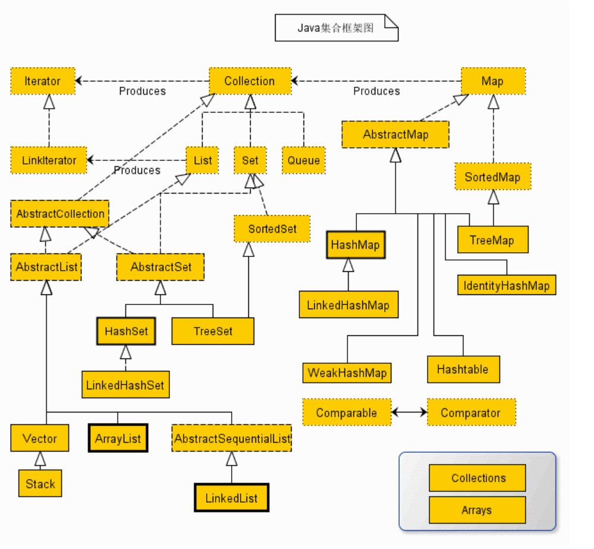
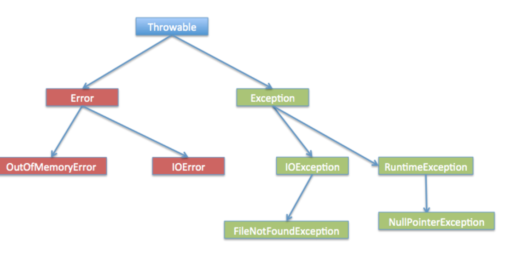
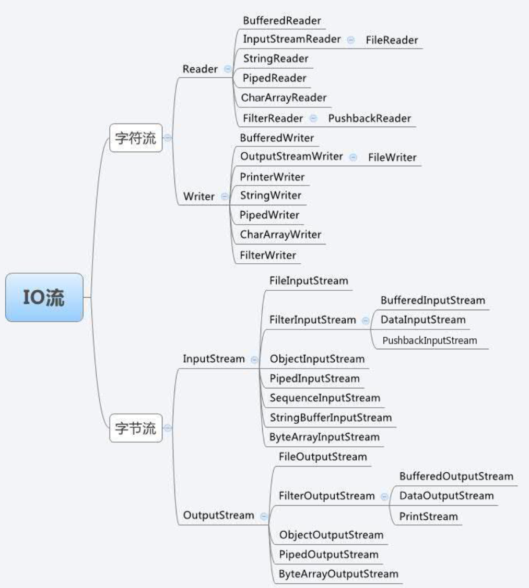

> 之前学过Java, 记录下容易忘的东西

### 基础

#### 访问控制修饰符

Java中，可以使用访问控制符来保护对类、变量、方法和构造方法的访问。Java class有4 种不同的访问权限。

* default (即默认，直接class A): **在同一包内可见**，不使用任何修饰符。使用对象：类、接口、变量、方法。

* private : 在同一类内可见。使用对象：变量、方法。 注意：**不能修饰类（外部类）**

* public : 对所有类可见。使用对象：类、接口、变量、方法

* protected : **对同一包内的类和所有子类可见**。使用对象：变量、方法。 注意：不能修饰类（外部类）。

此外, 文件被调用的类(含有`main`的类), 需要设置格式为`public class 文件名`。


Java文件的一般组织形式


Java中的方法, 变量一般都有private, public,或者protected修饰。
```java
package src;

public class person {
    public static void main(String[] args) {
        Person ming = new Person();
        ming.setName("Xiao Ming"); // 设置name
        ming.setAge(12); // 设置age
        System.out.println(ming.getName() + ", " + ming.getAge());
    }
}

class Person {
    private String name;
    private int age;

    public String getName() {
        return this.name;
    }

    public void setName(String name) {
        this.name = name;
    }
    public int getAge() {
        return this.age;
    }

    public void setAge(int age) {
        if (age < 0 || age > 100) {
            throw new IllegalArgumentException("invalid age value");
        }
        this.age = age;
    }
}
```

父类中声明为 public 的方法变量在子类中也必须为 public。

父类中声明为 protected 的方法变量在子类中要么声明为 protected，要么声明为 public，不能声明为 private。

父类中声明为 private 的方法变量，不能够被继承。

#### static 

修饰静态变量：无论一个类实例化多少对象，它的静态变量只有一份拷贝。 静态变量也被称为类变量。

修饰静态方法：static 关键字用来声明独立于对象的静态方法。**静态方法不能使用类的非静态变量**。(很简单, 静态方法形成时类实例还没初始化)。使用static时可以放在public/private修饰符后面, 也可以形成static块。

```java
private static int a;

public class TestStatic {
static{
    TestStatic.a=4;
    System.out.println(a);
}
}
```

注意static块中的语句在类加载是即执行, 也就是main还没开始时已经执行完了。注意类加载是按需加载, 加上一些编译优化, 有可能static块所属的class没有被加载, 这时候static块的语句不会被执行。

#### final

final 修饰变量表示不能被重新赋值。被 final 修饰的变量必须显式指定初始值。相当于C++的`const`。

final修饰方法表示方法不能被重写, 修饰类表示不能被继承, 相当于C++的final关键字。final 修饰符通常和 static 修饰符一起使用来创建类常量。

#### abstract 修饰符
* 抽象类：抽象类不能用来实例化对象，声明抽象类的唯一目的是为了将来对该类进行扩充, 抽象类可以包含抽象方法和非抽象方法。
* 抽象方法是一种没有任何实现的方法，该方法的的具体实现由子类提供。

```cpp
public abstract class SuperClass{
    abstract void m(); //抽象方法
}
 
class SubClass extends SuperClass{
     //实现抽象方法
      void m(){
          .........
      }
}
```

#### synchronized 修饰符

synchronized 关键字声明的方法同一时间只能被一个线程访问, RAII的思想。

synchronized括号的变量也就是被锁住的变量, 该变量可以是class, object, method, variable, 总之任一时刻只能被一个线程访问。

```java
public class ThreadDemo {

    public static void main(String[] args) {
        //实例化站台对象，并为每一个站台取名字
        Station station1=new Station("窗口1");
        Station station2=new Station("窗口2");
        Station station3=new Station("窗口3");

        // 让每一个站台对象各自开始工作, 执行run函数
        station1.start();
        station2.start();
        station3.start();
    }
}

class Station extends Thread {

    // 通过构造方法给线程名字赋值
    public Station(String name) {
        super(name);// 给线程名字赋值
    }
    // tick是多线程共享变量
    static int tick = 20;

    // 创建一个静态钥匙
    static Object ob = "aa";//值是任意的

    // 重写run方法，实现买票操作
    @Override
    public void run() {
        while (tick > 0) {

            synchronized (ob) {// ob这里起到Mutex的作用
                // 进去的人会把钥匙拿在手上，出来后才把钥匙拿让出来
                if (tick > 0) {
                    System.out.println(getName() + "卖出了第" + tick + "张票");
                    tick--;
                } else {
                    System.out.println("票卖完了");
                }
            }
            // 释放了锁
            try {
                sleep(1000);//休息一秒
            } catch (InterruptedException e) {
                e.printStackTrace();
            }
        }
    }
}
```

#### volatile 修饰符

java的volatile 涉及到内存屏障(CPU内存级别, 关系指令重排序), 其修饰的成员变量在每次被线程访问时，都强制从共享内存中重新读取该成员变量的值。而且，当成员变量发生变化时，会强制线程将变化值回写到共享内存。这样在任何时刻，两个不同的线程总是看到某个成员变量的同一个值。

同时, 禁止指令重排序（happens-before原则）：在进行指令优化时，不能将在对volatile变量访问的语句放在其后面执行，也不能把volatile变量后面的语句放到其前面执行。

C++的volatile只是编译器操作, 显式的要求编译器禁止对 volatile 变量进行优化, 它并没有`happen-before`语义, 没有添加内存屏障

### 数据类型

包装类	基本数据类型
Boolean	boolean
Byte	byte
Short	short
Integer	int
Long	long
Character	char
Float	float
Double	double

| 包装类 | 基本数据类型 | 
|  ----  | ----  | 
| Boolean  | boolean | 
| Byte  | byte | 
| Short  | short | 
| Integer  | int | 
| Long  | long | 
| Float  | float | 
| Double  | double |


#### character

```java
char ch = 'a';
 
// Unicode 字符表示形式
char uniChar = '\u039A'; 
 
// 字符数组, 栈上创建
char[] charArray ={ 'a', 'b', 'c', 'd', 'e' };
// 堆上创建
Character ch = new Character('a');
```

#### String

String 类是不可改变的，所以你一旦创建了 String 对象，那它的值就无法改变了。String内部维护的是char[]

```java
String s1 = "Runoob";              // String 直接创建
String s2 = "Runoob";              // String 直接创建
String s3 = s1;                    // 相同引用
String s4 = new String("Runoob");   // String 对象创建
String s5 = new String("Runoob");   // String 对象创建
```

常用方法

```cpp
`char charAt(int index)` 返回指定索引处的 char 值。
`int compareTo(Object o)`把这个字符串和另一个对象比较。
`int indexOf(int ch)` 返回指定字符在此字符串中第一次出现处的索引。
`int length()` 返回此字符串的长度
`String[] split(String regex)` 根据给定正则表达式的匹配拆分此字符串。
```
#### StringBuffer 和 StringBuilder

如果对字符串进行修改的时候，需要使用 StringBuffer 和 StringBuilder 类。这两个类更像C++的string对象, 区别基本在于StringBuilder 的方法不是线程安全的, 但效率会稍微高些。

由于 StringBuilder 相较于 StringBuffer 有速度优势，所以多数情况下建议使用 StringBuilder 类。

```java
public class RunoobTest{
    public static void main(String args[]){
        StringBuilder sb = new StringBuilder(10);
        sb.append("Runoob..");
        System.out.println(sb);  
        sb.append("!");
        System.out.println(sb); 
        sb.insert(8, "Java");
        System.out.println(sb); 
        sb.delete(5,8);
        System.out.println(sb);  
    }
}


String str = "Test string";
StringBuilder strBuilder = new StringBuilder(str);
strBuilder.setCharAt(1, 'X');   // 修改某个位置的值
str=Builder.toString();
```

### 容器类

Java 集合框架主要包括两种类型的容器，一种是集合（Collection），存储一个元素集合Collection，另一种是Map映射，存储键/值对映射。Collection 接口又有 3 种子类型，List、Set 和 Queue，再下面是一些抽象类，最后是具体实现类，常用的有 ArrayList、LinkedList、HashSet、LinkedHashSet、HashMap、LinkedHashMap 等等。



#### ArrayList

ArrayList 类是一个可以动态修改的数组，与普通数组的区别就是它是没有固定大小的限制，我们可以添加或删除元素。ArrayList类似C++的vector

```java
import java.util.ArrayList; // 引入 ArrayList 类

ArrayList<E> objectName =new ArrayList<>();　 // 初始化, 泛型写法.C++得A<int>* a = new A<int>; 因为模板参数也是类型的一部分

import java.util.ArrayList;

public class RunoobTest {
    public static void main(String[] args) {
        ArrayList<String> sites = new ArrayList<String>();
        sites.add("Google");
        
        System.out.println(sites);
        System.out.println(sites.get(0));
    }
}
```

常用方法
```
clear()	删除 arraylist 中的所有元素
contains()	判断元素是否在 arraylist
get()	通过索引值获取 arraylist 中的元素
size()	返回 arraylist 里元素数量
isEmpty()	判断 arraylist 是否为空
```
#### LinkedList

和ArrayList不同的是, `LinkedList`是双向链表, 类似C++的list。
```java
import java.util.LinkedList;

public class RunoobTest {
    public static void main(String[] args) {
        LinkedList<String> sites = new LinkedList<String>();
        sites.add("Google");
        sites.add("Runoob");
        // 使用 removeFirst() 移除头部元素
        sites.removeFirst();
        System.out.println(sites);
        System.out.println(sites.getFirst());
    }
}
```

常用方法
```
public boolean add(E e)	链表末尾添加元素
public void addFirst(E e)	元素添加到头部。
public void clear()	清空链表。
public E poll()	删除并返回第一个元素。
public E peek()	返回第一个元素。
```

#### hashset

hashset, 用hash实现的集合。由于java对每个对象都给一个hashcode, 因此使用时不需要像C++的unordered_set一样自定义哈希函数。

```java
// 引入 HashSet 类      
import java.util.HashSet;

public class RunoobTest {
    public static void main(String[] args) {
    HashSet<String> sites = new HashSet<String>();
        sites.add("Google");
        sites.add("Runoob");
        sites.add("Runoob");  // 重复的元素不会被添加
        System.out.println(sites);
        System.out.println(sites.contains("Taobao"));
        sites.remove("Taobao");  // 删除元素，删除成功返回 true，否则为 false

        for (String i : sites) {
            System.out.println(i);
        }
    }
}
```

#### hashmap

hashmap来自于map对象, 一般多态接口情况下, Map对象实现了如下通用接口。
```
clear() 从Map中删除所有映射
remove(Object key) 从Map中删除键和关联的值
put(Object key, Object value) 将指定值与指定键相关联
clear() 从 Map中删除所有映射
putAll(Map t) 将指定 Map中的所有映射复制到此 map
```

HashMap 实现了 Map 接口，根据键的 HashCode 值存储数据，具有很快的访问速度，最多允许一条记录的键为 null，不支持线程同步。基本等同于C++的unordered_map。
```java
// 引入 HashMap 类      
import java.util.HashMap;

public class RunoobTest {
    public static void main(String[] args) {
        // 创建 HashMap 对象 Sites
        HashMap<Integer, String> Sites = new HashMap<Integer, String>();
        // 添加键值对
        Sites.put(1, "Google");
        Sites.put(2, "Runoob");
        Sites.put(3, "Taobao");
        Sites.put(4, "Zhihu");
        Sites.remove(4);
        System.out.println(Sites);
    }
}
```

常用方法
```java
containsKey()	检查 hashMap 中是否存在指定的 key 对应的映射关系。
put()	将键/值对添加到 hashMap 中
remove()	删除 hashMap 中指定键 key 的映射关系
entrySet()	返回 hashMap 中所有映射项的集合集合视图, 是一个set<Entry>

    public static void mapdemo() {
        // TODO Auto-generated method stub

        Map<String,String> map = new HashMap<String,String>();  // 这个类似于多态写法

        //向该集合中添加元素
        System.out.println("请输入三组单词对应的原单词和注释");
        Scanner sc= new Scanner(System.in); // 读取一行输入, next()遇到空格中断,nextLine()遇到回车才中断
        int i=0;

        while(i < 3) {
            System.out.println("请输入key: ");
            String key = sc.next(); // 遇到空白符(包括空格)截断
            System.out.println("请输入value: ");
            String value = sc.next();
            map.put(key, value);
            i++;
        }

        System.out.println("=============================");
        System.out.println("使用迭代器输出value");
        Iterator it = map.values().iterator(); // java的迭代器能直接输出value, 厉害了。
        while(it.hasNext()) {
            System.out.print(it.next()+"\n");
        }

        System.out.println("============================");

        //使用entrySet方法获取key-value值
        Set<Entry<String,String>> set=map.entrySet();   // 使用entrySet()输出的办法高效
        for(Entry<String,String> entry : set) { // C++可以auto
            System.out.print(entry.getKey() + "-");
            System.out.println(entry.getValue());
        }

    }
```

#### LinkedHashMap

LinkedHashMap是HashMap的子类，内部还有一个双向链表维护键值对的顺序。其实现类似于LRU, 内部链表维护了插入先后的顺序。
```java
public class LinkedHashMap<K,V>
    extends HashMap<K,V>
    implements Map<K,V>
{
    ...
}

// 内部基本结构Entry相比hashmap, 多了一个next成员
private static class Entry<K,V> extends HashMap.Entry<K,V> {
    // These fields comprise the doubly linked list used for iteration.
    Entry<K,V> before, after;

Entry(int hash, K key, V value, HashMap.Entry<K,V> next) {
        super(hash, key, value, next);
    }
    ...
}
```
LinkedHashMap的put可以有两种顺序
1. 插入顺序：基于put, 先添加的在前面，后添加的在后面。修改操作不影响顺序
2. 访问顺序：所谓访问指的是get/put操作，对一个键执行get/put操作后，其对应的键值对会移动到链表末尾。这种顺序其实就是LRU, 开头的是最久没有访问的, 末尾的是最近访问的。

```java
public LinkedHashMap(int initialCapacity, float loadFactor, boolean accessOrder)
```
参数accessOrder就是用来指定是否按访问顺序，如果为true，就是访问顺序。

#### 迭代器

迭代器 Iterator 的两个基本操作是 next 、hasNext 和 remove, 用来操作容器中的元素。迭代器是比容器更底层的操作元素的手段, 容器中操作元素的办法就是通过迭代器的。因此可以通过容器获得迭代器`Iterator<Integer> it = numbers.iterator();`

调用 it.next() 会返回迭代器的下一个元素，并且更新迭代器的状态。

调用 it.hasNext() 用于检测集合中是否还有元素。

调用 it.remove() 将迭代器返回的元素删除。

```java
import java.util.ArrayList;
import java.util.Iterator;

public class RunoobTest {
    public static void main(String[] args) {
        ArrayList<Integer> numbers = new ArrayList<Integer>();
        numbers.add(12);
        numbers.add(8);
        numbers.add(2);
        numbers.add(23);
        Iterator<Integer> it = numbers.iterator();
        while(it.hasNext()) {
            Integer i = it.next();
            if(i < 10) {  
                it.remove();  // 删除小于 10 的元素
            }
        }
        System.out.println(numbers);
    }
}
```

### 类
Java真是把面向对象炉火纯青, 所有的类都是基于继承和实现的。

#### 继承
```java

public class Animal { 
    private String name;  
    private int id; 
    public Animal(String myName, int myid) { 
        name = myName; 
        id = myid;
    } 
    public void eat(){ 
        System.out.println(name+"正在吃"); 
    }
    public void sleep(){
        System.out.println(name+"正在睡");
    }
    public void introduction() { 
        System.out.println("大家好！我是"         + id + "号" + name + "."); 
    } 
}

public class Penguin extends Animal { 
    public Penguin(String myName, int myid) { 
        super(myName, myid); // 调用父类构造函数, C++直接实名也就是Animal(myName, myid)


    } 
}
```

#### 多态

Java的传参相等于C++的传指针, 不存在C++子类转型父类截断的问题。对于多态写法`Animal a = new Cat(); `可以直接通过`(Cat)a`将a向下转型。注意C++含有虚函数的类可以实例化, 含有纯虚函数的类不可实例化。但Java一旦是抽象类, 含有抽象方法，就不能实例化。

```cpp
public class Test {
    public static void main(String[] args) {
      show(new Cat());  // 以 Cat 对象调用 show 方法
      show(new Dog());  // 以 Dog 对象调用 show 方法
                
      Animal a = new Cat();  // 向上转型  
      a.eat();               // 调用的是 Cat 的 eat
      Cat c = (Cat)a;        // 向下转型  
      c.work();        // 调用的是 Cat 的 work
  }  
            
    public static void show(Animal a)  {
      a.eat();  
        // 类型判断
        if (a instanceof Cat)  {  // 猫做的事情 
            Cat c = (Cat)a;  
            c.work();  
        } else if (a instanceof Dog) { // 狗做的事情 
            Dog c = (Dog)a;  
            c.work();  
        }  
    }  
}
 
abstract class Animal {    // 抽象类和抽象方法
    abstract void eat();  
}  
  
class Cat extends Animal {  
    public void eat() {  
        System.out.println("吃鱼");  
    }  
    public void work() {  
        System.out.println("抓老鼠");  
    }  
}
```

#### 接口

```java
package com.rui;

public class JavaDemo {
    public static void main(String[] args) {
        Animal ani = new MammalInt();
        ani.eat();
        ani.travel();
    }
}

interface Animal {
    public void eat();
    public void travel();
}

class MammalInt implements Animal{

    public void eat(){
        System.out.println("Mammal eats");
    }

    public void travel(){
        System.out.println("Mammal travels");
    }
}
```

#### Object类

Java Object 类是所有类的父类，也就是说 Java 的所有类都继承了 Object，子类可以使用 Object 的所有方法。

常用方法(所有类都有的方法)
```
protected Object clone() 创建并返回一个对象的拷贝

boolean equals(Object obj) 比较两个对象是否相等, 一般需要重写equals方法, 

protected void finalize() 当 GC (垃圾回收器)确定不存在对该对象的有更多引用时，由对象的垃圾回收器调用此方法。

Class<?> getClass() 获取对象的运行时对象的类

int hashCode() 获取对象的 hash 值

void notify() 唤醒在该对象上等待的某个线程

void notifyAll() 唤醒在该对象上等待的所有线程

String toString() 返回对象的字符串表示形式
void wait() 让当前线程进入等待状态。直到其他线程调用此对象的 notify() 方法或 notifyAll() 方法。
```

#### 泛型

泛型提供了编译时类型安全检测机制，该机制允许程序员在编译时检测到非法的类型。

泛型的本质是参数化类型，也就是说所操作的数据类型被指定为一个参数。

```
E - Element (在集合中使用，因为集合中存放的是元素)
T - Type（Java 类）
K - Key（键）
V - Value（值）
N - Number（数值类型）
？ - 表示不确定的 java 类型
```

template可以支持编译期类型检查, `<T extends Comparable<T>>`
```java
// 比较三个值并返回最大值
   public static <T extends Comparable<T>> T maximum(T x, T y, T z)
   {                     
      T max = x; // 假设x是初始最大值
      if ( y.compareTo( max ) > 0 ){
         max = y; //y 更大
      }
      if ( z.compareTo( max ) > 0 ){
         max = z; // 现在 z 更大           
      }
      return max; // 返回最大对象
   }

public class Box<T> {
   
  private T t;
 
  public void add(T t) {
    this.t = t;
  }
 
  public T get() {
    return t;
  }
}
```

#### 异常

Java 语言定义了一些异常类在 java.lang 标准包中。

标准运行时异常类的子类是最常见的异常类。Exception 类是 Throwable 类的子类。除了Exception类外，Throwable还有一个子类Error 。

Java 程序通常不捕获错误。错误一般发生在严重故障时，它们在Java程序处理的范畴之外。Error 用来指示运行时环境发生的错误。例如，JVM 内存溢出。一般地，程序不会从错误中恢复。



异常可以使用`try, catch`块进行捕获, 
```java
try {
    file = new FileInputStream(fileName);
    x = (byte) file.read();
} catch(FileNotFoundException f) { // Not valid!
    f.printStackTrace();
    return -1;
} catch(IOException i) {
    i.printStackTrace();
    return -1;
}
```

如果一个方法没有捕获到一个检查性异常，那么该方法必须使用 throws 关键字来声明。表示向外界抛出一个异常, throws 关键字放在方法签名的尾部。
```java
  public void deposit(double amount) throws RemoteException
  {
    // Method implementation
    throw new RemoteException();
  }
```

### IO

#### File
Java的标准库java.io提供了File对象来操作文件和目录。java.io.File 类是专门对文件进行操作的类，只能对文件本身进行操作，不能对文件内容进行操作。
```java
File f = new File("C:\\Windows\\notepad.exe");
System.out.println(f.getPath());
System.out.println(f.getAbsolutePath());
System.out.println(f.getCanonicalPath());
```

#### 流
Java中的字节流处理的最基本单位为单个字节，它通常用来处理二进制数据。Java中最基本的两个字节流类是InputStream和OutputStream，它们分别代表了组基本的输入字节流和输出字节流。

Java中的字符流处理的最基本的单元是Unicode码元（大小2字节），它通常用来处理文本数据。



#### 字节流

`java.io.OutputStream`抽象类是表示字节输出流的所有类的超类（父类），将指定的字节信息写出到目的地。
```
public void close() ：关闭此输出流并释放与此流相关联的任何系统资源。
public void flush() ：刷新此输出流并强制任何缓冲的输出字节被写出。
public void write(byte[] b)：将 b.length个字节从指定的字节数组写入此输出流。
public void write(byte[] b, int off, int len) ：从指定的字节数组写入 len字节，从偏移量 off开始输出到此输出流。 也就是说从off个字节数开始读取一直到len个字节结束
public abstract void write(int b) ：将指定的字节输出流。
```

使用
```java
    public static void main(String[] args) throws IOException {
        // 使用文件名称创建流对象
        FileOutputStream fos = new FileOutputStream("fos.txt");     
      	// 写出数据
      	fos.write(97); // 写出第1个字节
      	fos.write(98); // 写出第2个字节
      	fos.write(99); // 写出第3个字节
      	// 关闭资源
        fos.close();
    }
```

`java.io.InputStream`抽象类是表示字节输入流的所有类的超类（父类），可以读取字节信息到内存中。它定义了字节输入流的基本共性功能方法。

使用
```java
    public static void main(String[] args) throws IOException{
      	// 使用文件名称创建流对象
       	FileInputStream fis = new FileInputStream("read.txt");//read.txt文件中内容为abcde
      	// 读取数据，返回一个字节
        int read = fis.read();
        System.out.println((char) read);
        read = fis.read();
      	// 读取到末尾,返回-1
       	read = fis.read();
        System.out.println( read);
		// 关闭资源
        fis.close();
    }
```

#### 字符流
因为数据编码的不同，因而有了对字符进行高效操作的流对象，字符流本质其实就是基于字节流读取时。

`java.io.Reader`抽象类是字符输入流的所有类的超类（父类），可以读取字符信息到内存中。它定义了字符输入流的基本共性功能方法。
```
public void close() ：关闭此流并释放与此流相关联的任何系统资源。
public int read()： 从输入流读取一个字符。
public int read(char[] cbuf)： 从输入流中读取一些字符，并将它们存储到字符数组 cbuf中
```

`java.io.Writer`抽象类是字符输出流的所有类的超类（父类），将指定的字符信息写出到目的地。
```
void write(int c) 写入单个字符。
void write(char[] cbuf)写入字符数组。
abstract void write(char[] cbuf, int off, int len)写入字符数组的某一部分,off数组的开始索引,len写的字符个数。
void write(String str)写入字符串。
void write(String str, int off, int len) 写入字符串的某一部分,off字符串的开始索引,len写的字符个数。
void flush()刷新该流的缓冲。
void close() 关闭此流，但要先刷新它。
```

使用try-catch/try-with-resource读取和写入文件, 通过`new BufferedReader(new FileReader(new File()))`先读取到缓冲区, 再对缓冲区的字符进行操作。

```java
    BufferedReader reader = null;
    try (FileReader filereader = new FileReader(new File("locations.txt"))) {
        BufferedReader br = new BufferedReader(filereader); // 建立一个对象，它把文件内容转成计算机能读懂的语言
        String line = null;
        while((line=br.readLine())!=null){ //循环读取行
            
            System.out.println(line);
        }

    } catch (IOException e) {
        e.printStackTrace();
    }
```

try-with-resources语句确保在语句的最后每个资源都被关闭 。任何实现了 java.lang.AutoCloseable的对象, 包括所有实现了 java.io.Closeable 的对象, 都可以用作一个资源。
```java
static String readFirstLineFromFile(String path) throws IOException {
      try (BufferedReader br = new BufferedReader(new FileReader(path))) {
        return br.readLine();
    }
}
```
BufferedReader类实现了java.lang.AutoCloseable接口。 因为 BufferedReader实例是在 try-with-resource 语句中声明的, 所以不管 try 语句正常地完成或是 发生意外 (结果就是 BufferedReader.readLine 方法抛出IOException)，BufferedReader都将会关闭。


```java

public static void main(String[] args) {
      	// 声明变量
        FileWriter fw = null;
        try {
            //创建流对象
            fw = new FileWriter("fw.txt");
            // 写出数据
            fw.write("abcd"); //哥敢摸si
        } catch (IOException e) {
            e.printStackTrace();
        } finally {
            try {
                if (fw != null) {
                    fw.close();
                }
            } catch (IOException e) {
                e.printStackTrace();
            }
        }
    }
```