mysql的日常使用包括
* 启动MYSQL服务器程序
* 启动MYSQL客户端程序,连接到服务器程序
* 客户端中输入命令语句, 并将其作为请求发送到服务器程序、服务器执行将结果返回到客户端。

### 命令

#### mysql基础
mysqld 可执行文件表示MYSQL服务器启动程序

mysql.server是一个启动脚本，间接调用mysqld_saft.
```sh
mysql.server start  # 启动服务器程序
mysql.server stop   # 关闭正在运行的服务器程序
```
mysql服务器默认监听3306端口

启动mysqL服务器程序后, 可以启动客户端来连接。通过mysql可执行文件可以与服务器交互。
```sh
mysql -h host -u user -p password

mysql -hlocalhost -uroot -p123456
```

* 命令的长形式

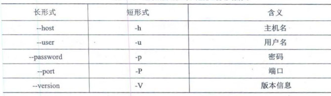

* 启动
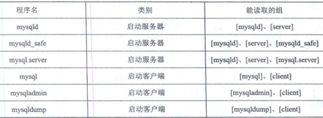

* 变量

<!-- more -->

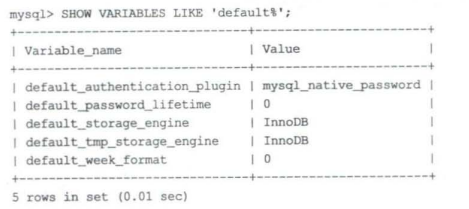

* 字符集和比较规则, 字符集表示编码规则, 比较规则定义比较(例如大小写是否区分)

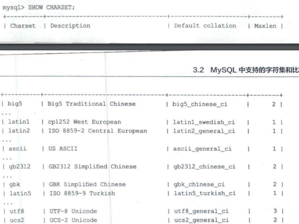

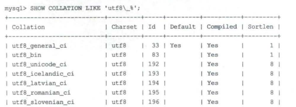

### InnoDB存储引擎

#### COMPACT 每行格式, 行又称记录

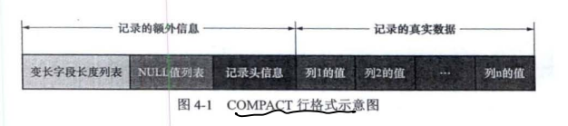

额外信息是方便管理存储的内容
1. 变长字段长度列表, 变长字段存储空间分为两部分: 真正的数据内容, 该数据占用的字节数。其中长度组成了变长字段长度列表, 真实数据存到后面
2. NULL值列表用二进制表示, 二进制位值为1, 表示对应的列号为NULL
3. 头信息

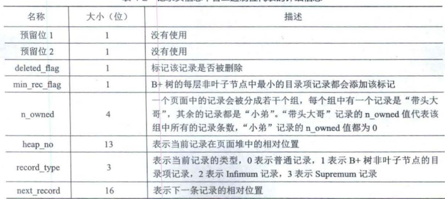

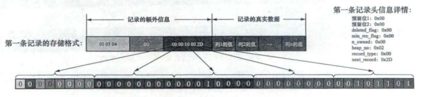

#### InnoDB数据页格式

* 页是InnDB管理存储空间的基本单位, 一个页的大小一般是16KB。我们存储的记录会按照指定的行格式存储到User Records部分

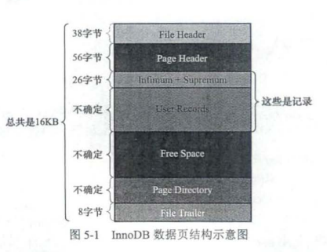

* Page Header存储该页的信息, 例如数据页存储了多少记录等, 存储的是当前页的状态信息


* File Header 存储通用的信息例如, 页号, 上一页, 下一页, 页的类型等

* File Trailer文件尾部, 由8字节组成。前4字节代表页的校验和, 校验和和File Header的对应, 二者一致说明无误。后四字节也是用于校验完整性LSN。


每个记录的头信息有`next_record`属性,使页内所有记录串联成一个单向链表。

* 各数据页页组成单向链表, 每个数据页的记录按照主键值从小到大顺序组成单向链表。InnoDB会把页里的记录分为若干组, **每个组最后一个记录地址偏移量作为槽, 放入目录里, 通过主键查找可用在页目录中使用二分查找定位到对应的槽**, 然后遍历槽对应的分组。
1. 目录里二分查找槽
2. 遍历槽中的目录

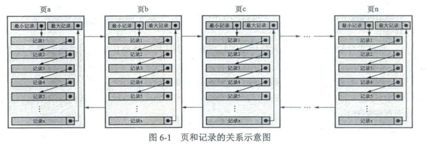

#### B+树索引

* 一般查找过程是, 定位到页, 二分查找页的目录得到槽, 遍历槽里的记录。

#### 聚簇索引

* 页内的记录按照主键大小顺序排成单向链表, 页内的记录划分为若干组, 每个组主键最大的记录在页内的偏移量当作槽存放在页目录中; 
* 存放用户记录页也是根据主键大小顺序形成的双向链表
* 存放目录项的页分为不同的层级, 同层级的页也是根据页中目录项记录主键大小排成双向链表

* 目录项的页只存储主键值和对应的页号

* 聚簇索引**B+树的叶子节点存储的是完整的用户记录**,包括了记录所有列的值。
* 聚簇索引完整的用户记录都位于B+树结构中, InnoDB引擎自动创建。也就是**索引即数据,数据即索引**, 但只能在搜索条件是主键时发挥作用。因为只有主键有序, **聚簇索引作用就是在主键有序的页中用B+树结构检索页(叶子节点)**, 之后就是二分查找目录得到槽了

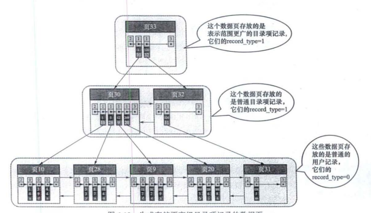

#### 二级索引

* 当使用别的列作为条件, 而不是主键值时, 简单的办法时以其他列再建一颗B+树。同样, 联合索引时同时以多个列的大小作为排序规则。
* 这时候在叶子节点处存储的是索引列+主键。

* B+树的每层都根据索引列的值从小到大组成了双向列表。页内的记录(包括用户记录和目录项记录)都按照索引值从小到大形成单向链表， 联合索引优先前一个索引排序。二级索引找到主键值之后, 再从聚簇索引中查找完整的用户记录。

#### 创建索引

* 为出现在where子句的列, 连接子句中的连接列, 或者出现在order by, group by 子句的列创建索引。
* 索引类型尽可能小
* 对字符串, 可以为列前缀创建索引(索引只保留字符串的前n个字符)

```
ALTER TABLE single_table ADD INDEX index_key1(key1(10))
```

* 不是查询操作的谨慎创建索引, 索引建的不多不少为佳


#### 存储

向InnoDB这样的存储引擎都是把数据存储在文件系统上, 操作系统使用文件系统管理磁盘。

表空间对应文件系统上一个或多个真实文件, 同时一个表空间可以被划分为很多页, 表数据就存放在某个表空间的某个页中。同时, 聚簇索引和二级索引都是以B+树的形式保存在表空间中。

* 具体的, 连续的64个页就是一个区, 也就是1MB大小。系统表空间和独立表空间, 可以看成若干连续的区组成, 每256个区划分为一组。
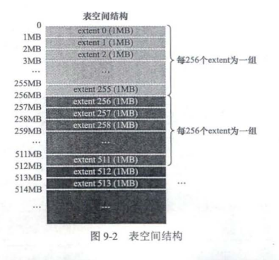
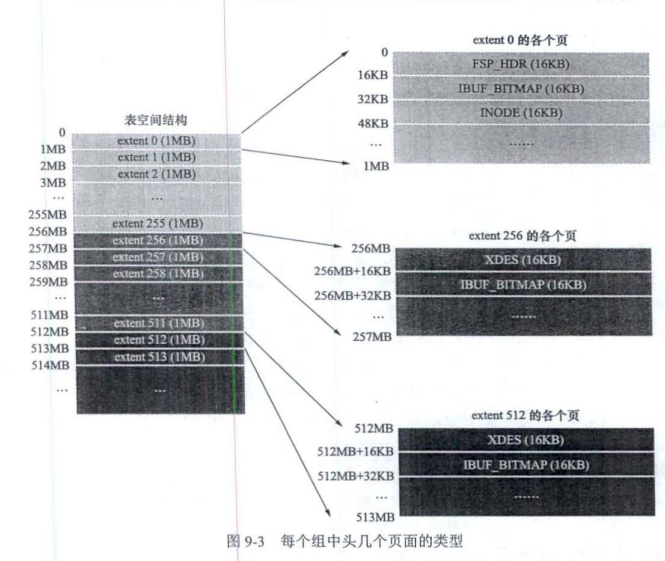

当表中的数据量很大时, 为某个索引分配空间时不再按页为单位而按区为单位分配。

* InnoDB提供了一些列系统表描述元数据, 其中`SYS_TABLES`, `SYS_COLUMNS`, `SYS_INDEXS`, `SYS_FIELDS`这四个表尤其重要, 成为基本系统表。

### 查询优化

#### 单表访问方法

以下表结构
```
CREATE TABLE single_table (
    id INT NOT NULL AUTO_INCREMENT,
    key1 VARCHAR(100),
    key2 INT,
    key3 VARCHAR,
    key_part1 VARCHAR(100),
    key_part2 VARCHAR(100),
    key_part3 VARCHAR(100),
    common_field VARCHAR(100),
    PRIMARY KEY(id),
    KEY idx_key1(key1),
    UNIQUE KEY uk_key2 (key2),
    KEY idx_key3(key3),
    KEY idx_key_part(key_part1, key_part2, key_part3)
) Engine=InnoDB CHARSET=utf8;
```
* 主键会自动添加唯一索引，所以主键列不需要添加索引
* 唯一键需要该列值唯一，这样会自动添加唯一索引，所以唯一键列不需要添加索引
* 绝大部分情况下，mysql中的索引index和键key是同义词。
以上, 主键id有聚簇索引, key2有唯一索引, key1, key3是普通二级索引, (key_part1, key_part2, key_part3)是一个联合二级索引。


* const查询, 当根据**主键或者唯一二级索引和常数等值比较**定位记录, 是最快的, 称const查询
* ref查询, **普通二级索引列和常数等值比较**, 称为ref查询。这时候由于索引列值可能不唯一, 因此可能匹配多条记录。这时候每获得一条二级索引记录都立即执行一次回表操作。

* ref_or_null, 当执行**普通二级索引列和常数等值比较或者值为NULL**的记录,

```
SELECT * FROM single_table WHERE key1 = 'abc' OR key1 IS NULL
```
这时候对应扫描空间是`[NULL,NULL]`和`['abc', 'abc']`,这种查询方法称为`ref_or_null`。这与ref查询类似, 只是执行`key1 = 'abc' OR key1 IS NULL`, 每找到一条记录就会执行回表操作

* range查询, 当搜索区间非单点或全部时, 称为range查询。如
```
SELECT * FROM single_table WHERE key2 IN (1438, 6238) OR (key2 >= 38 AND key2 <= 79)
```

这时候搜索区间为`[1438,1438]`, `[6328,6328]`, 以及`[38, 79]`。

* index 查询

```
SELECT key_part1,key_part2, key_part3 FROM single_table WHERE key_part2 = 'abc'
```

这时候`key_part2`不是联合索引idx_key_part最左边的列, 无法形成范围区间。但是查询列表key_part1,key_part2, key_part3均来自联合索引且查询条件也是联合索引, **这个过程不需要回表操作** 称为index查询

此外全表扫描添加`ORDER BY`主键也被认为index访问, 如

```
SELECT * FROM single_table ORDER BY id
```

* 最后全表扫描称为all查询, 全表扫描指没有索引的扫描。

* 如果使用多个索引进行查询, 有可能发生索引合并。

#### 表连接

* 连接查询

将t1表的记录和t2表的记录连起来组成新的更大的记录, 称为连接。全表连接直接在from后面跟多个表名

```
SELECT * FROM t1, t2
```

* 直接表连接产生的笛卡尔积是巨大的, 因此有必要先过滤掉指定记录。连接过程, 对于

```
SELECT * FROM t1, t2 WHERE t1.m1 > 1 AND t1.m1 = t2.m2 AND t2.n2 < 'd'
```

以上查询指明了三个过滤条件, `t1.m1 > 1`, `t1.m1=t2.m2`, `t2.n2<'d'`

1. 首先建立一个需要查询的表称为, 驱动表, 也就是t1。单表查询`t1.m1 > 1`, 可以使用全表扫描
2. 从驱动表中得到一个记录, 就从t2表找匹配的记录, 如果找到`t1.m1=2`则t2查询条件`t2.m2=2 AND t2.n2 < 'd'`

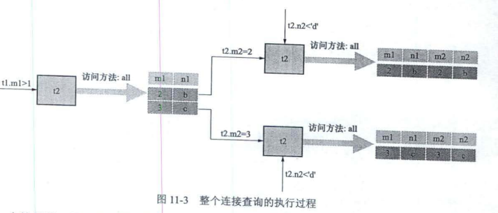

* 内连接, 若驱动表的记录在被驱动表中找不到匹配的记录, 则该记录不会加入到最后的结果集
* 外连接, 若驱动表的记录在被驱动表中找不到匹配的记录也会加入到最后的结果集。左外连接就是选取左边的表作为驱动表, 右外连接是选取右边的表作为驱动表

```
/// 内连接
SELECT * FROM t1 JOIN t2 ON [连接条件,where过滤条件]
// 左外连接
SELECT * FROM t1 LEFT JOIN t2 ON [连接条件,where过滤条件]
// 右外连接
SELECT * FROM t1 RIGHT JOIN t2 ON [连接条件,where过滤条件]
```

* 使用索引加快连接速度

```
SELECT * FROM  t1,t2 WHERE t1.m1 > 1 AND t1.m1 = t2.m2 AND t2.n2 < 'd'
```

在m2列加索引, 查询`t1.m1=t2.m2`就是等值查找, 可能使用到ref访问方法。同理, 在n2上加索引可能使用到range访问方法。而且为了可能用到的index访问方法, 最好不要用*作为查询列表, 而把真正用到的列作为查询列表。

#### 优化器执行计划

单表查询中, 优化器生成执行计划的步骤一般如下

1. 根据搜索条件, 找出所有可能使用的索引
2. 计算全表扫描的代价
3. 计算使用不同索引执行查询的代价
4. 对比各种执行方案的代价, 找出成本最低的方案

对于内连接来说, 为了生成成本最低的执行计划, 需要考虑
1. 最优的表连接顺序
2. 为驱动表和被驱动表选择成本最低的访问方法

可以手动修改mysql数据库下engine_cost表中的某些成本常数, 更精确控制执行计划中的成本计算过程。


#### 基于规则的优化


MYSQL会根据一些规则, 将糟糕的语句转换成某种可以高效执行的形式。

* 条件化简

移除不必要的括号

移除多余的条件

合并HAVING子句和WHERE子句

外连接消除, 例如设定搜索条件不为NULL, 外连接和内连接结果没有区别, 就会转化成内连接

* 子查询

```
SELECT m, n FROM (SELECT m2+1 as m, n2 as n FROM te WHERE m2 > 2) AS t;
```

#### 缓存

* Buffer Pool, Buffer Pool对应的一片连续的内存被划分为若干个页面, 页面大小与InnoDB表空间使用的页面大小一致,默认16KB。这些页面称之为缓冲页。每个缓冲页有一些控制信息, 包含该页所属的表空间编号, 页号, 地址,链表节点信息等。 

* 刚刚初始化的Buffer Pool, 所有的缓冲页都是空闲的, 每一个缓冲页对应的控制块都会加入到free链表中。每当需要从磁盘加载一个页到Buffer Pool中时，就从free链表取一个空闲的缓冲页, 把该缓冲页对应的控制块信息填入, 将控制块从free链表中移除表示该缓冲页已经使用了。

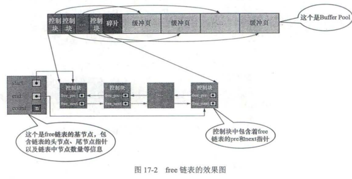

* 如果要访问的页已经在Buffer Pool中, 直接使用就可以不用从磁盘拿数据, 查找的办法是根据**表空间号+页号定位一个页**, 用表空间号+页号当作Key用哈希表直接映射到缓冲页控制块地址， 只需要输入表空间号+页号就可以定位缓冲控制块。

* 当修改了Buffer Pool缓冲页的数据, 它就与磁盘上的页不一样了, 这样的缓冲页也称为脏页。频繁向磁盘中写数据会影响数据库的性能。因此创建一个存储脏页的链表,也就是flush链表

* 某个缓冲页不可能既是free链表的节点, 又是flush链表的节点。


* LRU链表, 留下最近最频繁使用的数据。可以使用某个比例将LRU分为两部分, 热数据和冷数据

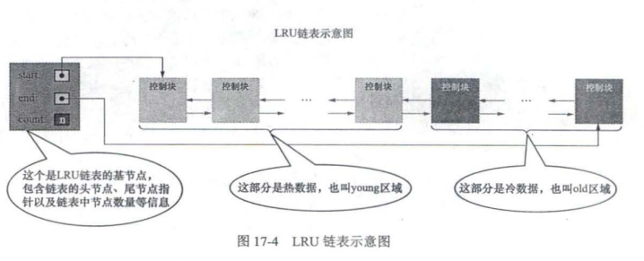

* 只要从磁盘中加载一个页面到Buffer Pool的缓冲页中, 该缓冲页对应的控制块就会作为一个节点加入到LRU链表中, 控制块从free list中删除。但flush链表的节点肯定包含在LRU链表中。


### 事务 transaction

#### 事务简介

事务的特性 AICD
* 原子性 Atomicity, 操作不可分割, 要么全部做完且成功, 要么不做

* 隔离性 Isolation, 其他的操作不会影响本次操作(例如多线程)

* 一致性 Consistency 应用系统从一个正确的状态到另一个正确的状态。可以说AID都是来保证C

*  持久性 Durability 状态转移发生后 , 转换的结果永久保留不可更改。

事务的状态转换, 活动的, 部分提交的, 提交的, 失败的, 中止的, 

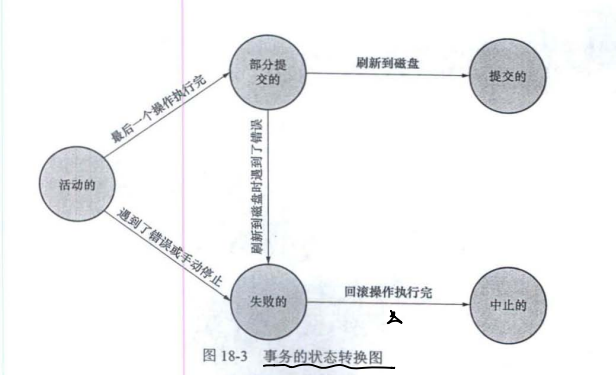

事务的语法

```
BEGIN;
UPDATE account SET balance = blance-10 WHERE id=1;
UPDATE account SET balance = blance+10 WHERE id=2;
COMMIT; # 提交 或者 ROLLBACK # 回滚
```
有时候没有COMMIT;也会自动提交事务, 称为隐式提交。

* 保存点

可以在事务中加入保存点`SAVEPOINT`, 回滚到指定的保存点。

```
BEGIN;
UPDATE account SET balance = balance - 10 WHERE id = 1;
SAVEPOINT s1;
UPDATE account SET blance = blance + 1 WHERE id = 2;
ROLLBACK TO s1;
```

#### redo日志

* 对于一个已经提交的事务. 在事务提交之后即使系统发生了崩溃, 对数据库做的更改也不能丢失。在事务提交前刷新入磁盘, 较于事务提交时将所有修改过的内存的页面刷新到磁盘中, redo日志有以下好处

1. redo日志占用空间小, 只存储表空间id, 页号, 偏移量以及要更新的值
2. redo日志顺序写入磁盘， 顺序IO

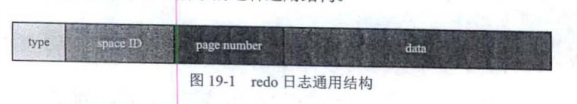

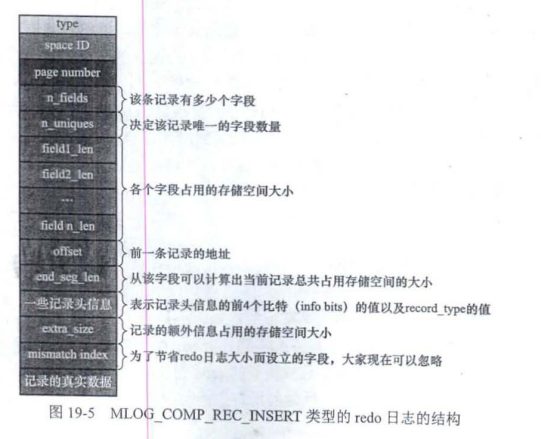
type日志类型, space ID表空间ID, page number页号, data具体内容

* redo日志放在了大小为512字节的页中, 称为block。redo日志存储在496字节的log block body中, log block header和log block trailer存储的是一些管理信息。

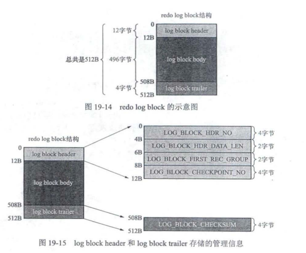

* 服务器启动时会将操作系统申请大片redo log buffer redo日志缓冲区.
向log buffer中写入redo 日志时顺序写入到log block body中。

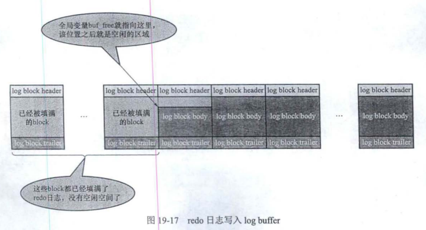

* redo buffer会在, log buffer空间不足, 事务提交, 后台1s一次进程的时机将redo日志进行刷盘。

以上时redo日志在内存中的存储格式, 接下来是文件中redo日志文件格式.MYSQL的数据目录(可使用`SHOW VARIABLES LIKE 'datadir'`命令)默认有`iblogfile`文件, logbuffer的日志默认刷新到这两个磁盘文件中。redo日志文件组中每个文件大小都一样, 格式也一样。前2048个字节可分为4个特殊block, 从2048字节往后存储log buffer中的block镜像。

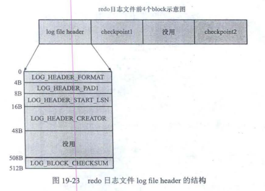

* redo日志只是为了系统崩溃后恢复脏页用的, 如果对应的脏页已经刷新到磁盘中, 即使现在系统崩溃重启后也不用恢复页面,redo日志也就没用了。mysql对redo日志设置lsn(log sequence number), 该值一致递增。当redo日志有可以被覆盖的, 首先计算当前可被覆盖的redo日志对应的lsn值最大多少, 小于该值的redo日志都可以被覆盖掉。此外当页被刷新到磁盘上, redo日志可以覆盖, 同时进行一次增加checkpoint_lsn的操作, checkpoint_lsn主要用于恢复

* 恢复时, 首先去欸的那个**恢复起始点, 也就是最近发生的那次checkpoint的信息**, 然后确定恢复的终点, 最后一个redo日志文件中的block。且如果该日志页lsn小于于检查点的lsn, 说明已经刷入磁盘。

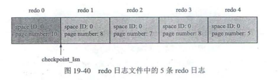

#### undo日志

#### 事务隔离级别

事务并发执行时的一致性问题

* 脏写 Dirty Write, 一个事务修改了另一个未提交事务修改过的数据
* 脏读 Dirty Read, 一个事务读到了另一个未提交事务修改过的数据
* 不可重复读 Non-Repeatable Read 一个事务修改了另一个未提交事务**读取**的数据,
* 幻读 Phantom 一个事务查询一些记录, 该事务未提交时, 另一个事务写入了那些符合条件的记录(写入可以是INSERT, DELETE, UPDATE), 称为幻读。

严重性, 脏写 > 脏读 > 不可重复读 > 幻读

* 四个隔离级别

1. READ UNCOMMITTED 未提交读
2. READ COMMITTED 已提交读
3. REPEATABLE READ 可重复读
4. SERIALIZABLE 可串行化


都不允许脏写, 而REPEATABLE READ也可以很大程度避免幻读

* MVCC Muti-Version Concurrency Control 多版本并发控制


#### 锁