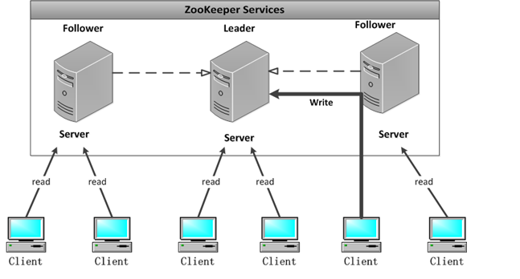
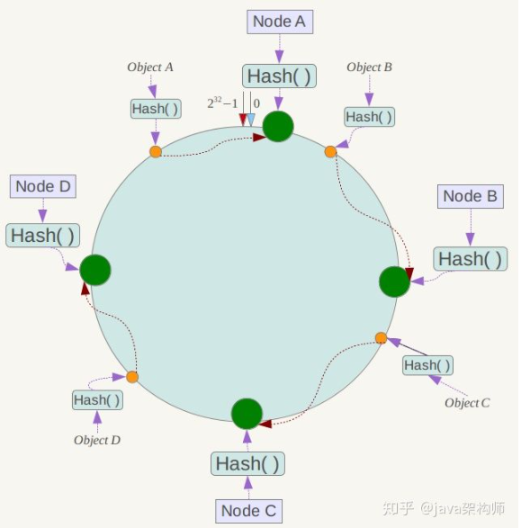
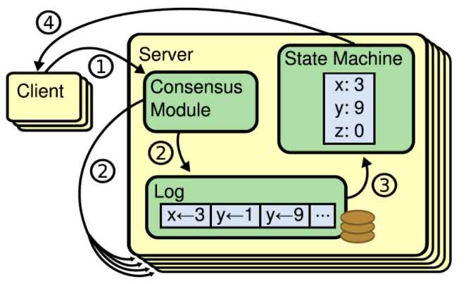
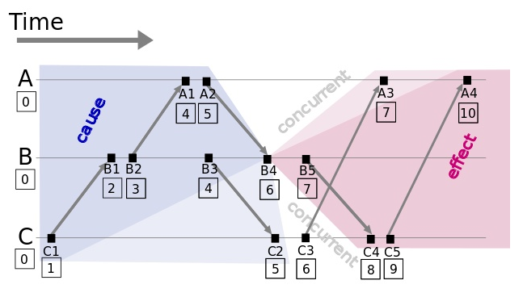
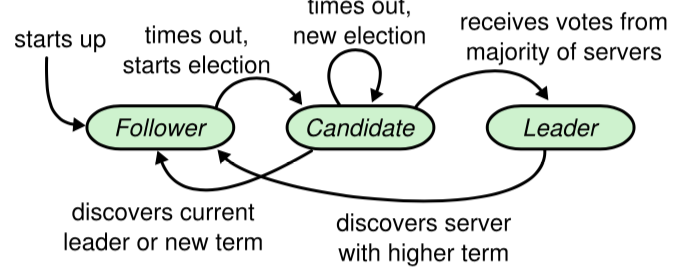
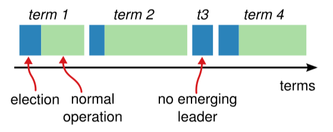
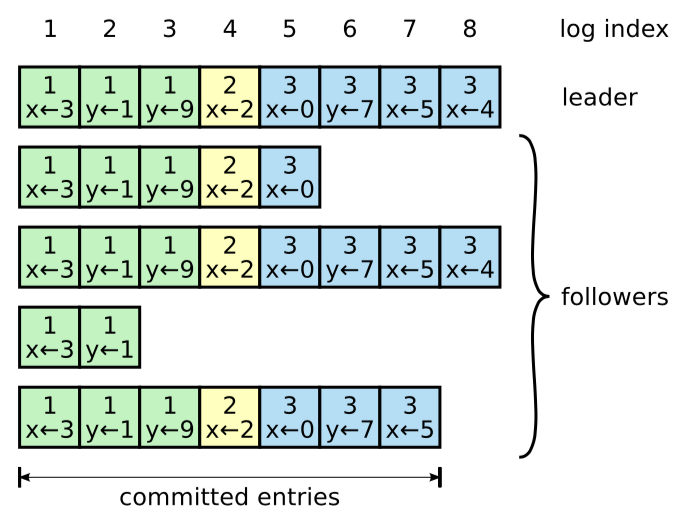
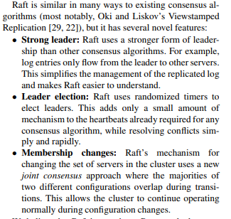
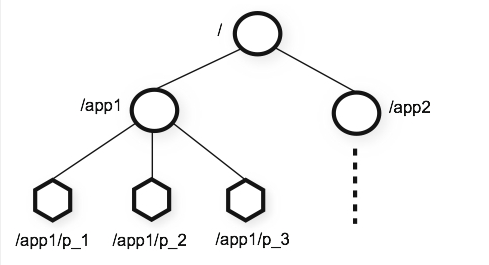
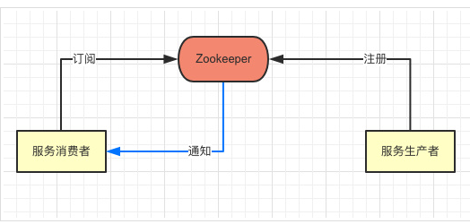

> 分布式是如今服务端架构的基本形式, 多机条件下, 不论是分布式计算还是分布式存储, 都需要遵循分布式系统的一般知识

### 分布式理论

#### CAP理论

* 一致性 Consistency: 在分布式环境中，一致性是指数据在多个副本之间是否能够保持一致的特性，等同于所有节点访问同一份最新的数据副本。在一致性的需求下，当一个系统在数据一致的状态下执行更新操作后，应该保证系统的数据仍然处于一致的状态。

* 可用性 Availability: 每次请求都能获取到正确的响应，但是不保证获取的数据为最新数据。

* 分区容错性 Partition tolerance: 分布式系统在遇到任何网络分区故障的时候，仍然需要能够保证对外提供满足一致性和可用性的服务，除非是整个网络环境都发生了故障。

一个分布式系统最多只能同时满足一致性(Consistency), 可用性(Availability)和分区容错性(Partition tolerance)这三项中的两项。

在这三个基本需求中，最多只能同时满足其中的两项。P 容错性是必须的, 因此只能在 CP 和 AP 中选择。如果要求更高的一致性必然牺牲可用性, zookeeper 保证的是 CP, 对比 spring cloud 系统中的注册中心的 eruka 实现的是 AP。

#### BASE 理论

BASE 是 Basically Available(基本可用)、Soft-state(软状态) 和 Eventually Consistent(最终一致性) 三个短语的缩写。

* 基本可用：在分布式系统出现故障，允许损失部分可用性(服务降级、页面降级)。

* 软状态：允许分布式系统出现中间状态。而且中间状态不影响系统的可用性。这里的中间状态是指不同的 data replication（数据备份节点）之间的数据更新可以出现延时的最终一致性。

* 最终一致性：data replications 经过一段时间达到一致性。

BASE 理论是对 CAP 中的一致性和可用性进行一个权衡的结果，理论的核心思想就是：我们无法做到强一致(也就是所有节点接收到同样的操作时会按照完全相同的顺序执行)，但每个应用都可以根据自身的业务特点，采用适当的方式来使系统达到最终一致性(经过一段时间后可以达到一致性。

最终一致性允许多个节点的状态出现冲突，但是所有能够沟通的节点都能够在有限的时间内解决冲突，从不一致的状态恢复到一致



<!-- more -->

#### 拜占庭将军问题

* 拜占庭将军问题是 Leslie Lamport 在 `The Byzantine Generals Problem` 论文中提出的分布式领域的容错问题，它是分布式领域中最复杂、最严格的容错模型。

* 在该模型下，系统不会对集群中的节点做任何的限制，集群的节点甚至可以向其他节点发送随机数据、错误数据，也可以选择不响应其他节点的请求，这些无法预测的行为使得容错这一问题变得更加复杂。但注意到, 日常中节点发送错误数据可能性基本不可能存在, 除非中了僵尸网络。

* 拜占庭将军问题是对分布式系统容错的最高要求，然而这不是日常工作中使用的大多数分布式系统中会面对的问题，我们遇到更多的还是节点故障宕机或者不响应等情况，这就大大简化了系统对容错的要求。但类似 Bitcoin、Ethereum 等分布式系统确实需要考虑拜占庭容错的问题

#### 一致性哈希算法

* 哈希算法将任意长度的二进制值映射为较短的固定长度的二进制值，这个小的二进制值称为哈希值。

* 如果我们采用普通的hash算法进行路由，将数据映射到具体的节点上，如`key%N`，key是数据的key，N是机器节点数，如果有一个机器加入或退出这个集群，则所有的数据映射都无效了。环形hash空间, 将对应的key哈希到一个具有2^32次方个节点的空间中，即0 ~ (2^32)-1的数字空间中。现在我们可以将这些数字头尾相连，想象成一个闭合的环形。

bjectA、objectB、objectC、objectD四个对象通过特定的Hash函数计算出对应的key值，然后散列到Hash环上,然后从数据所在位置沿环顺时针“行走”，第一台遇到的服务器就是其应该定位到的服务器。



* 如果此时NodeC宕机了，此时Object A、B、D不会受到影响，只有Object C会重新分配到Node D上面去，而其他数据对象不会发生变化。如果在环境中新增一台服务器Node X，通过hash算法将Node X映射到环中，通过按顺时针迁移的规则，那么Object C被迁移到了Node X中，其它对象还保持这原有的存储位置。

**一致性哈希算法相当于在原始hash算法基础上, 把哈希桶从数组连续空间变成了环形**, 一致性哈希算法在保持了单调性的同时，还是数据的迁移达到了最小，这样的算法对分布式集群来说是非常合适的，避免了大量数据迁移，减小了服务器的的压力。

### 共识 Consensus

一致性（consensus）是构建具有容错性（fault-tolerant）的分布式系统的基础。 在一个具有一致性的性质的集群里面，同一时刻所有的结点对存储在其中的某个值都有相同的结果，即对其共享的存储保持一致。集群具有自动恢复的性质，当少数结点失效的时候不影响集群的正常工作，当大多数集群中的结点失效的时候，集群则会停止服务。

#### 复制状态机

复制状态机（Replicated State Machine）中，一组 Server 的状态机计算相同状态的副本，并且即使有一部分 Server 宕机了它们仍然能够继续运行。在分布式系统中，复制状态机被用来解决各种容错问题。

一般通过使用复制日志来实现复制状态机。每个 Server 存储着一份包含命令序列的日志文件，状态机会按顺序执行这些命令。因为每个日志包含相同的命令，并且顺序也相同，所以每个状态机处理相同的命令序列。由于状态机是确定性的，所以处理相同的状态，得到相同的输出。

保证复制日志的一致性是一致性算法的任务。一个 Server 上的一致性模块会接收来自客户端的命令，并把命令添加到它的日志文件中。它同其它 Server 上的一致性模块进行通信，确保每一个日志最终包含相同的请求且顺序也相同，即使某些 Server 故障。一旦这些命令被正确复制，每个 Server 的状态机都会按照日志中的顺序去处理，将输出结果返回给客户端。

复制状态机的核心就是Consensus模块，即Paxos，ZAB，Raft等一致性协议算法。


对于实际系统，一致性算法一般具有如下特点：

1. 安全。满足在所有非拜占庭条件下确保安全（从来不会返回错误结果），包括网络延迟、分区、丢包、重复和重排序。
2. 高可用。只要集群中的大部分 Server 正常运行，并能够互相通信且可以同客户端通信，这个集群就完全可用。因此，拥有5个 Server 的集群可以容忍其中的2个 Server 失败。假使通过停掉某些 Server 使其失败，稍后它们会从持久化存储的状态进行恢复，并重新加入到集群中。
3. 不依赖于时序。确保日志的一致性：时钟错误，以及极端情况下的消息延迟，在最坏的情况下都会造成可用性问题。
4. 通常情况下，只要集群中大多数 Server 成功响应了某一轮 RPC 调用，一个命令就算完成。少部分较慢的 Server 不应该影响到整个系统性能。


#### 逻辑时钟

Lamport大神在1987年就提出来的一个想法，用来解决分布式系统中，不同的机器时钟不一致可能带来的问题。在单机系统中，我们用机器的时间来标识事件，就可以非常清晰地知道两个不同事件的发生次序。但是在分布式系统中，由于每台机器的时间可能存在误差，无法通过物理时钟来准确分辨两个事件发生的先后顺序。

实际上，在分布式系统中，**只有两个发生关联的事件，我们才会去关心两者的先来后到关系**。比如说两个事务，一个修改了rowa，一个修改了rowb，他们两个谁先发生，谁后发生，其实我们并不关心。自然想到通过有向图表示先后关系, 这其实就是逻辑时钟用来定义两个关联事件的发生次序，即‘happens before’。而对于不关联的事件，逻辑时钟并不能决定其先后，所以说这种‘happens before’的关系，是一种偏序关系。


图中，箭头表示进程间通讯，ABC分别代表分布式系统中的三个进程。每个事件对应一个Lamport时间戳，初始值为0

如果事件在节点内发生，时间戳加1; 如果事件属于发送事件，时间戳加1并在消息中带上该时间戳; 如果事件属于接收事件，时间戳 = Max(本地时间戳，消息中的时间戳) + 1

这样，所有关联的发送接收事件，我们都能保证发送事件的时间戳小于接收事件。如果两个事件之间没有关联，比如说A3和B5，他们的逻辑时间一样。而实际在物理世界中，明显B5是要早于A3发生的，因为这是两个事件, 所以没有关系。

#### Paxos
Paxos 和 Raft 是目前分布式系统领域中两种非常著名的解决一致性问题的共识算法，两者都能解决分布式系统中的一致性问题，但是前者的实现与证明非常难以理解，后者的实现比较简洁并且遵循人的直觉，它的出现就是为了解决 Paxos 难以理解并和难以实现的问题。

如果只是把Paxos协议当做一个理论去看，而不是考虑实际工程上会遇到什么问题的话，会容易理解的多。Lamport的论文中对StateMachine的应用只有一个大概的想法，并没有具体的实现逻辑，想要直接把Paxos放到复制状态机里使用是不可能的，得在Paxos上补充很多的东西。这些是为什么Paxos有这么多的变种。

### Raft

Raft的作者在设计Raft的时候，有一个非常明确的目标，就是让这个协议能够更好的理解，在设计Raft的过程中，如果遇到有多种方案可以选择的，就选择更加容易理解的那个。

在任意的时间，每一个服务器一定会处于以下三种状态中的一个：Leader、Candidate、Follower。在正常情况下，只有一个服务器是Leader，剩下的服务器是 Follower。Follower 是被动的：它们不会发送任何请求，只是响应来自 Leader 和 Candidate 的请求。Leader来处理所有来自客户端的请求（如果一个客户端与 Follower 进行通信，Follower 会将信息发送 Leader）。Candidate 用来选取一个新的 Leader。



Raft 算法将时间划分成为任意不同长度的任期（Term）。任期用连续的数字进行表示。每一个任期的开始都是一次选举，就像 5.2节所描述的那样，一个或多个 Candidate 会试图成为Leader。如果一个 Candidate 赢得了选举，它就会在该任期的剩余时间担任 Leader。在某些情况下，选票会被瓜分，有可能没有选出 Leader，那么，将会开始另一个任期，并且立刻开始下一次选举。Raft 算法保证在给定的一个任期最少要有一个 Leader。



任期Term在 Raft 中充当逻辑时钟的角色，并且它们允许服务器检测过期的信息，比如过时的 Leader。每一台服务器都存储着一个当前任期Term的数字，这个数字会单调的增加。当服务器之间进行通信时，会互相交换当前任期号；如果一台服务器的当前任期号比其它服务器的小，则更新为较大的任期号。如果一个 Candidate 或者 Leader 意识到它的任期号过时了，它会立刻转换为 Follower 状态。如果一台服务器收到的请求的任期号是过时的，那么它会拒绝此次请求。

Raft中的服务器通过远程过程调用（RPC）来通信，基本的 Raft 一致性算法仅需要 2 种 RPC。RequestVote RPC是 Candidate 在选举过程中触发的，AppendEntries RPC 是 Leader 触发的，为的是复制日志条目和提供一种心跳（Heartbeat）机制

#### Raft选举

Raft 使用一种心跳机制来触发 Leader 的选举。当服务器启动时，它们会初始化为 Follower。一台服务器会一直保持 Follower 的状态，只要它们能够收到来自 Leader 或者 Candidate 的有效 RPC。Leader 会向所有 Follower 周期性发送心跳（不带有任何日志条目的 AppendEntries RPC）来保证它们的 Leader 地位。如果一个 Follower 在一个周期内没有收到心跳信息，就叫做选举超时，然后它就会认为没有可用的 Leader，并且开始一次选举以选出一个新的 Leader。

为了开始选举，一个 Follower 会自增它的当前任期并且转换状态为 Candidate。然后，它会给自己投票并且给集群中的其他服务器发送 RequestVote RPC。一个 Candidate 会一直处于该状态，直到下列三种情形之一发生：
* 它赢得了选举；
* 另一台服务器赢得了选举；
* 一段时间后没有任何一台服务器赢得了选举。

如果一个 Candidate 在一个任期内收到了来自集群中大多数服务器的投票，就会赢得选举。在一个任期内，一台服务器最多能给一个 Candidate 投票，按照先到先服务原则。大多数原则使得在一个任期内最多有一个 Candidate 能赢得选举。一旦有一个 Candidate 赢得了选举，它就会成为 Leader。然后，它会向其他服务器发送心跳信息来建立自己的 Leader 地位，并且组织新的选举。

当一个 Candidate 等待别人的选票时，它有可能会收到来自其他服务器发来的声明其为 Leader 的 AppendEntries RPC。如果这个Leader 的任期（包含在它的 RPC 中）比当前 Candidate 的当前任期要大，则 Candidate 认为该 Leader 合法，并且转换自己的状态为 Follower。如果在这个 RPC 中的任期小于 Candidate 的当前任期，则候选人会拒绝此次 RPC， 继续保持 Candidate 状态。

如果一个 Candidate 既没有赢得选举，也没有输掉选举：**如果许多 Follower 在同一时刻都成为了 Candidate，选票会被分散**，可能没有 Candidate 能获得大多数的选票。当这种情形发生时，每一个 Candidate 都将会超时，并且通过自增任期号和发起另一轮 RequestVote RPC 来开始新的选举。然而，如果没有其它手段来分配选票的话，这种情形可能会无限的重复下去。

Raft 使用随机的选举超时时间来确保第三种情形很少发生，并且能够快速解决。为了防止在一开始是选票就被瓜分，选举超时时间是在一个固定的间隔内随机选出来的（例如150-300ms）。这种机制使得各个服务器能够分散开来，在大多数情况下**只有一个服务器会率先超时；它会在其它服务器超时之前赢得选举，并且向其它服务器发送心跳信息**。

#### 日志复制

命令作为日志, 日志复制就是命令复制

选出了 Leader，它就开始接收客户端的请求。**每一个客户端请求都包含一条需要被复制状态机（Replicated State Machine）执行的命令**。**Leader 把这条命令加入到它的日志中去**，然后并行的向其它服务器发起 AppendEntries RPC，要求其它服务器复制这个条目。当这个条目被安全的复制之后，Leader 会将这个条目应用到它的状态机中并且会向客户端返回执行结果。如果 Follower 崩溃了或者运行缓慢或者是网络丢包了，Leader 会无限的重试 AppendEntries RPC（甚至在它向客户端响应之后），直到有的 Follower 最终存储了所有的日志条目。


Leader 决定什么时候将日志条目应用到状态机是安全的；这种条目被称为是已提交的（Committed）。Raft 保证可已提交的日志条目是持久化的，并且最终会被所有可用的状态机执行。**一旦被 Leader 创建的条目已经复制到了大多数的服务器上，这个条目就称为已提交的**



日志由有序编号的日志条目组成。每个日志条目包含它被创建时的任期号（每个方块中的数字），并且包含用于状态机执行的命令索引。如果在不同日志中的两个条目有着相同的索引和任期号，则它们所存储的命令是相同的。

Raft算法中，Leader 通过强制 Follower 复制它的日志来处理日志的不一致。日志条目只有一个流向：从Leader流向Follower。Leader永远不会覆盖已经存在的日志条目。Raft使用投票的方式来处理，避免一个没有包含全部日志条目的Candidate赢得选举，除非该Candidate的日志包含了所有已提交的条目。这简化而又保证了日志命令的一致性。

如果Leader在提交之前就崩溃了，将来的Leader会尝试着继续完成复制日志。如果一个Follower或者Candidate崩溃了，那么之后发送给它的RequestVote RPC和AppendEntries RPC会失败。Raft通过无限的重试来处理这些失败；如果崩溃的Server重启了，RPC就会成功完成。如果一个Server在收到了RPC之后但在响应之前崩溃了，那么它会在重启之后再次收到同一个RPC。因为Raft中的RPC都是幂等的，因此不会有什么问题。例如，如果一个Follower收到了一个已经包含在它的日志中的AppendEntries请求，它会忽视这个新的请求。



#### Chubby

* 在 2006 年，Google 发表了一篇名为 The Chubby lock service for loosely-coupled distributed systems 的论文，描述了一个分布式锁服务 Chubby 的设计理念和实现原理。Chubby 的目的就是允许多个客户端对它们的行为进行同步，同时也能够解决客户端的环境相关信息的分发和粗粒度的同步问题，GFS 和 Bigtable 都使用了 Chubby 以解决主节点的选举等问题。

* Chubby 总共由两部分组成，**一部分是用于提供数据的读写接口并管理相关的配置数据的服务端，另一部分就是客户端使用的 SDK**，每一个 Chubby 单元都由一组服务器组成，它会使用 共识算法 从集群中选举出主节点。

* 只有主节点会对外提供读写服务，其他的节点其实都是当前节点的副本(Replica)，它们只是维护一个数据的拷贝并会在主节点更新时对它们持有的数据库进行更新；当主节点宕机时，副本会在其租约到期时重新进行选举

#### 分布式事务

* 两阶段提交是一种使分布式系统中所有节点在进行事务提交时保持一致性而设计的一种协议；在一个分布式系统中，所有的节点虽然都可以知道自己执行操作后的状态，但是无法知道其他节点执行操作的状态，**在一个事务跨越多个系统时，就需要引入一个作为协调者的组件来统一掌控全部的节点并指示这些节点是否把操作结果进行真正的提交**。

* 两阶段提交的执行过程分为两个阶段，**投票阶段和提交阶段**，在投票阶段中，协调者（Coordinator）会向事务的参与者（Cohort）询问是否可以执行操作的请求，并等待其他参与者的响应，参与者会执行相对应的事务操作并记录重做和回滚日志，如果满足条件则进行提交阶段正是提交。


### zookeeper

* Zookeeper 作为非常出名的分布式协调服务，有非常多的应用，包括发布订阅、命名服务、分布式协调和分布式锁。Zookeeper 集群中所有的节点都可以对外提供服务，但是集群中的节点也分为主从两种节点，所有的节点都能处理来自客户端的读请求，但是只有主节点才能处理写入操作：

#### Zab共识协议

客户端在使用 Zookeeper 服务时会随机连接到集群中的一个节点，所有的读请求都会由当前节点处理，而写请求会被路由给主节点并由主节点向其他节点广播事务，与 2PC 非常相似，如果在所有的节点中超过一半都返回成功，那么当前写请求就会被提交。

当主节点崩溃时，其他的 Replica 节点会进入崩溃恢复模式并重新进行选举，Zab 协议必须确保提交已经被 Leader 提交的事务提案，同时舍弃被跳过的提案，这也就是说当前集群中最新 ZXID 最大的服务器会被选举成为 Leader 节点；但是在正式对外提供服务之前，新的 Leader 也需要先与 Follower 中的数据进行同步，确保所有节点拥有完全相同的提案列表。

ZXID 是 Zab 协议中设计的事务编号，它是一个 64 位的整数，**其中最低的 32 位是一个计数器**，每当客户端修改 Zookeeper 集群状态时，Leader 都会以当前 ZXID 值作为提案的编号创建一个新的事务，在这之后会将当前计数器加一；**ZXID 中高的 32 位表示当前 Leader 的任期**，每当发生崩溃进入恢复模式，集群的 Leader 重新选举之后都会将 epoch 加一。

和Raft的相似之处

1. 都使用timeout来重新选择leader.
2. 采用quorum来确定整个系统的一致性(也就是对某一个值的认可),这个quorum一般实现是集群中半数以上的服务器,zookeeper里还提供了带权重的quorum实现.
3. 都由leader来发起写操作.
4. 都采用心跳检测存活性。
5. zookeeper的zab实现里选主要求选出来的主拥有quorum里最新的历史，而raft的follower的选主投票根据term的大小+日志完成度来选择投票给谁。

#### 节点

Zookeeper中，“节点"分为两类，第一类同样是指构成集群的机器，我们称之为机器节点；第二类则是指数据模型中的数据单元，我们称之为数据节点一一ZNode。Zookeeper 中 Znode 的概念，它既能作为容器存储数据，也可以持有其他的 Znode 形成父子关系。

ZooKeeper 集群最大的一个特点是同步，在外界看来，**集群内各个节点的数据都是一样的**，如果某个节点挂了，整个集群对外提供的内容不会受到影响。其命名空间结构和 Linux 文件系统很像，是一棵树，所有的数据均存放在树节点上



```
create / # 创建节点
get / #得到节点的数据

znode

data : Znode存储的数据；
ACL：记录 Znode 的访问权限，即哪些人或哪些 IP 可以访问本节点；
stat：包含Znode的各种源数据，包括ZXID、版本号、时间戳、数据长度等；
child：子节点引用；
```

Zookeeper的数据模型是树结构，在内存数据库中，存储了整棵树的内容，包括所有的节点路径、节点数据、ACL信息，Zookeeper会定时将这个数据存储到磁盘上。Zookeeper可以视作in-memory的文件系统, 内部包含了数据库系统, 日志系统等

#### 通知

Zookeeper 实现了通知机制 Watch，当客户端使用 getData 等接口获取 Znode 状态时传入了一个用于处理节点变更的回调，那么服务端就会主动向客户端推送节点的变更：

Watch理解成是一个和指定Znode所绑定的监听器，当这个Znode发生变化，也就是在这个Znode上进行了数据的写操作（create、delete、setData），这个监听器监听到这些写操作之后会异步向请求Watch的客户端发送通知。



#### 分布式锁

* 排他锁（Exclusive Locks），又被称为写锁或独占锁，如果事务T1对数据对象O1加上排他锁，那么整个加锁期间，只允许事务T1对O1进行读取和更新操作，其他任何事务都不能进行读或写。

* 共享锁（Shared Locks），又称读锁。如果事务T1对数据对象O1加上了共享锁，那么当前事务只能对O1进行读取操作，其他事务也只能对这个数据对象加共享锁，直到该数据对象上的所有共享锁都释放

### RPC

RPC（Remote Procedure Call Protocol），远程过程调用协议，它是一种通过网络从远程服务器上请求服务，而不需要关心和了解底层网络技术的协议。可以理解成客户端发送request让server调用自己的方法并返回结果给客户端。RPC是分布式架构的核心，按响应方式分如下两种：

1. 同步调用：客户端调用服务方方法，等待直到服务方返回结果或者超时，再继续自己的操作
2. 异步调用：客户端把消息发送给中间件，不再等待服务端返回，直接继续自己的操作。

RPC 是一种 C/S 编程模型，客户端与服务端建立连接后，客户端的调用参数通过底层服务通道，根据传输前所提供的目的地址，传给服务端，此时客户端处于等待状态，直到收到应答或 TimeOut 超时信号。当服务器收到请求信息时，会根据注册 RPC 时告诉 RPC 系统的例程入口地址，执行相应的操作，并将结果返回至客户端。

一个RPC架构里包含4个组件: 
1. 客户端(Client)：服务调用方; 
2. 客户端存根(Client Stub)：存放服务端地址信息，将客户端的请求参数打包成网络消息，再通过网络发送给服务方
3. 服务端存根(Server Stub)：接受客户端发送过来的消息并解包，再调用本地服务
4. 服务端(Server)：真正的服务提供者。

#### 发布-订阅模式 Observer

发布订阅模式，即是观察者模式，指一个实体观察着另一个实体里的事件，当特定的事件发生时，观察的实体做出相应的动作，调用相应的业务逻辑流程进行处理。发布 / 订阅系统是一种使分布式系统中的各参与者能以发布 / 订阅的方式进行交互的中间件系统 。在发布订阅模式中，发布者和订阅者之间通过 事件消息 松耦合，发布者发布某种事件，发布订阅系统将事件的产生告知订阅者，发布者完全不知晓订阅者的存在，发布者和订阅者之间单向依赖，即只有订阅者依赖于发布者。

加入了zookeeper的RPC, 客户端和服务端直接通信转移到以zookeeper作为中介。**服务端把服务先注册到zookeeper节点, 客户端连接该节点触发服务端执行并返回服务结果**。即使压力增大, 只需要加大zookeeper服务器的数量就可以了。

通过中介注册服务的方式是如今RPC的一般实现形式, 这使得RPC服务由1对1转为了多对多，即多客户端对多服务端。